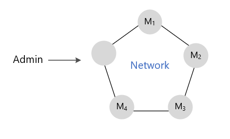

# Application development on Intel SGX 

Confidential computing infrastructure requires specific tools and software. This page specifically discusses concepts related to application development for Azure confidential computing virtual machines running on Intel SGX. Before reading this page, [read the introduction of Intel SGX virtual machines and enclaves](confidential-computing-enclaves.md). 

To leverage the power of enclaves and isolated environments, you'll need to use tools that support confidential computing. There are various tools that support enclave application development. For example, you can use these open-source frameworks: 

- [The Open Enclave Software Development Kit (OE SDK)](#oe-sdk)
- [The Confidential Consortium Framework (CCF)](#ccf)

## Overview

An application built with enclaves is partitioned in two ways:

1. An "untrusted" component (the host)
1. A "trusted" component (the enclave)

**The host** is where your enclave application is running on top of and is an untrusted environment. The enclave code deployed on the host can't be accessed by the host. 

**The enclave** is where the application code and its cached data/memory runs. Secure computations should occur in the enclaves to ensure secrets and sensitive data, stay protected. 

During application design, it's important to identify and determine what part of the application needs to run in the enclaves. The code that you choose to put into the trusted component is isolated from the rest of your application. Once the enclave is initialized and the code is loaded to memory, that code can't be read or changed from the untrusted components. 

## Open Enclave Software Development Kit (OE SDK) 

Use a library or framework supported by your provider if you want to write code that runs in an enclave. The [Open Enclave SDK](https://github.com/openenclave/openenclave) (OE SDK) is an open-source SDK that allows abstraction over different confidential computing-enabled hardware. 

The OE SDK is built to be a single abstraction layer over any hardware on any CSP. The OE SDK can be used on top of Azure confidential computing virtual machines to create and run applications on top of enclaves.

## Confidential Consortium Framework (CCF) 

The [CCF](https://github.com/Microsoft/CCF) is a distributed network of nodes, each running their own enclaves. The trusted node network allows you to run a distributed ledger. The ledger provides secure, reliable components for the protocol to use. 

This open-source framework enables high throughout, fine-grained confidentiality, and consortium governance for blockchain. With each node using TEEs, you can ensure secure consensus and transaction processing.

## Next steps 
- [Deploy a confidential computing DCsv2-Series virtual machine](quick-create-portal.md)
- [Download and install the OE SDK and start developing applications](https://github.com/openenclave/openenclave)