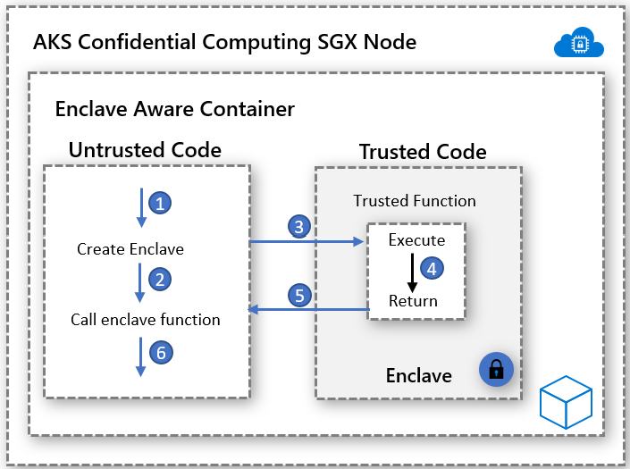

# Enclave Aware Containers

An enclave is a protected memory region that provides confidentiality for data and code execution. It is an instance of a Trusted Execution Environment (TEE) which is secured by hardware. Confidential computing nodes on AKS uses [Intel Software Guard Extensions (SGX)](https://software.intel.com/sgx) to create isolated enclave environments in the nodes between each container application.

Just like Intel SGX virtual machines, container applications which are developed to run in enclaves have two components:

- An untrusted component (called the host) and
- A trusted component (called the enclave).

Enclave aware containers application architecture give you the most control on the implementation while keeping the code footprint in the enclave low. Minimizing the code that runs in the enclave helps reduce the attack surface areas.   

## Enablers

### Open Enclave SDK
Open Enclave SDK is a hardware-agnostic open-source library for developing C, C++ applications that utilize Hardware-based Trusted Execution Environments. The current implementation provides support for Intel SGX as well as preview support for [OP-TEE OS on Arm TrustZone](https://optee.readthedocs.io/en/latest/general/about.html).

Get started with Open Enclave based container application [here](https://github.com/openenclave/openenclave/tree/master/docs/GettingStartedDocs)

### Intel SGX SDK
Intel maintains the software development kit for building SGX applications for both Linux and Windows container workloads. Windows containers currently not supported by AKS confidential computing nodes.

Get started with Intel SGX-based applications [here](https://software.intel.com/content/www/us/en/develop/topics/software-guard-extensions/sdk.html)

### Confidential Consortium Framework (CCF)
The Confidential Consortium Framework (CCF) is an open-source framework for building a new category of secure, highly available, and performant applications that focus on multi-party compute and data. CCF can enable high-scale, confidential networks that meet key enterprise requirements—providing a means to accelerate production and enterprise adoption of consortium based blockchain and multi-party compute technology.

Get started with Azure confidential computing and CCF [here](https://github.com/Microsoft/CCF)

### Confidential Inferencing ONNX Runtime

Open source enclave-based ONNX runtime establishes a secure channel between the client and the inference service - ensuring that neither the request nor the response can leave the secure enclave. 

This solution allows you to bring existing ML trained model and run them confidentially while providing trust between the client and server through attestation and verifications. 

Get started with ML model lift and shift to ONNX runtime [here](https://aka.ms/confidentialinference)

### Edgeless RT

Edgeless RT is an open-source project that builds upon the Open Enclave SDK. It adds support for Go and additional C++ features. Get started with a simple confidential Go application using your familiar VS Code environment [here](https://github.com/edgelesssys/edgelessrt). For Edgeless applications on AKS follow instructions [here](https://github.com/edgelesssys/edgelessrt/blob/master/docs/ERTAzureAKSDeployment.md)

## Container Based Sample Implementations

[Azure samples for enclave aware containers on AKS](https://github.com/Azure-Samples/confidential-computing/tree/main/containersamples)

<!-- LINKS - external -->
[Azure Attestation](../attestation/overview.md)

<!-- LINKS - internal -->
[DC Virtual Machine](./virtual-machine-solutions.md)
[Confidential Containers](./confidential-containers.md)