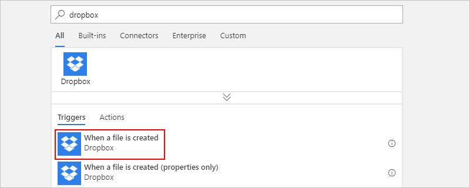

# Upload and manage files in Dropbox by using Azure Logic Apps

With the Dropbox connector and Azure Logic Apps, 
you can create automated workflows that upload 
and manage files in your Dropbox account. 

This article shows how to connect to Dropbox 
from your logic app, and then add the Dropbox 
**When a file is created** trigger and the 
Dropbox **Get file content using path** action.

## Prerequisites

* An Azure subscription. If you don't have an Azure subscription, 
<a href="https://azure.microsoft.com/free/" target="_blank">sign up for a free Azure account</a>.

* A [Dropbox account](https://www.dropbox.com/), 
which you can sign up for free. Your account credentials 
are necessary for creating a connection between your 
logic app and your Dropbox account.

* Basic knowledge about 
[how to create logic apps](../logic-apps/quickstart-create-first-logic-app-workflow.md). 
For this example, you need a blank logic app.

## Add trigger

[!INCLUDE [Create connection general intro](../../includes/connectors-create-connection-general-intro.md)]

1. Under the search box, choose **All**. 
In the search box, enter "dropbox" as your filter.
From the triggers list, select this trigger: 
**When a file is created**

   

1. Sign in with your Dropbox account credentials, 
and authorize access to your Dropbox data for Azure Logic Apps.

1. Provide the required information for your trigger. 

   In this example, select the folder where you want to 
   track file creation. To browse your folders, choose 
   the folder icon next to the **Folder** box.

## Add action

Now add an action that gets the content from any new file.

1. Under the trigger, choose **Next step**. 

1. Under the search box, choose **All**. 
In the search box, enter "dropbox" as your filter.
From the actions list, select this action: 
**Get file content using path**

1. If you haven't already authorized Azure Logic Apps 
to access Dropbox, authorize access now.

1. To browse to the file path you want to use, 
next to the **File Path** box, choose the ellipses 
(**...**) button. 

   You can also click inside the **File Path** box, 
   and from the dynamic content list, select **File path**, 
   whose value is available as output from the trigger 
   you added in the previous section.

1. When you're done, save your logic app.

1. To trigger your logic app, 
create a new file in Dropbox.

## Connector reference

For technical details, such as triggers, actions, and limits, 
as described by the connector's OpenAPI (formerly Swagger) file, 
see the [connector's reference page](/connectors/dropbox/).

## Get support

* For questions, visit the [Azure Logic Apps forum](https://social.msdn.microsoft.com/Forums/en-US/home?forum=azurelogicapps).
* To submit or vote on feature ideas, visit the [Logic Apps user feedback site](https://aka.ms/logicapps-wish).

## Next steps

* Learn about other [Logic Apps connectors](../connectors/apis-list.md)
