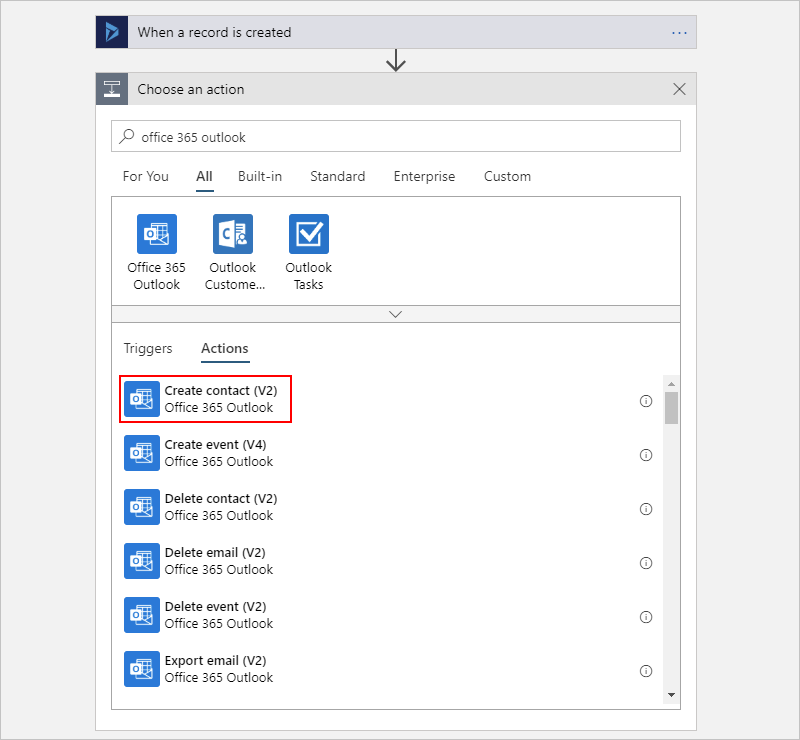

# Manage email, contacts, and calendars in Office 365 Outlook by using Azure Logic Apps

With [Azure Logic Apps](../logic-apps/logic-apps-overview.md) and the [Office 365 Outlook connector](/connectors/office365connector/), you can create automated tasks and workflows that manage your Office 365 account by building logic apps. For example, you automate these tasks:

* Get, send, and reply to email. 
* Schedule meetings on your calendar.
* Add and edit contacts. 

You can use any trigger to start your workflow, for example, when a new email arrives, when a calendar item is updated, or when an event happens in a difference service, such as Salesforce. You can use actions that respond to the trigger event, for example, send an email or create a new calendar event. 

> [!NOTE]
> To automate tasks for an @outlook.com or @hotmail.com account, use the 
> [Outlook.com connector](../connectors/connectors-create-api-outlook.md).

## Prerequisites

* An [Office 365 account](https://www.office.com/)

* An Azure subscription. If you don't have an Azure subscription, [sign up for a free Azure account](https://azure.microsoft.com/free/). 

* The logic app where you want to access your Office 365 Outlook account. To start your workflow with an Office 365 Outlook trigger, you need to have a [blank logic app](../logic-apps/quickstart-create-first-logic-app-workflow.md). To add an Office 365 Outlook action to your workflow, your logic app needs to already have a trigger.

## Add a trigger

A [trigger](../logic-apps/logic-apps-overview.md#logic-app-concepts) is an event that starts the workflow in your logic app. This example logic app uses a "polling" trigger that checks for any updated calendar event in your email account, based on the specified interval and frequency.

1. In the [Azure portal](https://portal.azure.com), open your blank logic app in the Logic App Designer.

1. In the search box, enter `office 365 outlook` as your filter. This example selects **When an upcoming event is starting soon**.
   
   

1. If you're prompted to sign in, provide your Office 365 credentials so that your logic app can connect to your account. Otherwise, if your connection already exists, provide the information for the trigger's properties.

   This example selects the calendar that the trigger checks, for example:

   

1. In the trigger, set the **Frequency** and **Interval** values. To add other available trigger properties, such as **Time zone**, select those properties from the **Add new parameter** list.

   For example, if you want the trigger to check the calendar every 15 minutes, set **Frequency** to **Minute**, and set **Interval** to `15`. 

   

1. On the designer toolbar, select **Save**.

Now add an action that runs after the trigger fires. For example, you can add the Twilio **Send message** action, which sends a text when a calendar event starts in 15 minutes.

## Add an action

An [action](../logic-apps/logic-apps-overview.md#logic-app-concepts) is an operation that's run by the workflow in your logic app. This example logic app creates a new contact in Office 365 Outlook. You can use the output from another trigger or action to create the contact. For example, suppose your logic app uses the Dynamics 365 trigger, **When a record is created**. You can add the Office 365 Outlook **Create contact** action and use the outputs from the SalesForce trigger to create the new contact.

1. In the [Azure portal](https://portal.azure.com), open your logic app in the Logic App Designer.

1. To add an action as the last step in your workflow, select **New step**. 

   To add an action between steps, move your pointer over the arrow between those steps. Select the plus sign (**+**) that appears, and then select **Add an action**.

1. In the search box, enter `office 365 outlook` as your filter. This example selects **Create contact**.

    

1. If you're prompted to sign in, provide your Office 365 credentials so that your logic app can connect to your account. Otherwise, if your connection already exists, provide the information for the action's properties.

   This example selects the contacts folder where the action creates the new contact, for example:

   

   To add other available action properties, select those properties from the **Add new parameter** list.

1. On the designer toolbar, select **Save**.

## Connector-specific details

For technical details about triggers, actions, and limits as described in the connector's Swagger file, see the [connector's reference page](/connectors/office365connector/). 

## Next steps

* Learn about other [Logic Apps connectors](../connectors/apis-list.md)
