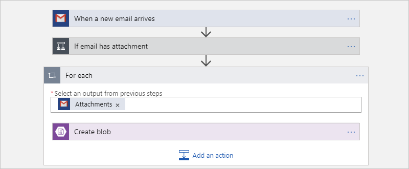
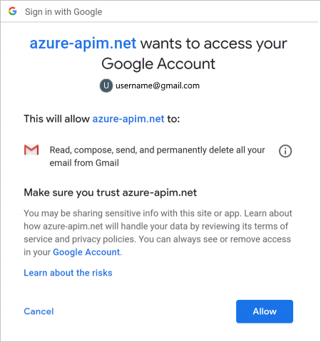

# Data security and privacy policies for Google connectors in Azure Logic Apps

Starting **May 1, 2020**, changes due to Google's [data security and privacy policies](https://www.blog.google/technology/safety-security/project-strobe/) might affect your logic app workflows that use the [Gmail connector](/connectors/gmail/). If your logic apps use the Gmail connector with a Gmail consumer account (email address that ends with @gmail.com or @googlemail.com), your logic apps can use only specific [Google-approved triggers, actions, and connectors](#approved-connectors).

> [!NOTE]
> If your logic apps use the Gmail connector with a G-Suite business account (email address with a custom domain), your logic apps aren't affected and have no restrictions on using the Gmail connector.

## Affected logic apps

If you have logic apps that use the Gmail connector, you'll receive an email about potentially-affected logic apps. However, starting **June 15, 2020**, any non-compliant workflows will be disabled. You can take either of these actions:

* Update the affected logic apps by [following the steps in this topic](#update-affected-workflows). You need to create a Google client app, which provides a client ID and client secret that you use for authentication in your Gmail trigger or action.

* Update the affected logic apps so that they use only the [Google-approved connectors](#approved-connectors) before you re-enable the disabled logic apps.

## Google-approved connectors

Under this policy, when you use a Gmail consumer account, you can use the Gmail connector with only specific Google-approved services, which are subject to change. Our engineering teams continue working with Google to add more services to this list. For now, here are the Google-approved triggers, actions, and connectors that you can use in the same logic app workflow with the Gmail connector when you use a Gmail consumer account:

* Logic Apps built-in triggers and actions: Batch, Control, Data Operations, Date Time, Flat File, Liquid, Request, Schedule, Variables, and XML

  Built-in triggers and actions that aren't approved by Google, such as HTTP, Azure Functions, Azure Logic Apps, and others, make a logic app non-compliant with the Gmail connector because the app can send or receive data from anywhere.

* Google services: Gmail, Google Calendar, Google Contacts, Google Drive, Google Sheets, and Google Tasks

* Approved Microsoft services: Dynamics 365, Excel Online, Microsoft Teams, Microsoft 365, OneDrive, and SharePoint Online

* Connectors for customer-managed data sources: FTP, RSS, SFTP, SMTP, and SQL Server

## Non-compliant examples

Here are some examples that use the Gmail connector with built-in triggers and actions or managed connectors that aren't approved by Google:

* This logic app uses the Gmail connector with the HTTP built-in trigger:

  
  
  The logic app also uses the Google Calendar connector, which is approved.

* This logic app uses the Gmail connector with the Azure Blob Storage connector:

  

* This logic app uses the Gmail connector with the Twitter connector:

  

For the most recent information, see the [Gmail connector's technical reference documentation](/connectors/gmail/).

## Steps for affected logic apps

If you have to use the Gmail connector with a Gmail consumer account and Google non-approved connectors in a logic app, you can create your own Google app for personal or internal use in your enterprise. For this scenario, here are the high-level steps that you need to take:

1. Create a Google client app by using the [Google API Console](https://console.developers.google.com).

1. In your Gmail connector, use the client ID and client secret values from your Google client app.

For more information, see the [Gmail connector's technical reference documentation](/connectors/gmail/#authentication-and-bring-your-own-application).

### Create Google client app

To set up a project for your client app, use the [Google API Console wizard](https://console.developers.google.com/start/api?id=gmail&credential=client_key) and follow the instructions. Or, for detailed steps, review the instructions in the [Gmail connector's technical reference documentation](/connectors/gmail/#authentication-and-bring-your-own-application).

When you're done, your screen looks like this example except you'll have your own **Client ID** and **Client secret** values, which you later use in your logic app.

### Use client app settings in logic app

To use the client ID and client secret from your Google client app in your Gmail trigger or action, follow these steps:

1. In the [Azure portal](https://portal.azure.com), open your logic app in the Logic App Designer.

1. If you're adding a new Gmail trigger or action and creating an entirely new connection, continue to the next step. Otherwise, in the Gmail trigger or action, select **Change connection** > **Add new**, for example:

   

1. Provide your connection information, for example:

   

   | Property | Value | Description |
   |----------|-------|-------------|
   | **Authentication Type** | **Bring your own application** | Specifies that you'll use your own client app for authentication. |
   | **Client ID** | <*client-ID*> | The client ID from your Google client app |
   | **Client Secret** | <*client-secret*> | The client secret from your Google client app |
   ||||

1. When you're done, select **Sign in**.

   A page appears that shows the client app that you created. If you're using a Gmail consumer account, you might get a page that show your client app isn't verified by Google and prompts you to first allow access to your Google account.

   

1. If necessary, select **Allow**.

   You can now use the Gmail connector without restrictions in your logic app.

## Next steps

Learn more about the [Gmail connector](/connectors/gmail/)

