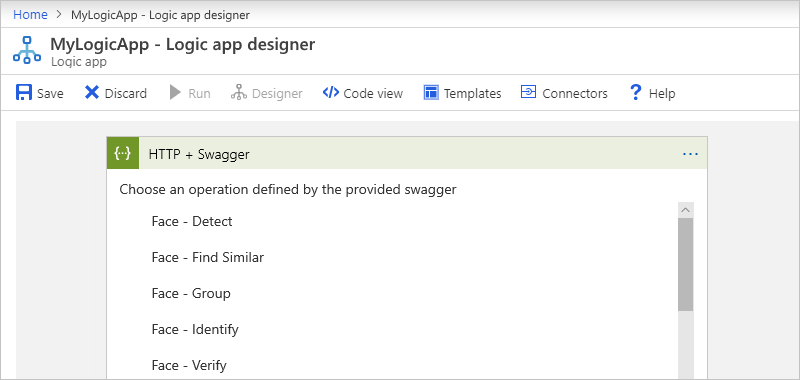
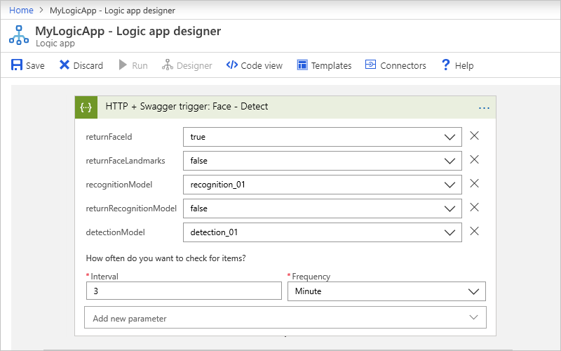
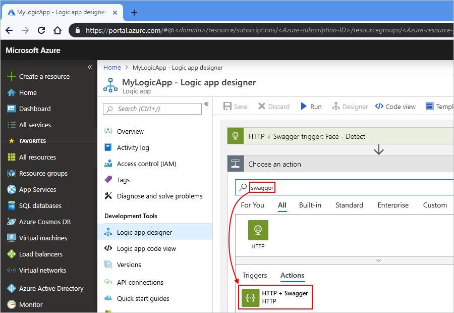
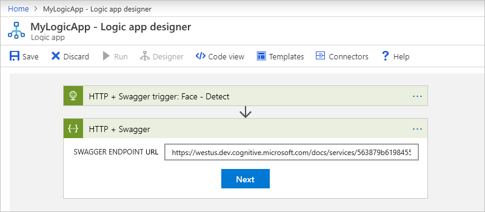
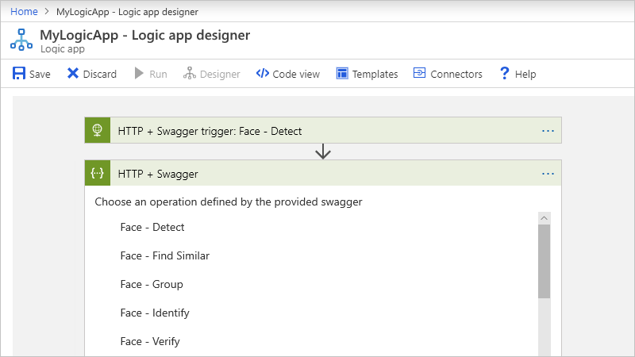
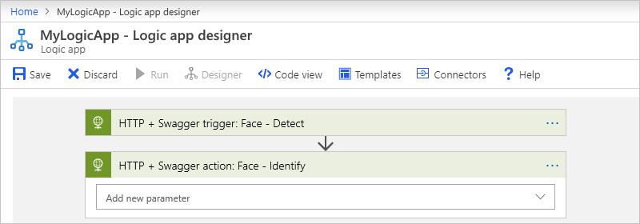

# Call REST endpoints by using Azure Logic Apps

With [Azure Logic Apps](../logic-apps/logic-apps-overview.md) and the built-in HTTP + Swagger connector, you can automate workflows that regularly call any REST endpoint through a [Swagger file](https://swagger.io) by building logic apps. The HTTP + Swagger trigger and action work the same as the [HTTP trigger and action](connectors-native-http.md) but provide a better experience in the Logic App Designer by exposing the API structure and outputs described by the Swagger file. To implement a polling trigger, follow the polling pattern that's described in [Create custom APIs to call other APIs, services, and systems from logic apps](../logic-apps/logic-apps-create-api-app.md#polling-triggers).

## Prerequisites

* An Azure subscription. If you don't have an Azure subscription, [sign up for a free Azure account](https://azure.microsoft.com/free/).

* The URL for the Swagger (not OpenAPI) file that describes the target REST endpoint

  Typically, the REST endpoint must meet this criteria for the connector to work:

  * The Swagger file must be hosted on an HTTPS URL that's publicly accessible.
  
  * The Swagger file must contain an `operationID` for each operation in the definition. If not, the connector only shows the last operation in the Swagger file. 

  * The Swagger file must have [Cross-Origin Resource Sharing (CORS)](/rest/api/storageservices/cross-origin-resource-sharing--cors--support-for-the-azure-storage-services) enabled.

  To reference a Swagger file that's not hosted or that doesn't meet the security and cross-origin requirements, you can [upload the Swagger file to a blob container in an Azure storage account](#host-swagger), and enable CORS on that storage account so that you can reference the file.

  The examples in this topic use the [Cognitive Services Face API](../cognitive-services/face/overview.md), which requires a [Cognitive Services account and access key](../cognitive-services/cognitive-services-apis-create-account.md).

* Basic knowledge about [how to create logic apps](../logic-apps/quickstart-create-first-logic-app-workflow.md). If you're new to logic apps, review [What is Azure Logic Apps?](../logic-apps/logic-apps-overview.md)

* The logic app from where you want to call the target endpoint. To start with the HTTP + Swagger trigger, [create a blank logic app](../logic-apps/quickstart-create-first-logic-app-workflow.md). To use the HTTP + Swagger action, start your logic app with any trigger that you want. This example uses the HTTP + Swagger trigger as the first step.

## Add an HTTP + Swagger trigger

This built-in trigger sends an HTTP request to a URL for a Swagger file that describes a REST API and returns a response that contains that file's content.

1. Sign in to the [Azure portal](https://portal.azure.com). Open your blank logic app in Logic App Designer.

1. On the designer, in the search box, enter "swagger" as your filter. From the **Triggers** list, select the **HTTP + Swagger** trigger.

   

1. In the **SWAGGER ENDPOINT URL** box, enter the URL for the Swagger file, and select **Next**.

   This example uses the Swagger URL that is located in the West US region for the [Cognitive Services Face API](https://westus.dev.cognitive.microsoft.com/docs/services/563879b61984550e40cbbe8d/operations/563879b61984550f30395236):

   `https://westus.dev.cognitive.microsoft.com/docs/services/563879b61984550e40cbbe8d/export?DocumentFormat=Swagger&ApiName=Face%20API%20-%20V1.0`

   

1. When the designer shows the operations described by the Swagger file, select the operation that you want to use.

   

1. Provide the values for the trigger parameters, which vary based on the selected operation, that you want to include in the endpoint call. Set up the recurrence for how often you want the trigger to call the endpoint.

   This example renames the trigger to "HTTP + Swagger trigger: Face - Detect" so that the step has a more descriptive name.

   

1. To add other available parameters, open the **Add new parameter** list, and select the parameters that you want.

   For more information about authentication types available for HTTP + Swagger, see [Add authentication to outbound calls](../logic-apps/logic-apps-securing-a-logic-app.md#add-authentication-outbound).

1. Continue building your logic app's workflow with actions that run when the trigger fires.

1. When you're finished, remember to save your logic app. On the designer toolbar, select **Save**.

## Add an HTTP + Swagger action

This built-in action makes an HTTP request to the URL for the Swagger file that describes a REST API and returns a response that contains that file's content.

1. Sign in to the [Azure portal](https://portal.azure.com). Open your logic app in Logic App Designer.

1. Under the step where you want to add the HTTP + Swagger action, select **New step**.

   To add an action between steps, move your pointer over the arrow between steps. Select the plus sign (**+**) that appears, and then select **Add an action**.

1. On the designer, in the search box, enter "swagger" as your filter. From the **Actions** list, select the **HTTP + Swagger** action.

    

1. In the **SWAGGER ENDPOINT URL** box, enter the URL for the Swagger file, and select **Next**.

   This example uses the Swagger URL that is located in the West US region for the [Cognitive Services Face API](https://westus.dev.cognitive.microsoft.com/docs/services/563879b61984550e40cbbe8d/operations/563879b61984550f30395236):

   `https://westus.dev.cognitive.microsoft.com/docs/services/563879b61984550e40cbbe8d/export?DocumentFormat=Swagger&ApiName=Face%20API%20-%20V1.0`

   

1. When the designer shows the operations described by the Swagger file, select the operation that you want to use.

   

1. Provide the values for the action parameters, which vary based on the selected operation, that you want to include in the endpoint call.

   This example has no parameters, but renames the action to "HTTP + Swagger action: Face - Identify" so that the step has a more descriptive name.

   

1. To add other available parameters, open the **Add new parameter** list, and select the parameters that you want.

   For more information about authentication types available for HTTP + Swagger, see [Add authentication to outbound calls](../logic-apps/logic-apps-securing-a-logic-app.md#add-authentication-outbound).

1. When you're finished, remember to save your logic app. On the designer toolbar, select **Save**.

## Host Swagger in Azure Storage

You can reference a Swagger file that's not hosted or that doesn't meet the security and cross-origin requirements by uploading that file to blob container in an Azure storage account and enabling CORS on that storage account. To create, set up, and store Swagger files in Azure Storage, follow these steps:

1. [Create an Azure storage account](../storage/common/storage-account-create.md).

1. Now enable CORS for the blob. On your storage account's menu, select **CORS**. On the **Blob service** tab, specify these values, and then select **Save**.

   | Property | Value |
   |----------|-------|
   | **Allowed origins** | `*` |
   | **Allowed methods** | `GET`, `HEAD`, `PUT` |
   | **Allowed headers** | `*` |
   | **Exposed headers** | `*` |
   | **Max age** (in seconds) | `200` |
   |||

   Although this example uses the [Azure portal](https://portal.azure.com), you can use a tool such as [Azure Storage Explorer](https://storageexplorer.com/), or automatically configure this setting by using this sample [PowerShell script](https://github.com/logicappsio/EnableCORSAzureBlob/blob/master/EnableCORSAzureBlob.ps1).

1. [Create a blob container](../storage/blobs/storage-quickstart-blobs-portal.md). On the container's **Overview** pane, select **Change access level**. From the **Public access level** list, select **Blob (anonymous read access for blobs only)**, and select **OK**.

1. [Upload the Swagger file to the blob container](../storage/blobs/storage-quickstart-blobs-portal.md#upload-a-block-blob), either through the [Azure portal](https://portal.azure.com) or [Azure Storage Explorer](https://storageexplorer.com/).

1. To reference the file in the blob container, get the HTTPS URL that follows this format, which is case-sensitive, from Azure Storage Explorer:

   `https://<storage-account-name>.blob.core.windows.net/<blob-container-name>/<complete-swagger-file-name>?<query-parameters>`

## Connector reference

Here is more information about the outputs from an HTTP + Swagger trigger or action. The HTTP + Swagger call returns this information:

| Property name | Type | Description |
|---------------|------|-------------|
| headers | object | The headers from the request |
| body | object | The object with the body content from the request |
| status code | int | The status code from the request |
||||

| Status code | Description |
|-------------|-------------|
| 200 | OK |
| 202 | Accepted |
| 400 | Bad request |
| 401 | Unauthorized |
| 403 | Forbidden |
| 404 | Not Found |
| 500 | Internal server error. Unknown error occurred. |
|||

## Next steps

* Learn about other [Logic Apps connectors](../connectors/apis-list.md)
