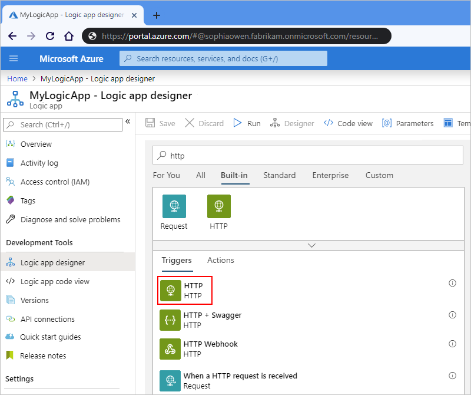
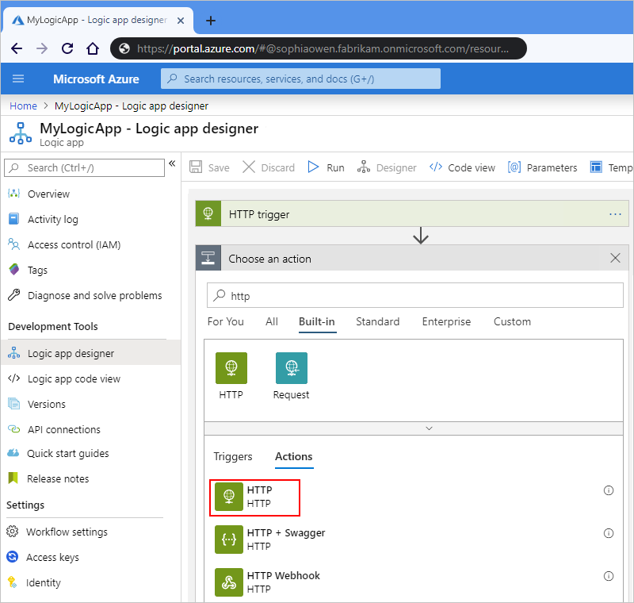
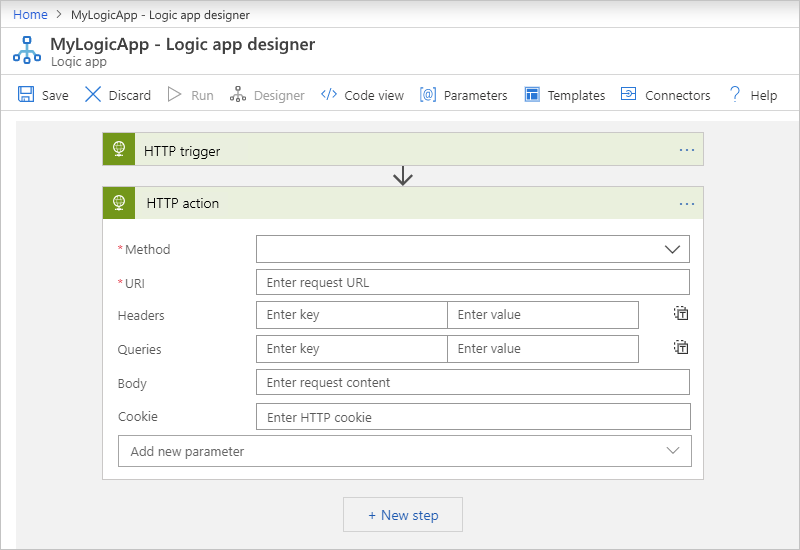
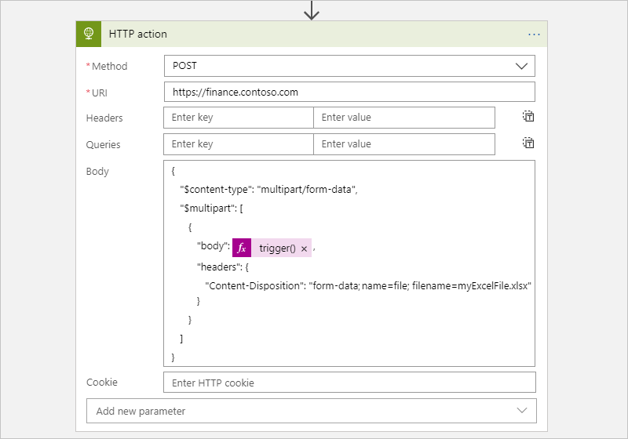

# Call HTTP or HTTPS endpoints by using Azure Logic Apps

With [Azure Logic Apps](../logic-apps/logic-apps-overview.md) and the built-in HTTP connector, you can automate workflows that regularly call any HTTP or HTTPS endpoint by building logic apps. For example, you can monitor the service endpoint for your website by checking that endpoint on a specified schedule. When a specific event happens at that endpoint, such as your website going down, the event triggers your logic app's workflow and runs the specified actions.

To check or *poll* an endpoint on a regular schedule, you can use the HTTP trigger as the first step in your workflow. On each check, the trigger sends a call or *request* to the endpoint. The endpoint's response determines whether your logic app's workflow runs. The trigger passes along any content from the response to the actions in your logic app.

You can use the HTTP action as any other step in your workflow for calling the endpoint when you want. The endpoint's response determines how your workflow's remaining actions run.

Based the target endpoint's capability, the HTTP connector supports Transport Layer Security (TLS) versions 1.0, 1.1, and 1.2. Logic Apps negotiates with the endpoint over using the highest supported version possible. So, for example, if the endpoint supports 1.2, the connector uses 1.2 first. Otherwise, the connector uses the next highest supported version.

## Prerequisites

* An Azure subscription. If you don't have an Azure subscription, [sign up for a free Azure account](https://azure.microsoft.com/free/).

* The URL for the target endpoint that you want to call

* Basic knowledge about [how to create logic apps](../logic-apps/quickstart-create-first-logic-app-workflow.md). If you're new to logic apps, review [What is Azure Logic Apps?](../logic-apps/logic-apps-overview.md)

* The logic app from where you want to call the target endpoint. To start with the HTTP trigger, [create a blank logic app](../logic-apps/quickstart-create-first-logic-app-workflow.md). To use the HTTP action, start your logic app with any trigger that you want. This example uses the HTTP trigger as the first step.

## Add an HTTP trigger

This built-in trigger makes an HTTP call to the specified URL for an endpoint and returns a response.

1. Sign in to the [Azure portal](https://portal.azure.com). Open your blank logic app in Logic App Designer.

1. On the designer, in the search box, enter "http" as your filter. From the **Triggers** list, select the **HTTP** trigger.

   

   This example renames the trigger to "HTTP trigger" so that the step has a more descriptive name. Also, the example later adds an HTTP action, and both names must be unique.

1. Provide the values for the [HTTP trigger parameters](../logic-apps/logic-apps-workflow-actions-triggers.md##http-trigger) that you want to include in the call to the target endpoint. Set up the recurrence for how often you want the trigger to check the target endpoint.

   

   For more information about authentication types available for HTTP, see [Authenticate HTTP triggers and actions](../logic-apps/logic-apps-workflow-actions-triggers.md#connector-authentication).

1. To add other available parameters, open the **Add new parameter** list, and select the parameters that you want.

1. Continue building your logic app's workflow with actions that run when the trigger fires.

1. When you're finished, done, remember to save your logic app. On the designer toolbar, select **Save**.

## Add an HTTP action

This built-in action makes an HTTP call to the specified URL for an endpoint and returns a response.

1. Sign in to the [Azure portal](https://portal.azure.com). Open your logic app in Logic App Designer.

   This example uses the HTTP trigger as the first step.

1. Under the step where you want to add the HTTP action, select **New step**.

   To add an action between steps, move your pointer over the arrow between steps. Select the plus sign (**+**) that appears, and then select **Add an action**.

1. On the designer, in the search box, enter "http" as your filter. From the **Actions** list, select the **HTTP** action.

   

   This example renames the action to "HTTP action" so that the step has a more descriptive name.

1. Provide the values for the [HTTP action parameters](../logic-apps/logic-apps-workflow-actions-triggers.md##http-action) that you want to include in the call to the target endpoint.

   

   For more information about authentication types available for HTTP, see [Authenticate HTTP triggers and actions](../logic-apps/logic-apps-workflow-actions-triggers.md#connector-authentication).

1. To add other available parameters, open the **Add new parameter** list, and select the parameters that you want.

1. When you're finished, remember to save your logic app. On the designer toolbar, select **Save**.

## Content with multipart/form-data type

To handle content that has `multipart/form-data` type in HTTP requests, you can add a JSON object that includes the `$content-type` and `$multipart` attributes to the HTTP request's body by using this format.

```json
"body": {
   "$content-type": "multipart/form-data",
   "$multipart": [
      {
         "body": "<output-from-trigger-or-previous-action>",
         "headers": {
            "Content-Disposition": "form-data; name=file; filename=<file-name>"
         }
      }
   ]
}
```

For example, suppose you have a logic app that sends an HTTP POST request for an Excel file to a website by using that site's API, which supports the `multipart/form-data` type. Here's how this action might look:



Here is the same example that shows the HTTP action's JSON definition in the underlying workflow definition:

```json
{
   "HTTP_action": {
      "body": {
         "$content-type": "multipart/form-data",
         "$multipart": [
            {
               "body": "@trigger()",
               "headers": {
                  "Content-Disposition": "form-data; name=file; filename=myExcelFile.xlsx"
               }
            }
         ]
      },
      "method": "POST",
      "uri": "https://finance.contoso.com"
   },
   "runAfter": {},
   "type": "Http"
}
```

## Connector reference

For more information about trigger and action parameters, see these sections:

* [HTTP trigger parameters](../logic-apps/logic-apps-workflow-actions-triggers.md##http-trigger)
* [HTTP action parameters](../logic-apps/logic-apps-workflow-actions-triggers.md##http-action)

### Output details

Here is more information about the outputs from an HTTP trigger or action, which returns this information:

| Property name | Type | Description |
|---------------|------|-------------|
| headers | object | The headers from the request |
| body | object | JSON object | The object with the body content from the request |
| status code | int | The status code from the request |
|||

| Status code | Description |
|-------------|-------------|
| 200 | OK |
| 202 | Accepted |
| 400 | Bad request |
| 401 | Unauthorized |
| 403 | Forbidden |
| 404 | Not Found |
| 500 | Internal server error. Unknown error occurred. |
|||

## Next steps

* Learn about other [Logic Apps connectors](../connectors/apis-list.md)
