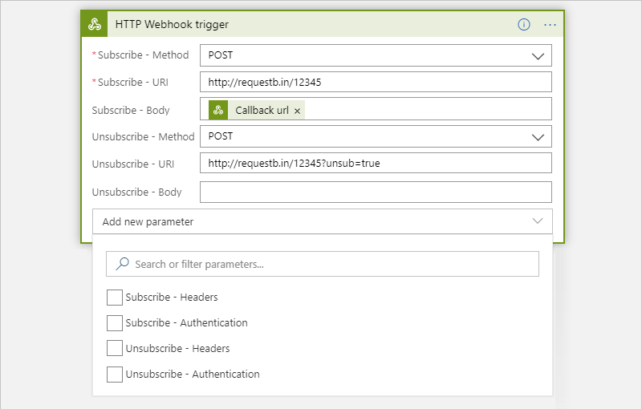
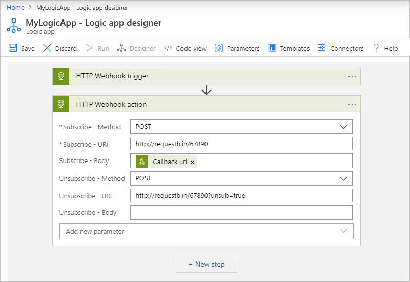
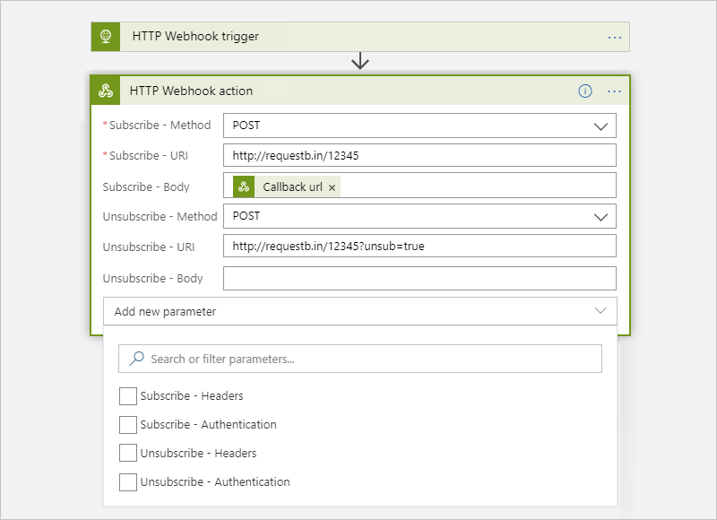

# Create and run automated event-based workflows by using HTTP webhooks in Azure Logic Apps

With [Azure Logic Apps](../logic-apps/logic-apps-overview.md) and the built-in HTTP Webhook connector, you can create automated tasks and workflows that subscribe to a service endpoint, wait for specific events, and run based on those events, rather than regularly checking or *polling* that endpoint.

Here are some example webhook-based workflows:

* Wait for an item to arrive from an [Azure Event Hub](https://github.com/logicappsio/EventHubAPI) before triggering a logic app run.
* Wait for an approval before continuing a workflow.

This article shows how to use the Webhook trigger and Webhook action so that your logic app can receive and respond to events at a service endpoint.

## How do webhooks work?

A webhook trigger is event-based, which doesn't depend on checking or polling regularly for new items. When you save a logic app that starts with a webhook trigger, or when you change your logic app from disabled to enabled, the webhook trigger *subscribes* to the specified service endpoint by registering a *callback URL* with that endpoint. The trigger then waits for that service endpoint to call the URL, which starts running the logic app. Similar to the [Request trigger](connectors-native-reqres.md), the logic app fires immediately when the specified event happens. The webhook trigger *unsubscribes* from the service endpoint if you remove the trigger and save your logic app, or when you change your logic app from enabled to disabled.

A webhook action is also event-based and *subscribes* to the specified service endpoint by registering a *callback URL* with that endpoint. The webhook action pauses the logic app's workflow and waits until the service endpoint calls the URL before the logic app resumes running. The webhook action *unsubscribes* from the service endpoint in these cases:

* When the webhook action successfully finishes
* If the logic app run is canceled while waiting for a response
* Before the logic app times out

For example, the Office 365 Outlook connector's [**Send approval email**](connectors-create-api-office365-outlook.md) action is an example of webhook action that follows this pattern. You can extend this pattern into any service by using the webhook action.

For more information, see these topics:

* [Webhooks and subscriptions](../logic-apps/logic-apps-workflow-actions-triggers.md#webhooks-and-subscriptions)
* [Create custom APIs that support a webhook](../logic-apps/logic-apps-create-api-app.md)

For information about encryption, security, and authorization for inbound calls to your logic app, such as [Transport Layer Security (TLS)](https://en.wikipedia.org/wiki/Transport_Layer_Security), previously known as Secure Sockets Layer (SSL), or [Azure Active Directory Open Authentication (Azure AD OAuth)](../active-directory/develop/index.yml), see [Secure access and data - Access for inbound calls to request-based triggers](../logic-apps/logic-apps-securing-a-logic-app.md#secure-inbound-requests).

## Prerequisites

* An Azure account and subscription. If you don't have an Azure subscription, [sign up for a free Azure account](https://azure.microsoft.com/free/).

* The URL for an already deployed endpoint or API that supports the webhook subscribe and unsubscribe pattern for [webhook triggers in logic apps](../logic-apps/logic-apps-create-api-app.md#webhook-triggers) or [webhook actions in logic apps](../logic-apps/logic-apps-create-api-app.md#webhook-actions) as appropriate

* Basic knowledge about [how to create logic apps](../logic-apps/quickstart-create-first-logic-app-workflow.md). If you're new to logic apps, review [What is Azure Logic Apps?](../logic-apps/logic-apps-overview.md)

* The logic app where you want to wait for specific events at the target endpoint. To start with the HTTP Webhook trigger, [create a blank logic app](../logic-apps/quickstart-create-first-logic-app-workflow.md). To use the HTTP Webhook action, start your logic app with any trigger that you want. This example uses the HTTP trigger as the first step.

## Add an HTTP Webhook trigger

This built-in trigger calls the subscribe endpoint on the target service and registers a callback URL with the target service. Your logic app then waits for the target service to send an `HTTP POST` request to the callback URL. When this event happens, the trigger fires and passes any data in the request along to the workflow.

1. Sign in to the [Azure portal](https://portal.azure.com). Open your blank logic app in Logic App Designer.

1. In the designer's search box, enter `http webhook` as your filter. From the **Triggers** list, select the **HTTP Webhook** trigger.

   

   This example renames the trigger to `HTTP Webhook trigger` so that the step has a more descriptive name. Also, the example later adds an HTTP Webhook action, and both names must be unique.

1. Provide the values for the [HTTP Webhook trigger parameters](../logic-apps/logic-apps-workflow-actions-triggers.md#http-webhook-trigger) that you want to use for the subscribe and unsubscribe calls.

   In this example, the trigger includes the methods, URIs, and message bodies to use when performing the subscribe and unsubscribe operations.

   

   | Property | Required | Description |
   |----------|----------|-------------|
   | **Subscription - Method** | Yes | The method to use when subscribing to the target endpoint |
   | **Subscribe - URI** | Yes | The URL to use for subscribing to the target endpoint |
   | **Subscribe - Body** | No | Any message body to include in the subscribe request. This example includes the callback URL that uniquely identifies the subscriber, which is your logic app, by using the `@listCallbackUrl()` expression to retrieve your logic app's callback URL. |
   | **Unsubscribe - Method** | No | The method to use when unsubscribing from the target endpoint |
   | **Unsubscribe - URI** | No | The URL to use for unsubscribing from the target endpoint |
   | **Unsubscribe - Body** | No | An optional message body to include in the unsubscribe request 

**Note**: This property doesn't support using the `listCallbackUrl()` function. However, the trigger automatically includes and sends the headers, `x-ms-client-tracking-id` and `x-ms-workflow-operation-name`, which the target service can use to uniquely identify the subscriber. |
   ||||

1. To add other trigger properties, open the **Add new parameter** list.

   

   For example, if you need to use authentication, you can add the **Subscribe - Authentication** and **Unsubscribe - Authentication** properties. For more information about authentication types available for HTTP Webhook, see [Add authentication to outbound calls](../logic-apps/logic-apps-securing-a-logic-app.md#add-authentication-outbound).

1. Continue building your logic app's workflow with actions that run when the trigger fires.

1. When you're finished, done, remember to save your logic app. On the designer toolbar, select **Save**.

   Saving your logic app calls the subscribe endpoint on the target service and registers the callback URL. Your logic app then waits for the target service to send an `HTTP POST` request to the callback URL. When this event happens, the trigger fires and passes any data in the request along to the workflow. If this operation completes successfully, the trigger unsubscribes from the endpoint, and your logic app continues the remaining workflow.

## Add an HTTP Webhook action

This built-in action calls the subscribe endpoint on the target service and registers a callback URL with the target service. Your logic app then pauses and waits for target service to send an `HTTP POST` request to the callback URL. When this event happens, the action passes any data in the request along to the workflow. If the operation completes successfully, the action unsubscribes from the endpoint, and your logic app continues running the remaining workflow.

1. Sign in to the [Azure portal](https://portal.azure.com). Open your logic app in Logic App Designer.

   This example uses the HTTP Webhook trigger as the first step.

1. Under the step where you want to add the HTTP Webhook action, select **New step**.

   To add an action between steps, move your pointer over the arrow between steps. Select the plus sign (**+**) that appears, and then select **Add an action**.

1. In the designer's search box, enter `http webhook` as your filter. From the **Actions** list, select the **HTTP Webhook** action.

   

   This example renames the action to "HTTP Webhook action" so that the step has a more descriptive name.

1. Provide the values for the HTTP Webhook action parameters, which are similar to the [HTTP Webhook trigger parameters](../logic-apps/logic-apps-workflow-actions-triggers.md#http-webhook-trigger), that you want to use for the subscribe and unsubscribe calls.

   In this example, the action includes the methods, URIs, and message bodies to use when performing the subscribe and unsubscribe operations.

   

   | Property | Required | Description |
   |----------|----------|-------------|
   | **Subscription - Method** | Yes | The method to use when subscribing to the target endpoint |
   | **Subscribe - URI** | Yes | The URL to use for subscribing to the target endpoint |
   | **Subscribe - Body** | No | Any message body to include in the subscribe request. This example includes the callback URL that uniquely identifies the subscriber, which is your logic app, by using the `@listCallbackUrl()` expression to retrieve your logic app's callback URL. |
   | **Unsubscribe - Method** | No | The method to use when unsubscribing from the target endpoint |
   | **Unsubscribe - URI** | No | The URL to use for unsubscribing from the target endpoint |
   | **Unsubscribe - Body** | No | An optional message body to include in the unsubscribe request 

**Note**: This property doesn't support using the `listCallbackUrl()` function. However, the action automatically includes and sends the headers, `x-ms-client-tracking-id` and `x-ms-workflow-operation-name`, which the target service can use to uniquely identify the subscriber. |
   ||||

1. To add other action properties, open the **Add new parameter** list.

   

   For example, if you need to use authentication, you can add the **Subscribe - Authentication** and **Unsubscribe - Authentication** properties. For more information about authentication types available for HTTP Webhook, see [Add authentication to outbound calls](../logic-apps/logic-apps-securing-a-logic-app.md#add-authentication-outbound).

1. When you're finished, remember to save your logic app. On the designer toolbar, select **Save**.

   Now, when this action runs, your logic app calls the subscribe endpoint on the target service and registers the callback URL. The logic app then pauses the workflow and waits for the target service to send an `HTTP POST` request to the callback URL. When this event happens, the action passes any data in the request along to the workflow. If the operation completes successfully, the action unsubscribes from the endpoint, and your logic app continues running the remaining workflow.

## Trigger and action outputs

Here is more information about the outputs from an HTTP Webhook trigger or action, which returns this information:

| Property name | Type | Description |
|---------------|------|-------------|
| headers | object | The headers from the request |
| body | object | JSON object | The object with the body content from the request |
| status code | int | The status code from the request |
|||

| Status code | Description |
|-------------|-------------|
| 200 | OK |
| 202 | Accepted |
| 400 | Bad request |
| 401 | Unauthorized |
| 403 | Forbidden |
| 404 | Not Found |
| 500 | Internal server error. Unknown error occurred. |
|||

## Connector reference

For more information about trigger and action parameters, which are similar to each other, see [HTTP Webhook parameters](../logic-apps/logic-apps-workflow-actions-triggers.md#http-webhook-trigger).

## Next steps

* [Secure access and data - Access for inbound calls to request-based triggers](../logic-apps/logic-apps-securing-a-logic-app.md#secure-inbound-requests)
* [Connectors for Logic Apps](../connectors/apis-list.md)
