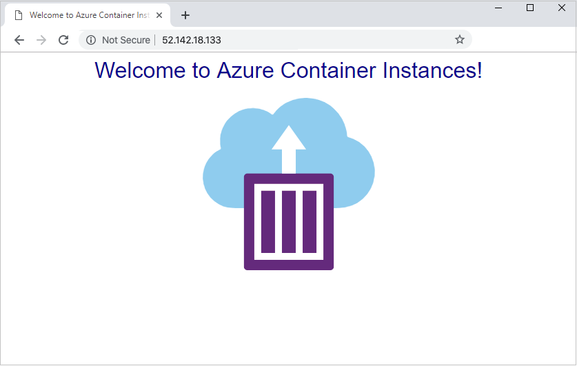

# Expose a static IP address for a container group

This article shows one way to expose a static, public IP address for a [container group](container-instances-container-groups.md) by using an Azure [application gateway](../application-gateway/overview.md). Follow these steps when you need a static entry point for an external-facing containerized app that runs in Azure Container Instances. 

In this article you use the Azure CLI to create the resources for this scenario:

* An Azure virtual network
* A container group deployed [in the virtual network](container-instances-vnet.md) that hosts a small web app
* An application gateway with a public frontend IP address, a listener to host a website on the gateway, and a route to the backend container group

As long as the application gateway runs and the container group exposes a stable private IP address in the network's delegated subnet, the container group is accessible at this public IP address.

> [!NOTE]
> Azure charges for an application gateway based on the amount of time that the gateway is provisioned and available, as well as the amount of data it processes. See [pricing](https://azure.microsoft.com/pricing/details/application-gateway/).

## Create virtual network

In a typical case, you might already have an Azure virtual network. If you don't have one, create one as shown with the following example commands. The virtual network needs separate subnets for the application gateway and the container group.

If you need one, create an Azure resource group. For example:

```azureci
az group create --name myResourceGroup --location eastus
```

Create a virtual network with the [az network vnet create][az-network-vnet-create] command. This command creates the *myAGSubnet* subnet in the network.

```azurecli
az network vnet create \
  --name myVNet \
  --resource-group myResourceGroup \
  --location eastus \
  --address-prefix 10.0.0.0/16 \
  --subnet-name myAGSubnet \
  --subnet-prefix 10.0.1.0/24
```

Use the [az network vnet subnet create][az-network-vnet-subnet-create] command to create a subnet for the backend container group. Here it's named *myACISubnet*.

```azurecli
az network vnet subnet create \
  --name myACISubnet \
  --resource-group myResourceGroup \
  --vnet-name myVNet   \
  --address-prefix 10.0.2.0/24
```

Use the [az network public-ip create][az-network-public-ip-create] command to create a static public IP resource. In a later step, this address is configured as the front end of the application gateway.

```azurecli
az network public-ip create \
  --resource-group myResourceGroup \
  --name myAGPublicIPAddress \
  --allocation-method Static \
  --sku Standard
```

## Create container group

Run the following [az container create][az-container-create] to create a container group in the virtual network you configured in the previous step. 

The group is deployed in the *myACISubnet* subnet and contains a single instance named *appcontainer* that pulls the `aci-helloworld` image. As shown in other articles in the documentation, this image packages a small web app written in Node.js that serves a static HTML page. 

```azurecli
az container create \
  --name appcontainer \
  --resource-group myResourceGroup \
  --image mcr.microsoft.com/azuredocs/aci-helloworld \
  --vnet myVNet \
  --subnet myACISubnet
```

When successfully deployed, the container group is assigned a private IP address in the virtual network. For example, run the following [az container show][az-container-show] command to retrieve the group's IP address:

```azurecli
az container show \
  --name appcontainer --resource-group myResourceGroup \
  --query ipAddress.ip --output tsv
```

Output is similar to: `10.0.2.4`.

For use in a later step, save the IP address in an environment variable:

```azurecli
ACI_IP=$(az container show \
  --name appcontainer \
  --resource-group myResourceGroup \
  --query ipAddress.ip --output tsv)
```

## Create application gateway

Create an application gateway in the virtual network, following the steps in the [application gateway quickstart](../application-gateway/quick-create-cli.md). The following [az network application-gateway create][az-network-application-gateway-create] command creates a gateway with a public frontend IP address and a route to the backend container group. See the [Application Gateway documentation](/azure/application-gateway/) for details about the gateway settings.

```azurecli
az network application-gateway create \
  --name myAppGateway \
  --location eastus \
  --resource-group myResourceGroup \
  --capacity 2 \
  --sku Standard_v2 \
  --http-settings-protocol http \
  --public-ip-address myAGPublicIPAddress \
  --vnet-name myVNet \
  --subnet myAGSubnet \
  --servers "$ACI_IP" 
```


It can take up to 15 minutes for Azure to create the application gateway. 

## Test public IP address
  
Now you can test access to the web app running in the container group behind the application gateway.

Run the [az network public-ip show][az-network-public-ip-show] command to retrieve the frontend public IP address of the gateway:

```azurecli
az network public-ip show \
--resource-group myresourcegroup \
--name myAGPublicIPAddress \
--query [ipAddress] \
--output tsv
```

Output is a public IP address, similar to: `52.142.18.133`.

To view the running web app when successfully configured, navigate to the gateway's public IP address in your browser. Successful access is similar to:



## Next steps

* See a [quickstart template](https://github.com/Azure/azure-quickstart-templates/tree/master/201-aci-wordpress-vnet) to create a container group with a WordPress container instance as a backend server behind an application gateway.
* You can also configure an application gateway with a certificate for SSL termination. See the [overview](../application-gateway/ssl-overview.md) and the [tutorial](../application-gateway/create-ssl-portal.md).
* Depending on your scenario, consider using other Azure load-balancing solutions with Azure Container Instances. For example, use [Azure Traffic Manager](../traffic-manager/traffic-manager-overview.md) to distribute traffic across multiple container instances and across multiple regions. See this [blog post](https://aaronmsft.com/posts/azure-container-instances/).

[az-network-vnet-create]:  /cli/azure/network/vnet#az-network-vnet-create
[az-network-vnet-subnet-create]: /cli/azure/network/vnet/subnet#az-network-vnet-subnet-create
[az-network-public-ip-create]: /cli/azure/network/public-ip#az-network-public-ip-create
[az-network-public-ip-show]: /cli/azure/network/public-ip#az-network-public-ip-show
[az-network-application-gateway-create]: /cli/azure/network/application-gateway#az-network-application-gateway-create
[az-container-create]: /cli/azure/container#az-container-create
[az-container-show]: /cli/azure/container#az-container-show