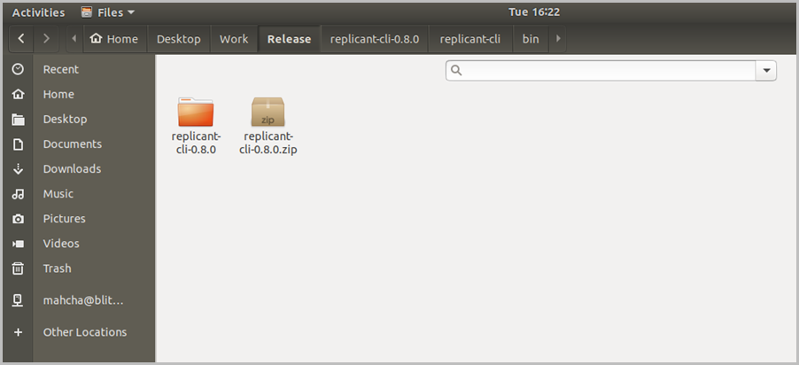
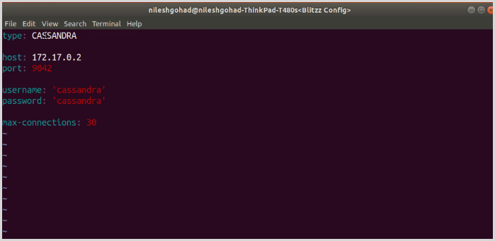
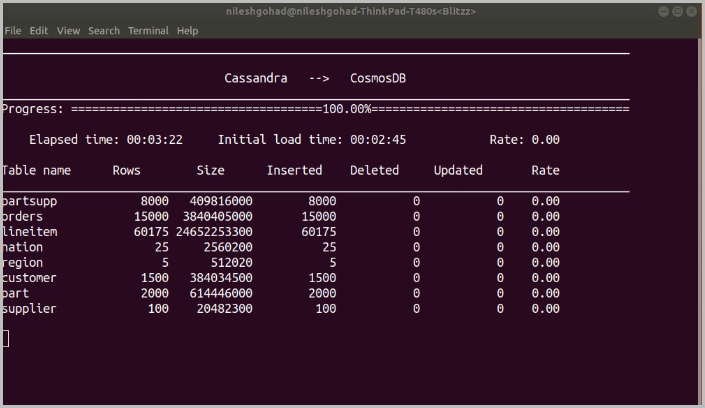

# Migrate data from Cassandra to Azure Cosmos DB Cassandra API account using Blitzz

Cassandra API in Azure Cosmos DB has become a great choice for enterprise workloads running on Apache Cassandra for a variety of reasons such as: 

* **No overhead of managing and monitoring:** It eliminates the overhead of managing and monitoring a myriad of settings across OS, JVM, and yaml files and their interactions.

* **Significant cost savings:** You can save cost with Azure Cosmos DB, which includes the cost of VM’s, bandwidth, and any applicable licenses. Additionally, you don’t have to manage the data centers, servers, SSD storage, networking, and electricity costs. 

* **Ability to use existing code and tools:** Azure Cosmos DB provides wire protocol level compatibility with existing Cassandra SDKs and tools. This compatibility ensures you can use your existing codebase with Azure Cosmos DB Cassandra API with trivial changes.

There are various ways to migrate database workloads from one platform to another. [Blitzz](https://www.blitzz.io) is a tool that offers a secure and reliable way to perform zero downtime migration from a variety of databases to Azure Cosmos DB. This article describes the steps required to migrate data from Apache Cassandra database to Azure Cosmos DB Cassandra API using Blitzz.

## Benefits using Blitzz for migration

Blitzz’s migration solution follows a step by step approach to migrate complex operational workloads. The following are some of the key aspects of Blitzz’s zero-downtime migration plan:

* It offers automatic migration of business logic (tables, indexes, views) from Apache Cassandra database to Azure Cosmos DB. You don’t have to create schemas manually.

* Blitzz offers high-volume and parallel database replication. It enables both the source and target platforms to be in-sync during the migration by using a technique called Change-Data-Capture (CDC). By using CDC, Blitzz continuously pulls a stream of changes from the source database(Apache Cassandra) and applies it to the destination database(Azure Cosmos DB).

* It is fault-tolerant and guarantees exactly once delivery of data even during a hardware or software failure in the system.

* It secures the data during transit using a variety of security methodologies like SSL, encryption.

## Steps to migrate data

This section describes the steps required to set up Blitzz and migrates data from Apache Cassandra database to Azure Cosmos DB.

1. From the computer where you plan to install the Blitzz replicant, add a security certificate. This certificate is required by the Blitzz replicant to establish a SSL connection with the specified Azure Cosmos DB account. You can add the certificate with the following steps:

   ```bash
   wget https://cacert.omniroot.com/bc2025.crt
   mv bc2025.crt bc2025.cer
   keytool -keystore $JAVA_HOME/lib/security/cacerts -importcert -alias bc2025ca -file bc2025.cer
   ```

1. You can get the Blitzz installation and the binary files either by requesting a demo on the [Blitzz website](https://www.blitzz.io). Alternatively, you can also send an [email](mailto:success@blitzz.io) to the team.

   

   

1. From the CLI terminal, set up the source database configuration. Open the configuration file using **`vi conf/conn/cassandra.yml`** command and add a comma-separated list of IP addresses of the Cassandra nodes, port number, username, password, and any other required details. The following is an example of contents in the configuration file:

   ```bash
   type: CASSANDRA
  
   host: 172.17.0.2
   port: 9042

   username: 'cassandra'
   password: 'cassandra'

   max-connections: 30

   ```

   

   

   After filling out the configuration details, save and close the file.

1. Optionally, you can set up the source database filter file. The filter file specifies which schemas or tables to migrate. Open the configuration file using **`vi filter/cassandra_filter.yml`** command and enter the following configuration details:

   ```bash

   allow:
   -	schema: “io_blitzz”
   Types: [TABLE]
   ```

   After filling out the database filter details, save and close the file.

1. Next you will set up the destination database configuration. Before you define the configuration, [create an Azure Cosmos DB Cassandra API account](create-cassandra-dotnet.md#create-a-database-account) and then create a Keyspace, and a table to store the migrated data. Because you are migrating from Apache Cassandra to Cassandra API in Azure Cosmos DB, you can use the same partition key that you have used with Apache cassandra.

1. Before migrating the data, increase the container throughput to the amount required for your application to migrate quickly. For example, you can increase the throughput to 100000 RUs. Scaling the throughput before starting the migration will help you to migrate your data in less time.

   

   Decrease the throughput after the migration is complete. Based on the amount of data stored and RUs required for each operation, you can estimate the throughput required after data migration. To learn more on how to estimate the RUs required, see [Provision throughput on containers and databases](set-throughput.md) and [Estimate RU/s using the Azure Cosmos DB capacity planner](estimate-ru-with-capacity-planner.md) articles.

1. Get the **Contact Point, Port, Username**, and **Primary Password** of your Azure Cosmos account from the **Connection String** pane. You will use these values in the configuration file.

1. From the CLI terminal, set up the destination database configuration. Open the configuration file using **`vi conf/conn/cosmosdb.yml`** command and add a comma-separated list of host URI, port number, username, password, and other required parameters. The following example shows the contents of the configuration file:

   ```bash
   type: COSMOSDB

   host: '<Azure Cosmos account’s Contact point>'
   port: 10350

   username: 'blitzzdemo'
   password: '<Your Azure Cosmos account’s primary password>'

   max-connections: 30
   ```

1. Next migrate the data using Blitzz. You can run the Blizz replicant in **full** or **snapshot** mode:

   * **Full mode** – In this mode, the replicant continues to run after migration and it listens for any changes on the source Apache Cassandra system. If it detects any changes, they are replicated on the target Azure Cosmos account in real time.

   * **Snapshot mode** – In this mode, you can perform schema migration and one-time data  replication. Real-time replication isn’t supported with this option.

   By using the above two modes, migration can be performed with zero downtime. 

1. To migrate data, from the Blitzz replicant CLI terminal, run the following command:

   ```bash
   ./bin/replicant full conf/conn/cassandra.yaml conf/conn/cosmosdb.yaml --filter filter/cassandra_filter.yaml --replace-existing
   ```

   The replicant UI shows the replication progress. Once the schema migration and snapshot operation are done, the progress shows 100%. After the migration is complete, you can validate the data on the target Azure Cosmos database.

   


1. Because you have used full mode for migration, you can perform operations such as insert, update, or delete data on the source Apache Cassandra database. Later validate that they are replicated real time on the target Azure Cosmos database. After the migration, make sure to decrease the throughput configured for your Azure Cosmos container.

1. You can stop the replicant any point and restart it with **--resume** switch. The replication resumes from the point it has stopped without compromising on data consistency. The following command shows how to use the resume switch.

   ```bash
   ./bin/replicant full conf/conn/cassandra.yaml conf/conn/cosmosdb.yaml --filter filter/cassandra_filter.yaml --replace-existing --resume
   ```

To learn more on the data migration to destination, real-time migration, see the [Blitzz replicant demo](https://www.youtube.com/watch?v=fsUhF9LUZmM).

## Next steps

* [Provision throughput on containers and databases](set-throughput.md) 
* [Partition key best practices](partitioning-overview.md#choose-partitionkey)
* [Estimate RU/s using the Azure Cosmos DB capacity planner](estimate-ru-with-capacity-planner.md) articles