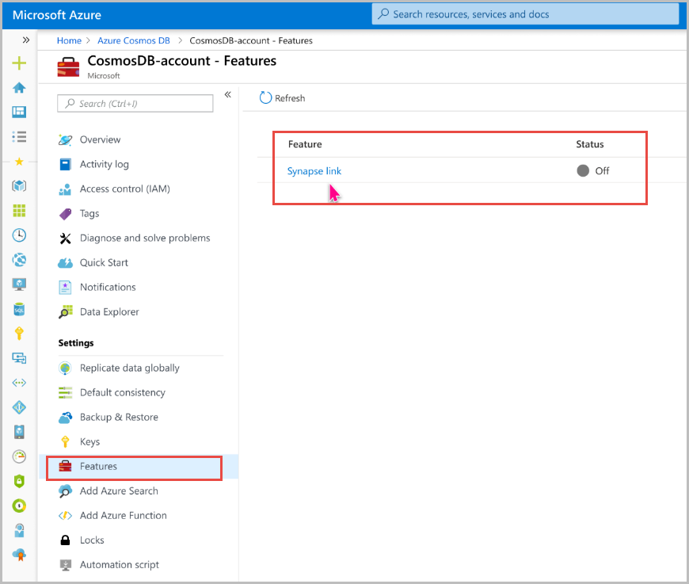
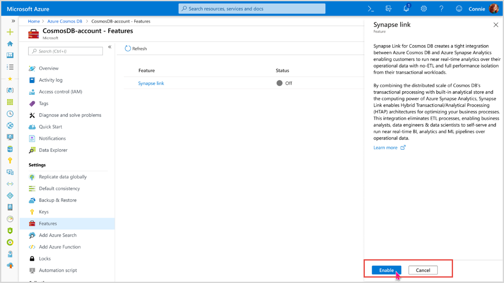
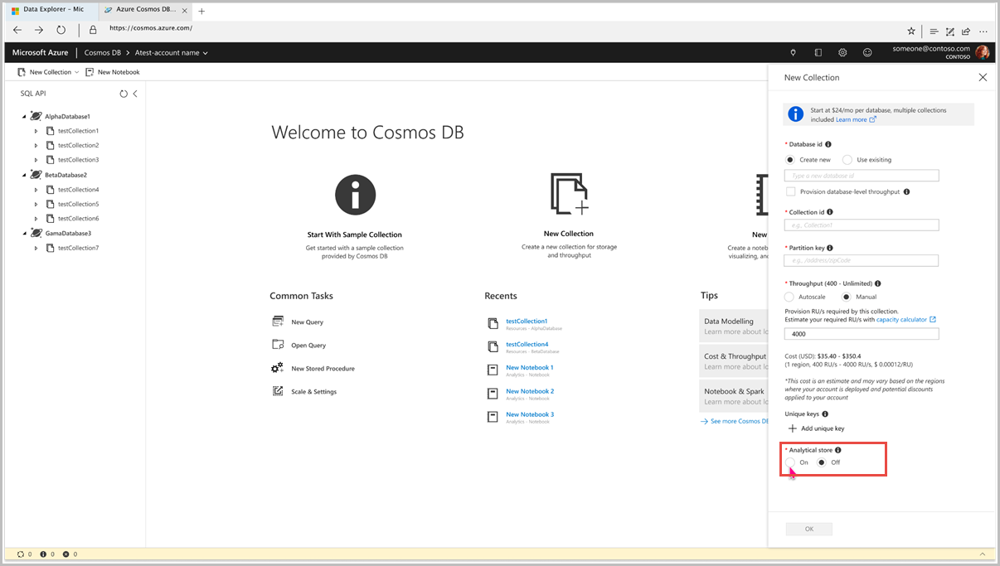

# Configure and use Azure Synapse Link for Azure Cosmos DB (preview)

Synapse Link for Azure Cosmos DB is a cloud-native hybrid transactional and analytical processing (HTAP) capability that enables you to run near real-time analytics over operational data in Azure Cosmos DB. Synapse Link creates a tight seamless integration between Azure Cosmos DB and Azure Synapse Analytics.


> [!IMPORTANT]
> To use Azure Synapse Link, ensure you provision your Azure Cosmos account & Azure Synapse Analytics workspace in one of the above supported regions.For the list of supported regions, see [Azure service updates](https://azure.microsoft.com/updates/). 

Use the following steps to run analytical queries with the Synapse Link for Azure Cosmos DB:

* [Enable Synapse Link for your Azure Cosmos accounts](#enable-synapse-link)
* [Create an analytical store enabled Azure Cosmos container](#create-analytical-ttl)
* [Connect your Azure Cosmos database to a Synapse workspace](#connect-to-cosmos-database)
* [Query the analytical store using Synapse Spark](#query-analytical-store)

## <a id="enable-synapse-link"></a>Enable Azure Synapse Link for Azure Cosmos accounts

### Azure portal

1. Sign into the [Azure portal](https://portal.azure.com/).

1. [Create a new Azure 
account](create-sql-api-dotnet.md#create-account), or select an existing Azure Cosmos account.

1. Navigate to your Azure Cosmos account and open the **Features** pane.

1. Select **Synapse Link** from the features list.

   

1. Next it prompts you to enable synapse link on your account. Select Enable.

   

1. Your account is now enabled to use Synapse Link. Next see how to create analytical store enabled containers to automatically start replicating your operational data from the transactional store to the analytical store.

### Azure Resource Manager template

The [Azure Resource Manager template](manage-sql-with-resource-manager.md#azure-cosmos-account-with-analytical-store) creates a Synapse Link enabled Azure Cosmos account for SQL API. This template creates a Core (SQL) API account in one region with a container configured with analytical TTL enabled, and an option to use manual or autoscale throughput. To deploy this template, click on **Deploy to Azure** on the readme page.

## <a id="create-analytical-ttl"></a> Create an Azure Cosmos container with analytical store

You can turn on analytical store on an Azure Cosmos container while creating the container. You can use the Azure portal or configure the `analyticalTTL` property during container creation by using the Azure Cosmos DB SDKs.

> [!NOTE]
> Currently you can enable analytical store for **new** containers (both in new and existing accounts).

### Azure portal

1. Sign in to the [Azure portal](https://portal.azure.com/) or the [Azure Cosmos explorer](https://cosmos.azure.com/).

1. Navigate to your Azure Cosmos account and open the **Data Explorer** tab.

1. Select **New Container** and enter a name for your database, container, partition key and throughput details. Turn on the **Analytical store** option. After you enable the analytical store, it creates a container with `AnalyicalTTL` property set to the default value of  -1 (infinite retention). This analytical store that retains all the historical versions of records.

   

1. If you have previously not enabled Synapse Link on this account, it will prompt you to do so because it's a pre-requisite to create an analytical store enabled container. If prompted, select **Enable Synapse Link**.

1. Select **OK**, to create an analytical store enabled Azure Cosmos container.

### .NET SDK

The following code creates a container with analytical store by using the .NET SDK. Set the analytical TTL property to the required value. For the list of allowed values, see the [analytical TTL supported values](analytical-store-introduction.md#analytical-ttl) article:

```csharp
// Create a container with a partition key, and analytical TTL configured to  -1 (infinite retention)
string containerId = “myContainerName”;
int analyticalTtlInSec = -1;
ContainerProperties cpInput = new ContainerProperties()
            {
Id = containerId,
PartitionKeyPath = "/id",
AnalyticalStorageTimeToLiveInSeconds = analyticalTtlInSec,
};
 await this. cosmosClient.GetDatabase("myDatabase").CreateContainerAsync(cpInput);
```

### Java V4 SDK

The following code creates a container with analytical store by using the Java V4 SDK. Set the `AnalyticalStoreTimeToLiveInSeconds` property to the required value:

```java
// Create a container with a partition key and  analytical TTL configured to  -1 (infinite retention) 
CosmosContainerProperties containerProperties = new CosmosContainerProperties("myContainer", "/myPartitionKey");

containerProperties.setAnalyticalStoreTimeToLiveInSeconds(-1);

container = database.createContainerIfNotExists(containerProperties, 400).block().getContainer();
```

### Python V3 SDK

The following code creates a container with analytical store by using the Python SDK:

```python
import azure.cosmos.cosmos_client as cosmos_client
def create_collection_if_not_exists(cosmosEndpoint, cosmosKey, databaseName, collectionName):
    client = cosmos_client.CosmosClient(url_connection=cosmosEndpoint, auth={'masterKey': cosmosKey})

db = client.QueryDatabases("select * from c where c.id = '" + databaseName + "'").fetch_next_block()[0]
options = {
    'offerThroughput': 1000
}

container_definition = {
    'id': collectionName,
    "partitionKey": {  
        "paths": [  
        "/id"  
        ],  
        "kind": "Hash" 
    },
    "indexingPolicy": {  
    "indexingMode": "consistent",  
    "automatic": True,  
    "includedPaths": [],  
    "excludedPaths": [{
        "path": "/*"
    }]  
    },
    "defaultTtl": -1,
    "analyticalStorageTtl": -1
}

container = client.CreateContainer(db['_self'], container_definition, options)
```

### <a id="update-analytical-ttl"></a> Update the analytical store time to live

After the analytical store is enabled with a particular TTL value, you can update it to a different valid value later. You can update the value by using the Azure portal or SDKs. For information on the various Analytical TTL config options, see the [analytical TTL supported values](analytical-store-introduction.md#analytical-ttl) article.

#### Azure portal

If you created an analytical store enabled container through the Azure portal, it contains a default analytical TTL of -1. Use the following steps to update this value:

1. Sign in to the [Azure portal](https://portal.azure.com/) or the [Azure Cosmos explorer](https://cosmos.azure.com/).

1. Navigate to your Azure Cosmos account and open the **Data Explorer** tab.

1. Select an existing container that has analytical store enabled. Expand it and modify the following values:

  * Open the **Scale & Settings** window.
  * Under **Setting** find,** Analytical Storage Time to Live**.
  * Select **On (no default)** or select **On** and set a TTL value
  * Click **Save** to save the changes.

#### .NET SDK

The following code shows how to update the TTL for analytical store by using the .NET SDK:

```csharp
// Get the container, update AnalyticalStorageTimeToLiveInSeconds 
ContainerResponse containerResponse = await client.GetContainer("database", "container").ReadContainerAsync();
// Update analytical store TTL
containerResponse.Resource. AnalyticalStorageTimeToLiveInSeconds = 60 * 60 * 24 * 180  // Expire analytical store data in 6 months;
await client.GetContainer("database", "container").ReplaceContainerAsync(containerResponse.Resource);
```

#### Java V4 SDK

The following code shows how to update the TTL for analytical store by using the Java V4 SDK:

```java
CosmosContainerProperties containerProperties = new CosmosContainerProperties("myContainer", "/myPartitionKey");

// Update analytical store TTL to expire analytical store data in 6 months;
containerProperties.setAnalyticalStoreTimeToLiveInSeconds (60 * 60 * 24 * 180 );  
 
// Update container settings
container.replace(containerProperties).block();
```

## <a id="connect-to-cosmos-database"></a> Connect to a Synapse workspace

Use the instructions in [Connect to Azure Synapse Link](../synapse-analytics/synapse-link/how-to-connect-synapse-link-cosmos-db.md) on how to access an Azure Cosmos DB database from Azure Synapse Analytics Studio with Azure Synapse Link.

## <a id="query-analytical-store"></a> Query using Synapse Spark

Use the instructions in the [Query Azure Cosmos DB analytical store](../synapse-analytics/synapse-link/how-to-query-analytical-store-spark.md) article on how to query with Synapse Spark. That article gives some examples on how you can interact with the analytical store from Synapse gestures. Those gestures are visible when you right-click on a container. With gestures, you can quickly generate code and tweak it to your needs. They are also perfect for discovering data with a single click.

## <a id="cosmosdb-synapse-link-samples"></a> Getting started with Azure Synpase Link - Samples

You can find samples to get started with Azure Synapse Link on [Github](https://aka.ms/cosmosdb-synapselink-samples). These showcase end-to-end solutions with IoT and Retail scenarios.

## Next steps

To learn more, see the following docs:

* [Azure Synapse Link for Azure Cosmos DB.](synapse-link.md)

* [Azure Cosmos DB analytical store overview.](analytical-store-introduction.md)

* [Frequently asked questions about Synapse Link for Azure Cosmos DB.](synapse-link-frequently-asked-questions.md)

* [Apache Spark in Azure Synapse Analytics](../synapse-analytics/spark/apache-spark-concepts.md).

* [SQL serverless/on-demand in Azure Synapse Analytics](../synapse-analytics/sql/on-demand-workspace-overview.md).
