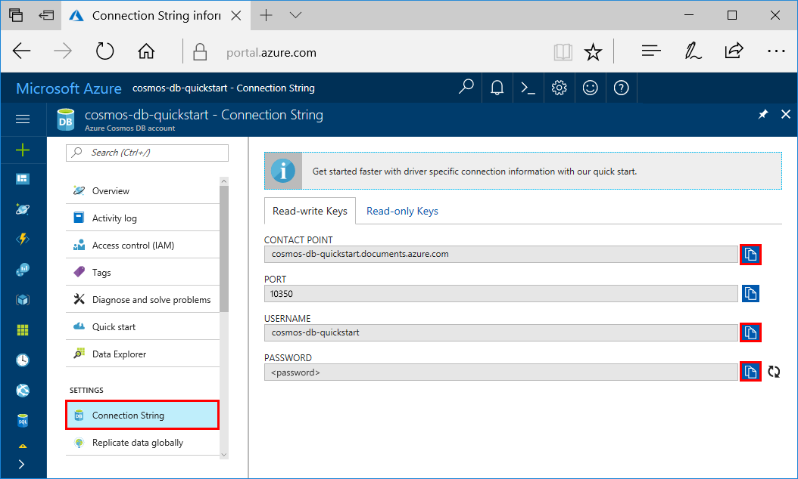
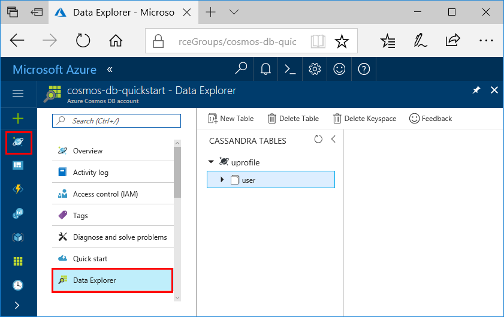

# Quickstart: Build a Cassandra app with .NET SDK and Azure Cosmos DB

> [!div class="op_single_selector"]
> * [.NET](create-cassandra-dotnet.md)
> * [.NET Core](create-cassandra-dotnet-core.md)
> * [Java v3](create-cassandra-java.md)
> * [Java v4](create-cassandra-java-v4.md)
> * [Node.js](create-cassandra-nodejs.md)
> * [Python](create-cassandra-python.md)
>  

This quickstart shows how to use .NET and the Azure Cosmos DB [Cassandra API](cassandra-introduction.md) to build a profile app by cloning an example from GitHub. This quickstart also shows you how to use the web-based Azure portal to create an Azure Cosmos DB account.

Azure Cosmos DB is Microsoft's globally distributed multi-model database service. You can quickly create and query document, table, key-value, and graph databases, all of which benefit from the global distribution and horizontal scale capabilities at the core of Azure Cosmos DB. 

## Prerequisites

[!INCLUDE [quickstarts-free-trial-note](../../includes/quickstarts-free-trial-note.md)] Alternatively, you can [Try Azure Cosmos DB for free](https://azure.microsoft.com/try/cosmosdb/) without an Azure subscription, free of charge and commitments.

In addition, you need: 
* If you don't already have Visual Studio 2019 installed, you can download and use the **free** [Visual Studio 2019 Community Edition](https://www.visualstudio.com/downloads/). Make sure that you enable **Azure development** during the Visual Studio setup.
* Install [Git](https://www.git-scm.com/) to clone the example.

<a id="create-account"></a>
## Create a database account

[!INCLUDE [cosmos-db-create-dbaccount-cassandra](../../includes/cosmos-db-create-dbaccount-cassandra.md)]


## Clone the sample application

Now let's switch to working with code. Let's clone a Cassandra API app from GitHub, set the connection string, and run it. You'll see how easy it is to work with data programmatically. 

1. Open a command prompt. Create a new folder named `git-samples`. Then, close the command prompt.

    ```bash
    md "C:\git-samples"
    ```

2. Open a git terminal window, such as git bash, and use the `cd` command to change to the new folder to install the sample app.

    ```bash
    cd "C:\git-samples"
    ```

3. Run the following command to clone the sample repository. This command creates a copy of the sample app on your computer.

    ```bash
    git clone https://github.com/Azure-Samples/azure-cosmos-db-cassandra-dotnet-getting-started.git
    ```

4. Next, open the CassandraQuickStartSample solution file in Visual Studio. 

## Review the code

This step is optional. If you're interested to learn how the code creates the database resources, you can review the following snippets. The snippets are all taken from the `Program.cs` file installed in the `C:\git-samples\azure-cosmos-db-cassandra-dotnet-getting-started\CassandraQuickStartSample` folder. Otherwise, you can skip ahead to [Update your connection string](#update-your-connection-string).

* Initialize the session by connecting to a Cassandra cluster endpoint. The Cassandra API on Azure Cosmos DB supports only TLSv1.2. 

  ```csharp
   var options = new Cassandra.SSLOptions(SslProtocols.Tls12, true, ValidateServerCertificate);
   options.SetHostNameResolver((ipAddress) => CassandraContactPoint);
   Cluster cluster = Cluster.Builder().WithCredentials(UserName, Password).WithPort(CassandraPort).AddContactPoint(CassandraContactPoint).WithSSL(options).Build();
   ISession session = cluster.Connect();
   ```

* Create a new keyspace.

    ```csharp
    session.Execute("CREATE KEYSPACE uprofile WITH REPLICATION = { 'class' : 'NetworkTopologyStrategy', 'datacenter1' : 1 };"); 
    ```

* Create a new table.

   ```csharp
  session.Execute("CREATE TABLE IF NOT EXISTS uprofile.user (user_id int PRIMARY KEY, user_name text, user_bcity text)");
   ```

* Insert user entities by using the IMapper object with a new session that connects to the uprofile keyspace.

    ```csharp
    mapper.Insert<User>(new User(1, "LyubovK", "Dubai"));
    ```
    
* Query to get all user's information.

    ```csharp
   foreach (User user in mapper.Fetch<User>("Select * from user"))
   {
      Console.WriteLine(user);
   }
    ```
    
* Query to get a single user's information.

    ```csharp
    mapper.FirstOrDefault<User>("Select * from user where user_id = ?", 3);
    ```

## Update your connection string

Now go back to the Azure portal to get your connection string information and copy it into the app. The connection string information enables your app to communicate with your hosted database.

1. In the [Azure portal](https://portal.azure.com/), select **Connection String**.

    Use the  button on the right side of the screen to copy the USERNAME value.

    

2. In Visual Studio, open the Program.cs file. 

3. Paste the USERNAME value from the portal over `<FILLME>` on line 13.

    Line 13 of Program.cs should now look similar to 

    `private const string UserName = "cosmos-db-quickstart";`

3. Go back to portal and copy the PASSWORD value. Paste the PASSWORD value from the portal over `<FILLME>` on line 14.

    Line 14 of Program.cs should now look similar to 

    `private const string Password = "2Ggkr662ifxz2Mg...==";`

4. Go back to portal and copy the CONTACT POINT value. Paste the CONTACT POINT value from the portal over `<FILLME>` on line 15.

    Line 15 of Program.cs should now look similar to 

    `private const string CassandraContactPoint = "cosmos-db-quickstarts.cassandra.cosmosdb.azure.com"; //  DnsName`

5. Save the Program.cs file.
    
## Run the .NET app

1. In Visual Studio, select **Tools** > **NuGet Package Manager** > **Package Manager Console**.

2. At the command prompt, use the following command to install the .NET Driver's NuGet package. 

    ```cmd
    Install-Package CassandraCSharpDriver
    ```
3. Press CTRL + F5 to run the application. Your app displays in your console window. 

    

    Press CTRL + C to stop execution of the program and close the console window. 
    
4. In the Azure portal, open **Data Explorer** to query, modify, and work with this new data.

    

## Review SLAs in the Azure portal

[!INCLUDE [cosmosdb-tutorial-review-slas](../../includes/cosmos-db-tutorial-review-slas.md)]

## Clean up resources

[!INCLUDE [cosmosdb-delete-resource-group](../../includes/cosmos-db-delete-resource-group.md)]

## Next steps

In this quickstart, you've learned how to create an Azure Cosmos DB account, create a container using the Data Explorer, and run a web app. You can now import additional data to your Cosmos DB account. 

> [!div class="nextstepaction"]
> [Import Cassandra data into Azure Cosmos DB](cassandra-import-data.md)
