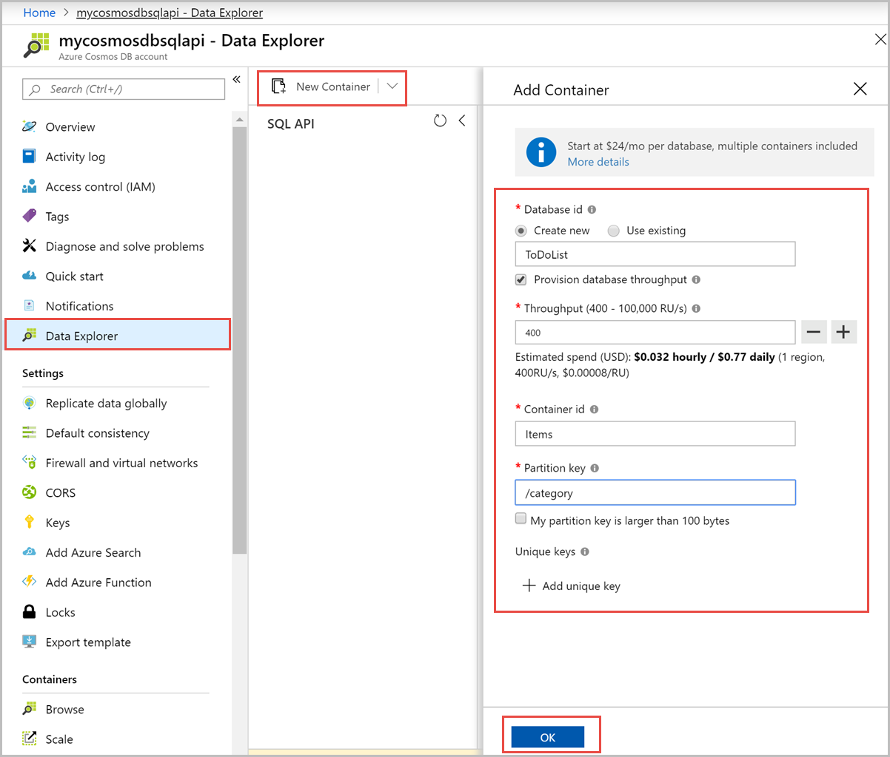
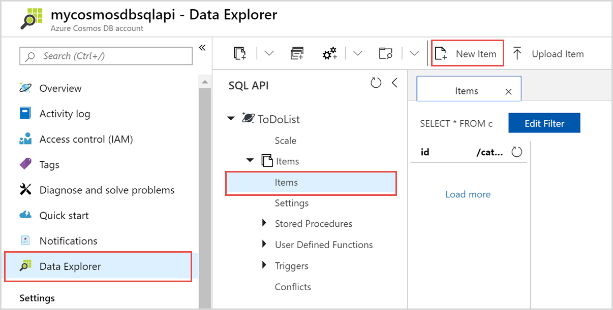
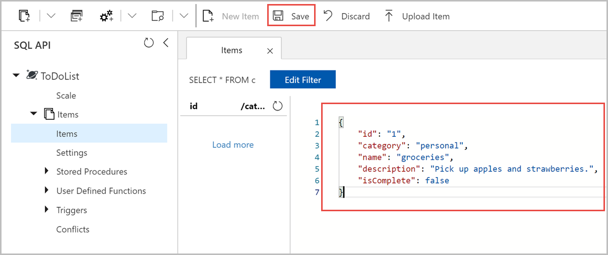

# Quickstart: Create an Azure Cosmos account, database, container, and items from the Azure portal

> [!div class="op_single_selector"]
> * [Azure portal](create-cosmosdb-resources-portal.md)
> * [.NET](create-sql-api-dotnet.md)
> * [Java](create-sql-api-java.md)
> * [Node.js](create-sql-api-nodejs.md)
> * [Python](create-sql-api-python.md)
> * [Xamarin](create-sql-api-xamarin-dotnet.md)
>  

Azure Cosmos DB is Microsoft’s globally distributed multi-model database service. You can use Azure Cosmos DB to quickly create and query key/value databases, document databases, and graph databases, all of which benefit from the global distribution and horizontal scale capabilities at the core of Azure Cosmos DB. 

This quickstart demonstrates how to use the Azure portal to create an Azure Cosmos DB [SQL API](sql-api-introduction.md) account, create a document database and container, and add data to the container. 

## Prerequisites

An Azure subscription or free Azure Cosmos DB trial account
- [!INCLUDE [quickstarts-free-trial-note](../../includes/quickstarts-free-trial-note.md)] 

- [!INCLUDE [cosmos-db-emulator-docdb-api](../../includes/cosmos-db-emulator-docdb-api.md)]  

<a id="create-account"></a>
## Create an Azure Cosmos DB account

[!INCLUDE [cosmos-db-create-dbaccount](../../includes/cosmos-db-create-dbaccount.md)]

<a id="create-container-database"></a>
## Add a database and a container 

You can use the Data Explorer in the Azure portal to create a database and container. 

1.  Select **Data Explorer** from the left navigation on your Azure Cosmos DB account page, and then select **New Container**. 
    
    You may need to scroll right to see the **Add Container** window.
    
    
    
1.  In the **Add container** pane, enter the settings for the new container.
    
    |Setting|Suggested value|Description
    |---|---|---|
    |**Database ID**|ToDoList|Enter *ToDoList* as the name for the new database. Database names must contain from 1 through 255 characters, and they cannot contain `/, \\, #, ?`, or a trailing space. Check the **Provision database throughput** option, it allows you to share the throughput provisioned to the database across all the containers within the database. This option also helps with cost savings. |
    |**Throughput**|400|Leave the throughput at 400 request units per second (RU/s). If you want to reduce latency, you can scale up the throughput later.| 
    |**Container ID**|Items|Enter *Items* as the name for your new container. Container IDs have the same character requirements as database names.|
    |**Partition key**| /category| The sample described in this article uses */category* as the partition key.|

    
    Don't add **Unique keys** for this example. Unique keys let you add a layer of data integrity to the database by ensuring the uniqueness of one or more values per partition key. For more information, see [Unique keys in Azure Cosmos DB](unique-keys.md).
    
1.  Select **OK**. The Data Explorer displays the new database and the container that you created.

## Add data to your database

Add data to your new database using Data Explorer.

1. In **Data Explorer**, expand the **ToDoList** database, and expand the **Items** container. Next, select **Items**, and then select **New Item**. 
   
   
   
1. Add the following structure to the document on the right side of the **Documents** pane:

     ```json
     {
         "id": "1",
         "category": "personal",
         "name": "groceries",
         "description": "Pick up apples and strawberries.",
         "isComplete": false
     }
     ```

1. Select **Save**.
   
   
   
1. Select **New Document** again, and create and save another document with a unique `id`, and any other properties and values you want. Your documents can have any structure, because Azure Cosmos DB doesn't impose any schema on your data.

## Query your data

[!INCLUDE [cosmos-db-create-sql-api-query-data](../../includes/cosmos-db-create-sql-api-query-data.md)] 

## Clean up resources

[!INCLUDE [cosmosdb-delete-resource-group](../../includes/cosmos-db-delete-resource-group.md)]

## Next steps

In this quickstart, you learned how to create an Azure Cosmos DB account, create a database and container using the Data Explorer. You can now import additional data to your Azure Cosmos DB account. 

> [!div class="nextstepaction"]
> [Import data into Azure Cosmos DB](import-data.md)