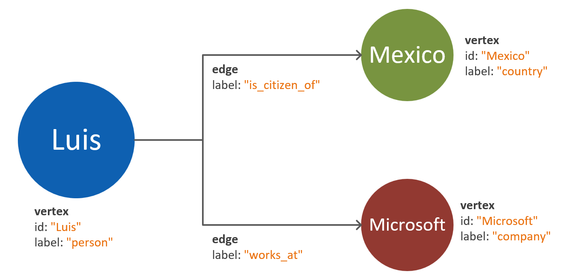
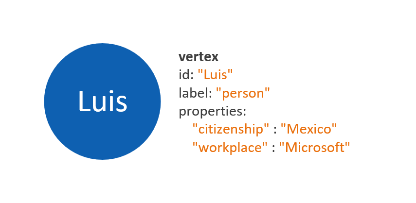
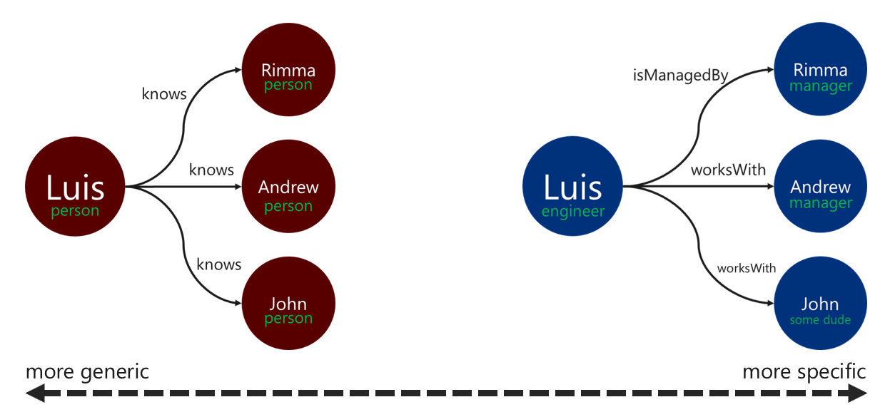

# Graph data modeling for Azure Cosmos DB Gremlin API

The following document is designed to provide graph data modeling recommendations. This step is vital in order to ensure the scalability and performance of a graph database system as the data evolves. An efficient data model is especially important with large-scale graphs.

## Requirements

The process outlined in this guide is based on the following assumptions:
 * The **entities** in the problem-space are identified. These entities are meant to be consumed _atomically_ for each request. In other words, the database system isn't designed to retrieve a single entity's data in multiple query requests.
 * There is an understanding of **read and write requirements** for the database system. These requirements will guide the optimizations needed for the graph data model.
 * The principles of the [Apache Tinkerpop property graph standard](http://tinkerpop.apache.org/docs/current/reference/#graph-computing) are well understood.

## When do I need a graph database?

A graph database solution can be optimally applied if the entities and relationships in a data domain have any of the following characteristics: 

* The entities are **highly connected** through descriptive relationships. The benefit in this scenario is the fact that the relationships are persisted in storage.
* There are **cyclic relationships** or **self-referenced entities**. This pattern is often a challenge when using relational or document databases.
* There are **dynamically evolving relationships** between entities. This pattern is especially applicable to hierarchical or tree-structured data with many levels.
* There are **many-to-many relationships** between entities.
* There are **write and read requirements on both entities and relationships**. 

If the above criteria is satisfied, it's likely that a graph database approach will provide advantages for **query complexity**, **data model scalability**, and **query performance**.

The next step is to determine if the graph is going to be used for analytic or transactional purposes. If the graph is intended to be used for heavy computation and data processing workloads, it would be worth to explore the [Cosmos DB Spark connector](https://docs.microsoft.com/azure/cosmos-db/spark-connector) and the use of the [GraphX library](https://spark.apache.org/graphx/). 

## How to use graph objects

The [Apache Tinkerpop property graph standard](http://tinkerpop.apache.org/docs/current/reference/#graph-computing) defines two types of objects **Vertices** and **Edges**. 

The following are the best practices for the properties in the graph objects:

| Object | Property | Type | Notes |
| --- | --- | --- |  --- |
| Vertex | ID | String | Uniquely enforced per partition. If a value isn't supplied upon insertion, and auto-generated GUID will be stored. |
| Vertex | label | String | This property is used to define the type of entity that the vertex represents. If a value isn't supplied, a default value "vertex" will be used. |
| Vertex | properties | String, Boolean, Numeric | A list of separate properties stored as key-value pairs in each vertex. |
| Vertex | partition key | String, Boolean, Numeric | This property defines where the vertex and its outgoing edges will be stored. Read more about [graph partitioning](graph-partitioning.md). |
| Edge | ID | String | Uniquely enforced per partition. Auto-generated by default. Edges usually don't have the need to be uniquely retrieved by an ID. |
| Edge | label | String | This property is used to define the type of relationship that two vertices have. |
| Edge | properties | String, Boolean, Numeric | A list of separate properties stored as key-value pairs in each edge. |

> [!NOTE]
> Edges don't require a partition key value, since its value is automatically assigned based on their source vertex. Learn more in the [graph partitioning](graph-partitioning.md) article.

## Entity and relationship modeling guidelines

The following are a set of guidelines to approach data modeling for an Azure Cosmos DB Gremlin API graph database. These guidelines assume that there's an existing definition of a data domain and queries for it.

> [!NOTE]
> The steps outlined below are presented as recommendations. The final model should be evaluated and tested before its consideration as production-ready. Additionally, the recommendations below are specific to Azure Cosmos DB's Gremlin API implementation. 

### Modeling vertices and properties 

The first step for a graph data model is to map every identified entity to a **vertex object**. A one to one mapping of all entities to vertices should be an initial step and subject to change.

One common pitfall is to map properties of a single entity as separate vertices. Consider the example below, where the same entity is represented in two different ways:

* **Vertex-based properties**: In this approach, the entity uses three separate vertices and two edges to describe its properties. While this approach might reduce redundancy, it increases model complexity. An increase in model complexity can result in added latency, query complexity, and computation cost. This model can also present challenges in partitioning.

* **Property-embedded vertices**: This approach takes advantage of the key-value pair list to represent all the properties of the entity inside a vertex. This approach provides reduced model complexity, which will lead to simpler queries and more cost-efficient traversals.

> [!NOTE]
> The above examples show a simplified graph model to only show the comparison between the two ways of dividing entity properties.

The **property-embedded vertices** pattern generally provides a more performant and scalable approach. The default approach to a new graph data model should gravitate towards this pattern.

However, there are scenarios where referencing to a property might provide advantages. For example: if the referenced property is updated frequently. Using a separate vertex to represent a property that is constantly changed would minimize the amount of write operations that the update would require.

### Relationship modeling with edge directions

After the vertices are modeled, the edges can be added to denote the relationships between them. The first aspect that needs to be evaluated is the **direction of the relationship**. 

Edge objects have a default direction that is followed by a traversal when using the `out()` or `outE()` function. Using this natural direction results in an efficient operation, since all vertices are stored with their outgoing edges. 

However, traversing in the opposite direction of an edge, using the `in()` function, will always result in a cross-partition query. Learn more about [graph partitioning](graph-partitioning.md). If there's a need to constantly traverse using the `in()` function, it's recommended to add edges in both directions.

You can determine the edge direction by using the `.to()` or `.from()` predicates to the `.addE()` Gremlin step. Or by using the [bulk executor library for Gremlin API](bulk-executor-graph-dotnet.md).

> [!NOTE]
> Edge objects have a direction by default.

### Relationship labeling

Using descriptive relationship labels can improve the efficiency of edge resolution operations. This pattern can be applied in the following ways:
* Use non-generic terms to label a relationship.
* Associate the label of the source vertex to the label of the target vertex with the relationship name.

The more specific the label that the traverser will use to filter the edges, the better. This decision can have a significant impact on query cost as well. You can evaluate the query cost at any time [using the executionProfile step](graph-execution-profile.md).

## Next steps: 
* Check out the list of supported [Gremlin steps](gremlin-support.md).
* Learn about [graph database partitioning](graph-partitioning.md) to deal with large-scale graphs.
* Evaluate your Gremlin queries using the [Execution Profile step](graph-execution-profile.md).
