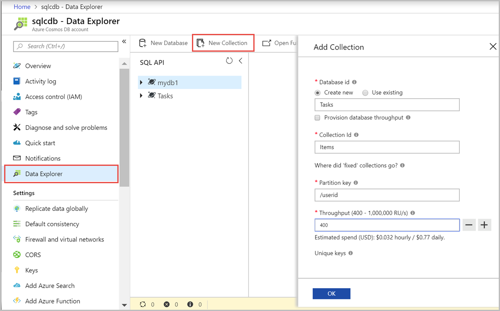

# Provision throughput on an Azure Cosmos container

This article explains how to provision throughput on a container (collection, graph, or table) in Azure Cosmos DB. You can provision throughput on a single container, or [provision throughput on a database](how-to-provision-database-throughput.md) and share it among the containers within the database. You can provision throughput on a container using Azure portal, Azure CLI, or Azure Cosmos DB SDKs.

## Azure portal

1. Sign in to the [Azure portal](https://portal.azure.com/).

1. [Create a new Azure Cosmos account](create-sql-api-dotnet.md#create-account), or select an existing Azure Cosmos account.

1. Open the **Data Explorer** pane, and select **New Collection**. Next, provide the following details:

   * Indicate whether you are creating a new database or using an existing one.
   * Enter a Container (or Table or Graph) ID.
   * Enter a partition key value (for example, `/userid`).
   * Enter a throughput that you want to provision (for example, 1000 RUs).
   * Select **OK**.

    

## Azure CLI or PowerShell

To create a container with dedicated throughput see,

* [Create a container using Azure CLI](manage-with-cli.md#create-a-container)
* [Create a container using Powershell](manage-with-powershell.md#create-container)

> [!Note]
> If you are provisioning throughput on a container in an Azure Cosmos account configured with the Azure Cosmos DB API for MongoDB, use `/myShardKey` for the partition key path. If you are provisioning throughput on a container in an Azure Cosmos account configured with Cassandra API, use `/myPrimaryKey` for the partition key path.

## .NET SDK

> [!Note]
> Use the Cosmos SDKs for SQL API to provision throughput for all Cosmos DB APIs, except Cassandra API.

### <a id="dotnet-most"></a>SQL, MongoDB, Gremlin, and Table APIs
### .Net V2 SDK

```csharp
// Create a container with a partition key and provision throughput of 400 RU/s
DocumentCollection myCollection = new DocumentCollection();
myCollection.Id = "myContainerName";
myCollection.PartitionKey.Paths.Add("/myPartitionKey");

await client.CreateDocumentCollectionAsync(
    UriFactory.CreateDatabaseUri("myDatabaseName"),
    myCollection,
    new RequestOptions { OfferThroughput = 400 });
```

### .Net V3 SDK
[!code-csharp[](~/samples-cosmosdb-dotnet-v3/Microsoft.Azure.Cosmos/tests/Microsoft.Azure.Cosmos.Tests/SampleCodeForDocs/ContainerDocsSampleCode.cs?name=ContainerCreateWithThroughput)]

## JavaScript SDK

```javascript
// Create a new Client
const client = new CosmosClient({ endpoint, key });

// Create a database
const { database } = await client.databases.createIfNotExists({ id: "databaseId" });

// Create a container with the specified throughput
const { resource } = await database.containers.createIfNotExists({
id: "contaierId ",
throughput: 1000
});

// To update an existing container or databases throughput, you need to user the offers API
// Get all the offers
const { resources: offers } = await client.offers.readAll().fetchAll();

// Find the offer associated with your container or the database
const offer = offers.find((_offer) => _offer.offerResourceId === resource._rid);

// Change the throughput value
offer.content.offerThroughput = 2000;

// Replace the offer.
await client.offer(offer.id).replace(offer);
```

### <a id="dotnet-cassandra"></a>Cassandra API

Similar commands can be issued through any CQL-compliant driver.

```csharp
// Create a Cassandra table with a partition (primary) key and provision throughput of 400 RU/s
session.Execute("CREATE TABLE myKeySpace.myTable(
    user_id int PRIMARY KEY,
    firstName text,
    lastName text) WITH cosmosdb_provisioned_throughput=400");

```
### Alter or change throughput for Cassandra table

```csharp
// Altering the throughput too can be done through code by issuing following command
session.Execute("ALTER TABLE myKeySpace.myTable WITH cosmosdb_provisioned_throughput=5000");
```


## Next steps

See the following articles to learn about throughput provisioning in Azure Cosmos DB:

* [How to provision throughput on a database](how-to-provision-database-throughput.md)
* [Request units and throughput in Azure Cosmos DB](request-units.md)
