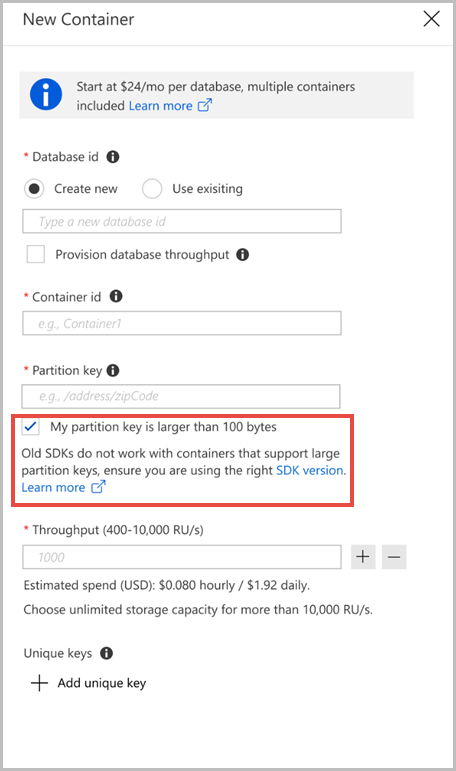

# Create containers with large partition key

Azure Cosmos DB uses hash-based partitioning scheme to achieve horizontal scaling of data. All Azure Cosmos containers created before May 3 2019 use a hash function that computes hash based on the first 100 bytes of the partition key. If there are multiple partition keys that have the same first 100 bytes, then those logical partitions are considered as the same logical partition by the service. This can lead to issues like partition size quota being incorrect, and unique indexes being applied across the partition keys. Large partition keys are introduced to solve this issue. Azure Cosmos DB now supports large partition keys with values up to 2 KB.

Large partition keys are supported by using the functionality of an enhanced version of the hash function, which can generate a unique hash from large partition keys up to 2 KB. This hash version is also recommended for scenarios with high partition key cardinality irrespective of the size of the partition key. A partition key cardinality is defined as the number of unique logical partitions, for example in the order of ~30000 logical partitions in a container. This article describes how to create a container with a large partition key using the Azure portal and different SDKs.

## Create a large partition key (Azure portal)

To create a large partition key, when you create a new container using the Azure portal, check the **My partition key is larger than 100-bytes** option. Unselect the checkbox if you don’t need large partition keys or if you have applications running on SDKs version older than 1.18.



## Create a large partition key (PowerShell)

To create a container with large partition key support see,

* [Create an Azure Cosmos container with a large partition key size](manage-with-powershell.md##create-container-big-pk)

## Create a large partition key (.Net SDK)

To create a container with a large partition key using the .NET SDK, specify the `PartitionKeyDefinitionVersion.V2` property. The following example shows how to specify the Version property within the PartitionKeyDefinition object and set it to PartitionKeyDefinitionVersion.V2.

### v3 .NET SDK

```csharp
await database.CreateContainerAsync(
    new ContainerProperties(collectionName, $"/longpartitionkey")
    {
        PartitionKeyDefinitionVersion = PartitionKeyDefinitionVersion.V2,
    })
```

### v2 .NET SDK

```csharp
DocumentCollection collection = await newClient.CreateDocumentCollectionAsync(
database,
     new DocumentCollection
        {
           Id = Guid.NewGuid().ToString(),
           PartitionKey = new PartitionKeyDefinition
           {
             Paths = new Collection<string> {"/longpartitionkey" },
             Version = PartitionKeyDefinitionVersion.V2
           }
         },
      new RequestOptions { OfferThroughput = 400 });
```

## Supported SDK versions

The Large partition keys are supported with the following minimum versions of SDKs:

|SDK type  | Minimum version   |
|---------|---------|
|.Net     |    1.18     |
|Java sync     |   2.4.0      |
|Java Async   |  2.5.0        |
| REST API | version higher than `2017-05-03` by using the `x-ms-version` request header.|

Currently, you cannot use containers with large partition key within in Power BI and Azure Logic Apps. You can use containers without a large partition key from these applications.

## Next steps

* [Partitioning in Azure Cosmos DB](partitioning-overview.md)
* [Request Units in Azure Cosmos DB](request-units.md)
* [Provision throughput on containers and databases](set-throughput.md)
* [Work with Azure Cosmos account](account-overview.md)
