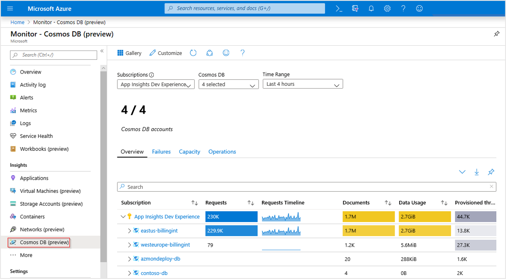
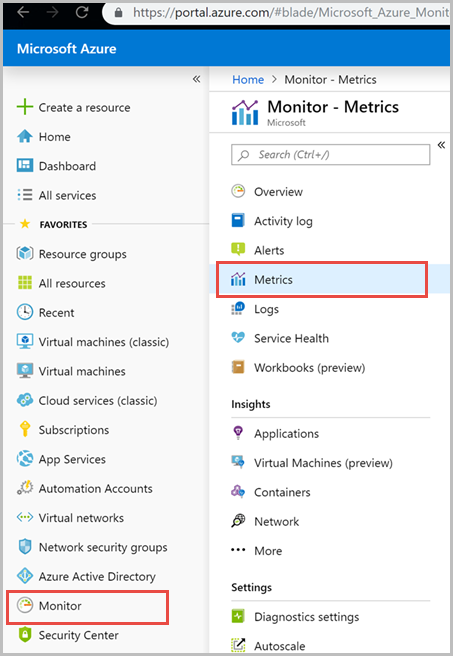
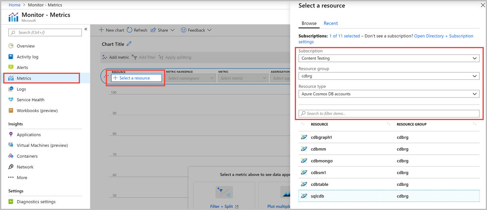
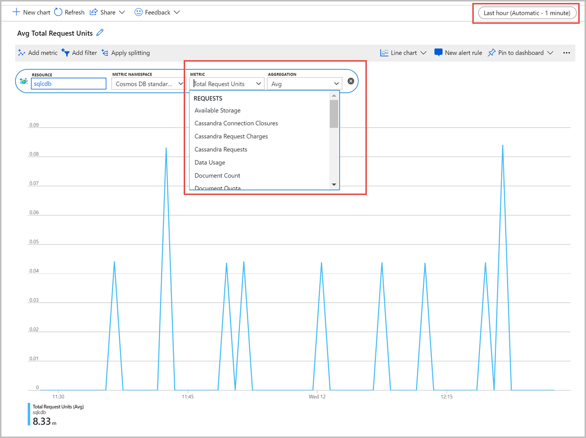
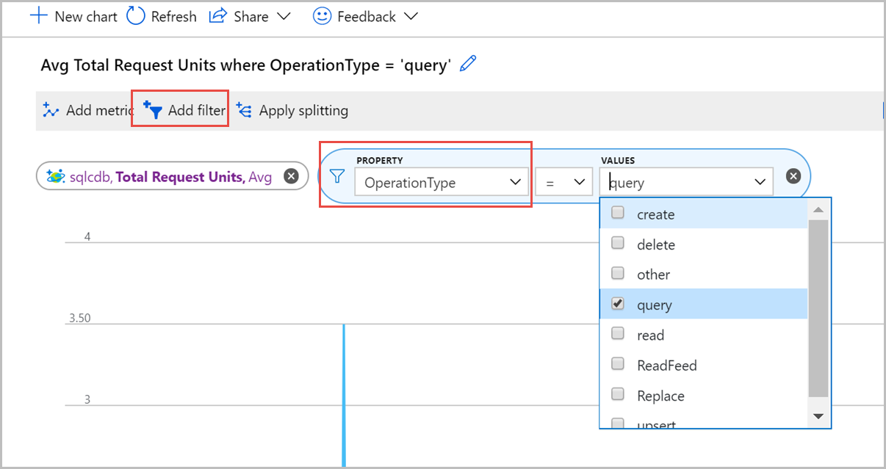
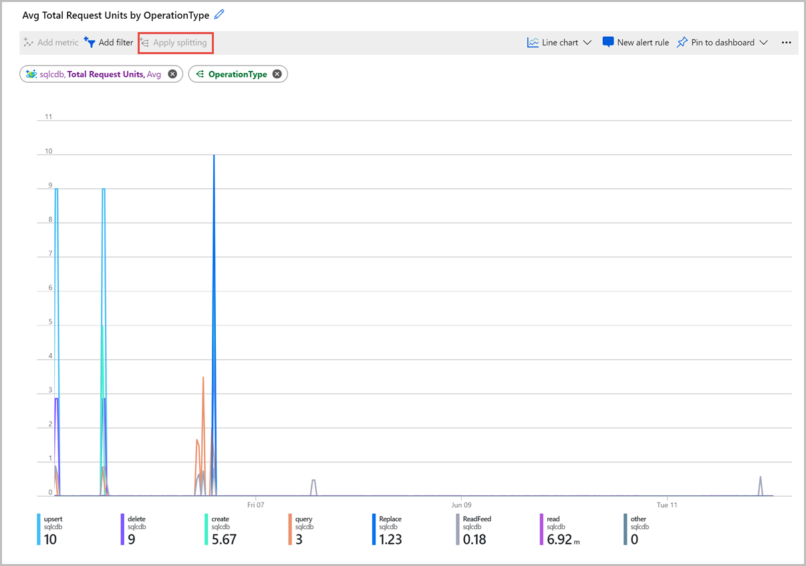
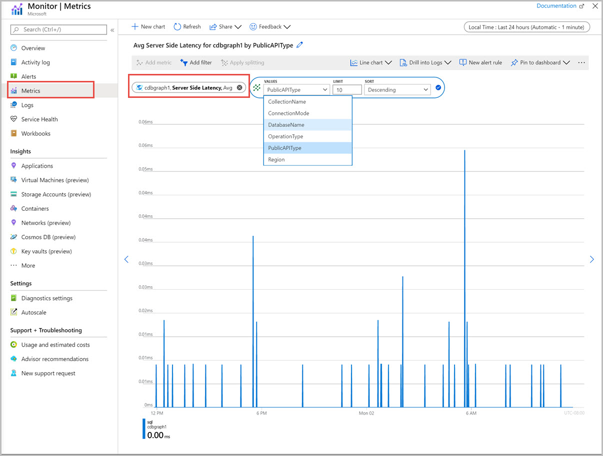
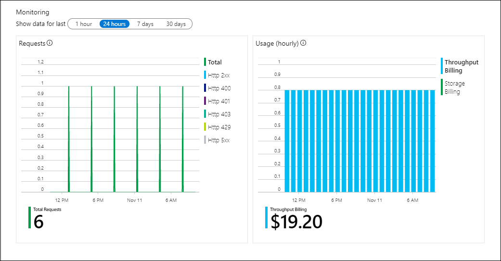

# Monitoring Azure Cosmos DB
When you have critical applications and business processes relying on Azure resources, you want to monitor those resources for their availability, performance, and operation. This article describes the monitoring data generated by Azure Cosmos databases and how you can use the features of Azure Monitor to analyze and alert on this data.

## What is Azure Monitor?
Azure Cosmos DB creates monitoring data using [Azure Monitor](../azure-monitor/overview.md) which is a full stack monitoring service in Azure that provides a complete set of features to monitor your Azure resources in addition to resources in other clouds and on-premises. 

If you're not already familiar with monitoring Azure services, start with the article [Monitoring Azure resources with Azure Monitor](../azure-monitor/insights/monitor-azure-resource.md) which describes the following:

- What is Azure Monitor?
- Costs associated with monitoring
- Monitoring data collected in Azure
- Configuring data collection
- Standard tools in Azure for analyzing and alerting on monitoring data

The following sections build on this article by describing the specific data gathered from Azure Cosmos DB and providing examples for configuring data collection and analyzing this data with Azure tools.

## Azure Monitor for Cosmos DB (Preview)
[Azure Monitor for Azure Cosmos DB](../azure-monitor/insights/cosmosdb-insights-overview.md) is based on the [workbooks feature of Azure Monitor](../azure-monitor/app/usage-workbooks.md) and uses the same monitoring data collected for Cosmos DB described in the sections below. Use this tool for a view of the overall performance, failures, capacity, and operational health of all your Azure Cosmos DB resources in a unified interactive experience, and leverage the other features of Azure Monitor for detailed analysis and alerting. 



## View operation level metrics for Azure Cosmos DB

1. Sign in to the [Azure portal](https://portal.azure.com/).

1. Select **Monitor** from the left-hand navigation bar, and select **Metrics**.

   

1. From the **Metrics** pane > **Select a resource** > choose the required **subscription**, and **resource group**. For the **Resource type**, select **Azure Cosmos DB accounts**, choose one of your existing Azure Cosmos accounts, and select **Apply**.

   

1. Next you can select a metric from the list of available metrics. You can select metrics specific to request units, storage, latency, availability, Cassandra, and others. To learn in detail about all the available metrics in this list, see the [Metrics by category](monitor-cosmos-db-reference.md) article. In this example, let’s select **Request units** and **Avg** as the aggregation value.

   In addition to these details, you can also select the **Time range** and **Time granularity** of the metrics. At max, you can view metrics for the past 30 days.  After you apply the filter, a chart is displayed based on your filter. You can see the average number of request units consumed per minute for the selected period.  

   

### Add filters to metrics

You can also filter metrics and the chart displayed by a specific **CollectionName**, **DatabaseName**, **OperationType**, **Region**, and **StatusCode**. To filter the metrics, select **Add filter** and choose the required property such as **OperationType** and select a value such as **Query**. The graph then displays the request units consumed for the query operation for the selected period. The operations executed via Stored procedure are not logged so they are not available under the OperationType metric.



You can group metrics by using the **Apply splitting** option. For example, you can group the request units per operation type and view the graph for all the operations at once as shown in the following image:



Here is another example to view the server-side latency metrics for a specific database, container, or an operation:



## Monitoring data collected from Azure Cosmos DB

Azure Cosmos DB collects the same kinds of monitoring data as other Azure resources which are described in [Monitoring data from Azure resources](../azure-monitor/insights/monitor-azure-resource.md#monitoring-data). See [Azure Cosmos DB monitoring data reference](monitor-cosmos-db-reference.md) for a detailed reference of the logs and metrics created by Azure Cosmos DB.

The **Overview** page in the Azure portal for each Azure Cosmos database includes a brief view of the database usage including its request and hourly billing usage. This is useful information but only a small amount of the monitoring data available. Some of this data is collected automatically and available for analysis as soon as you create the database while you can enable additional data collection with some configuration.



## Analyzing metric data

Azure Cosmos DB provides a custom experience for working with metrics. See [Monitor and debug Azure Cosmos DB metrics from Azure Monitor](cosmos-db-azure-monitor-metrics.md) for details on using this experience and for analyzing different Azure Cosmos DB scenarios.

You can analyze metrics for Azure Cosmos DB with metrics from other Azure services using Metrics explorer by opening **Metrics** from the **Azure Monitor** menu. See [Getting started with Azure Metrics Explorer](../azure-monitor/platform/metrics-getting-started.md) for details on using this tool. All metrics for Azure Cosmos DB are in the namespace **Cosmos DB standard metrics**. You can use the following dimensions with these metrics when adding a filter to a chart:

- CollectionName
- DatabaseName
- OperationType
- Region
- StatusCode


## Analyzing log data
Data in Azure Monitor Logs is stored in tables which each table having its own set of unique properties. Azure Cosmos DB stores data in the following tables.

| Table | Description |
|:---|:---|
| AzureDiagnostics | Common table used by multiple services to store Resource logs. Resource logs from Azure Cosmos DB can be identified with `MICROSOFT.DOCUMENTDB`.   |
| AzureActivity    | Common table that stores all records from the Activity log. 


> [!IMPORTANT]
> When you select **Logs** from the Azure Cosmos DB menu, Log Analytics is opened with the query scope set to the current Azure Cosmos database. This means that log queries will only include data from that resource. If you want to run a query that includes data from other databases or data from other Azure services, select **Logs** from the **Azure Monitor** menu. See [Log query scope and time range in Azure Monitor Log Analytics](../azure-monitor/log-query/scope.md) for details.

### Azure Cosmos DB Log Analytics queries in Azure Monitor

Here are some queries that you can enter into the **Log search** search bar to help you monitor your Azure Cosmos containers. These queries work with the [new language](../log-analytics/log-analytics-log-search-upgrade.md).

Following are queries that you can use to help you monitor your Azure Cosmos databases.

* To query for all of the diagnostic logs from Azure Cosmos DB for a specified time period:

    ```Kusto
    AzureDiagnostics 
    | where ResourceProvider=="MICROSOFT.DOCUMENTDB" and Category=="DataPlaneRequests"

    ```

* To query for the 10 most recently logged events:

    ```Kusto
    AzureDiagnostics 
    | where ResourceProvider=="MICROSOFT.DOCUMENTDB" and Category=="DataPlaneRequests" 
    | limit 10
    ```

* To query for all operations, grouped by operation type:

    ```Kusto
    AzureDiagnostics 
    | where ResourceProvider=="MICROSOFT.DOCUMENTDB" and Category=="DataPlaneRequests" 
    | summarize count() by OperationName
    ```

* To query for all operations, grouped by resource:

    ```Kusto
    AzureActivity 
    | where ResourceProvider=="MICROSOFT.DOCUMENTDB" and Category=="DataPlaneRequests" 
    | summarize count() by Resource

    ```

* To query for all user activity, grouped by resource:

    ```Kusto
    AzureActivity 
    | where Caller == "test@company.com" and ResourceProvider=="MICROSOFT.DOCUMENTDB" and Category=="DataPlaneRequests" 
    | summarize count() by Resource
    ```
* To get all queries greater than 100 RUs joined with data from **DataPlaneRequests** and **QueryRunTimeStatistics**.

    ```Kusto
    AzureDiagnostics
    | where ResourceProvider=="MICROSOFT.DOCUMENTDB" and Category=="DataPlaneRequests" and todouble(requestCharge_s) > 100.0
    | project activityId_g, requestCharge_s
    | join kind= inner (
           AzureDiagnostics
           | where ResourceProvider =="MICROSOFT.DOCUMENTDB" and Category == "QueryRuntimeStatistics"
           | project activityId_g, querytext_s
    ) on $left.activityId_g == $right.activityId_g
    | order by requestCharge_s desc
    | limit 100
    ```

* To query for which operations take longer than 3 milliseconds:

    ```Kusto
    AzureDiagnostics 
    | where toint(duration_s) > 3 and ResourceProvider=="MICROSOFT.DOCUMENTDB" and Category=="DataPlaneRequests" 
    | summarize count() by clientIpAddress_s, TimeGenerated
    ```

* To query for which agent is running the operations:

    ```Kusto
    AzureDiagnostics 
    | where ResourceProvider=="MICROSOFT.DOCUMENTDB" and Category=="DataPlaneRequests" 
    | summarize count() by OperationName, userAgent_s
    ```

* To query for when the long running operations were performed:

    ```Kusto
    AzureDiagnostics 
    | where ResourceProvider=="MICROSOFT.DOCUMENTDB" and Category=="DataPlaneRequests" 
    | project TimeGenerated , duration_s 
    | summarize count() by bin(TimeGenerated, 5s)
    | render timechart
    ```
    
* To get Partition Key statistics to evaluate skew across top 3 partitions for database account:

    ```Kusto
    AzureDiagnostics 
    | where ResourceProvider=="MICROSOFT.DOCUMENTDB" and Category=="PartitionKeyStatistics" 
    | project SubscriptionId, regionName_s, databaseName_s, collectionname_s, partitionkey_s, sizeKb_s, ResourceId 
    ```

## Monitor Azure Cosmos DB programmatically
The account level metrics available in the portal, such as account storage usage and total requests, are not available via the SQL APIs. However, you can retrieve usage data at the collection level by using the SQL APIs. To retrieve collection level data, do the following:

* To use the REST API, [perform a GET on the collection](https://msdn.microsoft.com/library/mt489073.aspx). The quota and usage information for the collection is returned in the x-ms-resource-quota and x-ms-resource-usage headers in the response.
* To use the .NET SDK, use the [DocumentClient.ReadDocumentCollectionAsync](https://msdn.microsoft.com/library/microsoft.azure.documents.client.documentclient.readdocumentcollectionasync.aspx) method, which returns a [ResourceResponse](https://msdn.microsoft.com/library/dn799209.aspx) that contains a number of usage properties such as **CollectionSizeUsage**, **DatabaseUsage**, **DocumentUsage**, and more.

To access additional metrics, use the [Azure Monitor SDK](https://www.nuget.org/packages/Microsoft.Azure.Insights). Available metric definitions can be retrieved by calling:

    https://management.azure.com/subscriptions/{SubscriptionId}/resourceGroups/{ResourceGroup}/providers/Microsoft.DocumentDb/databaseAccounts/{DocumentDBAccountName}/metricDefinitions?api-version=2015-04-08

Queries to retrieve individual metrics use the following format:

    https://management.azure.com/subscriptions/{SubscriptionId}/resourceGroups/{ResourceGroup}/providers/Microsoft.DocumentDb/databaseAccounts/{DocumentDBAccountName}/metrics?api-version=2015-04-08&$filter=%28name.value%20eq%20%27Total%20Requests%27%29%20and%20timeGrain%20eq%20duration%27PT5M%27%20and%20startTime%20eq%202016-06-03T03%3A26%3A00.0000000Z%20and%20endTime%20eq%202016-06-10T03%3A26%3A00.0000000Z


## Next steps

- See [Azure Cosmos DB monitoring data reference](monitor-cosmos-db-reference.md) for a reference of the logs and metrics created by Azure Cosmos DB.
- See [Monitoring Azure resources with Azure Monitor](../azure-monitor/insights/monitor-azure-resource.md) for details on monitoring Azure resources.
