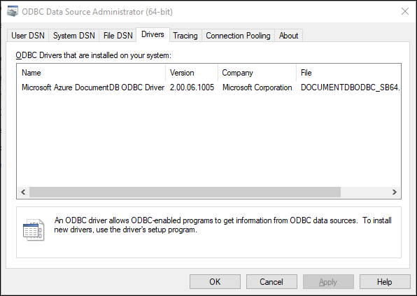
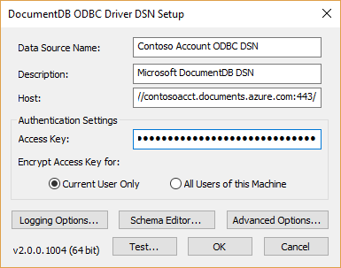
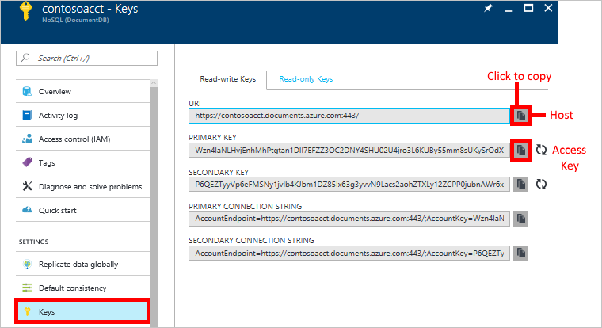
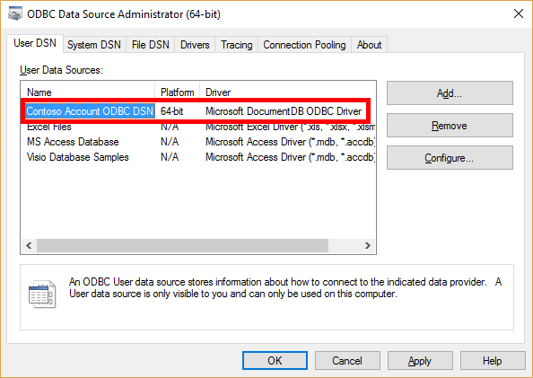
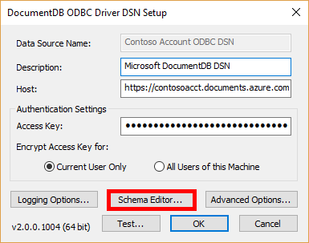
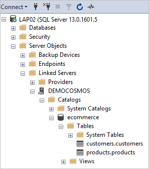
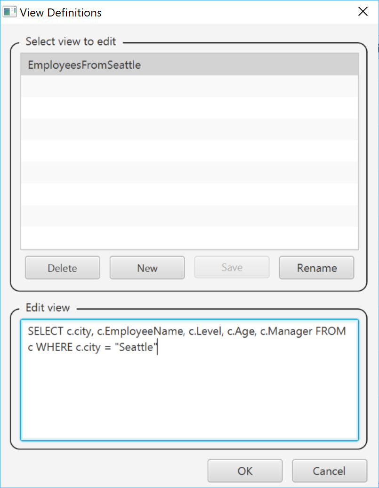
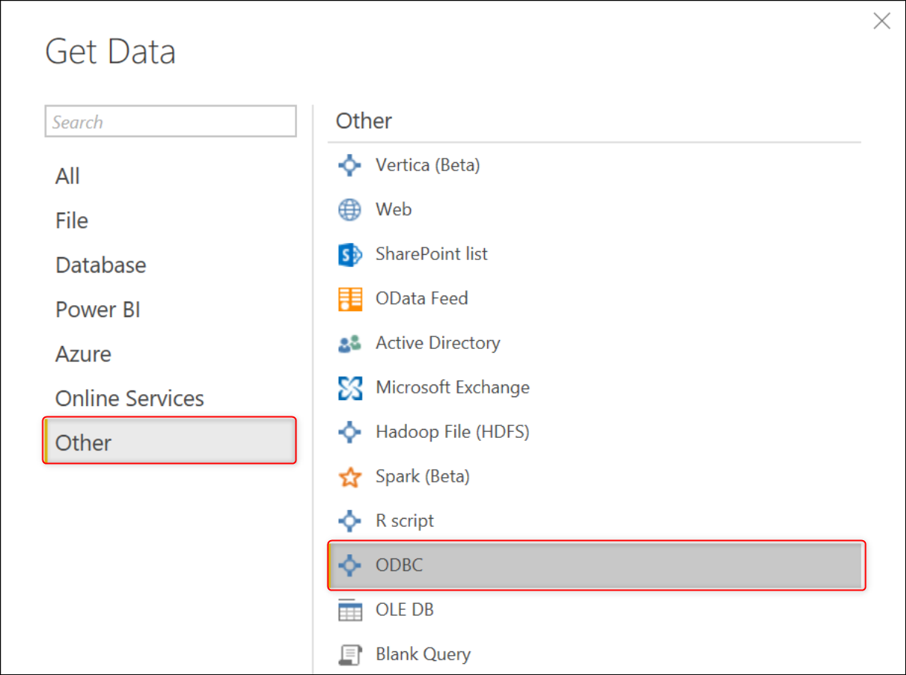
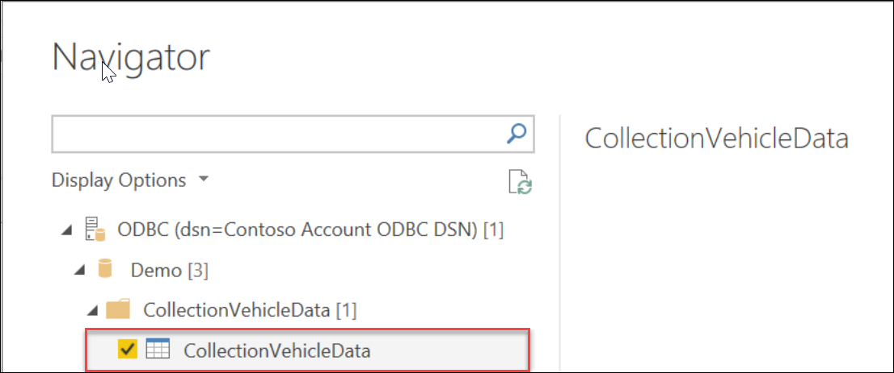

# Connect to Azure Cosmos DB using BI analytics tools with the ODBC driver

The Azure Cosmos DB ODBC driver enables you to connect to Azure Cosmos DB using BI analytics tools such as SQL Server Integration Services, Power BI Desktop, and Tableau so that you can analyze and create visualizations of your Azure Cosmos DB data in those solutions.

The Azure Cosmos DB ODBC driver is ODBC 3.8 compliant and supports ANSI SQL-92 syntax. The driver offers rich features to help you renormalize data in Azure Cosmos DB. Using the driver, you can represent data in Azure Cosmos DB as tables and views. The driver enables you to perform SQL operations against the tables and views including group by queries, inserts, updates, and deletes.

> [!NOTE]
> Connecting to Azure Cosmos DB with the ODBC driver is currently supported for Azure Cosmos DB SQL API accounts only.

## Why do I need to normalize my data?
Azure Cosmos DB is a schemaless database, which enables rapid application development and the ability to iterate on data models without being confined to a strict schema. A single Azure Cosmos DB database can contain JSON documents of various structures. This is great for rapid application development, but when you want to analyze and create reports of your data using data analytics and BI tools, the data often needs to be flattened and adhere to a specific schema.

This is where the ODBC driver comes in. By using the ODBC driver, you can now renormalize data in Azure Cosmos DB into tables and views that fit your data analytics and reporting needs. The renormalized schemas have no impact on the underlying data and do not confine developers to adhere to them. Rather, they enable you to leverage ODBC-compliant tools to access the data. So, now your Azure Cosmos DB database will not only be a favorite for your development team, but your data analysts will love it too.

Let's get started with the ODBC driver.

## <a id="install"></a>Step 1: Install the Azure Cosmos DB ODBC driver

1. Download the drivers for your environment:

    | Installer | Supported operating systems| 
    |---|---| 
    |[Microsoft Azure Cosmos DB ODBC 64-bit.msi](https://aka.ms/cosmos-odbc-64x64) for 64-bit Windows| 64-bit versions of Windows 8.1 or later, Windows 8, Windows 7, Windows Server 2012 R2, Windows Server 2012, and Windows Server 2008 R2.| 
    |[Microsoft Azure Cosmos DB ODBC 32x64-bit.msi](https://aka.ms/cosmos-odbc-32x64) for 32-bit on 64-bit Windows| 64-bit versions of Windows 8.1 or later, Windows 8, Windows 7, Windows XP, Windows Vista, Windows Server 2012 R2, Windows Server 2012, Windows Server 2008 R2, and Windows Server 2003.| 
    |[Microsoft Azure Cosmos DB ODBC 32-bit.msi](https://aka.ms/cosmos-odbc-32x32) for 32-bit Windows|32-bit versions of Windows 8.1 or later, Windows 8, Windows 7, Windows XP, and Windows Vista.|

    Run the msi file locally, which starts the **Microsoft Azure Cosmos DB ODBC Driver Installation Wizard**. 

1. Complete the installation wizard using the default input to install the ODBC driver.

1. Open the **ODBC Data source Administrator** app on your computer. You can do this by typing **ODBC Data sources** in the Windows search box. 
    You can confirm the driver was installed by clicking the **Drivers** tab and ensuring **Microsoft Azure Cosmos DB ODBC Driver** is listed.

    

## <a id="connect"></a>Step 2: Connect to your Azure Cosmos DB database

1. After [Installing the Azure Cosmos DB ODBC driver](#install), in the **ODBC Data Source Administrator** window, click **Add**. You can create a User or System DSN. In this example, you are creating a User DSN.

1. In the **Create New Data Source** window, select **Microsoft Azure Cosmos DB ODBC Driver**, and then click **Finish**.

1. In the **Azure Cosmos DB ODBC Driver SDN Setup** window, fill in the following information: 

    
    - **Data Source Name**: Your own friendly name for the ODBC DSN. This name is unique to your Azure Cosmos DB account, so name it appropriately if you have multiple accounts.
    - **Description**: A brief description of the data source.
    - **Host**: URI for your Azure Cosmos DB account. You can retrieve this from the Azure Cosmos DB Keys page in the Azure portal, as shown in the following screenshot. 
    - **Access Key**: The primary or secondary, read-write or read-only key from the Azure Cosmos DB Keys page in the Azure portal as shown in the following screenshot. We recommend you use the read-only key if the DSN is used for read-only data processing and reporting.
    
    - **Encrypt Access Key for**: Select the best choice based on the users of this machine. 
    
1. Click the **Test** button to make sure you can connect to your Azure Cosmos DB account. 

1. Click **Advanced Options** and set the following values:
    - **Query Consistency**: Select the [consistency level](consistency-levels.md) for your operations. The default is Session.
    - **Number of Retries**: Enter the number of times to retry an operation if the initial request does not complete due to service rate limiting.
    - **Schema File**: You have a number of options here.
        - By default, leaving this entry as is (blank), the driver scans the first page of data for all collections to determine the schema of each collection. This is known as Collection Mapping. Without a schema file defined, the driver has to perform the scan for each driver session and could result in a higher startup time of an application using the DSN. We recommend that you always associate a schema file for a DSN.
        - If you already have a schema file (possibly one that you created using the Schema Editor), you can click **Browse**, navigate to your file, click **Save**, and then click **OK**.
        - If you want to create a new schema, click **OK**, and then click **Schema Editor** in the main window. Then proceed to the Schema Editor information. After creating the new schema file, remember to go back to the **Advanced Options** window to include the newly created schema file.

1. Once you complete and close the **Azure Cosmos DB ODBC Driver DSN Setup** window, the new User DSN is added to the User DSN tab.

    

## <a id="#collection-mapping"></a>Step 3: Create a schema definition using the collection mapping method

There are two types of sampling methods that you can use: **collection mapping** or **table-delimiters**. A sampling session can utilize both sampling methods, but each collection can only use a specific sampling method. The steps below create a schema for the data in one or more collections using the collection mapping method. This sampling method retrieves the data in the page of a collection to determine the structure of the data. It transposes a collection to a table on the ODBC side. This sampling method is efficient and fast when the data in a collection is homogenous. If a collection contains heterogenous type of data, we recommend you use the [table-delimiters mapping method](#table-mapping) as it provides a more robust sampling method to determine the data structures in the collection. 

1. After completing steps 1-4 in [Connect to your Azure Cosmos DB database](#connect), click **Schema Editor** in the **Azure Cosmos DB ODBC Driver DSN Setup** window.

    
1. In the **Schema Editor** window, click **Create New**.
    The **Generate Schema** window displays all the collections in the Azure Cosmos DB account. 

1. Select one or more collections to sample, and then click **Sample**. 

1. In the **Design View** tab, the database, schema, and table are represented. In the table view, the scan displays the set of properties associated with the column names (SQL Name, Source Name, etc.).
    For each column, you can modify the column SQL name, the SQL type, SQL length (if applicable), Scale (if applicable), Precision (if applicable) and Nullable.
    - You can set **Hide Column** to **true** if you want to exclude that column from query results. Columns marked Hide Column = true are not returned for selection and projection, although they are still part of the schema. For example, you can hide all of the Azure Cosmos DB system required properties starting with "_".
    - The **id** column is the only field that cannot be hidden as it is used as the primary key in the normalized schema. 

1. Once you have finished defining the schema, click **File** | **Save**, navigate to the directory to save the schema, and then click **Save**.

1. To use this schema with a DSN, open the **Azure Cosmos DB ODBC Driver DSN Setup window** (via the ODBC Data Source Administrator), click **Advanced Options**, and then in the **Schema File** box, navigate to the saved schema. Saving a schema file to an existing DSN modifies the DSN connection to scope to the data and structure defined by schema.

## <a id="table-mapping"></a>Step 4: Create a schema definition using the table-delimiters mapping method

There are two types of sampling methods that you can use: **collection mapping** or **table-delimiters**. A sampling session can utilize both sampling methods, but each collection can only use a specific sampling method. 

The following steps create a schema for the data in one or more collections using the **table-delimiters** mapping method. We recommend that you use this sampling method when your collections contain heterogeneous type of data. You can use this method to scope the sampling to a set of attributes and its corresponding values. For example, if a document contains a "Type" property, you can scope the sampling to the values of this property. The end result of the sampling would be a set of tables for each of the values for Type you have specified. For example, Type = Car will produce a Car table while Type = Plane would produce a Plane table.

1. After completing steps 1-4 in [Connect to your Azure Cosmos DB database](#connect), click **Schema Editor** in the Azure Cosmos DB ODBC Driver DSN Setup window.

1. In the **Schema Editor** window, click **Create New**.
    The **Generate Schema** window displays all the collections in the Azure Cosmos DB account. 

1. Select a collection on the **Sample View** tab, in the **Mapping Definition** column for the collection, click **Edit**. Then in the **Mapping Definition** window, select **Table Delimiters** method. Then do the following:

    a. In the **Attributes** box, type the name of a delimiter property. This is a property in your document that you want to scope the sampling to, for instance, City and press enter. 

    b. If you only want to scope the sampling to certain values for the attribute you entered above, select the attribute in the selection box, enter a value in the **Value** box (e.g. Seattle), and press enter. You can continue to add multiple values for attributes. Just ensure that the correct attribute is selected when you're entering values.

    For example, if you include an **Attributes** value of City, and you want to limit your table to only include rows with a city value of New York and Dubai, you would enter City in the Attributes box, and New York and then Dubai in the **Values** box.

1. Click **OK**. 

1. After completing the mapping definitions for the collections you want to sample, in the **Schema Editor** window, click **Sample**.
     For each column, you can modify the column SQL name, the SQL type, SQL length (if applicable), Scale (if applicable), Precision (if applicable) and Nullable.
    - You can set **Hide Column** to **true** if you want to exclude that column from query results. Columns marked Hide Column = true are not returned for selection and projection, although they are still part of the schema. For example, you can hide all the Azure Cosmos DB system required properties starting with `_`.
    - The **id** column is the only field that cannot be hidden as it is used as the primary key in the normalized schema. 

1. Once you have finished defining the schema, click **File** | **Save**, navigate to the directory to save the schema, and then click **Save**.

1. Back in the **Azure Cosmos DB ODBC Driver DSN Setup** window, click **Advanced Options**. Then, in the **Schema File** box, navigate to the saved schema file and click **OK**. Click **OK** again to save the DSN. This saves the schema you created to the DSN. 

## (Optional) Set up linked server connection

You can query Azure Cosmos DB from SQL Server Management Studio (SSMS) by setting up a linked server connection.

1. Create a system data source as described in [Step 2](#connect), named for example `SDS Name`.

1. [Install SQL Server Management Studio](https://docs.microsoft.com/sql/ssms/download-sql-server-management-studio-ssms) and connect to the server. 

1. In the SSMS query editor, create a linked server object `DEMOCOSMOS` for the data source with the following commands. Replace `DEMOCOSMOS` with the name for your linked server, and `SDS Name` with the name of your system data source.

    ```sql
    USE [master]
    GO
    
    EXEC master.dbo.sp_addlinkedserver @server = N'DEMOCOSMOS', @srvproduct=N'', @provider=N'MSDASQL', @datasrc=N'SDS Name'
    
    EXEC master.dbo.sp_addlinkedsrvlogin @rmtsrvname=N'DEMOCOSMOS', @useself=N'False', @locallogin=NULL, @rmtuser=NULL, @rmtpassword=NULL
    
    GO
    ```
    
To see the new linked server name, refresh the Linked Servers list.



### Query linked database

To query the linked database, enter an SSMS query. In this example, the query selects from the table in the collection named `customers`:

```sql
SELECT * FROM OPENQUERY(DEMOCOSMOS, 'SELECT *  FROM [customers].[customers]')
```

Execute the query. The result should be similar to this:

```
attachments/  1507476156    521 Bassett Avenue, Wikieup, Missouri, 5422   "2602bc56-0000-0000-0000-59da42bc0000"   2015-02-06T05:32:32 +05:00 f1ca3044f17149f3bc61f7b9c78a26df
attachments/  1507476156    167 Nassau Street, Tuskahoma, Illinois, 5998   "2602bd56-0000-0000-0000-59da42bc0000"   2015-06-16T08:54:17 +04:00 f75f949ea8de466a9ef2bdb7ce065ac8
attachments/  1507476156    885 Strong Place, Cassel, Montana, 2069       "2602be56-0000-0000-0000-59da42bc0000"   2015-03-20T07:21:47 +04:00 ef0365fb40c04bb6a3ffc4bc77c905fd
attachments/  1507476156    515 Barwell Terrace, Defiance, Tennessee, 6439     "2602c056-0000-0000-0000-59da42bc0000"   2014-10-16T06:49:04 +04:00      e913fe543490432f871bc42019663518
attachments/  1507476156    570 Ruby Street, Spokane, Idaho, 9025       "2602c156-0000-0000-0000-59da42bc0000"   2014-10-30T05:49:33 +04:00 e53072057d314bc9b36c89a8350048f3
```

> [!NOTE]
> The linked Cosmos DB server does not support four-part naming. An error is returned similar to the following message:

```
Msg 7312, Level 16, State 1, Line 44

Invalid use of schema or catalog for OLE DB provider "MSDASQL" for linked server "DEMOCOSMOS". A four-part name was supplied, but the provider does not expose the necessary interfaces to use a catalog or schema.
``` 

## (Optional) Creating views
You can define and create views as part of the sampling process. These views are equivalent to SQL views. They are read-only and are scope the selections and projections of the Azure Cosmos DB SQL query defined. 

To create a view for your data, in the **Schema Editor** window, in the **View Definitions** column, click **Add** on the row of the collection to sample. 
    


Then in the **View Definitions** window, do the following:

1. Click **New**, enter a name for the view, for example, EmployeesfromSeattleView and then click **OK**.

1. In the **Edit view** window, enter an Azure Cosmos DB query. This must be an [Azure Cosmos DB SQL query](how-to-sql-query.md), for example `SELECT c.City, c.EmployeeName, c.Level, c.Age, c.Manager FROM c WHERE c.City = "Seattle"`, and then click **OK**.

    


You can create a many views as you like. Once you are done defining the views, you can then sample the data. 

## Step 5: View your data in BI tools such as Power BI Desktop

You can use your new DSN to connect to Azure Cosmos DB with any ODBC-compliant tools - this step simply shows you how to connect to Power BI Desktop and create a Power BI visualization.

1. Open Power BI Desktop.

1. Click **Get Data**.

    

1. In the **Get Data** window, click **Other** | **ODBC** | **Connect**.

    

1. In the **From ODBC** window, select the data source name you created, and then click **OK**. You can leave the **Advanced Options** entries blank.

    

1. In the **Access a data source using an ODBC driver** window, select **Default or Custom** and then click **Connect**. You do not need to include the **Credential connection string properties**.

1. In the **Navigator** window, in the left pane, expand the database, the schema, and then select the table. The results pane includes the data using the schema you created.

    

1. To visualize the data in Power BI desktop, check the box in front of the table name, and then click **Load**.

1. In Power BI Desktop, on the far left, select the Data tab  to confirm your data was imported.

1. You can now create visuals using Power BI by clicking on the Report tab , clicking **New Visual**, and then customizing your tile. For more information about creating visualizations in Power BI Desktop, see [Visualization types in Power BI](https://powerbi.microsoft.com/documentation/powerbi-service-visualization-types-for-reports-and-q-and-a/).

## Troubleshooting

If you receive the following error, ensure the **Host** and **Access Key** values you copied the Azure portal in [Step 2](#connect) are correct and then retry. Use the copy buttons to the right of the **Host** and **Access Key** values in the Azure portal to copy the values error free.

    [HY000]: [Microsoft][Azure Cosmos DB] (401) HTTP 401 Authentication Error: {"code":"Unauthorized","message":"The input authorization token can't serve the request. Please check that the expected payload is built as per the protocol, and check the key being used. Server used the following payload to sign: 'get\ndbs\n\nfri, 20 jan 2017 03:43:55 gmt\n\n'\r\nActivityId: 9acb3c0d-cb31-4b78-ac0a-413c8d33e373"}`

## Next steps

To learn more about Azure Cosmos DB, see [Welcome to Azure Cosmos DB](introduction.md).
