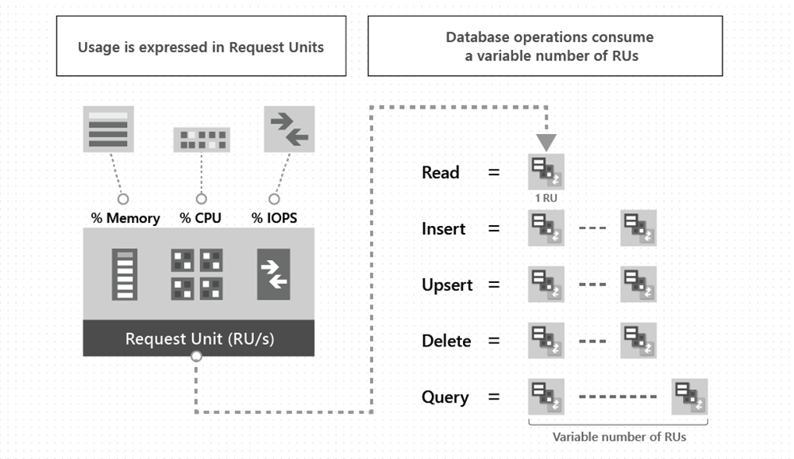

# Globally scale provisioned throughput 

In Azure Cosmos DB, provisioned throughput is represented as request units/second (RU/s or the plural form RUs). RUs measure the cost of both read and write operations against your Cosmos container as shown in the following image:

You can provision RUs on a Cosmos container or a Cosmos database. RUs provisioned on a container are exclusively available for the operations performed on that container. RUs provisioned on a database are shared among all the containers within that database (except for any containers with exclusively assigned RUs).

For elastically scaling provisioned throughput, you can increase or decrease the provisioned RU/s at any time. For more information, see [How-to provision throughput](set-throughput.md) and to elastically scale Cosmos containers and databases. For globally scaling throughput, you can add or remove regions from your Cosmos account at any time. For more information, see [Add/remove regions from your database account](how-to-manage-database-account.md#addremove-regions-from-your-database-account). Associating multiple regions with a Cosmos account is important in many scenarios - to achieve low latency and [high availability](high-availability.md) around the world.

## How provisioned throughput is distributed across regions

If you provision *'R'* RUs on a Cosmos container (or database), Cosmos DB ensures that *'R'* RUs are available in *each* region associated with your Cosmos account. Each time you add a new region to your account, Cosmos DB automatically provisions *'R'* RUs in the newly added region. The operations performed against your Cosmos container are guaranteed to get *'R'* RUs in each region. You can't selectively assign RUs to a specific region. The RUs provisioned on a Cosmos container (or database) are provisioned in all the regions associated with your Cosmos account.

Assuming that a Cosmos container is configured with *'R'* RUs and there are *'N'* regions associated with the Cosmos account, then:

- If the Cosmos account is configured with a single write region, the total RUs available globally on the container = *R* x *N*.

- If the Cosmos account is configured with multiple write regions, the total RUs available globally on the container = *R* x (*N*+1). The additional *R* RUs are automatically provisioned to process update conflicts and anti-entropy traffic across the regions.

Your choice of [consistency model](consistency-levels.md) also affects the throughput. You can get approximately 2x read throughput for the more relaxed consistency levels (e.g., *session*, *consistent prefix* and *eventual* consistency) compared to stronger consistency levels (e.g., *bounded staleness* or *strong* consistency).

## Next steps

Next you can learn how to configure throughput on a container or database:

* [Get and set throughput for containers and databases](set-throughput.md) 

