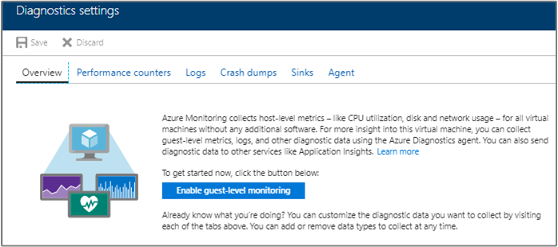
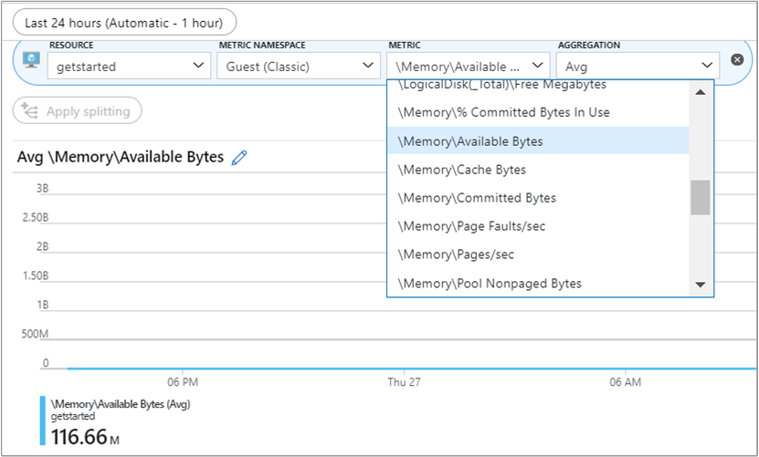
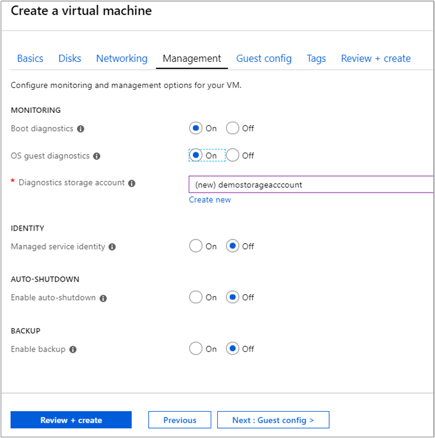

# Add extended metrics for Azure virtual machines

Cloudyn uses Azure metric data from your Azure VMs to show you detailed information about their resources. Metric data, also called performance counters, is used by Cloudyn to generate reports. However, Cloudyn does not automatically gather all Azure metric data from guest VMs — you must enable metric collection. This article helps you enable and configure additional diagnostics metrics for your Azure VMs.

After you enable metric collection, you can:

- Know when your VMs are reaching their memory, disk, and CPU limits.
- Detect usage trends and anomalies.
- Control your costs by sizing according to usage.
- Get cost effective sizing optimization recommendations from Cloudyn.

For example, you might want to monitor the CPU % and Memory % of your Azure VMs. The Azure VM metrics correspond to _Percentage CPU_ and _\Memory\% Committed Bytes In Use_.

> [!NOTE]
> Extended metric data collection is only supported with Azure guest-level monitoring. Cloudyn is not compatible with the [Log Analytics agent](../../azure-monitor/platform/agents-overview.md).

[!INCLUDE [cloudyn-note](../../../includes/cloudyn-note.md)]

## Determine whether extended metrics are enabled

1. Sign in to the Azure portal at [https://portal.azure.com](https://portal.azure.com).
2. Under **Virtual machines**, select a VM and then under **Monitoring**, select **Metrics**. A list of available metrics is shown.
3. Select some metrics and a graph displays data for them.  
    

In the preceding example, a limited set of standard metrics are available for your hosts, but memory metrics are not. Memory metrics are part of extended metrics. In this case, extended metrics are not enabled for the VM. You must perform some additional steps to enable extended metrics. The following information guides you through enabling them.

## Enable extended metrics in the Azure portal

Standard metrics are host computer metrics. The _Percentage CPU_ metric is one example. There are also basic metrics for guest VMs and they're also called extended metrics. Examples of extended metrics include _\Memory\% Committed Bytes In Use_ and _\Memory\Available Bytes_.

Enabling extended metrics is straightforward. For each VM, enable guest-level monitoring. When you enable guest-level monitoring, the Azure diagnostics agent is installed on the VM. By default, a basic set of extended metrics are added. The following process is the same for classic and regular VMs and the same for Windows and Linux VMs.

Keep in mind that both Windows and Linux guest-level monitoring require a storage account. When you enable guest-level monitoring, if you don't choose an existing storage account, then one is created for you.

### Enable guest-level monitoring on existing VMs

1. In **Virtual Machines**, view your list of your VMs and then select a VM.
2. Under **Monitoring**, select **Diagnostic settings**.
3. On the Diagnostics settings page, click **Enable guest-level monitoring**.  
    
4. After a few minutes, the Azure diagnostics agent is installed on the VM. A basic set of metrics are added. Refresh the page. The added performance counters appear on the Overview tab.
5. Under Monitoring, select **Metrics**.
6. In the metrics chart under **Metric Namespace**, select **Guest (Classic)**.
7. In the Metric list, you can view all of the available performance counters for the guest VM.  
    

### Enable guest-level monitoring on new VMs

When you create new VMs, on the Management tab, select **On** for **OS guest diagnostics**.

For more information about enabling extended metrics for Azure virtual machines, see [Understanding and using the Azure Linux agent](../../virtual-machines/extensions/agent-linux.md) and [Azure Virtual Machine Agent overview](../../virtual-machines/extensions/agent-windows.md).

## Resource Manager credentials

After you enable extended metrics, ensure that Cloudyn has access to your [Resource Manager credentials](./activate-subs-accounts.md). Your credentials are required for Cloudyn to collect and display performance data for your VMs. They're also used to create cost optimization recommendations. Cloudyn needs at least three days of performance data from an instance to determine if it is a candidate for a downsizing recommendation.

## Enable VM metrics with a script

You can enable VM metrics with Azure PowerShell scripts. When you have many VMs that you want to enable metrics on, you can use a script to automate the process. Example scripts are on GitHub at [Azure Enable Diagnostics](https://github.com/Cloudyn/azure-enable-diagnostics).

## View Azure performance metrics

To view performance metrics on your Azure Instances in the Cloudyn portal, navigate to **Assets** > **Compute** > **Instance Explorer**. In the list of VM instances, expand an instance and then expand a resource to view details.

## Next steps

- If you haven't already enabled Azure Resource Manager API access for your accounts, proceed to [Activate Azure subscriptions and accounts](./activate-subs-accounts.md).