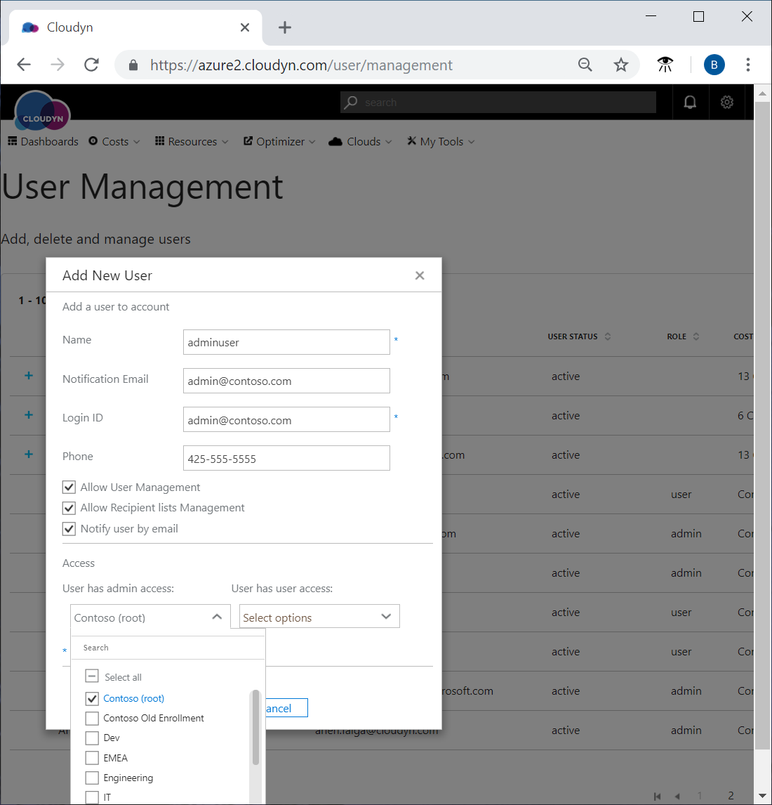
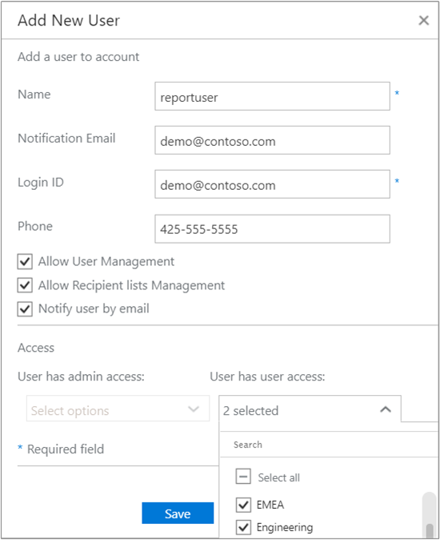
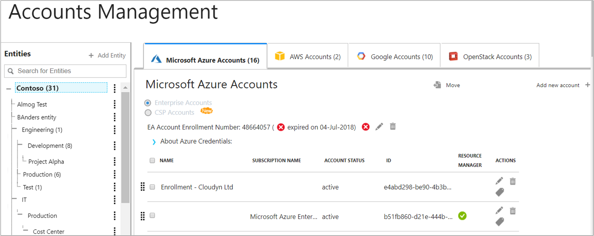
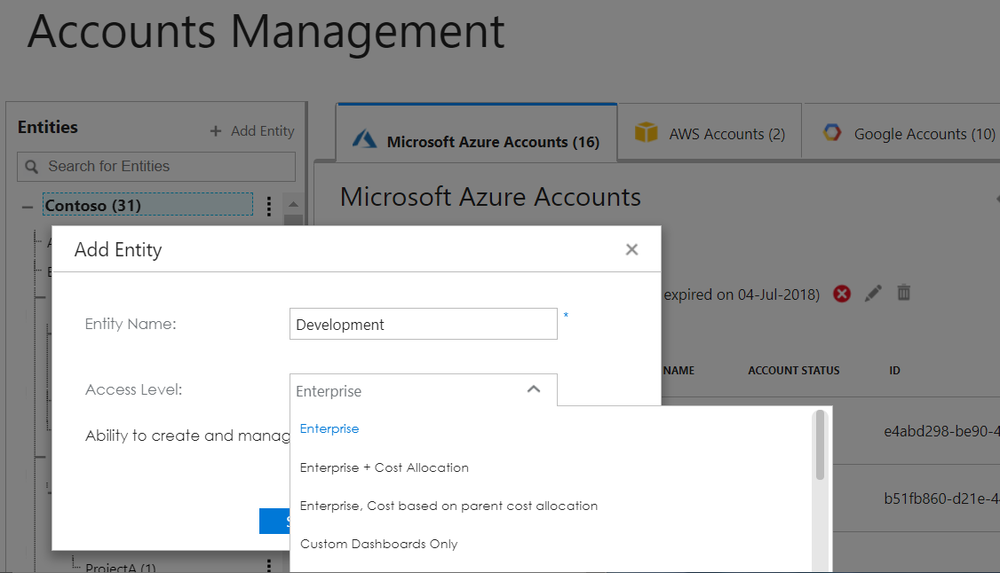

# Tutorial: Assign access to Cloudyn data

Access to Cloudyn data is provided by user or entity management. Cloudyn user accounts determine access to *entities* and administrative functions. There two types of access: admin and user. Unless modified per user, admin access allows a user unrestricted use of all functions in the Cloudyn portal, including: user management, recipient lists management and root entity access to all entity data. User access is intended for end users to view reports and create reports using the access they have to entity data.

Entities are used to reflect your business organization's hierarchical structure. They identify departments, divisions, and teams in your organization in Cloudyn. The entity hierarchy helps you accurately track spending by the entities.

When you registered your Azure agreement or account, an account with admin permission was created in Cloudyn, so you can perform all the steps in this tutorial. This tutorial covers access to Cloudyn data including  user management and entity management. You learn how to:

> [!div class="checklist"]
> * Create a user with admin access
> * Create a user with user access
> * Delete a user
> * Delete or export personal data
> * Create and manage entities

If you don't have an Azure subscription, create a  [free account](https://azure.microsoft.com/free/?WT.mc_id=A261C142F) before you begin.

[!INCLUDE [cloudyn-note](../../../includes/cloudyn-note.md)]

## Prerequisites

- You must have an Azure account.
- You must have either a trial registration or paid subscription for Cloudyn.

## Create a user with admin access

Although you already have admin access, coworkers in your organization might also need to have admin access. In the Cloudyn portal, click the gear symbol in the upper right and select **User Management**. Click **Add New User** to add a new user.

Enter required information about the user. The **login ID** must be a valid e-mail address. Choose permissions to allow User Management so that the user can create and modify other users. Recipient Lists Management allow the user to edit recipient lists. A link with sign in information gets sent to the user by e-mail from Cloudyn when you select **Notify user by email**. On first sign-in the user sets a password.

Under **User has admin access**, the root entity of your organization is selected. Leave root selected and then save the user information. Selecting the root entity allows the user to have admin permission not only to the root entity in the tree, but also to all the entities that reside below it.  
  

## Create a user with user access
Typical users that need access to Cloudyn data like dashboards and reports should have user access to view them. Create a new user with user access similar to the one you created with admin access, with the following differences:

- Clear **Allow User Management**, **Allow Recipient lists Management**, and clear all in the **User has admin access** list.
- Select the entities that the user needs access to in the **User has user access** list.
- You can also allow admin to access to specific entities, as needed.

To watch a tutorial video about adding users, see [Adding Users to Cloudyn](https://youtu.be/Nzn7GLahx30).

## Delete a user

When you delete a user, any entities that the user has access to remain intact. Saved *personal* reports are removed when the user is deleted. Saved *public* reports created by the user are not deleted.

You cannot remove yourself as a user.

> [!WARNING]
> When you delete a user, it can't be restored.

1.    In the Cloudyn portal, click the gear symbol in the upper right and then select **User Management**.
2.    In the list of users, select the user that you want to delete and then click **Delete User** (the trash can symbol).
3.    In the Delete User box, click **Yes** and then click **OK**.

## Delete or export personal data

If you want to delete or export personal data from Cloudyn, you need to create a support ticket. When the support ticket is created, it acts as formal request - a Data Subject Request. Microsoft then takes prompt action to remove the account and delete any customer or personal data. To learn about how you can request to have your data deleted or exported, see [Data Subject Requests of Cloudyn Data](https://www.cloudyn.com/cloudyn-gdpr-requests).

## Create and manage entities

When you define your cost entity hierarchy, a best practice is to identify the structure of your organization. Entities allow you to segment spending by individual accounts or subscriptions. You create cost entities to create logical groups to manage and track spending. As you build the tree, consider how you want or need to see their costs segregated by business units, cost centers, environments, and sales departments. The entity tree in Cloudyn is flexible due to entity inheritance.

Individual subscriptions for your cloud accounts are linked to specific entities. You can associate an entity with a cloud service provider account or subscription. So, entities are multi-tenant. You can assign specific users access to only their segment of your business using entities. Doing so keeps data isolated, even across large portions of a business like subsidiaries. And, data isolation helps with governance.  

When you registered your Azure agreement or account with Cloudyn, your Azure resource data including usage, performance, billing, and tag data from your subscriptions was copied to your Cloudyn account. However, you must manually create your entity tree. If you skipped the Azure Resource Manager registration, then only billing data and a few asset reports are available in the Cloudyn portal.

In the Cloudyn portal, click the gear symbol in the upper right and select **Cloud Accounts**. You start with a single entity (root) and build your entity tree under the root. Here's an example of an entity hierarchy that might resemble many IT organizations after the tree is complete:

Next to **Entities**, click **Add Entity**. Enter information about the person or department that you want to add. The **Full Name** and **Email** fields to do not have to match existing users. If you want to view a list of access levels, search in help for *Adding an entity*.

When you're done, **Save** the entity.

### Entity access levels

Entity access levels in conjunction with a user's access allows you to define what type of actions are available in the Cloudyn portal.

- **Enterprise** - Provides the ability to create and manage child cost entities.
- **Enterprise + Cost Allocation** - Provides the ability to create and manage child cost entities including cost allocation for consolidated accounts.
- **Enterprise, Cost based on parent cost allocation** - Provides the ability to create and manage child cost entities. Costs for the account are based on the parent's cost allocation model.
- **Custom Dashboards Only** - Provides the user to only see predefined custom dashboards.
- **Dashboards Only** - Provides the user the ability to only see dashboards.

### Create a cost entity hierarchy

To create a cost entity hierarchy, you must have an account with enterprise or enterprise + cost allocation access.

In the Cloudyn portal, click the gear symbol in the upper right and select  **Cloud Accounts**. The **Entities** tree is shown in the left pane. If necessary, expand the entity tree so that you can view the entity that you want to associate with an account.  Your cloud service provider accounts are shown on tabs in the right pane. Select a tab and then click and drag an account/subscription to the entity, then drop it. The **Move** box informs you that the account was successfully moved. Click **OK**.

You can also associate multiple accounts to an entity. Select the accounts and then click **Move**. In the Move Accounts box, select the entity where you want to move the account to and then click **Save**. The Move accounts box asks you to verify that you want to move the accounts. Click **Yes**, and then click **OK**.

To watch a tutorial video about creating a cost entity hierarchy, see [Creating a Cost Entity Hierarchy in Cloudyn](https://youtu.be/dAd9G7u0FmU).

If you are an Azure Enterprise Agreement user, watch a tutorial video about associating accounts and subscriptions to entities at [Connecting to Azure Resource Manager with Cloudyn](https://youtu.be/oCIwvfBB6kk).

## Next steps

In this tutorial, you learned how to:

> [!div class="checklist"]
> * Create a user with admin access
> * Create a user with user access
> * Delete a user
> * Delete or export personal data
> * Create and manage entities

If you haven't already enabled Azure Resource Manager API access for your accounts, proceed to the following article.

> [!div class="nextstepaction"]
> [Activate Azure subscriptions and accounts](./activate-subs-accounts.md)