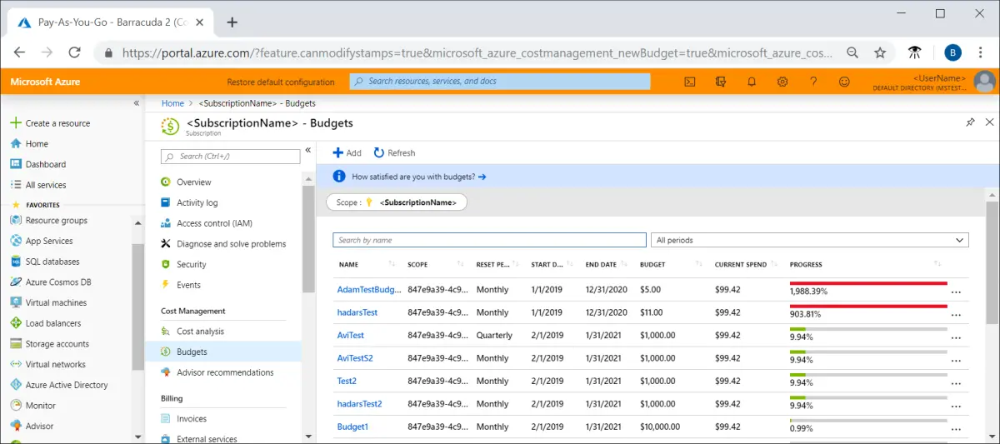
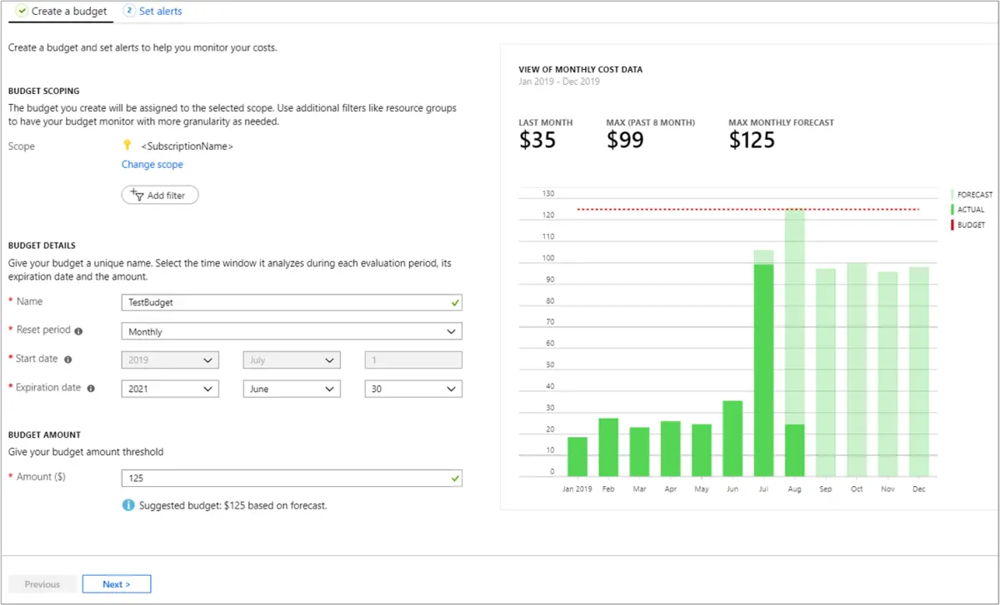
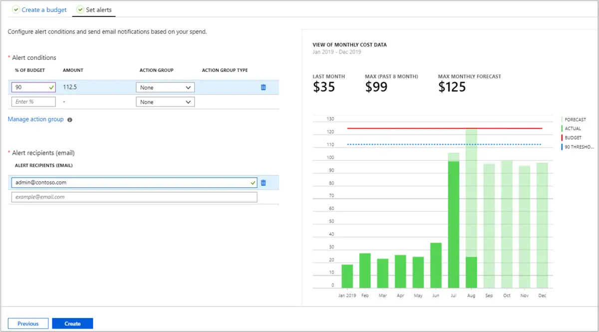
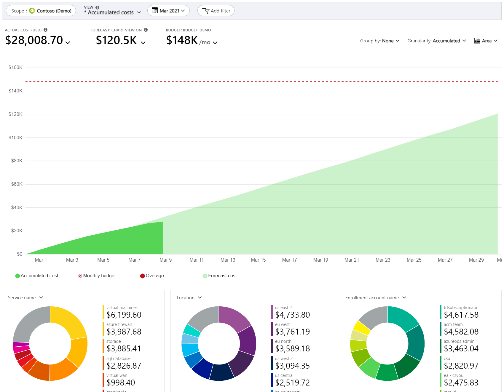
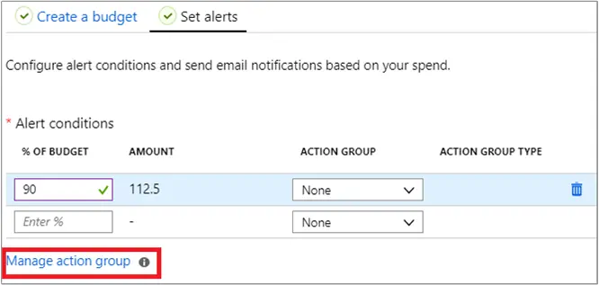
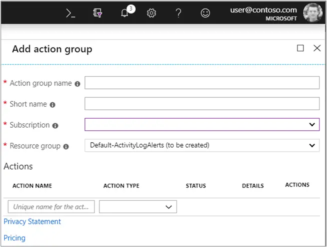
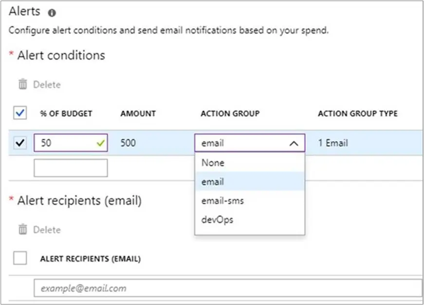
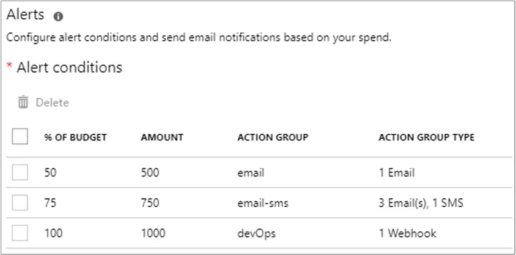

# Tutorial: Create and manage Azure budgets

Budgets in Cost Management help you plan for and drive organizational accountability. With budgets, you can account for the Azure services you consume or subscribe to during a specific period. They help you inform others about their spending to proactively manage costs, and to monitor how spending progresses over time. When the budget thresholds you've created are exceeded, only notifications are triggered. None of your resources are affected and your consumption isn't stopped. You can use budgets to compare and track spending as you analyze costs.

Cost and usage data is typically available within 20 hours and budgets are evaluated against these costs every 12-14 hours. When a budget threshold is met, email notifications are normally sent within an hour of the evaluation.

Budgets reset automatically at the end of a period (monthly, quarterly, or annually) for the same budget amount when you select an expiration date in the future. Because they reset with the same budget amount, you need to create separate budgets when budgeted currency amounts differ for future periods.

The examples in this tutorial walk you through creating and editing a budget for an Azure Enterprise Agreement (EA) subscription.

Watch the [Apply budgets to subscriptions using the Azure portal](https://www.youtube.com/watch?v=UrkHiUx19Po) video to see how you can create budgets in Azure to monitor spending. To watch other videos, visit the [Cost Management YouTube channel](https://www.youtube.com/c/AzureCostManagement).

>[!VIDEO https://www.youtube.com/embed/UrkHiUx19Po]

In this tutorial, you learn how to:

> [!div class="checklist"]
> * Create a budget in the Azure portal
> * Create and edit budgets with PowerShell
> * Create a budget with an Azure Resource Manager template

## Prerequisites

Budgets are supported for the following types of Azure account types and scopes:

- Azure Role-Based Access Control scopes
    - Management groups
    - Subscription
- Enterprise Agreement scopes
    - Billing account
    - Department
    - Enrollment account
- Individual agreements
    - Billing account
- Microsoft Customer Agreement scopes
    - Billing account
    - Billing profile
    - Invoice section
    - Customer
- AWS scopes
    - External account
    - External subscription


To view budgets, you need at least read access for your Azure account.

If you have a new subscription, you can't immediately create a budget or use other Cost Management features. It might take up to 48 hours before you can use all Cost Management features.

For Azure EA subscriptions, you must have read access to view budgets. To create and manage budgets, you must have contributor permission.

The following Azure permissions, or scopes, are supported per subscription for budgets by user and group. For more information about scopes, see [Understand and work with scopes](understand-work-scopes.md).

- Owner – Can create, modify, or delete budgets for a subscription.
- Contributor and Cost Management contributor – Can create, modify, or delete their own budgets. Can modify the budget amount for budgets created by others.
- Reader and Cost Management reader – Can view budgets that they have permission to.

For more information about assigning permission to Cost Management data, see [Assign access to Cost Management data](../../cost-management/assign-access-acm-data.md).

## Sign in to Azure

- Sign in to the Azure portal at [https://portal.azure.com](https://portal.azure.com).

## Create a budget in the Azure portal

You can create an Azure subscription budget for a monthly, quarterly, or annual period.

To create or view a budget, open the desired scope in the Azure portal and select **Budgets** in the menu. For example, navigate to **Subscriptions**, select a subscription from the list, and then select **Budgets** in the menu. Use the **Scope** pill to switch to a different scope, like a management group, in Budgets. For more information about scopes, see [Understand and work with scopes](understand-work-scopes.md).

After you create budgets, they show a simple view of your current spending against them.

Select **Add**.



In the **Create budget** window, make sure that the scope shown is correct. Choose any filters that you want to add. Filters allow you to create budgets on specific costs, such as resource groups in a subscription or a service like virtual machines. Any filter you can use in cost analysis can also be applied to a budget.

After you've identified your scope and filters, type a budget name. Then, choose a monthly, quarterly, or annual budget reset period. This reset period determines the time window that's analyzed by the budget. The cost evaluated by the budget starts at zero at the beginning of each new period. When you create a quarterly budget, it works in the same way as a monthly budget. The difference is that the budget amount for the quarter is evenly divided among the three months of the quarter. An annual budget amount is evenly divided among all 12 months of the calendar year.

If you have a Pay-As-You-Go, MSDN, or Visual Studio subscription, your invoice billing period might not align to the calendar month. For those subscription types and resource groups, you can create a budget that's aligned to your invoice period or to calendar months. To create a budget aligned to your invoice period, select a reset period of **Billing month**, **Billing quarter**, or **Billing year**. To create a budget aligned to the calendar month, select a reset period of **Monthly**, **Quarterly**, or **Annually**.

Next, identify the expiration date when the budget becomes invalid and stops evaluating your costs.

Based on the fields chosen in the budget so far, a graph is shown to help you select a threshold to use for your budget. The suggested budget is based on the highest forecasted cost that you might incur in future periods. You can change the budget amount.



After you configure the budget amount, select **Next** to configure budget alerts. Budgets require at least one cost threshold (% of budget) and a corresponding email address. You can optionally include up to five thresholds and five email addresses in a single budget. When a budget threshold is met, email notifications are normally sent within an hour of the evaluation.

If you want to receive emails, add azure-noreply@microsoft.com to your approved senders list so that emails don't go to your junk email folder. For more information about notifications, see [Use cost alerts](../../cost-management/cost-mgt-alerts-monitor-usage-spending.md).

In the example below, an email alert gets generated when 90% of the budget is reached. If you create a budget with the Budgets API, you can also assign roles to people to receive alerts. Assigning roles to people isn't supported in the Azure portal. For more about the Azure budgets API, see [Budgets API](/rest/api/consumption/budgets).

Alert limits support a range of 0.01 to 1000% of the budget threshold that you've provided.



After you create a budget, it is shown in cost analysis. Viewing your budget against your spending trend is one of the first steps when you start to [analyze your costs and spending](../../cost-management/quick-acm-cost-analysis.md).



In the preceding example, you created a budget for a subscription. You can also create a budget for a resource group. If you want to create a budget for a resource group, navigate to **Cost Management + Billing** &gt; **Subscriptions** &gt; select a subscription > **Resource groups** > select a resource group > **Budgets** > and then **Add** a budget.

### Create a budget for combined Azure and AWS costs

You can group your Azure and AWS costs together by assigning a management group to your connector along with it's consolidated and linked accounts. Assign your Azure subscriptions to the same management group. Then create a budget for the combined costs.

1. In Cost Management, select **Budgets**.
1. Select **Add**.
1. Select **Change scope** and then select the management group.
1. Continue creating the budget until complete.

## Costs in budget evaluations

Budget cost evaluations now include reserved instance and purchase data. If the charges apply to you, then you might receive alerts as charges are incorporated into your evaluations. We recommend that you sign in to the [Azure portal](https://portal.azure.com) to verify that budget thresholds are properly configured to account for the new costs. Your Azure billed charges aren't changed. Budgets now evaluate against a more complete set of your costs. If the charges don't apply to you, then your budget behavior remains unchanged.

If you want to filter the new costs so that budgets are evaluated against first party Azure consumption charges only, add the following filters to your budget:

- Publisher Type: Azure
- Charge Type: Usage

Budget cost evaluations are based on actual cost. They don't include amortization. For more information about filtering options available to you in budgets, see [Understanding grouping and filtering options](group-filter.md).

## Trigger an action group

When you create or edit a budget for a subscription or resource group scope, you can configure it to call an action group. The action group can perform various actions when your budget threshold is met. Action Groups are currently only supported for subscription and resource group scopes. For more information about Action Groups, see [Create and manage action groups in the Azure portal](../../azure-monitor/platform/action-groups.md). For more information about using budget-based automation with action groups, see [Manage costs with Azure budgets](../manage/cost-management-budget-scenario.md).

To create or update action groups, select **Manage action groups** while you're creating or editing a budget.



Next, select **Add action group** and create the action group.



After the action group is created, close the box to return to your budget.

Configure your budget to use your action group when an individual threshold is met. Up to five different thresholds are supported.



The following example shows budget thresholds set to 50%, 75%, and 100%. Each is configured to trigger the specified actions within the designated action group.



Budget integration with action groups only works for action groups that have the common alert schema disabled. For more information about disabling the schema, see [How do I enable the common alert schema?](../../azure-monitor/platform/alerts-common-schema.md#how-do-i-enable-the-common-alert-schema)

## Create and edit budgets with PowerShell

EA customers can create and edit budgets programmatically using the Azure PowerShell module.  To download the latest version of Azure PowerShell, run the following command:

```azurepowershell-interactive
install-module -name Az
```

The following example commands create a budget.

```azurepowershell-interactive
#Sign into Azure Powershell with your account

Connect-AzAccount

#Select a subscription to to monitor with a budget

select-AzSubscription -Subscription "Your Subscription"

#Create an action group email receiver and corresponding action group

$email1 = New-AzActionGroupReceiver -EmailAddress test@test.com -Name EmailReceiver1
$ActionGroupId = (Set-AzActionGroup -ResourceGroupName YourResourceGroup -Name TestAG -ShortName TestAG -Receiver $email1).Id

#Create a monthly budget that sends an email and triggers an Action Group to send a second email. Make sure the StartDate for your monthly budget is set to the first day of the current month. Note that Action Groups can also be used to trigger automation such as Azure Functions or Webhooks.

New-AzConsumptionBudget -Amount 100 -Name TestPSBudget -Category Cost -StartDate 2020-02-01 -TimeGrain Monthly -EndDate 2022-12-31 -ContactEmail test@test.com -NotificationKey Key1 -NotificationThreshold 0.8 -NotificationEnabled -ContactGroup $ActionGroupId
```
## Create a budget with an Azure Resource Manager template

You can create a budget using an Azure Resource Manager template. To use the template, see [Create a budget with an Azure Resource Manager template](quick-create-budget-template.md).

## Next steps

In this tutorial, you learned how to:

> [!div class="checklist"]
> * Create a budget in the Azure portal
> * Create and edit budgets with PowerShell
> * Create a budget with an Azure Resource Manager template

Advance to the next tutorial to create a recurring export for your cost management data.

> [!div class="nextstepaction"]
> [Create and manage exported data](tutorial-export-acm-data.md)
