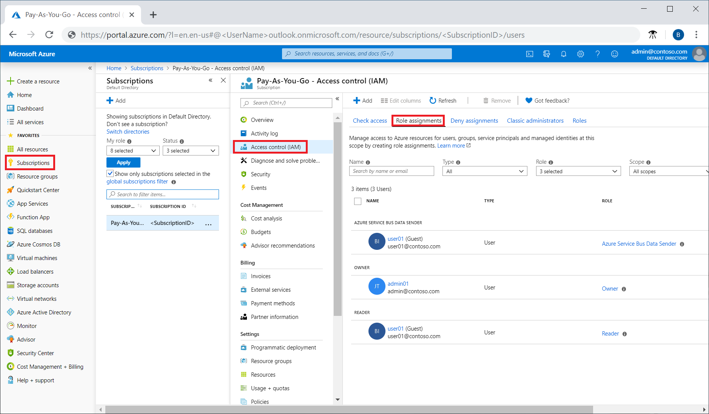
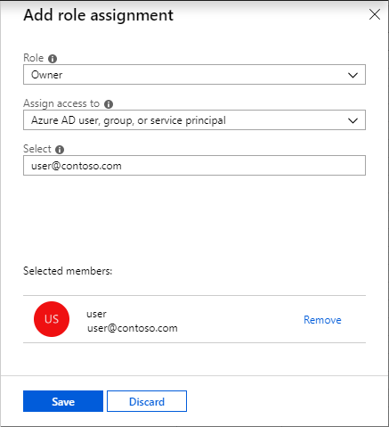

# Add or change Azure subscription administrators

To manage access to Azure resources, you must have the appropriate administrator role. Azure has an authorization system called [Azure role-based access control (Azure RBAC)](../../role-based-access-control/overview.md) with several built-in roles you can choose from. You can assign these roles at different scopes, such as management group, subscription, or resource group. By default, the person who creates a new Azure subscription can assign other users administrative access to a subscription.

This article describes how add or change the administrator role for a user using Azure RBAC at the subscription scope.

Microsoft recommends that you manage access to resources using Azure RBAC. However, if you are still using the classic deployment model and managing the classic resources by using [Azure Service Management PowerShell Module](/powershell/module/servicemanagement/azure.service), you'll need to use a classic administrator.

> [!TIP]
> If you only use the Azure portal to manage the classic resources, you don't need to use the classic administrator.

For more information, see [Azure Resource Manager vs. classic deployment](../../azure-resource-manager/management/deployment-models.md) and [Azure classic subscription administrators](../../role-based-access-control/classic-administrators.md).

## Assign a subscription administrator

To make a user an administrator of an Azure subscription, an existing administrator assigns them the [Owner](../../role-based-access-control/built-in-roles.md#owner) role (an Azure role) at the subscription scope. The Owner role gives the user full access to all resources in the subscription, including the right to delegate access to others. These steps are the same as any other role assignment.

If you're not sure who the account administrator is for a subscription, use the following steps to find out.

1. Open the [Subscriptions page in the Azure portal](https://portal.azure.com/#blade/Microsoft_Azure_Billing/SubscriptionsBlade).
1. Select the subscription you want to check, and then look under **Settings**.
1. Select **Properties**. The account administrator of the subscription is displayed in the **Account Admin** box.

### To assign a user as an administrator

1. Sign in to the Azure portal as the subscription owner and open [Subscriptions](https://portal.azure.com/#blade/Microsoft_Azure_Billing/SubscriptionsBlade).

1. Click the subscription where you want to grant access.

1. Click **Access control (IAM)**.

1. Click the **Role assignments** tab to view all the role assignments for this subscription.

    

1. Click **Add** > **Add role assignment** to open the **Add role assignment** pane.

    If you don't have permissions to assign roles, the option will be disabled.

1. In the **Role** drop-down list, select the **Owner** role.

1. In the **Select** list, select a user. If you don't see the user in the list, you can type in the **Select** box to search the directory for display names and email addresses.

    

1. Click **Save** to assign the role.

    After a few moments, the user is assigned the Owner role at the subscription scope.

## Next steps

* [What is Azure role-based access control (Azure RBAC)?](../../role-based-access-control/overview.md)
* [Understand the different roles in Azure](../../role-based-access-control/rbac-and-directory-admin-roles.md)
* [Associate or add an Azure subscription to your Azure Active Directory tenant](../../active-directory/fundamentals/active-directory-how-subscriptions-associated-directory.md)
* [Administrator role permissions in Azure Active Directory](../../active-directory/roles/permissions-reference.md)

## Need help? Contact support

If you still need help, [contact support](https://portal.azure.com/?#blade/Microsoft_Azure_Support/HelpAndSupportBlade) to get your issue resolved quickly.
