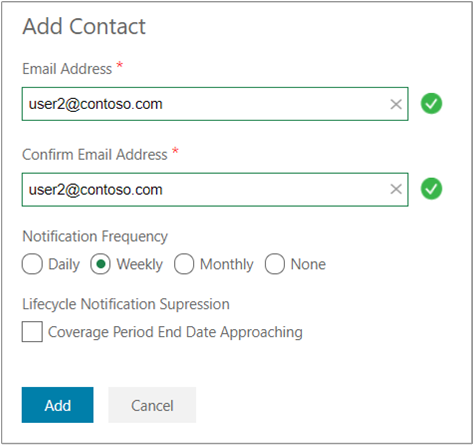

# Azure EA portal administration for partners

This article explains the common tasks that a partner EA administrator accomplishes in the Azure EA portal (https://ea.azure.com).

## Manage partner administrators

Each partner administrator within the Azure EA Portal has the ability to add or remove other partner administrators. Partner administrators are associated to the partner organizations of indirect enrollments and aren't associated directly to the enrollments.

### Add a partner administrator

To view a list of all enrollments that are associated to the same partner organization as the current user, select the **Enrollment** tab and select a desired enrollment box.

1. Sign in as a partner administrator.
1. Select **Manage** on the left navigation.
1. Select the **Partner** tab.
1. Select **+ Add Administrator** and fill in the email address, notification contact, and notification details.
1. Select **Add**.

### Remove a partner administrator

To view a list of all enrollments that are associated to the same partner organization as the current user, select the **Enrollment** tab and select a desired enrollment box.

1. Sign in as a partner administrator.
1. Select **Manage** on the left navigation.
1. Select the **Partner** tab.
1. Under the Administrator section, select the appropriate row for the administrator you wish to remove.
1. Select the X symbol on the right.
1. Confirm that you want to delete.

## Manage partner notifications

Partner Administrators can manage the frequency that they receive usage notifications for their enrollments. They automatically receive weekly notifications of their unbilled balance. They can change the frequency of individual notifications to monthly, weekly, daily, or turn them off completely.

If a notification isn't received by a user, verify that the user's notification settings are correct with the following steps.

1. Sign in to the Azure EA portal as a Partner Administrator.
2. Select **Manage** and then select the **Partner** tab.
3. View the list of administrators under the Administrator section.
4. To edit notification preferences, hover over the appropriate administrator and select the pencil symbol.
5. Increase the notification frequency and lifecycle notifications as needed.
6. Add a contact if needed and select **Add**.
7. Select **Save**.

## View enrollments for partner administrators

Partner administrators can see a list view of all their direct and indirect enrollments in the Azure EA Portal. Boxes containing an overview of every enrollment will be displayed with the enrollment number, enrollment name, balance, and overage amounts.

### View a List of Enrollments

1. Sign in as a partner administrator.
1. Select **Manage** on the navigation on the left side of the page.
1. Select the **Enrollment** tab.
1. Select the box for the enrollment.

A view of all enrollments remains at the top of the page, with boxes for each enrollment. Additionally, you can navigate between enrollments by selecting the current enrollment number on the navigation on the left side of the page. A pop out will appear allowing you to search enrollments or select a different enrollment by selecting the appropriate box.

## Next steps

- For introductory information about the Azure EA portal, see the [Get started with the Azure EA portal](ea-portal-get-started.md) article.
- If you need help with troubleshooting Azure EA portal issues, see [Troubleshoot Azure EA portal access](ea-portal-troubleshoot.md).