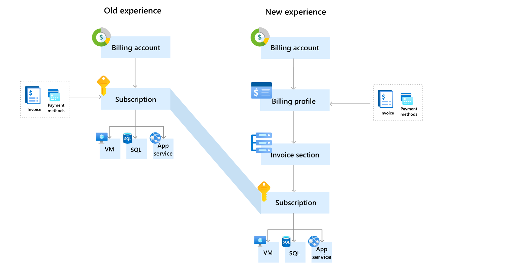
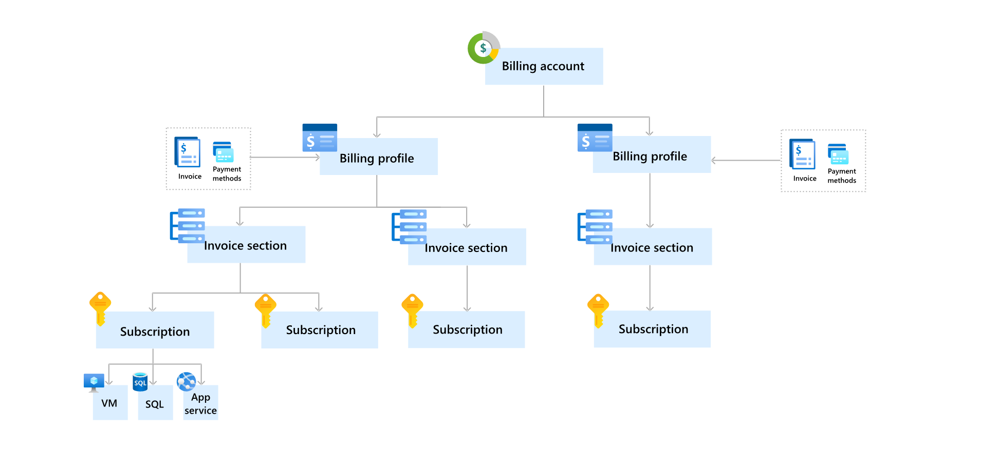

# Get started with your updated Azure billing account

Managing costs and invoices is one of the key components of your cloud experience. It helps you control and understand your spending on cloud. To make it easier for you to manage your costs and invoices, Microsoft is updating your Azure billing account to include enhanced cost management and billing capabilities. This article describes the updates to your billing account and walks you through the new capabilities.

> [!IMPORTANT]
> Your account will get updated when you receive an email from Microsoft notifying you about the updates to your account. The notification is sent 60 days before your account is updated.

## More flexibility with your new billing account

The following diagram compares your old and the new billing account:

Your new billing account contains one or more billing profiles that let you manage your invoices and payment methods. Each billing profile contains one or more invoice sections that let you organize costs on the billing profile's invoice.

Roles on the billing account have the highest level of permissions. These roles should be assigned to users that need to view invoices, and track costs for your entire account like finance or IT managers in an organization or the individual who signed up for an account. For more information, see [billing account roles and tasks](../manage/understand-mca-roles.md#billing-account-roles-and-tasks). When your account is updated, the user who has an account administrator role in the old billing account is given an owner role on the new account.

## Billing profiles

A billing profile is used to manage your invoice and payment methods. A monthly invoice is generated at the beginning of the month for each billing profile in your account. The invoice contains respective charges from the previous month for all subscriptions associated with the billing profile.

When your account is updated, a billing profile is automatically created for each subscription. Subscription's charges are billed to its respective billing profile and displayed on its invoice.

Roles on the billing profiles have permissions to view and manage invoices and payment methods. These roles should be assigned to users who pay invoices like members of the accounting team in an organization. For more information, see [billing profile roles and tasks](../manage/understand-mca-roles.md#billing-profile-roles-and-tasks). 

When your account is updated, for each subscription on which you've given others permission to [view invoices](download-azure-invoice.md#allow-others-to-download-the-your-subscription-invoice), users who have an owner, a contributor, a reader, or a billing reader Azure RBAC role are given the reader role on the respective billing profile.

## Invoice sections

An invoice section is used to organize the costs on your invoice. For example, you might need a single invoice but want to organize costs by department, team, or project. For this scenario, you have a single billing profile where you create an invoice section for each department, team, or project.

When your account is updated, an invoice section is created for each billing profile and the related subscription is assigned to the invoice section. When you add more subscriptions, you can create additional sections and assign the subscriptions to the invoice sections. You'll see the sections on the billing profile's invoice reflecting the usage of each subscription you've assigned to them.

Roles on the invoice section have permissions to control who creates Azure subscriptions. The roles should be assigned to users who set up the Azure environment for teams in an organization like engineering leads and technical architects. For more information, see [invoice section roles and tasks](../manage/understand-mca-roles.md#invoice-section-roles-and-tasks).

## Enhanced features in your new experience

Your new experience includes the following cost management and billing capabilities that make it easy for you to manage your costs and invoices:

#### Invoice management

**More predictable monthly billing period** - In your new account, the billing period begins from the first day of the month and ends at the last day of the month, regardless of when you sign up to use Azure. An invoice will be generated at the beginning of each month, and will contain all charges from the previous month.

**Get a single monthly invoice for multiple subscriptions** - You have the flexibility of either getting one monthly invoice for each of your subscriptions or a single invoice for multiple subscriptions.

**Receive a single monthly invoice for Azure subscriptions, support plans, and Azure Marketplace products** - You'll get one monthly invoice for all charges including usage charges for Azure subscriptions, and support plans and Azure Marketplace purchases.

**Group costs on the invoice based on your needs** - You can group costs on your invoice based on your needs - by departments, projects, or teams.

**Set an optional purchase order number on the invoice** - To associate your invoice with your internal financial systems, set a purchase order number. Manage and update it at any point of time in the Azure portal.

#### Payment management

**Pay invoices immediately using a credit card** - There's no need to wait for the autopayment to be charged to your credit card. You can use any credit card to pay a due or a past due invoice in the Azure portal.

**Keep track of all payments applied to the account** - View all payments applied to your account, including the payment method used, amount paid, and date of payment in the Azure portal.

#### Cost management

**Schedule monthly exports of usage data to a storage account** - Automatically publish your cost and usage data to a storage account on a daily, weekly, or monthly basis.

#### Account and subscription management

**Assign multiple administrators to perform billing operations** - Assign billing permissions to multiple users to manage billing for your account. Get flexibility by providing read, write, or both permissions to others.

**Create additional subscriptions directly in the Azure portal** - Create all your subscriptions with a single click in the Azure portal.

#### API support

**Perform billing and cost management operations through APIs, SDK, and PowerShell** - Use cost management, billing, and consumption APIs to pull billing and cost data into your preferred data analysis tools.

**Perform all subscription operations through APIs, SDK, and PowerShell** - Use Azure subscription APIs to automate the management of your Azure subscriptions, including creating, renaming, and canceling a subscription.

## Get prepared for your new experience

We recommend the following to get prepared for your new experience:

**Monthly billing period and different invoice date**

In the new experience, your invoice will be generated around the ninth day of each month and it contains all charges from previous month. This date might differ from the date when your invoice is generated in the old account. If you share your invoices with others, notify them of the change in the date.

**New billing and cost management APIs**

If you are using Cost Management or Billing APIs to query and update your billing or cost data, then you must use new APIs. 
<!-- Todo - Add link to the API doc -->

## Additional information

The following sections provide additional information about your new experience.

**No service downtime**
Azure services in your subscription will keep running without any interruption. The only update is to your billing experience. There's no impact to existing resources, resource groups, or management groups.

**No changes to Azure resources**
Access to Azure resources that were set using Azure RBAC (role-based access control) isn't affected by the update.

**Past invoices are available in the new experience**
Invoices generated before your account was updated are still available in the Azure portal.

**Invoices for account updated in the middle of the month**
If your account is updated in the middle of the month, you'll get one invoice for charges accumulated until the day your account is updated. You'll get another invoice for the remainder of the month. For example, your account has one subscription and it is updated on 15 September. You will get one invoice for charges accumulated until 15 September. You'll get another invoice for the period between 15 September through 30 September. After September, you'll get one invoice per month.

## Need help? Contact support.

If you need help, [contact support](https://portal.azure.com/?#blade/Microsoft_Azure_Support/HelpAndSupportBlade) to get your issue resolved quickly.

## Next steps

See the following articles to learn more about your billing account.

- [Understand administrative roles for your new billing account](../manage/understand-mca-roles.md)
- [Create an additional Azure subscription for your new billing account](../manage/create-subscription.md)
- [Create sections on your invoice to organize your costs](../manage/mca-section-invoice.md)
