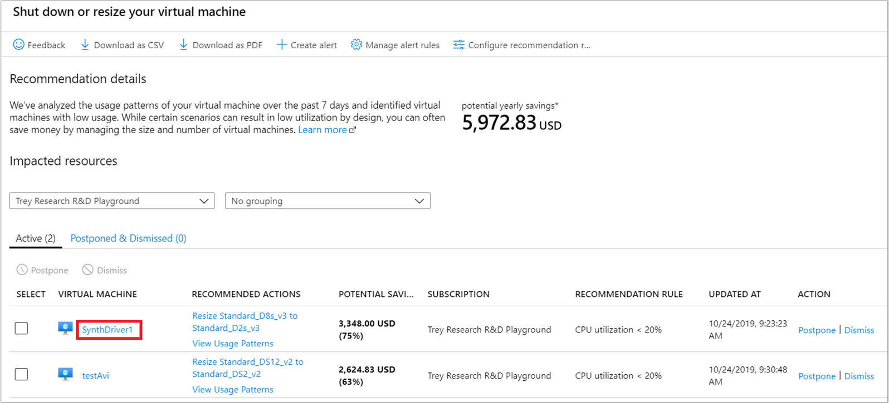
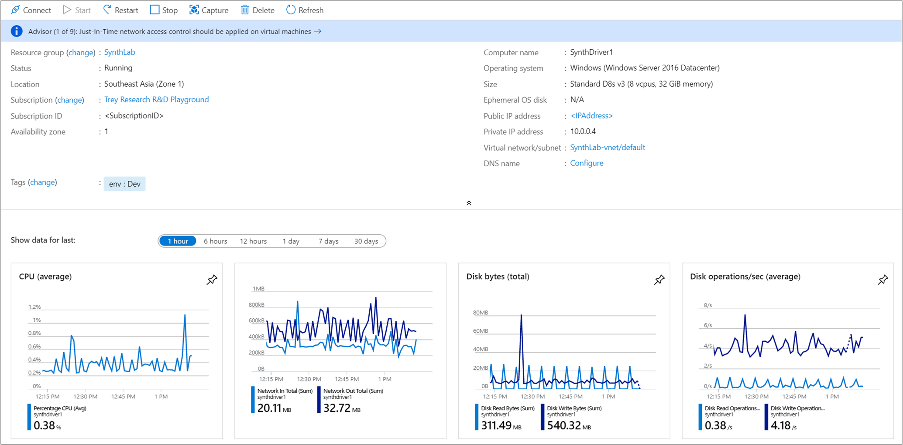
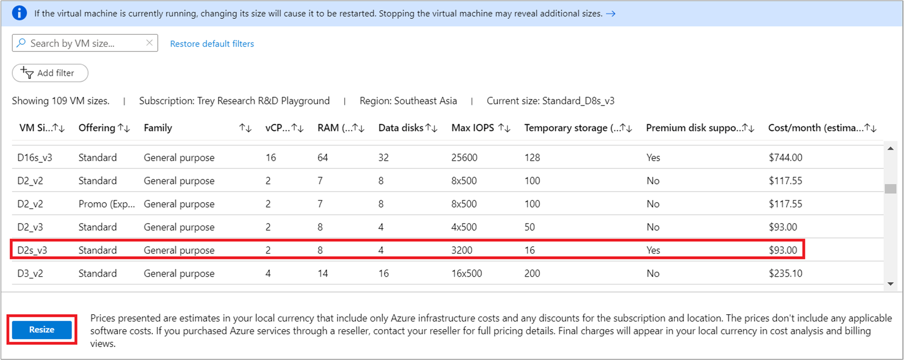

# Tutorial: Optimize costs from recommendations

Azure Cost Management works with Azure Advisor to provide cost optimization recommendations. Azure Advisor helps you optimize and improve efficiency by identifying idle and underutilized resources. This tutorial walks you through an example where you identify underutilized Azure resources and then you take action to reduce costs.

In this tutorial, you learn how to:

> [!div class="checklist"]
> * View cost optimization recommendations to view potential usage inefficiencies
> * Act on a recommendation to resize a virtual machine to a more cost-effective option
> * Verify the action to ensure that the virtual machine was successfully resized

## Prerequisites
Recommendations are available for a variety of scopes and Azure account types, including [Enterprise Agreement (EA)](https://azure.microsoft.com/pricing/enterprise-agreement/) customers. To view the full list of supported account types, see [Understand Cost Management data](understand-cost-mgt-data.md). You must have at least read access to one or more of the following scopes to view cost data. For more information about scopes, see [Understand and work with scopes](understand-work-scopes.md).

- Subscription
- Resource group

You must have active virtual machines with at least 14 days of activity.

## Sign in to Azure
Sign in to the Azure portal at [https://portal.azure.com](https://portal.azure.com/).

## View cost optimization recommendations

To view cost optimization recommendations for a subscription, open the desired scope in the Azure portal and select **Advisor recommendations**.

To view recommendations for a management group, open the desired scope in the Azure portal and select **Cost analysis** in the menu. Use the **Scope** pill to switch to a different scope, such as a management group. Select **Advisor recommendations** in the menu. For more information about scopes, see [Understand and work with scopes](understand-work-scopes.md).

The list of recommendations identifies usage inefficiencies or shows purchase recommendations that can help you save additional money. The totaled **Potential yearly savings** shows the total amount that you can save if you shut down or deallocate all of your VMs that meet recommendation rules. If you don't want to shut them down, you should consider resizing them to a less expensive VM SKU.

The **Impact** category, along with the **Potential yearly savings**, are designed to help identify recommendations that have the potential to save as much as possible.

High impact recommendations include:
- [Buy reserved virtual machine instances to save money over pay-as-you-go costs](../advisor/advisor-cost-recommendations.md#buy-reserved-virtual-machine-instances-to-save-money-over-pay-as-you-go-costs)
- [Optimize virtual machine spend by resizing or shutting down underutilized instances](../advisor/advisor-cost-recommendations.md#optimize-virtual-machine-spend-by-resizing-or-shutting-down-underutilized-instances)
- [Use Standard Storage to store Managed Disks snapshots ](../advisor/advisor-cost-recommendations.md#use-standard-snapshots-for-managed-disks)

Medium impact recommendations include:
- [Delete Azure Data Factory pipelines that are failing](../advisor/advisor-cost-recommendations.md#delete-azure-data-factory-pipelines-that-are-failing)
- [Reduce costs by eliminating un-provisioned ExpressRoute circuits](../advisor/advisor-cost-recommendations.md#reduce-costs-by-eliminating-unprovisioned-expressroute-circuits)
- [Reduce costs by deleting or reconfiguring idle virtual network gateways](../advisor/advisor-cost-recommendations.md#reduce-costs-by-deleting-or-reconfiguring-idle-virtual-network-gateways)

## Act on a recommendation

Azure Advisor monitors your virtual machine usage for 14 days and then identifies underutilized virtual machines. Virtual machines whose CPU utilization is five percent or less and network usage is seven MB or less for four or more days are considered low-utilization virtual machines.

The 5% or less CPU utilization setting is the default, but you can adjust the settings. For more information about adjusting the setting, see the [Configure the average CPU utilization rule or the low usage virtual machine recommendation](../advisor/advisor-get-started.md#configure-low-usage-vm-recommendation).

Although some scenarios can result in low utilization by design, you can often save money by changing the size of your virtual machines to less expensive sizes. Your actual savings might vary if you choose a resize action. Let's walk through an example of resizing a virtual machine.

In the list of recommendations, click the **Right-size or shutdown underutilized virtual machines** recommendation. In the list of virtual machine candidates, choose a virtual machine to resize and then click the virtual machine. The virtual machine's details are shown so that you can verify the utilization metrics. The **potential yearly savings** value is what you can save if you shut down or remove the VM. Resizing a VM will probably save you money, but you won't save the full amount of the potential yearly savings.

In the VM details, check the utilization of the virtual machine to confirm that it's a suitable resize candidate.

Note the current virtual machine's size. After you've verified that the virtual machine should be resized, close the VM details so that you see the list of virtual machines.

In the list of candidates to shut down or resize, select **Resize the virtual machine**.

Next, you're presented with a list of available resize options. Choose the one that will give the best performance and cost-effectiveness for your scenario. In the following example, the option chosen resizes from a **DS14\_V2** to a **DS13\_V2**. Following the recommendation saves $551.30/month or $6,615.60/year.

After you choose a suitable size, click **Select** to start the resize action.

Resizing requires an actively running virtual machine to restart. If the virtual machine is in a production environment, we recommend that you run the resize operation after business hours. Scheduling the restart can reduce disruptions caused by momentarily unavailability.

## Verify the action

When the VM resizing completes successfully, an Azure notification is shown.

## Next steps

In this tutorial, you learned how to:

> [!div class="checklist"]
> * View cost optimization recommendations to view potential usage inefficiencies
> * Act on a recommendation to resize a virtual machine to a more cost-effective option
> * Verify the action to ensure that the virtual machine was successfully resized

If you haven't already read the Cost Management best practices article, it provides high-level guidance and principles to consider to help manage costs.

> [!div class="nextstepaction"]
> [Cost Management best practices](cost-mgt-best-practices.md)
