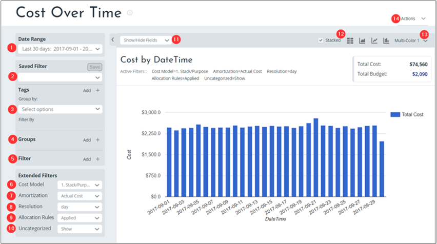
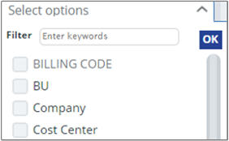
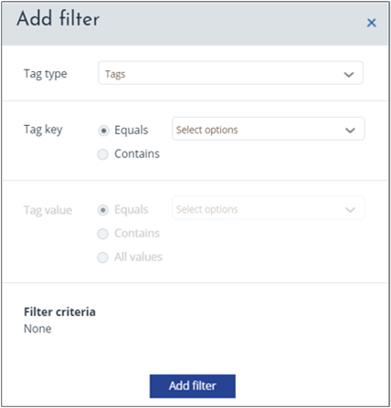
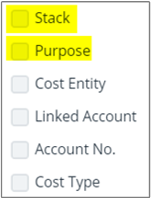
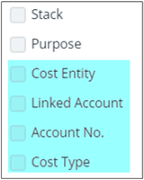

# Understanding Cloudyn cost management reports

This article helps you understand Cloudyn cost management reports basic structure and functions. Most Cloudyn reports are intuitive and have a uniform look and feel. After you read this article, are ready to use all the cost management reports. Many standard features are available throughout the various reports, allowing you to navigate the reports with ease. Reports are customizable, and you can select from several options to calculate and display results.

## Report fields and options

Here's a look at an example of the Cost Over Time report. Most Cloudyn reports have a similar layout.

Each numbered area in the preceding image is described in detail in the following information:

1. **Date Range**

    Use the Date Range list to define a report time interval using a preset or custom.
2. **Saved Filter**

    Use the Saved Filter list to save the current groups and filters that are applied to the report. Saved filters are available across cost and performance reports, including:

      - Cost Analysis
      - Allocation
      - Asset Management
      - Optimization

   Type a filter name and the click **Save**.

3. **Tags**

    Use the Tags area to group by tag categories. Tags listed in the menu are Azure department or cost center tags or they are Cloudyn's cost entity and subscription tags. Select tags to filter results. You can also type a tag name (keyword) to filter results.

    

    Click **Add** to add a new filter.

    

    Tag grouping or filtering does not relate to Azure resources or resource group tags.

    Cost allocation tag grouping and filtering are available in the **Groups** menu option.

4. **Groups in reports**

    Use groups in Cost Analysis reports to show standard, itemized categories from billing data in your report.  However, groups in Cost Allocation reports show view tag-based categories. Tag-based categories are defined in the cost allocation model and standard itemized categories from billing data.

    

    

    In Cost Allocation Reports, groups in tag-based group categories might include:
      - Tags
      - resource group tags
      - Cloudyn cost entity tags
      - Subscription tag categories for cost allocation purposes

   Examples might include:
   - Cost center
   - Department
   - Application
   - Environment
   - Cost code

     Here's a list of built-in groups available in reports:

     - **Cost Type**
     - Select a cost type or multiple cost types, or select all. Cost types include:
       - One-Time Fee
       - Support
       - Usage Cost
     - **Customer**
       - Select a specific customer, multiple customers, or select all customers.
     - **Account Name**
       - The account or subscription name. In Azure, it is the name of the Azure subscription.
     - **Account No**
       - Select an account, multiple accounts, or all accounts. In Azure, it is the Azure subscription’s GUID.
     - **Parent Account**
       - Select the parent account, multiple accounts, or select all.
     - **Service**
       - Select a service, multiple services, or select all services.
     - **Provider**
       - The cloud provider where assets and expenses are associated.
     - **Region**
       - Region where the resource is hosted.
     - **Availability Zone**
       - AWS isolated locations within a region.
     - **Resource Type**
       - The type of resource in use.
     - **Sub-Type**
       - Select the sub-type.
     - **Operation**
       - Select the operation or **Show all**.
     - **Price Model**
       - All Upfront
       - No Upfront
       - Partial Upfront
       - On Demand
       - Reservation
       - Spot
     - **Charge Type**
       - Select Negative or Positive charge type or both.
     - **Tenancy**
       - Whether a machine is running as a dedicated machine.
     - **Usage Type**
       - Usage type can be one-time fees or recurring fees.

5. **Filters**

    Use single or multi-select filters to set ranges to selected values. To set a filter, click **Add** and then select filter categories and values.

6. **Cost Model**

    Use Cost Model to select a cost model that you previously created with Cost Allocation 360. You might have multiple Cloudyn cost models, depending on your cost allocation requirements. Some of your organizational teams might have cost allocation requirements that differ from others. Each team can have their own dedicated cost model.

    For information about creating a cost allocation model definition, see [Use custom tags to allocate costs](tutorial-manage-costs.md#use-custom-tags-to-allocate-costs).

7. **Amortization**

    Use Amortization in Cost Allocation reports to view non-usage based service fees or one-time payable costs and spread their cost over time evenly during their lifespan. Examples of one-time fees might include:
    - Annual support fees
    - Annual security components fees
    - Reserved instances purchase fees
    - Some Azure Marketplace items.

   Under Amortization, select **Amortized cost** or **Actual Cost**.

8. **Resolution**

    Use Resolution to select the time resolution within the selected date range. Your time resolution determines how units are displayed in the report and can be:
    - Daily
    - Weekly
    - Monthly
    - Quarterly
    - Annual

9. **Allocation rules**

    Use Allocation Rules to apply or disable the cost allocation cost recalculation. You can enable or disable the cost allocation recalculation for billing data. The recalculation applies to the selected categories in the report. It allows you to assess the cost allocation recalculation impact against raw billing data.

10. **Uncategorized**

    Use Uncategorized to include or exclude uncategorized costs in the report.

11. **Show/hide fields**

    The Show/hide option does not have any effect in reports.

12. **Display formats**

    Use Display formats to select various graph or table views.

    

13. **Multi-color**

    Use Multi-color to set the color of charts in your report.

14. **Actions**

    Use Actions to save, export, or schedule the report.

15. **Policy**

    Although not pictured, some reports include a projected cost calculation policy. In those reports, the **Consolidated** policy shows recommendations for all accounts and subscriptions under the current entity such as Microsoft enrollment or AWS payer. The **Standalone** policy shows recommendations for one account or subscription as if no other subscriptions exist. The policy that you select varies on the optimization strategy used by your organization. Cost projections are based on the last 30 days of usage.

## Save and schedule reports

After you create a report, you can save it for future use. Saved reports are available in **My Tools** > **My Reports**. If you make changes to an existing report and save it, the report is saved as a new version. Or, you can save it as a new report.

### Save a report to the Cloudyn portal

While viewing any report, click **Actions** and then select **Save to my reports**. Name the report and then either add a your own URL or use the automatically created URL. You can optionally **Share** the report publicly with others in your organization or you can share it to your entity. If you do not share the report, it remains a personal report and that only you can view. Save the report.

### Save a report to cloud provider storage

In order to save a report to your cloud service provider, you must have already configured a storage account. While viewing any report, click **Actions** and then select **Schedule report**. Name the report and then either add a your own URL or use the automatically created URL. Select **Save to storage** and then select the storage account or add a new one. Enter a prefix that gets appended to the report file name. Select a CSV or JSON file format and then save the report.

### Schedule a report

You can run reports at scheduled intervals and you can sent them to a recipient list or cloud service provider storage account. While viewing any report, click **Actions** and then select **Schedule report**. You can send the report by email and save to a storage account. Under **Schedule**, select the interval (daily, weekly or monthly). For weekly and monthly, select the day or dates to deliver and select the time. Save the scheduled report. If you select the Excel report format, the report is sent as an attachment. When you select email content format, report results that are displayed in chart format are delivered as a graph.

### Export a report as a CSV file

While viewing any report, click **Actions** and then select **Export all report data**. A pop-up window appears and a CSV file is downloaded.

## Next steps

- Learn about the reports that are included in Cloudyn at [Use Cloudyn reports](use-reports.md).
- Learn about how to use reports to create [dashboards](dashboards.md).
