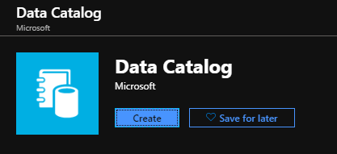
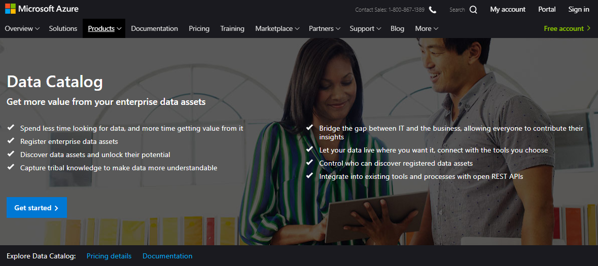
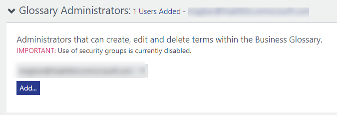
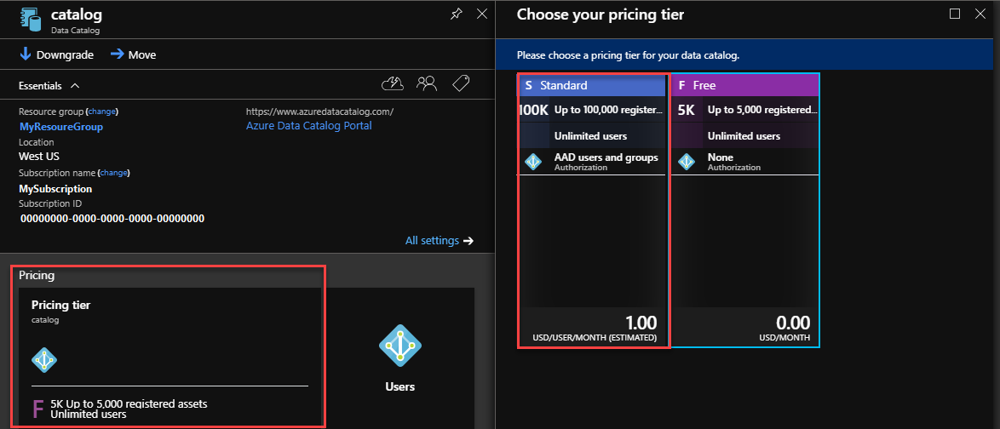

# Quickstart: Create an Azure Data Catalog

Azure Data Catalog is a fully managed cloud service that serves as a system of registration and system of discovery for enterprise data assets. For a detailed overview, see [What is Azure Data Catalog](overview.md).

This quickstart helps you get started with creating an Azure Data Catalog.

If you don’t have an Azure subscription, create a [free account](https://azure.microsoft.com/free/?WT.mc_id=A261C142F) before you begin.

## Prerequisites

> [!Note]
> Due to Azure security requirements, Azure Data Catalog has enfored Transport Layer Security (TLS) 1.2. TLS 1.0 and TLS 1.1 have been disabled. You may encounter errors running the registration tool if your machine is not updated for TLS 1.2. See [Enable Transport Layer Security (1.2)](/mem/configmgr/core/plan-design/security/enable-tls-1-2) to update your machine for TLS 1.2.

To get started, you need to have:

* A [Microsoft Azure](https://azure.microsoft.com/) subscription.
* You need to have your own [Azure Active Directory tenant](../active-directory/fundamentals/active-directory-access-create-new-tenant.md).

To set up Data Catalog, you must be the owner or co-owner of an Azure subscription.

## Create a data catalog

You can provision only one data catalog per organization (Azure Active Directory domain). Therefore, if the owner or co-owner of an Azure subscription who belongs to this Azure Active Directory domain has already created a catalog, then you can't create a catalog again even if you have multiple Azure subscriptions. To test whether a data catalog has been created by a user in your Azure Active Directory domain, go to the [Azure Data Catalog home page](http://azuredatacatalog.com) and verify whether you see the catalog. If a catalog has already been created for you, skip the following procedure and go to the next section.

1. Go to the [Azure portal](https://portal.azure.com) > **Create a resource** and select **Data Catalog**.

    

2. Specify a **name** for the data catalog, the **subscription** you want to use, the **location** for the catalog, and the **pricing tier**. Then select **Create**.

3. Go to the [Azure Data Catalog home page](http://azuredatacatalog.com) and click **Publish Data**.

   

   You can also get to the Data Catalog home page from the [Data Catalog service page](https://azure.microsoft.com/services/data-catalog) by selecting **Get started**.

   

4. Go to the **Settings** page.

    

5. Expand **Pricing** and verify your Azure Data Catalog **edition** (Free or Standard).

    

6. If you choose *Standard* edition as your pricing tier, you can expand **Security Groups** and enable authorizing Active Directory security groups to access Data Catalog and enable automatic adjustment of billing.

    

7. Expand **Catalog Users** and click **Add** to add users for the data catalog. You're automatically added to this group.

    

8. If you choose *Standard* edition as your pricing tier, you can expand **Glossary Administrators** and click **Add** to add glossary administrator users. You're automatically added to this group.

    

9. Expand **Catalog Administrators** and click **Add** to add additional administrators for the data catalog. You're automatically added to this group.

    

10. Expand **Portal Title** and add additional text that will be displayed in the portal title.

    

11. Once you complete the **Settings** page, next navigate to the **Publish** page.

    

## Find a data catalog in the Azure portal

1. On a separate tab in the web browser or in a separate web browser window, go to the [Azure portal](https://portal.azure.com) and sign in with the same account that you used to create the data catalog in the previous step.

2. Select **All services** and then click **Data Catalog**.

    

    You see the data catalog you created.

    

3. Click the catalog that you created. You see the **Data Catalog** blade in the portal.

   

4. You can view properties of the data catalog and update them. For example, click **Pricing tier** and change the edition.

    

## Next steps

In this quickstart, you've learned how to create an Azure Data Catalog for your organization. You can now register data sources in your data catalog.

> [!div class="nextstepaction"]
> [Register data sources in Azure Data Catalog](data-catalog-how-to-register.md)