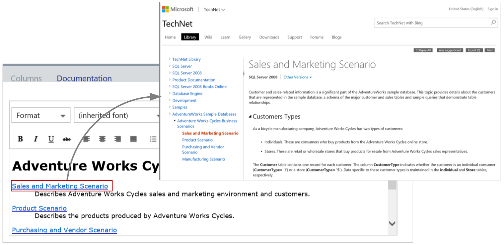

# How to document data sources in Azure Data Catalog

[!INCLUDE [Azure Purview redirect](../../includes/data-catalog-use-purview.md)]

## Introduction
**Microsoft Azure Data Catalog** is a fully managed cloud service that serves as a system of registration and system of discovery for enterprise data sources. In other words, **Azure Data Catalog** is all about helping people discover, *understand*, and use data sources, and helping organizations to get more value from their existing data.

When a data source is registered with **Azure Data Catalog**, its metadata is copied and indexed by the service, but the story doesn’t end there. **Azure Data Catalog** also allows users to provide their own complete documentation that can describe the usage and common scenarios for the data source.

In [How to annotate data sources](data-catalog-how-to-annotate.md), you learn that experts who know the data source can annotate it with tags and a description. The **Azure Data Catalog** portal includes a rich text editor so that users can fully document data assets and containers. The editor includes paragraph formatting, such as headings, text formatting, bulleted lists, numbered lists, and tables.

Tags and descriptions are great for simple annotations. However, to help data consumers better understand the use of a data source, and business scenarios for a data source, an expert can provide complete, detailed documentation. It's easy to document a data source. Select a data asset or container, and choose **Documentation**.

## Documenting data assets
The benefit of **Azure Data Catalog** documentation allows you to use your Data Catalog as a content repository to create a complete narrative of your data assets. You can explore detailed content that describes containers and tables. If you already have content in another content repository, such as SharePoint or a file share, you can add to the asset documentation links to reference this existing content. This feature makes your existing documents more discoverable.

> [!NOTE]
> Documentation is not included in search index.
>

The level of documentation can range from describing the characteristics and value of a data asset container to a detailed description of table schema within a container. The level of documentation provided should be driven by your business needs. But in general, here are a few pros and cons of documenting data assets:

* Document just a container: All the content is in one place, but might lack necessary details for users to make an informed decision.
* Document just the tables: Content is specific to that object, but your users have multiple places for documents.
* Document containers and tables: Most comprehensive approach, but might introduce more maintenance of the documents.

## Summary
Documenting data sources with **Azure Data Catalog** can create a narrative about your data assets in as much detail as you need.  By using links, you can link to content stored in an existing content repository, which brings your existing docs and data assets together. Once your users discover appropriate data assets, they can have a complete set of documentation.
