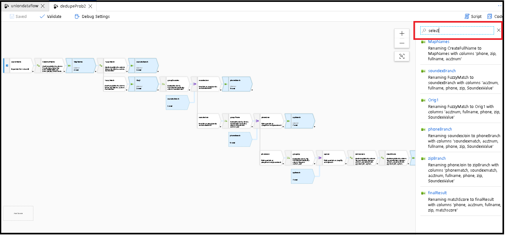

# Mapping data flow graphs

The mapping data flows design surface is a "construction" surface where you build data flows top-down, left-to-right. There is a toolbox attached to each transform with a plus (+) symbol. Concentrate on your business logic instead of connecting nodes via edges in a free-form DAG environment.

Below are built-in mechanisms to manage the data flow graph.

## Move nodes

Without a drag-and-drop paradigm, the way to "move" a transformation node, is to change the incoming stream. Instead, you will move transforms around by changing the "incoming stream".

## Streams of data inside of data flow

In Azure Data Factory Data Flow, streams represent the flow of data. On the transformation settings pane, you will see an "Incoming Stream" field. This tells you which incoming data stream is feeding that transformation. You can change the physical location of your transform node on the graph by clicking the Incoming Stream name and selecting another data stream. The current transformation along with all subsequent transforms on that stream will then move to the new location.

If you are moving a transformation with one or more transformations after it, then the new location in the data flow will be joined via a new branch.

If you have no subsequent transformations after the node you've selected, then only that transform will move to the new location.

## Hide graph and show graph

There is a button on the far-right of the bottom configuration pane where you can expand the bottom pane to full screen when working on transformation configurations. This will allow you to use "previous" and "next" buttons to navigate through the graph's configurations. To move back to graph view, click the down button and return to split screen.

## Search graph

You can search the graph with the search button on the design surface.

## Next steps

After completing your Data Flow design, turn the debug button on and test it out in debug mode either directly in the [data flow designer](concepts-data-flow-debug-mode.md) or [pipeline debug](control-flow-execute-data-flow-activity.md).
