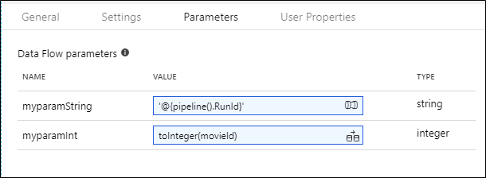

# Data Flow activity in Azure Data Factory

Use the Data Flow activity to transform and move data via mapping data flows. If you're new to data flows, see [Mapping Data Flow overview](concepts-data-flow-overview.md)

## Syntax

```json
{
    "name": "MyDataFlowActivity",
    "type": "ExecuteDataFlow",
    "typeProperties": {
      "dataflow": {
         "referenceName": "MyDataFlow",
         "type": "DataFlowReference"
      },
      "staging": {
          "linkedService": {
              "referenceName": "MyStagingLinkedService",
              "type": "LinkedServiceReference"
          },
          "folderPath": "my-container/my-folder"
      },
      "integrationRuntime": {
          "referenceName": "MyDataFlowIntegrationRuntime",
          "type": "IntegrationRuntimeReference"
      }
}

```

## Type properties

Property | Description | Allowed values | Required
-------- | ----------- | -------------- | --------
dataflow | The reference to the Data Flow being executed | DataFlowReference | Yes
integrationRuntime | The compute environment the data flow runs on | IntegrationRuntimeReference | Yes
staging.linkedService | If you're using a SQL DW source or sink, the storage account used for PolyBase staging | LinkedServiceReference | Only if the data flow reads or writes to a SQL DW
staging.folderPath | If you're using a SQL DW source or sink, the folder path in blob storage account used for PolyBase staging | String | Only if the data flow reads or writes to a SQL DW


### Data Flow integration runtime

Choose which Integration Runtime to use for your Data Flow activity execution. By default, Data Factory will use the autoresolve Azure Integration runtime with four worker cores and no time to live (TTL). This IR has a general purpose compute type and runs in the same region as your factory. You can create your own Azure Integration Runtimes that define specific regions, compute type, core counts, and TTL for your data flow activity execution.

For pipeline executions, the cluster is a job cluster, which takes several minutes to start up before execution starts. If no TTL is specified, this start-up time is required on every pipeline run. If you specify a TTL, a warm cluster pool will stay active for the time specified after the last execution, resulting in shorter start-up times. For example, if you have a TTL of 60 minutes and run a data flow on it once an hour, the cluster pool will stay active. For more information, see [Azure integration runtime](concepts-integration-runtime.md).


> [!NOTE]
> The Integration Runtime selection in the Data Flow activity only applies to *triggered executions* of your pipeline. Debugging your pipeline with data flows runs on the cluster specified in the debug session.

### PolyBase

If you're using an Azure SQL Data Warehouse as a sink or source, you must choose a staging location for your PolyBase batch load. PolyBase allows for batch loading in bulk instead of loading the data row-by-row. PolyBase drastically reduces the load time into the SQL DW.

## Parameterizing Data Flows

### Parameterized datasets

If your data flow uses parameterized datasets, set the parameter values in the **Settings** tab.


### Parameterized data flows

If your data flow is parameterized, set the dynamic values of the data flow parameters in the **Parameters** tab. You can use either the ADF pipeline expression language (only for String types) or the data flow expression language to assign dynamic or literal parameter values. For more information, see [Data Flow Parameters](parameters-data-flow.md).



## Pipeline debug of Data Flow activity

To execute a debug pipeline run with a Data Flow activity, you must switch on data flow debug mode via the **Data Flow Debug** slider on the top bar. Debug mode lets you run the data flow against an active Spark cluster. For more information, see [Debug Mode](concepts-data-flow-debug-mode.md).


The debug pipeline runs against the active debug cluster, not the integration runtime environment specified in the Data Flow activity settings. You can choose the debug compute environment when starting up debug mode.

## Monitoring the Data Flow activity

The Data Flow activity has a special monitoring experience where you can view partitioning, stage time, and data lineage information. Open the monitoring pane via the eyeglasses icon under **Actions**. For more information, see [Monitoring Data Flows](concepts-data-flow-monitoring.md).

## Next steps

See control flow activities supported by Data Factory: 

- [If Condition Activity](control-flow-if-condition-activity.md)
- [Execute Pipeline Activity](control-flow-execute-pipeline-activity.md)
- [For Each Activity](control-flow-for-each-activity.md)
- [Get Metadata Activity](control-flow-get-metadata-activity.md)
- [Lookup Activity](control-flow-lookup-activity.md)
- [Web Activity](control-flow-web-activity.md)
- [Until Activity](control-flow-until-activity.md)
