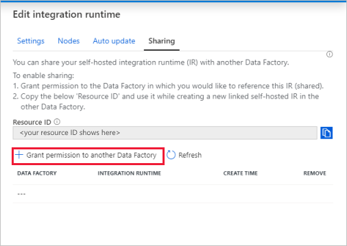
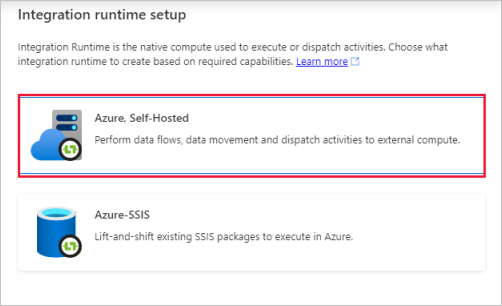
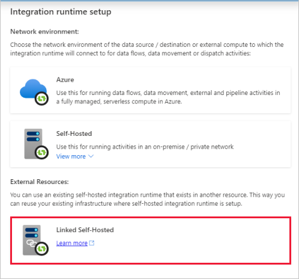
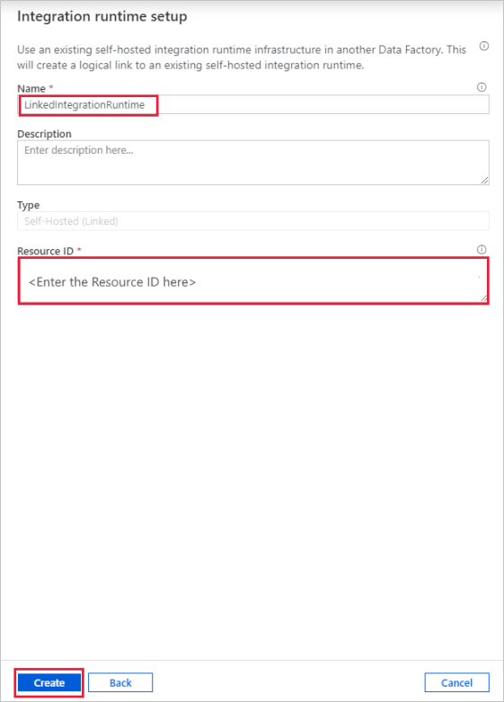
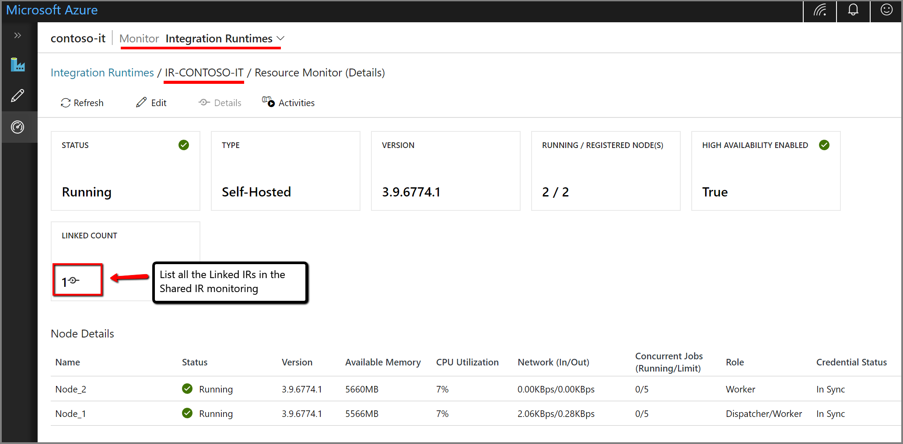
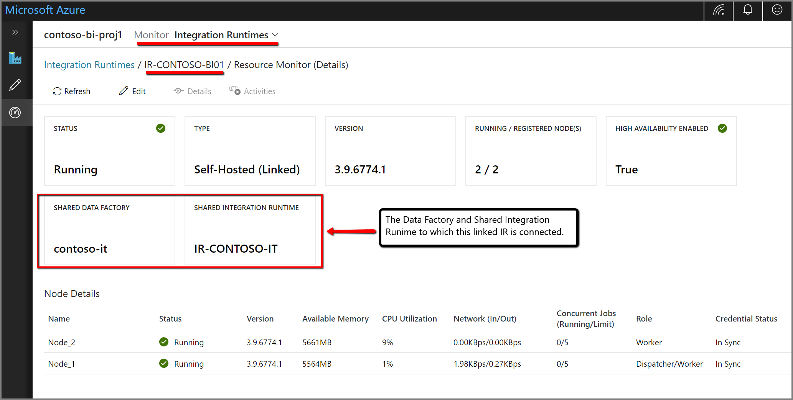

# Create a shared self-hosted integration runtime in Azure Data Factory

[!INCLUDE[appliesto-adf-xxx-md](includes/appliesto-adf-xxx-md.md)]

This guide shows you how to create a shared self-hosted integration runtime in Azure Data Factory. Then you can use the shared self-hosted integration runtime in another data factory.

## Create a shared self-hosted integration runtime in Azure Data Factory

You can reuse an existing self-hosted integration runtime infrastructure that you already set up in a data factory. This reuse lets you create a linked self-hosted integration runtime in a different data factory by referencing an existing shared self-hosted IR.

To see an introduction and demonstration of this feature, watch the following 12-minute video:

> [!VIDEO https://channel9.msdn.com/Shows/Azure-Friday/Hybrid-data-movement-across-multiple-Azure-Data-Factories/player]

### Terminology

- **Shared IR**: An original self-hosted IR that runs on a physical infrastructure.  
- **Linked IR**: An IR that references another shared IR. The linked IR is a logical IR and uses the infrastructure of another shared self-hosted IR.

## Create a shared self-hosted IR using Azure Data Factory UI

To create a shared self-hosted IR using Azure Data Factory UI, you can take following steps:

1. In the self-hosted IR to be shared, select **Grant permission to another Data factory** and in the "Integration runtime setup" page, select the Data factory in which you want to create the linked IR.
      
      
    
2. Note and copy the above "Resource ID" of the self-hosted IR to be shared.
         
3. In the data factory to which the permissions were granted, create a new self-hosted IR (linked) and enter the resource ID.
      
    
   
     

    

## Create a shared self-hosted IR using Azure PowerShell

To create a shared self-hosted IR using Azure PowerShell, you can take following steps: 
1. Create a data factory. 
1. Create a self-hosted integration runtime.
1. Share the self-hosted integration runtime with other data factories.
1. Create a linked integration runtime.
1. Revoke the sharing.

### Prerequisites 

[!INCLUDE [updated-for-az](../../includes/updated-for-az.md)]

- **Azure subscription**. If you don't have an Azure subscription, [create a free account](https://azure.microsoft.com/free/) before you begin. 

- **Azure PowerShell**. Follow the instructions in [Install Azure PowerShell on Windows with PowerShellGet](/powershell/azure/install-az-ps). You use PowerShell to run a script to create a self-hosted integration runtime that can be shared with other data factories. 

> [!NOTE]  
> For a list of Azure regions in which Data Factory is currently available, select the regions that interest you on  [Products available by region](https://azure.microsoft.com/global-infrastructure/services/?products=data-factory).

### Create a data factory

1. Launch the Windows PowerShell Integrated Scripting Environment (ISE).

1. Create variables. Copy and paste the following script. Replace the variables, such as **SubscriptionName** and **ResourceGroupName**, with actual values: 

    ```powershell
    # If input contains a PSH special character, e.g. "$", precede it with the escape character "`" like "`$". 
    $SubscriptionName = "[Azure subscription name]" 
    $ResourceGroupName = "[Azure resource group name]" 
    $DataFactoryLocation = "EastUS" 

    # Shared Self-hosted integration runtime information. This is a Data Factory compute resource for running any activities 
    # Data factory name. Must be globally unique 
    $SharedDataFactoryName = "[Shared Data factory name]" 
    $SharedIntegrationRuntimeName = "[Shared Integration Runtime Name]" 
    $SharedIntegrationRuntimeDescription = "[Description for Shared Integration Runtime]"

    # Linked integration runtime information. This is a Data Factory compute resource for running any activities
    # Data factory name. Must be globally unique
    $LinkedDataFactoryName = "[Linked Data factory name]"
    $LinkedIntegrationRuntimeName = "[Linked Integration Runtime Name]"
    $LinkedIntegrationRuntimeDescription = "[Description for Linked Integration Runtime]"
    ```

1. Sign in and select a subscription. Add the following code to the script to sign in and select your Azure subscription:

    ```powershell
    Connect-AzAccount
    Select-AzSubscription -SubscriptionName $SubscriptionName
    ```

1. Create a resource group and a data factory.

    > [!NOTE]  
    > This step is optional. If you already have a data factory, skip this step. 

    Create an [Azure resource group](../azure-resource-manager/management/overview.md) by using the [New-AzResourceGroup](/powershell/module/az.resources/new-azresourcegroup) command. A resource group is a logical container into which Azure resources are deployed and managed as a group. The following example creates a resource group named `myResourceGroup` in the WestEurope location: 

    ```powershell
    New-AzResourceGroup -Location $DataFactoryLocation -Name $ResourceGroupName
    ```

    Run the following command to create a data factory: 

    ```powershell
    Set-AzDataFactoryV2 -ResourceGroupName $ResourceGroupName `
                             -Location $DataFactoryLocation `
                             -Name $SharedDataFactoryName
    ```

### Create a self-hosted integration runtime

> [!NOTE]  
> This step is optional. If you already have the self-hosted integration runtime that you want to share with other data factories, skip this step.

Run the following command to create a self-hosted integration runtime:

```powershell
$SharedIR = Set-AzDataFactoryV2IntegrationRuntime `
    -ResourceGroupName $ResourceGroupName `
    -DataFactoryName $SharedDataFactoryName `
    -Name $SharedIntegrationRuntimeName `
    -Type SelfHosted `
    -Description $SharedIntegrationRuntimeDescription
```

#### Get the integration runtime authentication key and register a node

Run the following command to get the authentication key for the self-hosted integration runtime:

```powershell
Get-AzDataFactoryV2IntegrationRuntimeKey `
    -ResourceGroupName $ResourceGroupName `
    -DataFactoryName $SharedDataFactoryName `
    -Name $SharedIntegrationRuntimeName
```

The response contains the authentication key for this self-hosted integration runtime. You use this key when you register the integration runtime node.

#### Install and register the self-hosted integration runtime

1. Download the self-hosted integration runtime installer from [Azure Data Factory Integration Runtime](https://aka.ms/dmg).

2. Run the installer to install the self-hosted integration on a local computer.

3. Register the new self-hosted integration with the authentication key that you retrieved in a previous step.

### Share the self-hosted integration runtime with another data factory

#### Create another data factory

> [!NOTE]  
> This step is optional. If you already have the data factory that you want to share with, skip this step. But in order to add or remove role assignments to other data factory, you must have `Microsoft.Authorization/roleAssignments/write` and `Microsoft.Authorization/roleAssignments/delete` permissions, such as [User Access Administrator](../role-based-access-control/built-in-roles.md#user-access-administrator) or [Owner](../role-based-access-control/built-in-roles.md#owner).

```powershell
$factory = Set-AzDataFactoryV2 -ResourceGroupName $ResourceGroupName `
    -Location $DataFactoryLocation `
    -Name $LinkedDataFactoryName
```
#### Grant permission

Grant permission to the data factory that needs to access the self-hosted integration runtime you created and registered.

> [!IMPORTANT]  
> Do not skip this step!

```powershell
New-AzRoleAssignment `
    -ObjectId $factory.Identity.PrincipalId ` #MSI of the Data Factory with which it needs to be shared
    -RoleDefinitionName 'Contributor' `
    -Scope $SharedIR.Id
```

### Create a linked self-hosted integration runtime

Run the following command to create a linked self-hosted integration runtime:

```powershell
Set-AzDataFactoryV2IntegrationRuntime `
    -ResourceGroupName $ResourceGroupName `
    -DataFactoryName $LinkedDataFactoryName `
    -Name $LinkedIntegrationRuntimeName `
    -Type SelfHosted `
    -SharedIntegrationRuntimeResourceId $SharedIR.Id `
    -Description $LinkedIntegrationRuntimeDescription
```

Now you can use this linked integration runtime in any linked service. The linked integration runtime uses the shared integration runtime to run activities.

### Revoke integration runtime sharing from a data factory

To revoke the access of a data factory from the shared integration runtime, run the following command:

```powershell
Remove-AzRoleAssignment `
    -ObjectId $factory.Identity.PrincipalId `
    -RoleDefinitionName 'Contributor' `
    -Scope $SharedIR.Id
```

To remove the existing linked integration runtime, run the following command against the shared integration runtime:

```powershell
Remove-AzDataFactoryV2IntegrationRuntime `
    -ResourceGroupName $ResourceGroupName `
    -DataFactoryName $SharedDataFactoryName `
    -Name $SharedIntegrationRuntimeName `
    -Links `
    -LinkedDataFactoryName $LinkedDataFactoryName
```

### Monitoring

#### Shared IR




#### Linked IR





### Known limitations of self-hosted IR sharing

* The data factory in which a linked IR is created must have an [Managed Identity](../active-directory/managed-identities-azure-resources/overview.md). By default, the data factories created in the Azure portal or PowerShell cmdlets have an implicitly created Managed Identity. But when a data factory is created through an Azure Resource Manager template or SDK, you must set the **Identity** property explicitly. This setting ensures that Resource Manager creates a data factory that contains a Managed Identity.

* The Data Factory .NET SDK that supports this feature must be version 1.1.0 or later.

* To grant permission, you need the Owner role or the inherited Owner role in the data factory where the shared IR exists.

* The sharing feature works only for data factories within the same Azure AD tenant.

* For Azure AD [guest users](../active-directory/governance/manage-guest-access-with-access-reviews.md), the search functionality in the UI, which lists all data factories by using a search keyword, doesn't work. But as long as the guest user is the owner of the data factory, you can share the IR without the search functionality. For the Managed Identity of the data factory that needs to share the IR, enter that Managed Identity in the **Assign Permission** box and select **Add** in the Data Factory UI.

  > [!NOTE]
  > This feature is available only in Data Factory V2.


### Next steps

- Review [integration runtime concepts in Azure Data Factory](./concepts-integration-runtime.md).

- Learn how to [create a self-hosted integration runtime in the Azure portal](./create-self-hosted-integration-runtime.md).