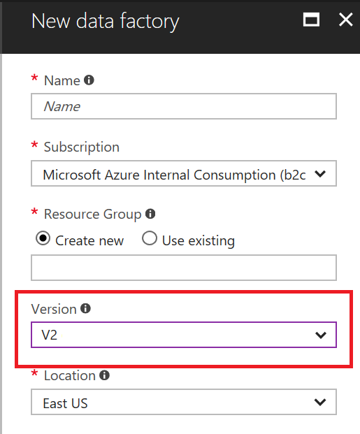
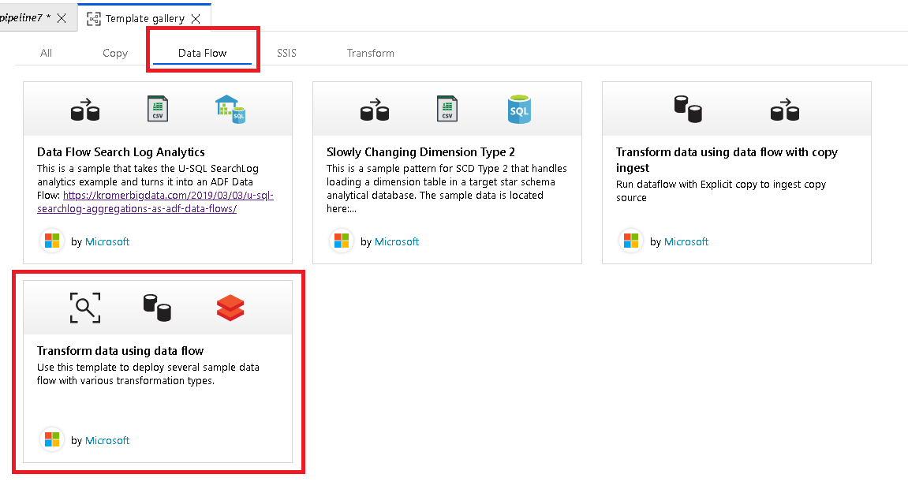
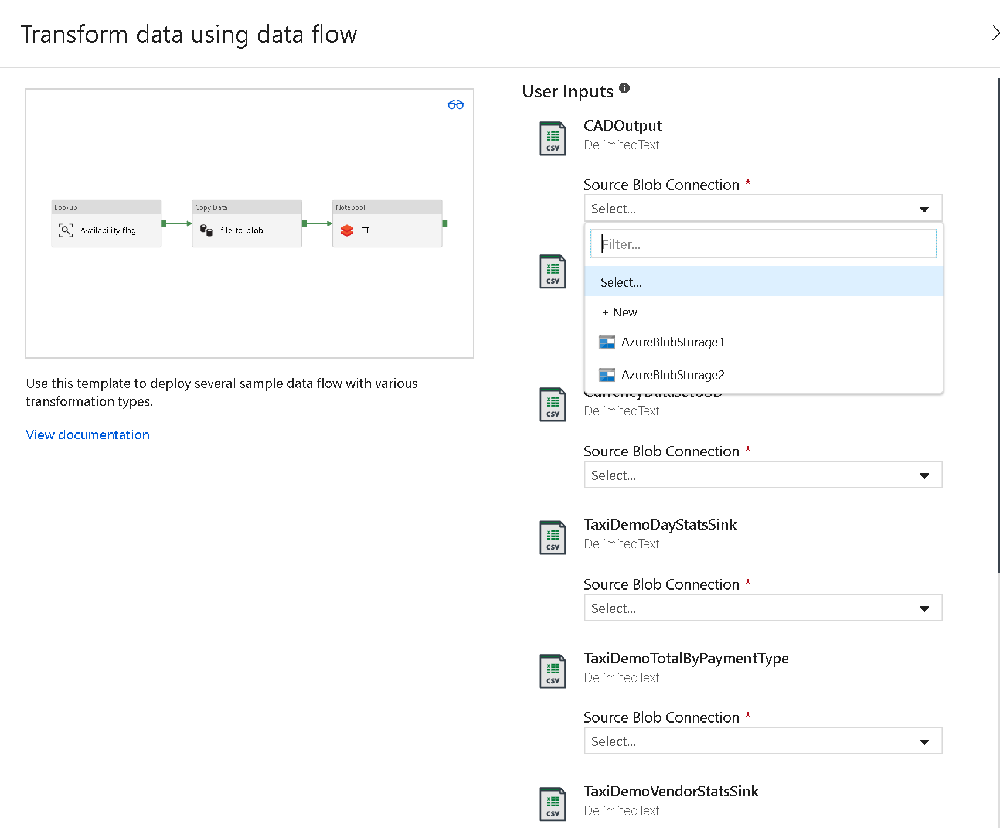
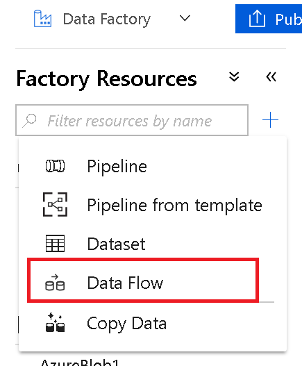

# Create Azure Data Factory Data Flow

Mapping Data Flows in ADF provide a way to transform data at scale without any coding required. You can design a data transformation job in the data flow designer by constructing a series of transformations. Start with any number of source transformations followed by data transformation steps. Then, complete your data flow with sink to land your results in a destination.

Get started by first creating a new V2 Data Factory from the Azure portal. After creating your new factory, click on the "Author & Monitor" tile to launch the Data Factory UI.

Once you are in the Data Factory UI, you can use sample Data Flows. The samples are available from the ADF Template Gallery. In ADF, create "Pipeline from Template" and select the Data Flow category from the template gallery.

You will be prompted to enter your Azure Blob Storage account information.

[The data used for these samples can be found here](https://github.com/kromerm/adfdataflowdocs/tree/master/sampledata). Download the sample data and store the files in your Azure Blob storage accounts so that you can execute the samples.

## Create new data flow

Use the Create Resource "plus sign" button in the ADF UI to create Data Flows.

## Next steps

Begin building your data transformation with a [source transformation](data-flow-source.md).
