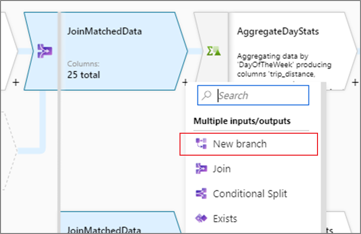
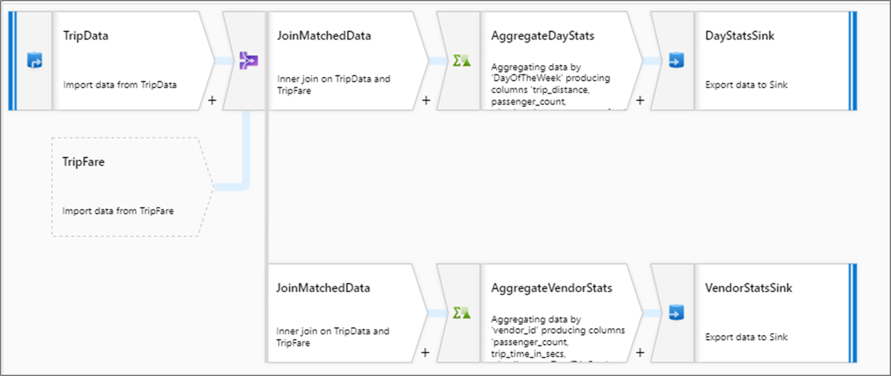

# Creating a new branch in mapping data flow

[!INCLUDE[appliesto-adf-xxx-md](includes/appliesto-adf-xxx-md.md)]

Add a new branch to do multiple sets of operations and transformations against the same data stream. Adding a new branch is useful when you want to use the same source to for multiple sinks or for self-joining data together.

A new branch can be added from the transformation list similar to other transformations. **New Branch** will only be available as an action when there's an existing transformation following the transformation you're attempting to branch.

In the below example, the data flow is reading taxi trip data. Output aggregated by both day and vendor is required. Instead of creating two separate data flows that read from the same source, a new branch can be added. This way both aggregations can be executed as part of the same data flow. 

