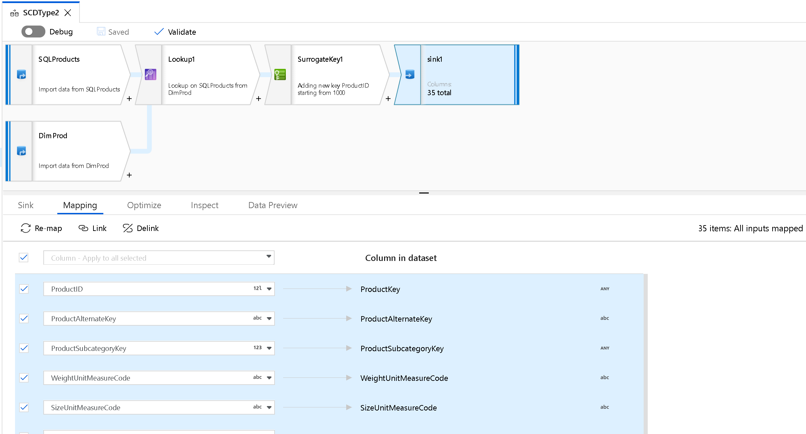
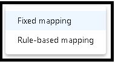
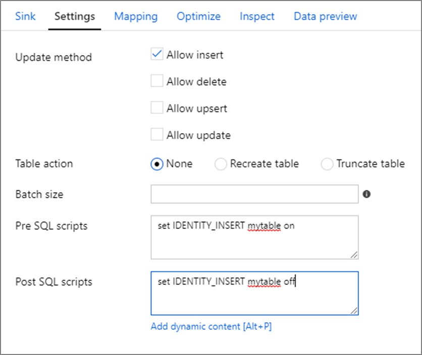
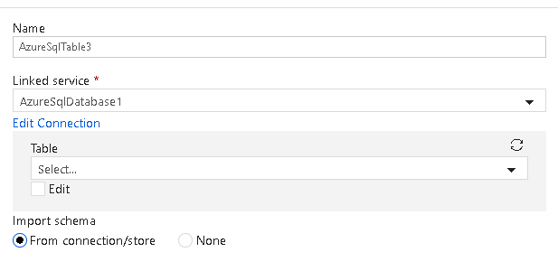

# Sink transformation for a data flow


After you transform your data flow, you can sink the data into a destination dataset. In the sink transformation, choose a dataset definition for the destination output data. You can have as many sink transformations as your data flow requires.

To account for schema drift and changes in incoming data, sink the output data to a folder without a defined schema in the output dataset. You can also account for column changes in your sources by selecting **Allow schema drift** in the source. Then automap all fields in the sink.


To sink all incoming fields, turn on **Auto Map**. To choose the fields to sink to the destination, or to change the names of the fields at the destination, turn off **Auto Map**. Then open the **Mapping** tab to map output fields.


## Output 
For Azure Blob storage or Data Lake Storage sink types, output the transformed data into a folder. Spark generates partitioned output data files based on the partitioning scheme that the sink transformation uses. 

You can set the partitioning scheme from the **Optimize** tab. If you want Data Factory to merge your output into a single file, select **Single partition**.


## Field mapping
On the **Mapping** tab of your sink transformation, you can map the incoming columns on the left to the destinations on the right. When you sink data flows to files, Data Factory will always write new files to a folder. When you map to a database dataset, you will choose database table operation options to insert, update, upsert, or delete.


In the mapping table, you can multiselect to link multiple columns, delink multiple columns, or map multiple rows to the same column name.

To always map the incoming set of fields to a target as they are and to fully accept flexible schema definitions, select **Allow schema drift**.



To reset your column mappings, select **Re-map**.


Select **Validate schema** to fail the sink if the schema changes.

Select **Clear the folder** to truncate the contents of the sink folder before writing the destination files in that target folder.

## Fixed mapping vs. rule-based mapping
When you turn off auto-mapping, you will have the option to add either column-based mapping (fixed mapping) or rule-based mapping. Rule-based mapping will allow you to write expressions with pattern matching while fixed mapping will map logical and physical column names.



When you choose rule-based mapping, you are instructing ADF to evaluate your matching expression to match incoming pattern rules and define the outgoing field names. You may add any combination of both field and rule-based mappings. Field names are then generated at runtime by ADF based on incoming metadata from the source. You can view the names of the generated fields during debug and using the data preview pane.

Details on pattern matching are at [Column Pattern documentation](concepts-data-flow-column-pattern.md).

You can also enter regular expression patterns when using rule based matching by expanding the row and entering a regular expression next to "Name Matches:".


A very basic common example for a rule-based mapping vs. fixed mapping is the case where you want to map all incoming fields to the same name in your target. In the case of fixed mappings, you would list each individual column in the table. For rule-based mapping, you would have a single rule that maps all fields using ```true()``` to the same incoming field name represented by ```$$```.

### Sink association with dataset

The dataset that you select for your sink may or may not have a schema defined in the dataset definition. If it does not have a defined schema, then you must allow schema drift. When you defined a fixed mapping, the logical-to-physical name mapping will persist in the sink transformation. If you change the schema definition of the dataset, then you will potentially break your sink mapping. To avoid this, use rule-based mapping. Rule-based mappings are generalized, meaning that schema changes on your dataset will not break the mapping.

## File name options

Set up file naming: 

   * **Default**: Allow Spark to name files based on PART defaults.
   * **Pattern**: Enter a pattern for your output files. For example, **loans[n]** will create loans1.csv, loans2.csv, and so on.
   * **Per partition**: Enter one file name per partition.
   * **As data in column**: Set the output file to the value of a column.
   * **Output to a single file**: With this option, ADF will combine the partitioned output files into a single named file. To use this option, your dataset should resolve to a folder name. Also, please be aware that this merge operation can possibly fail based upon node size.

> [!NOTE]
> File operations start only when you're running the Execute Data Flow activity. They don't start in Data Flow Debug mode.

## Database options

Choose database settings:


* **Update method**: The default is to allow inserts. Clear **Allow insert** if you want to stop inserting new rows from your source. To update, upsert, or delete rows, first add an alter-row transformation to tag rows for those actions. 
* **Recreate table**: Drop or create your target table before the data flow finishes.
* **Truncate table**: Remove all rows from your target table before the data flow finishes.
* **Batch size**: Enter a number to bucket writes into chunks. Use this option for large data loads. 
* **Enable staging**: Use PolyBase when you load Azure Data Warehouse as your sink dataset.
* **Pre and Post SQL scripts**: Enter multi-line SQL scripts that will execute before (pre-processing) and after (post-processing) data is written to your Sink database



> [!NOTE]
> In Data Flow, you can direct Data Factory to create a new table definition in your target database. To create the table definition, set a dataset in the sink transformation that has a new table name. In the SQL dataset, below the table name, select **Edit** and enter a new table name. Then, in the sink transformation, turn on **Allow schema drift**. Set **Import schema** to **None**.



> [!NOTE]
> When you update or delete rows in your database sink, you must set the key column. This setting allows the alter-row transformation to determine the unique row in the data movement library (DML).

## Next steps
Now that you've created your data flow, add a [Data Flow activity to your pipeline](concepts-data-flow-overview.md).
