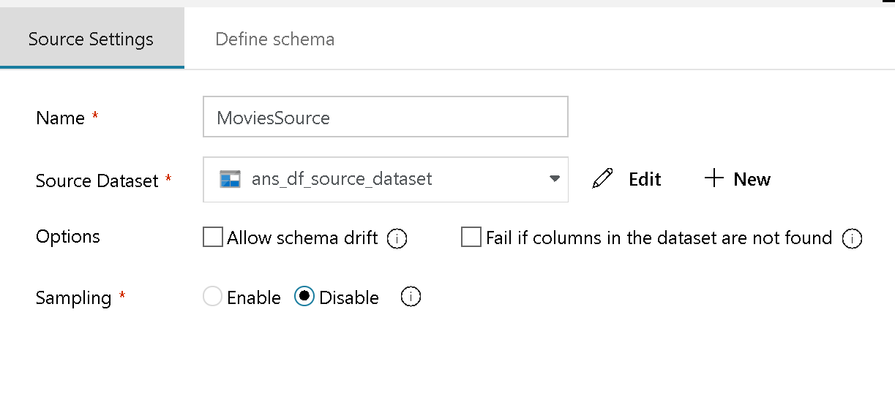
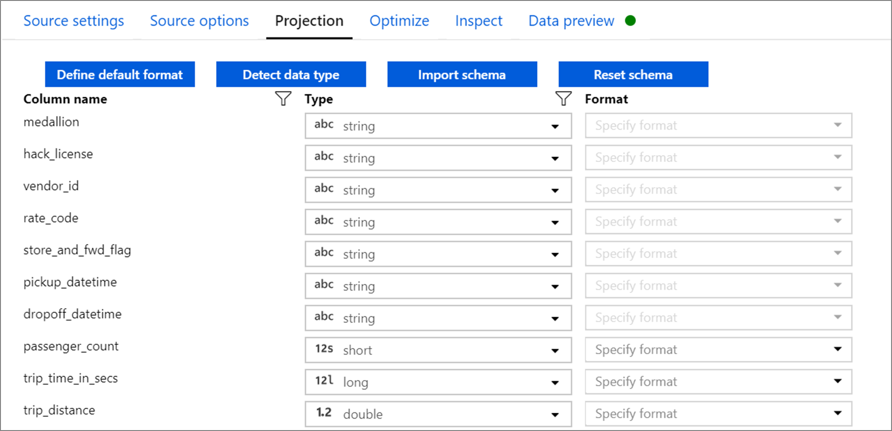
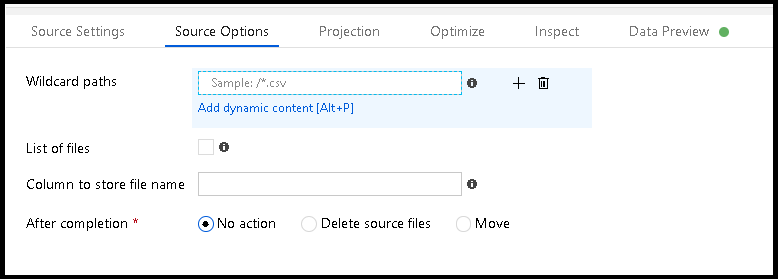

# Source transformation for Mapping Data Flow 

[!INCLUDE [notes](../../includes/data-factory-data-flow-preview.md)]

A source transformation configures your data source for the data flow. A data flow can include more than one source transformation. When designing data flows, always begin with a source transformation.

Every data flow requires at least one source transformation. Add as many sources as necessary to complete your data transformations. You can join those sources together with a join transformation or a union transformation.

> [!NOTE]
> When you debug your data flow, data is read from the source by using the sampling setting or the debug source limits. To write data to a sink, you must run your data flow from a pipeline Data Flow activity. 



Associate your Data Flow source transformation with exactly one Data Factory dataset. The dataset defines the shape and location of the data you want to write to or read from. You can use wildcards and file lists in your source to work with more than one file at a time.

## Data Flow staging areas

Data Flow works with *staging* datasets that are all in Azure. Use these datasets for staging when you're transforming your data. 

Data Factory has access to nearly 80 native connectors. To include data from those other sources in your data flow, use the Copy Activity tool to stage that data in one of the Data Flow dataset staging areas.

## Options

Choose schema and sampling options for your data.

### Allow schema drift
Select **Allow schema drift** if the source columns will change often. This setting allows all incoming source fields to flow through the transformations to the sink.

### Validate schema

If the incoming version of the source data doesn't match the defined schema, the data flow will fail to run.


### Sample the data
Enable **Sampling** to limit the number of rows from your source. Use this setting when you test or sample data from your source for debugging purposes.

## Define schema

When your source files aren't strongly typed (for example, flat files rather than Parquet files), define the data types for each field here in the source transformation.  


You can later change the column names in a select transformation. Use a derived-column transformation to change the data types. For strongly typed sources, you can modify the data types in a later select transformation. 


### Optimize the source transformation

On the **Optimize** tab for the source transformation, you might see a **Source** partition type. This option is available only when your source is Azure SQL Database. This is because Data Factory tries to make connections parallel to run large queries against your SQL Database source.


You don't have to partition data on your SQL Database source, but partitions are useful for large queries. You can base your partition on a column or a query.

### Use a column to partition data

From your source table, select a column to partition on. Also set the number of partitions.

### Use a query to partition data

You can choose to partition the connections based on a query. Simply enter the contents of a WHERE predicate. For example, enter year > 1980.

## Source file management

Choose settings to manage files in your source. 


* **Wildcard path**: From your source folder, choose a series of files that match a pattern. This setting overrides any file in your dataset definition.

Wildcard examples:

* ```*``` Represents any set of characters
* ```**``` Represents recursive directory nesting
* ```?``` Replaces one character
* ```[]``` Matches one of more characters in the brackets

* ```/data/sales/**/*.csv``` Gets all csv files under /data/sales
* ```/data/sales/20??/**``` Gets all files in the 20th century
* ```/data/sales/2004/*/12/[XY]1?.csv``` Gets all csv files in 2004 in December starting with X or Y prefixed by a 2-digit number

Container has to be specified in the dataset. Your wildcard path must therefore also include your folder path from the root folder.

* **List of files**: This is a file set. Create a text file that includes a list of relative path files to process. Point to this text file.
* **Column to store file name**: Store the name of the source file in a column in your data. Enter a new name here to store the file name string.
* **After completion**: Choose to do nothing with the source file after the data flow runs, delete the source file, or move the source file. The paths for the move are relative.

To move source files to another location post-processing, first select "Move" for file operation. Then, set the "from" directory. If you are not using any wildcards for your path, then the "from" setting will be the same folder as your source folder.

If you have a wildcarded source path, ex:

```/data/sales/20??/**/*.csv```

You can specify "from" as

```/data/sales```

And "to" as

```/backup/priorSales```

In this case, all subdirectories under /data/sales which were sourced are moved relative to /backup/priorSales.

### SQL datasets

If your source is in SQL Database or SQL Data Warehouse, you have additional options for source file management.

* **Query**: Enter a SQL query for your source. This setting overrides any table that you've chosen in the dataset. Note that **Order By** clauses aren't supported here, but you can set a full SELECT FROM statement. You can also use user-defined table functions. **select * from udfGetData()** is a UDF in SQL that returns a table. This query will produce a source table that you can use in your data flow.
* **Batch size**: Enter a batch size to chunk large data into reads.
* **Isolation Level**: Default for SQL sources in ADF Mapping Data Flows is Read Uncommitted. You can change the isolation level here to one of these values:
* Read Committed
* Read Uncommitted
* Repeatable Read
* Serializable
* None (ignore isolation level)


> [!NOTE]
> File operations run only when you start the data flow from a pipeline run (a pipeline debug or execution run) that uses the Execute Data Flow activity in a pipeline. File operations *do not* run in Data Flow debug mode.

### Projection

Like schemas in datasets, the projection in a source defines the data columns, types, and formats from the source data. 



If your text file has no defined schema, select **Detect data type** so that Data Factory will sample and infer the data types. Select **Define default format** to autodetect the default data formats. 

You can modify the column data types in a later derived-column transformation. Use a select transformation to modify the column names.


### Add dynamic content

When you click inside of fields in the setting panel, you will see a hyperlink for "Add dynamic content". When you click here, you will launch the Expression Builder. This is where you can set values for settings dynamically using expressions, static literal values, or parameters.



## Next steps

Begin building a [derived-column transformation](data-flow-derived-column.md) and a [select transformation](data-flow-select.md).
