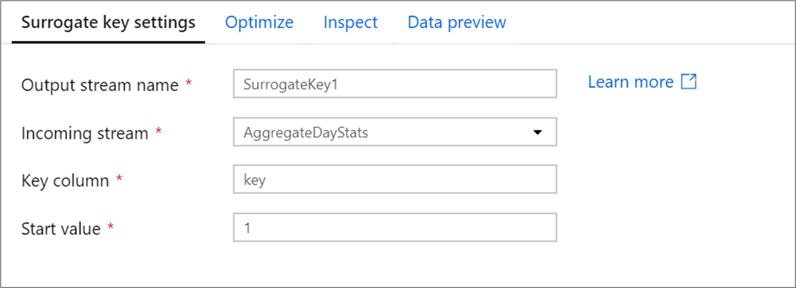
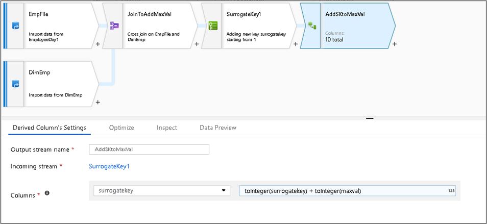
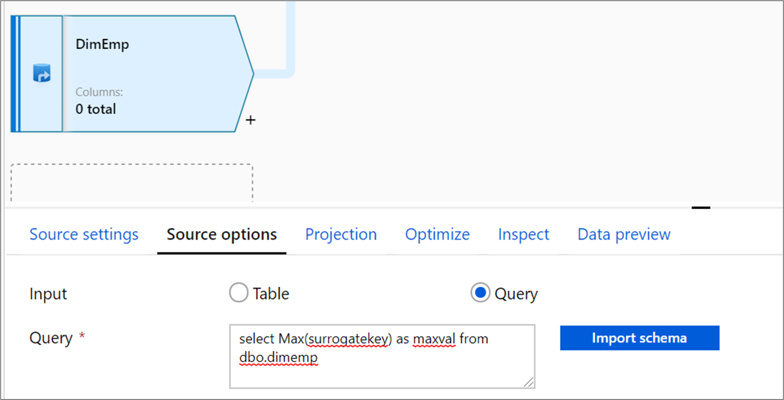
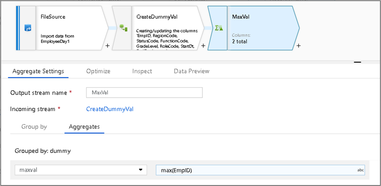
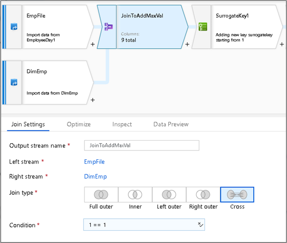

# Mapping Data Flow Surrogate Key Transformation

Use the Surrogate Key Transformation to add an incrementing non-business arbitrary key value to your data flow rowset. This is useful when designing dimension tables in a star schema analytical data model where each member in your dimension tables needs to have a unique key that is a non-business key, part of the Kimball DW methodology.

"Key Column" is the name that you will give to your new surrogate key column.

"Start Value" is the beginning point of the incremental value.

## Increment keys from existing sources

If you'd like to start your sequence from a value that exists in a Source, you can use a Derived Column transformation immediately following your Surrogate Key transformation and add the two values together:

To seed the key value with the previous max, there are two techniques that you can use:

### Database sources

Use the "Query" option to select MAX() from your source using the Source transformation:

### File sources

If your previous max value is in a file, you can use your Source transformation together with an Aggregate transformation and use the MAX() expression function to get the previous max value:

In both cases, you must Join your incoming new data together with your source that contains the previous max value:

## Next steps

These examples use the [Join](data-flow-join.md) and [Derived Column](data-flow-derived-column.md) transformations.
