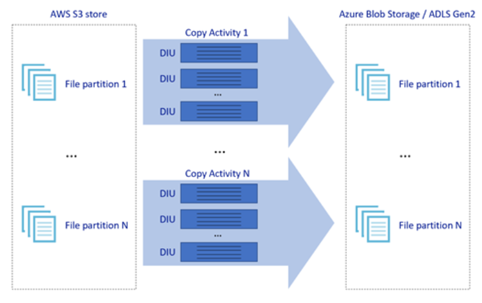
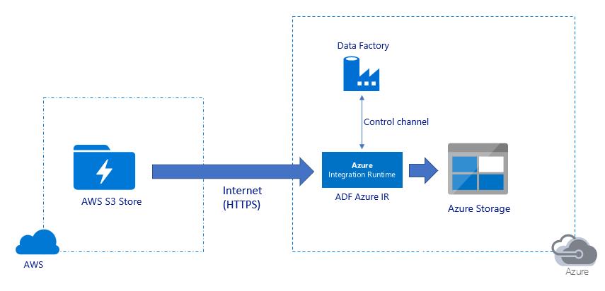
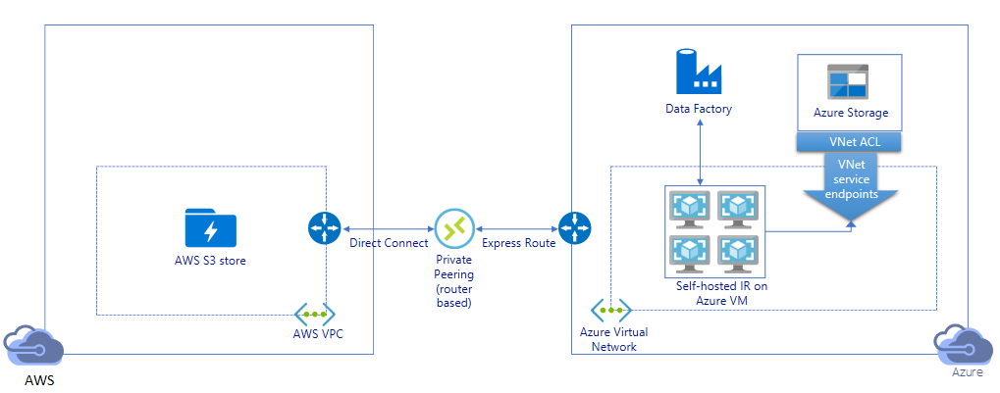
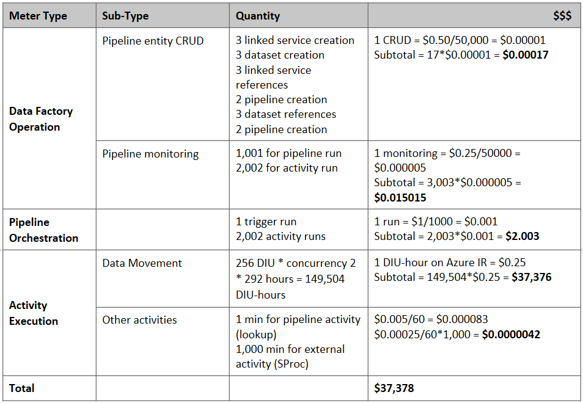

# Use Azure Data Factory to migrate data from Amazon S3 to Azure Storage 

[!INCLUDE[appliesto-adf-xxx-md](includes/appliesto-adf-xxx-md.md)]

Azure Data Factory provides a performant, robust, and cost-effective mechanism to migrate data at scale from Amazon S3 to Azure Blob Storage or Azure Data Lake Storage Gen2.  This article provides the following information for data engineers and developers: 

> [!div class="checklist"]
> * Performance​ 
> * Copy resilience
> * Network security
> * High-level solution architecture 
> * Implementation best practices  

## Performance

ADF offers a serverless architecture that allows parallelism at different levels, which allows developers to build pipelines to fully utilize your network bandwidth as well as storage IOPS and bandwidth to maximize data movement throughput for your environment. 

Customers have successfully migrated petabytes of data consisting of hundreds of millions of files from Amazon S3 to Azure Blob Storage, with a sustained throughput of 2 GBps and higher. 

The picture above illustrates how you can achieve great data movement speeds through different levels of parallelism:
 
- A single copy activity can take advantage of scalable compute resources: when using Azure Integration Runtime, you can specify [up to 256 DIUs](https://docs.microsoft.com/azure/data-factory/copy-activity-performance#data-integration-units) for each copy activity in a serverless manner; when using self-hosted Integration Runtime, you can manually scale up the machine or scale out to multiple machines ([up to 4 nodes](https://docs.microsoft.com/azure/data-factory/create-self-hosted-integration-runtime#high-availability-and-scalability)), and a single copy activity will partition its file set across all nodes. 
- A single copy activity reads from and writes to the data store using multiple threads. 
- ADF control flow can start multiple copy activities in parallel, for example using [For Each loop](https://docs.microsoft.com/azure/data-factory/control-flow-for-each-activity). 

## Resilience

Within a single copy activity run, ADF has built-in retry mechanism so it can handle a certain level of transient failures in the data stores or in the underlying network. 

When doing binary copying from S3 to Blob and from S3 to ADLS Gen2, ADF automatically performs checkpointing.  If a copy activity run has failed or timed out, on a subsequent retry, the copy resumes from the last failure point instead of starting from the beginning. 

## Network security 

By default, ADF transfers data from Amazon S3 to Azure Blob Storage or Azure Data Lake Storage Gen2 using encrypted connection over HTTPS protocol.  HTTPS provides data encryption in transit and prevents eavesdropping and man-in-the-middle attacks. 

Alternatively, if you do not want data to be transferred over public Internet, you can achieve higher security by transferring data over a private peering link between AWS Direct Connect and Azure Express Route.  Refer to the solution architecture below on how this can be achieved. 

## Solution architecture

Migrate data over public Internet:

- In this architecture, data is transferred securely using HTTPS over public Internet. 
- Both the source Amazon S3 as well as the destination Azure Blob Storage or Azure Data Lake Storage Gen2 are configured to allow traffic from all network IP addresses.  Refer to the second architecture below on how you can restrict network access to specific IP range. 
- You can easily scale up the amount of horsepower in serverless manner to fully utilize your network and storage bandwidth so that you can get the best throughput for your environment. 
- Both initial snapshot migration and delta data migration can be achieved using this architecture. 

Migrate data over private link: 

- In this architecture, data migration is done over a private peering link between AWS Direct Connect and Azure Express Route such that data never traverses over public Internet.  It requires use of AWS VPC and Azure Virtual network. 
- You need to install ADF self-hosted integration runtime on a Windows VM within your Azure virtual network to achieve this architecture.  You can manually scale up your self-hosted IR VMs or scale out to multiple VMs (up to 4 nodes) to fully utilize your network and storage IOPS/bandwidth. 
- If it is acceptable to transfer data over HTTPS but you want to lock down network access to source S3 to a specific IP range, you can adopt a variation of this architecture by removing AWS VPC and replacing private link with HTTPS.  You will want to keep Azure Virtual and self-hosted IR on Azure VM so you can have a static publicly routable IP for whitelisting purpose. 
- Both initial snapshot data migration and delta data migration can be achieved using this architecture. 

## Implementation best practices 

### Authentication and credential management 

- To authenticate to Amazon S3 account, you must use [access key for IAM account](https://docs.microsoft.com/azure/data-factory/connector-amazon-simple-storage-service#linked-service-properties). 
- Multiple authentication types are supported to connect to Azure Blob Storage.  Use of [managed identities for Azure resources](https://docs.microsoft.com/azure/data-factory/connector-azure-blob-storage#managed-identity) is highly recommended: built on top of an automatically managed ADF identify in Azure AD, it allows you to configure pipelines without supplying credentials in Linked Service definition.  Alternatively, you can authenticate to Azure Blob Storage using [Service Principal](https://docs.microsoft.com/azure/data-factory/connector-azure-blob-storage#service-principal-authentication), [shared access signature](https://docs.microsoft.com/azure/data-factory/connector-azure-blob-storage#shared-access-signature-authentication), or [storage account key](https://docs.microsoft.com/azure/data-factory/connector-azure-blob-storage#account-key-authentication). 
- Multiple authentication types are also supported to connect to Azure Data Lake Storage Gen2.  Use of [managed identities for Azure resources](https://docs.microsoft.com/azure/data-factory/connector-azure-data-lake-storage#managed-identity) is highly recommended, although [service principal](https://docs.microsoft.com/azure/data-factory/connector-azure-data-lake-storage#service-principal-authentication) or [storage account key](https://docs.microsoft.com/azure/data-factory/connector-azure-data-lake-storage#account-key-authentication) can also be used. 
- When you are not using managed identities for Azure resources, [storing the credentials in Azure Key Vault](https://docs.microsoft.com/azure/data-factory/store-credentials-in-key-vault) is highly recommended to make it easier to centrally manage and rotate keys without modifying ADF linked services.  This is also one of the [best practices for CI/CD](https://docs.microsoft.com/azure/data-factory/continuous-integration-deployment#best-practices-for-cicd). 

### Initial snapshot data migration 

Data partition is recommended especially when migrating more than 100 TB of data.  To partition the data, leverage the ‘prefix’ setting to filter the folders and files in Amazon S3 by name, and then each ADF copy job can copy one partition at a time.  You can run multiple ADF copy jobs concurrently for better throughput. 

If any of the copy jobs fail due to network or data store transient issue, you can rerun the failed copy job to reload that specific partition again from AWS S3.  All other copy jobs loading other partitions will not be impacted. 

### Delta data migration 

The most performant way to identify new or changed files from AWS S3 is by using time-partitioned naming convention – when your data in AWS S3 has been time partitioned with time slice information in the file or folder name (for example, /yyyy/mm/dd/file.csv), then your pipeline can easily identify which files/folders to copy incrementally. 

Alternatively, If your data in AWS S3 is not time partitioned, ADF can identify new or changed files by their LastModifiedDate.   The way it works is that ADF will scan all the files from AWS S3, and only copy the new and updated file whose last modified timestamp is greater than a certain value.  Be aware that if you have a large number of files in S3, the initial file scanning could take a long time regardless of how many files match the filter condition.  In this case you are suggested to partition the data first, using the same ‘prefix’ setting for initial snapshot migration, so that the file scanning can happen in parallel.  

### For scenarios that require self-hosted Integration runtime on Azure VM 

Whether you are migrating data over private link or you want to allow specific IP range on Amazon S3 firewall, you need to install self-hosted Integration runtime on Azure Windows VM. 

- The recommend configuration to start with for each Azure VM is Standard_D32s_v3 with 32 vCPU and 128-GB memory.  You can keep monitoring CPU and memory utilization of the IR VM during the data migration to see if you need to further scale up the VM for better performance or scale down the VM to save cost. 
- You can also scale out by associating up to 4 VM nodes with a single self-hosted IR.  A single copy job running against a self-hosted IR will automatically partition the file set and leverage all VM nodes to copy the files in parallel.  For high availability, you are recommended to start with 2 VM nodes to avoid single point of failure during the data migration. 

### Rate limiting 

As a best practice, conduct a performance POC with a representative sample dataset, so that you can determine an appropriate partition size. 

Start with a single partition and a single copy activity with default DIU setting.  Gradually increase the DIU setting until you reach the bandwidth limit of your network or IOPS/bandwidth limit of the data stores, or you have reached the max 256 DIU allowed on a single copy activity. 

Next, gradually increase the number of concurrent copy activities until you reach limits of your environment. 

When you encounter throttling errors reported by ADF copy activity, either reduce the concurrency or DIU setting in ADF, or consider increasing the bandwidth/IOPS limits of the network and data stores.  

### Estimating Price 

> [!NOTE]
> This is a hypothetical pricing example.  Your actual pricing depends on the actual throughput in your environment.

Consider the following pipeline constructed for migrating data from S3 to Azure Blob Storage: 

Let us assume the following: 

- Total data volume is 2 PB 
- Migrating data over HTTPS using first solution architecture 
- 2 PB is divided into 1 K partitions and each copy moves one partition 
- Each copy is configured with DIU=256 and achieves 1 GBps throughput 
- ForEach concurrency is set to 2 and aggregate throughput is 2 GBps 
- In total, it takes 292 hours to complete the migration 

Here is the estimated price based on the above assumptions: 

### Additional references 
- [Amazon Simple Storage Service connector](https://docs.microsoft.com/azure/data-factory/connector-amazon-simple-storage-service)
- [Azure Blob Storage connector](https://docs.microsoft.com/azure/data-factory/connector-azure-blob-storage)
- [Azure Data Lake Storage Gen2 connector](https://docs.microsoft.com/azure/data-factory/connector-azure-data-lake-storage)
- [Copy activity performance tuning guide](https://docs.microsoft.com/azure/data-factory/copy-activity-performance)
- [Creating and configuring self-hosted Integration Runtime](https://docs.microsoft.com/azure/data-factory/create-self-hosted-integration-runtime)
- [Self-hosted integration runtime HA and scalability](https://docs.microsoft.com/azure/data-factory/create-self-hosted-integration-runtime#high-availability-and-scalability)
- [Data movement security considerations](https://docs.microsoft.com/azure/data-factory/data-movement-security-considerations)
- [Store credentials in Azure Key Vault](https://docs.microsoft.com/azure/data-factory/store-credentials-in-key-vault)
- [Copy file incrementally based on time partitioned file name](https://docs.microsoft.com/azure/data-factory/tutorial-incremental-copy-partitioned-file-name-copy-data-tool)
- [Copy new and changed files based on LastModifiedDate](https://docs.microsoft.com/azure/data-factory/tutorial-incremental-copy-lastmodified-copy-data-tool)
- [ADF pricing page](https://azure.microsoft.com/pricing/details/data-factory/data-pipeline/)

## Template

Here is the [template](solution-template-migration-s3-azure.md) to start with to migrate petabytes of data consisting of hundreds of millions of files from Amazon S3 to Azure Data Lake Storage Gen2.

## Next steps

- [Copy files from multiple containers with Azure Data Factory](solution-template-copy-files-multiple-containers.md)
