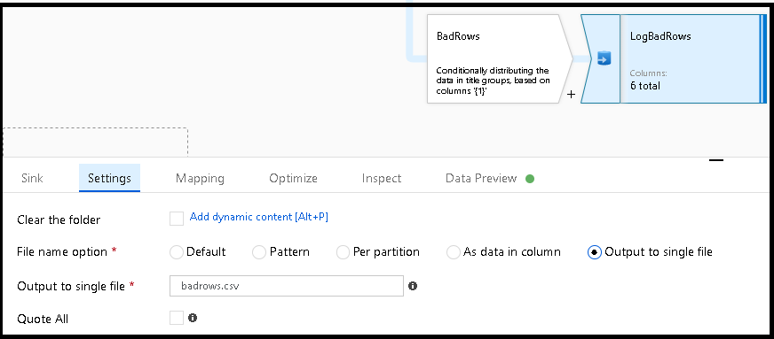

# Handle SQL truncation error rows in Data Factory mapping data flows

[!INCLUDE[appliesto-adf-asa-md](includes/appliesto-adf-asa-md.md)]

A common scenario in Data Factory when using mapping data flows, is to write your transformed data to a database in Azure SQL Database. In this scenario, a common error condition that you must prevent against is possible column truncation. Follow these steps to provide logging of columns that won't fit into a target string column, allowing your data flow to continue in those scenarios.

## Scenario

1. We have a target database table that has an ```nvarchar(5)``` column called "name".

2. Inside of our data flow, we want to map movie titles from our sink to that target "name" column.

    
    
3. The problem is that the movie title won't all fit within a sink column that can only hold 5 characters. When you execute this data flow, you will receive an error like this one: ```"Job failed due to reason: DF-SYS-01 at Sink 'WriteToDatabase': java.sql.BatchUpdateException: String or binary data would be truncated. java.sql.BatchUpdateException: String or binary data would be truncated."```

This video walks through an example of setting-up error row handling logic in your data flow:
> [!VIDEO https://www.microsoft.com/en-us/videoplayer/embed/RE4uOHj]

## How to design around this condition

1. In this scenario, the maximum length of the "name" column is five characters. So, let's add a conditional split transformation that will allow us to log rows with "titles" that are longer than five characters while also allowing the rest of the rows that can fit into that space to write to the database.

    

2. This conditional split transformation defines the maximum length of "title" to be five. Any row that is less than or equal to five will go into the ```GoodRows``` stream. Any row that is larger than five will go into the ```BadRows``` stream.

3. Now we need to log the rows that failed. Add a sink transformation to the ```BadRows``` stream for logging. Here, we'll "auto-map" all of the fields so that we have logging of the complete transaction record. This is a text-delimited CSV file output to a single file in Blob Storage. We'll call the log file "badrows.csv".

    
    
4. The completed data flow is shown below. We are now able to split off error rows to avoid the SQL truncation errors and put those entries into a log file. Meanwhile, successful rows can continue to write to our target database.

    

## Next steps

* Build the rest of your data flow logic by using mapping data flows [transformations](concepts-data-flow-overview.md).
