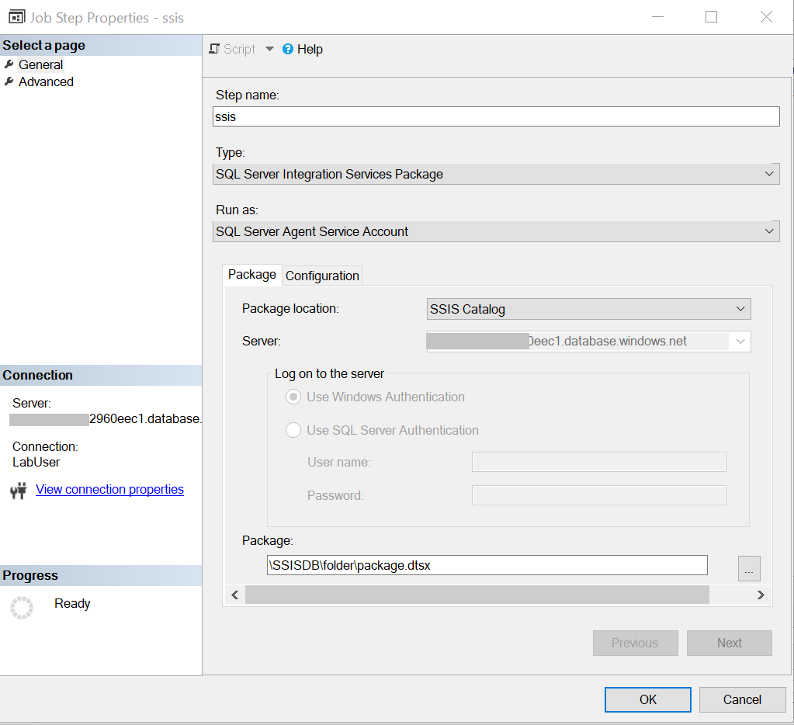
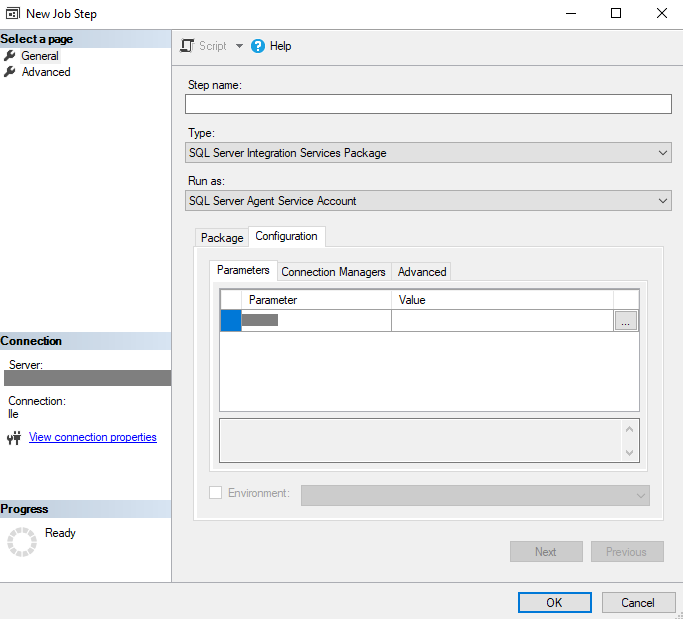
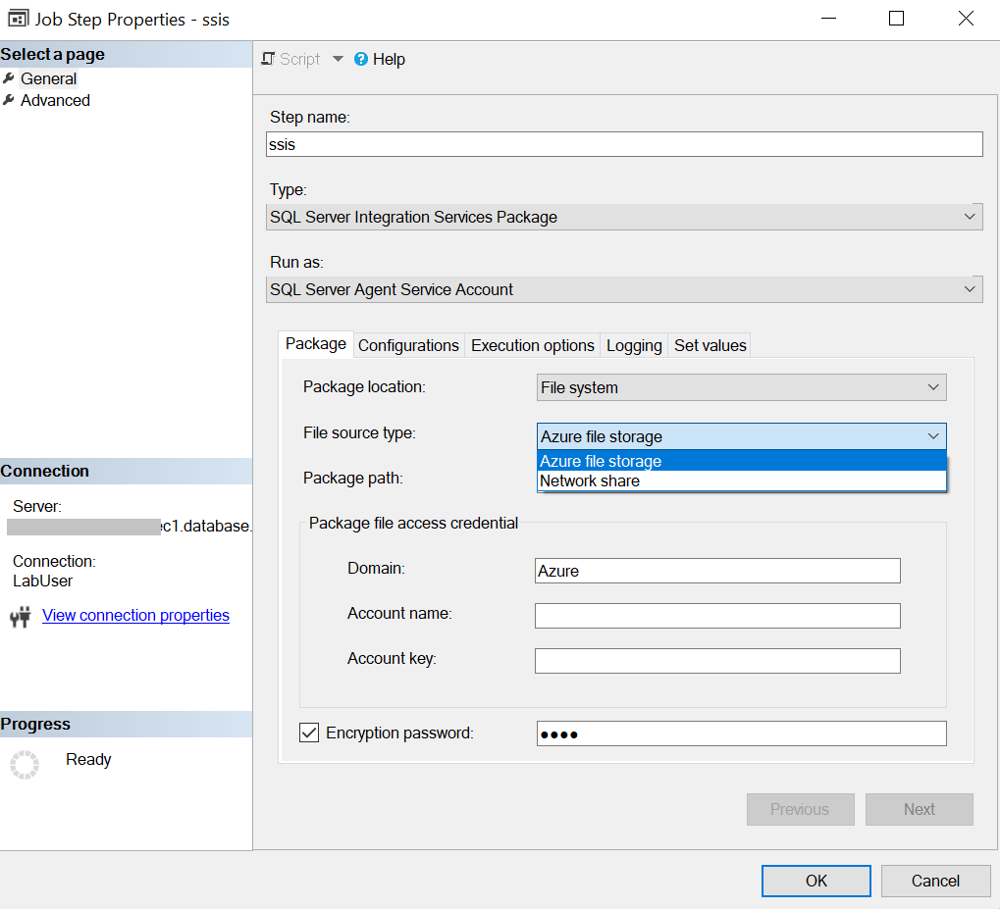
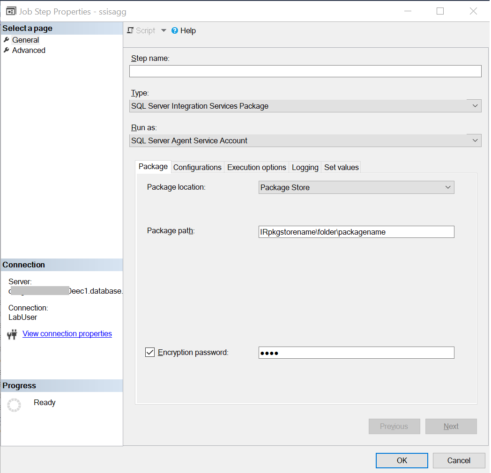
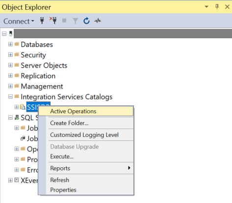

# Run SSIS packages by using Azure SQL Managed Instance Agent

This article describes how to run a SQL Server Integration Services (SSIS) package by using Azure SQL Managed Instance Agent. This feature provides behaviors that are similar to when you schedule SSIS packages by using SQL Server Agent in your on-premises environment.

With this feature, you can run SSIS packages that are stored in SSISDB in a SQL Managed Instance, a file system like Azure Files, or an Azure-SSIS integration runtime package store.

## Prerequisites

To use this feature, [download](/sql/ssms/download-sql-server-management-studio-ssms) and install latest SQL Server Management Studio (SSMS). Version support details as below:

- To run packages in SSISDB or file system, install SSMS version 18.5 or above.
- To run packages in package store, install SSMS version 18.6 or above.

You also need to [provision an Azure-SSIS integration runtime](./tutorial-deploy-ssis-packages-azure.md) in Azure Data Factory. It uses a SQL Managed Instance as an endpoint server.

## Run an SSIS package in SSISDB

In this procedure, you use SQL Managed Instance Agent to invoke an SSIS package that's stored in SSISDB.

1. In the latest version of SSMS, connect to a SQL Managed Instance.
1. Create a new agent job and a new job step. Under **SQL Server Agent**, right-click the **Jobs** folder, and then select **New Job**.

   

1. On the **New Job Step** page, select **SQL Server Integration Services Package** as the type.

   

1. On the **Package** tab, select **SSIS Catalog** as the package location.
1. Because SSISDB is in a SQL Managed Instance, you don't need to specify authentication.
1. Specify an SSIS package from SSISDB.

   

1. On the **Configuration** tab, you can:
  
   - Specify parameter values under **Parameters**.
   - Override values under **Connection Managers**.
   - Override the property and choose the logging level under **Advanced**.

   

1. Select **OK** to save the agent job configuration.
1. Start the agent job to run the SSIS package.

## Run an SSIS package in the file system

In this procedure, you use SQL Managed Instance Agent to run an SSIS package that's stored in the file system.

1. In the latest version of SSMS, connect to a SQL Managed Instance.
1. Create a new agent job and a new job step. Under **SQL Server Agent**, right-click the **Jobs** folder, and then select **New Job**.

   

1. On the **New Job Step** page, select **SQL Server Integration Services Package** as the type.

   

1. On the **Package** tab:

   1. For **Package location**, select **File system**.

   1. For **File source type**:

      - If your package is uploaded to Azure Files, select **Azure file share**.

        

        The package path is **`\\<storage account name>.file.core.windows.net\<file share name>\<package name>.dtsx`**.

        Under **Package file access credential**, enter the Azure file account name and account key to access the Azure file. The domain is set as **Azure**.

      - If your package is uploaded to a network share, select **Network share**.

        The package path is the UNC path of your package file with its .dtsx extension.

        Enter the corresponding domain, username, and password to access the network share package file.
   1. If your package file is encrypted with a password, select **Encryption password** and enter the password.
1. On the **Configurations** tab, enter the configuration file path if you need a configuration file to run the SSIS package.
   If you store your configuration in Azure Files, its configuration path will be **`\\<storage account name>.file.core.windows.net\<file share name>\<configuration name>.dtsConfig`**.
1. On the **Execution options** tab, you can choose whether to use **Windows authentication** or **32-bit runtime** to run the SSIS package.
1. On the **Logging** tab, you can choose the logging path and corresponding logging access credential to store the log files. 
   By default, the logging path is the same as the package folder path, and the logging access credential is the same as the package access credential.
   If you store your logs in Azure Files, your logging path will be **`\\<storage account name>.file.core.windows.net\<file share name>\<log folder name>`**.
1. On the **Set values** tab, you can enter the property path and value to override the package properties.

   For example, to override the value of your user variable, enter its path in the following format: **`\Package.Variables[User::<variable name>].Value`**.
1. Select **OK** to save the agent job configuration.
1. Start the agent job to run the SSIS package.

## Run an SSIS package in the package store

In this procedure, you use SQL Managed Instance Agent to run an SSIS package that's stored in the  Azure-SSIS IR package store.

1. In the latest version of SSMS, connect to a SQL Managed Instance.
1. Create a new agent job and a new job step. Under **SQL Server Agent**, right-click the **Jobs** folder, and then select **New Job**.

   

1. On the **New Job Step** page, select **SQL Server Integration Services Package** as the type.

   

1. On the **Package** tab:

   1. For **Package location**, select **Package Store**.

   1. For **Package path**:

      The package path is **`<package store name>\<folder name>\<package name>`**.

      

   1. If your package file is encrypted with a password, select **Encryption password** and enter the password.
1. On the **Configurations** tab, enter the configuration file path if you need a configuration file to run the SSIS package.
   If you store your configuration in Azure Files, its configuration path will be **`\\<storage account name>.file.core.windows.net\<file share name>\<configuration name>.dtsConfig`**.
1. On the **Execution options** tab, you can choose whether to use **Windows authentication** or **32-bit runtime** to run the SSIS package.
1. On the **Logging** tab, you can choose the logging path and corresponding logging access credential to store the log files.
   By default, the logging path is the same as the package folder path, and the logging access credential is the same as the package access credential.
   If you store your logs in Azure Files, your logging path will be **`\\<storage account name>.file.core.windows.net\<file share name>\<log folder name>`**.
1. On the **Set values** tab, you can enter the property path and value to override the package properties.

   For example, to override the value of your user variable, enter its path in the following format: **`\Package.Variables[User::<variable name>].Value`**.
1. Select **OK** to save the agent job configuration.
1. Start the agent job to run the SSIS package.

## Cancel SSIS package execution

To cancel package execution from a SQL Managed Instance Agent job, take the following steps instead of directly stopping the agent job:

1. Find your SQL agent **jobId** from **msdb.dbo.sysjobs**.
1. Find the corresponding SSIS **executionId** based on the job ID, by using this query:
   ```sql
   select * from '{table for job execution}' where  parameter_value = 'SQL_Agent_Job_{jobId}' order by execution_id desc
   ```
   If your SSIS packages are in SSISDB, then use **ssisdb.internal.execution_parameter_values** as table for job execution. If your SSIS packages are in file system, then use **ssisdb.internal.execution_parameter_values_noncatalog**.
1. Right-click the SSISDB catalog, and then select **Active Operations**.

   

1. Stop the corresponding operation based on **executionId**.

## Next steps
You can also schedule SSIS packages by using Azure Data Factory. For step-by-step instructions, see [Azure Data Factory event trigger](how-to-create-event-trigger.md).