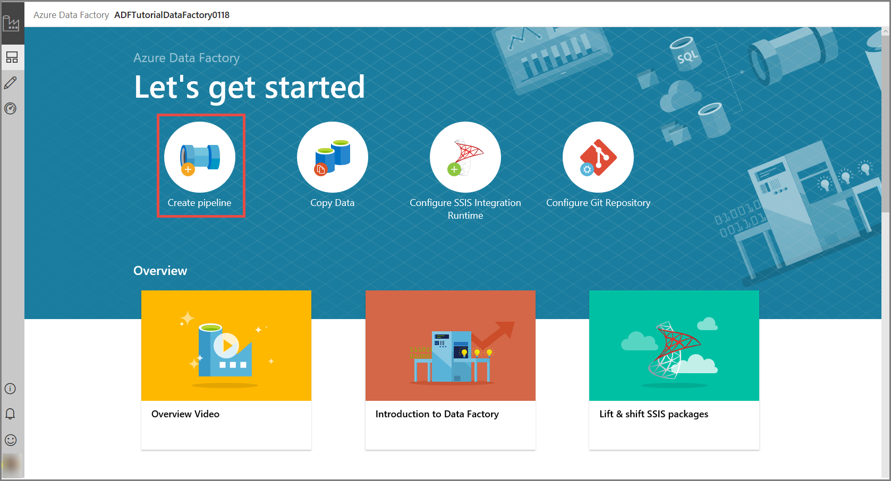
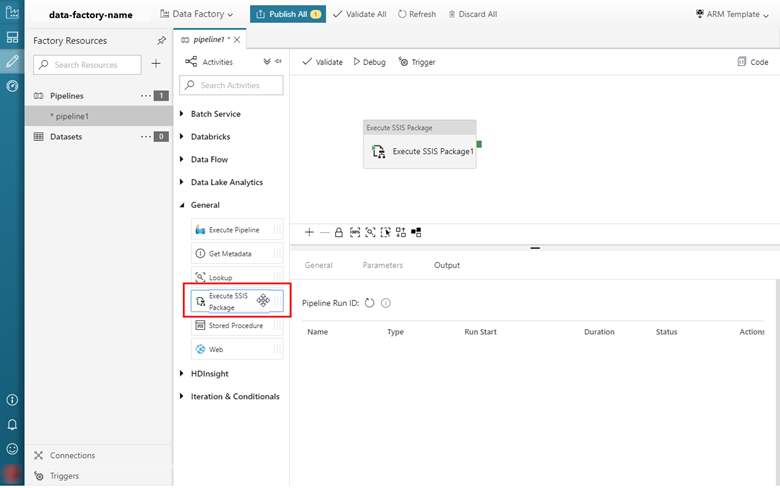
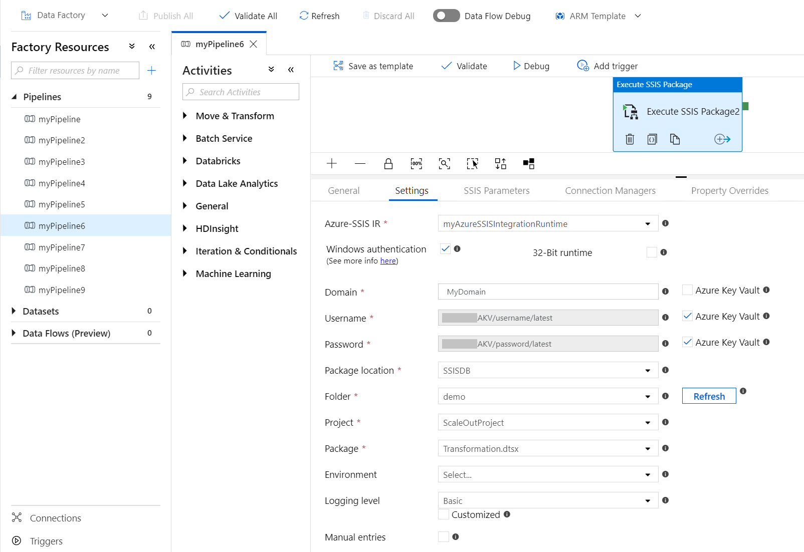
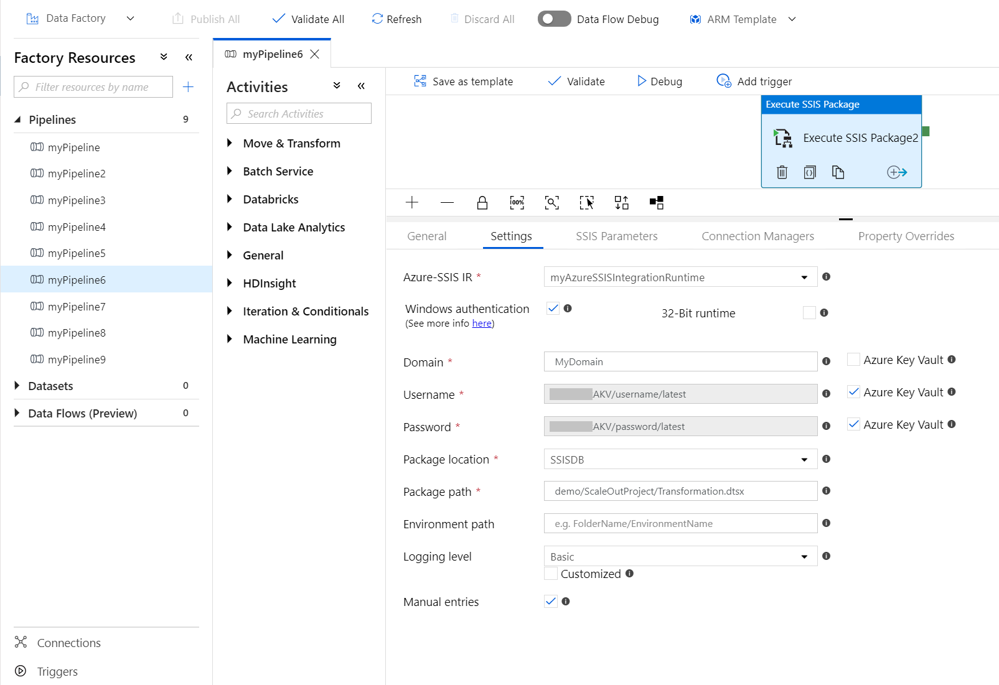
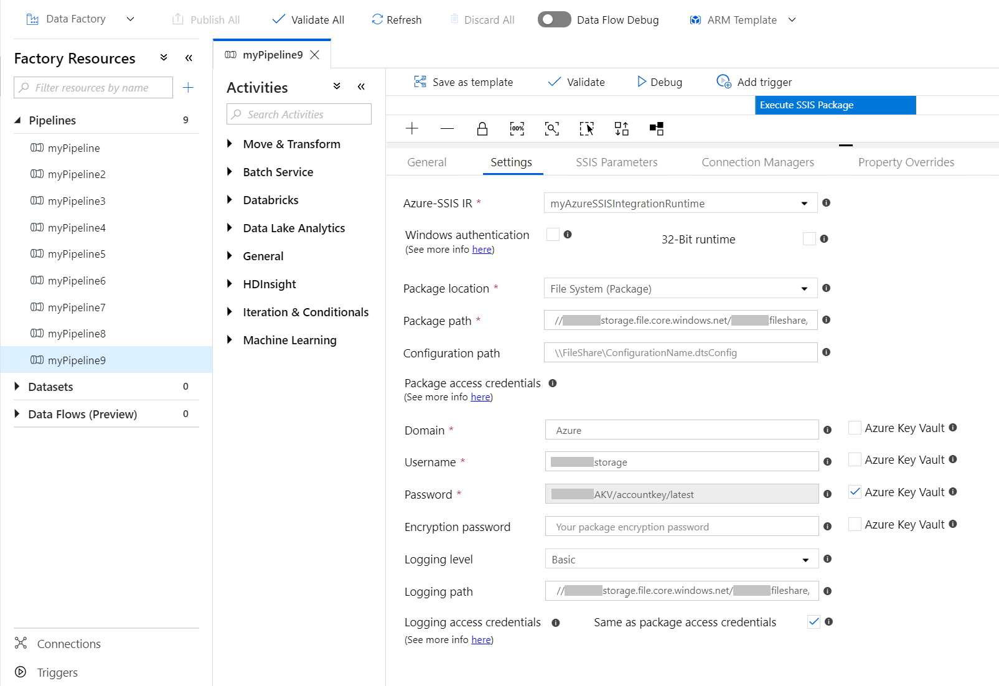
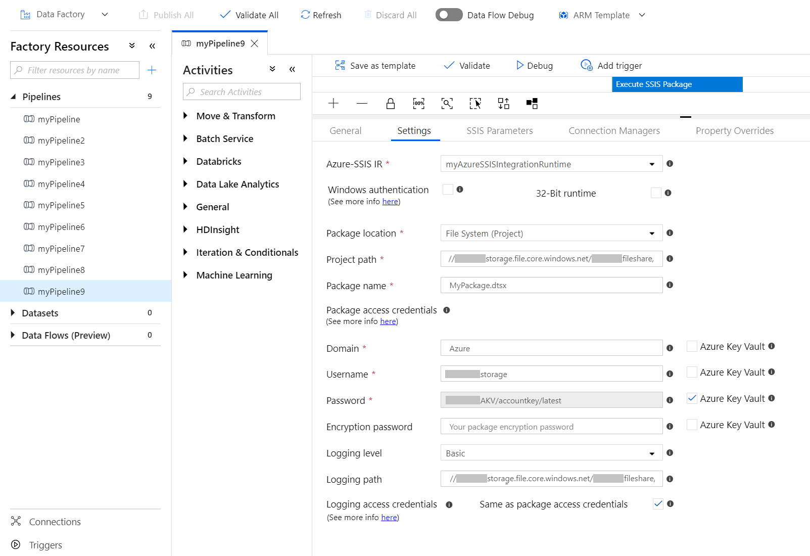
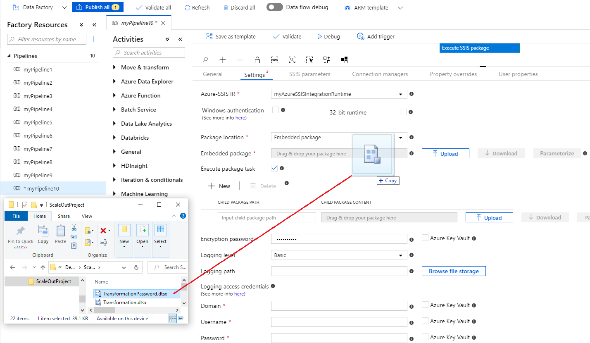
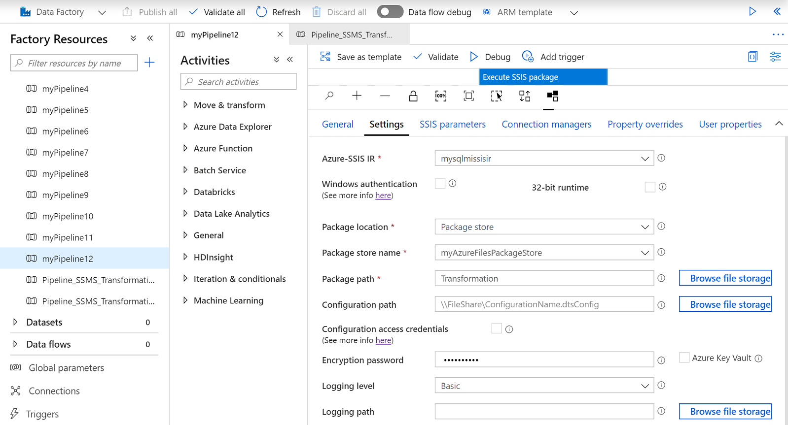
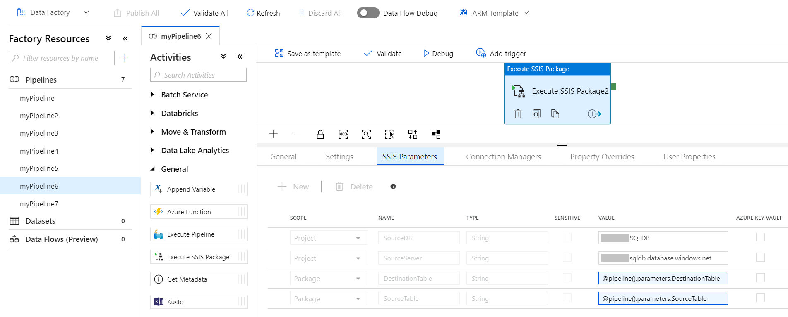
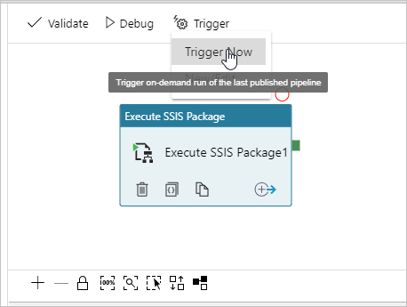

# Run an SSIS package with the Execute SSIS Package activity in Azure Data Factory

[!INCLUDE[appliesto-adf-asa-md](includes/appliesto-adf-asa-md.md)]

This article describes how to run a SQL Server Integration Services (SSIS) package in an Azure Data Factory  pipeline by using the Execute SSIS Package activity. 

## Prerequisites

[!INCLUDE [updated-for-az](../../includes/updated-for-az.md)]

Create an Azure-SSIS integration runtime (IR) if you don't have one already by following the step-by-step instructions in the [Tutorial: Provisioning Azure-SSIS IR](tutorial-create-azure-ssis-runtime-portal.md).

## Run a package in the Azure portal
In this section, you use the Data Factory user interface (UI) or app to create a Data Factory pipeline with an Execute SSIS Package activity that runs your SSIS package.

### Create a pipeline with an Execute SSIS Package activity
In this step, you use the Data Factory UI or app to create a pipeline. You add an Execute SSIS Package activity to the pipeline and configure it to run your SSIS package. 

1. On your Data Factory overview or home page in the Azure portal, select the **Author & Monitor** tile to start the Data Factory UI or app in a separate tab. 

   

   On the **Let's get started** page, select **Create pipeline**. 

   

1. In the **Activities** toolbox, expand **General**. Then drag an **Execute SSIS Package** activity to the pipeline designer surface. 

    

   Select the Execute SSIS Package activity object to configure its **General**, **Settings**, **SSIS Parameters**, **Connection Managers**, and **Property Overrides** tabs.

#### General tab

On the **General** tab of Execute SSIS Package activity, complete the following steps.

   

   1. For **Name**, enter the name of your Execute SSIS Package activity.

   1. For **Description**, enter the description of your Execute SSIS Package activity.

   1. For **Timeout**, enter the maximum amount of time your Execute SSIS Package activity can run. Default is 7 days, format is D.HH:MM:SS.

   1. For **Retry**, enter the maximum number of retry attempts for your Execute SSIS Package activity.

   1. For **Retry interval**, enter the number of seconds between each retry attempt for your Execute SSIS Package activity. Default is 30 seconds.

   1. Select the **Secure output** check box to choose whether you want to exclude the output of your Execute SSIS Package activity from logging.

   1. Select the **Secure input** check box to choose whether you want to exclude the input of your Execute SSIS Package activity from logging.

#### Settings tab

On the **Settings** tab of Execute SSIS Package activity, complete the following steps.

   

   1. For **Azure-SSIS IR**, select the designated Azure-SSIS IR to run your Execute SSIS Package activity.

   1. For **Description**, enter the description of your Execute SSIS Package activity.

   1. Select the **Windows authentication** check box to choose whether you want to use Windows authentication to access data stores, such as SQL servers/file shares on-premises or Azure Files.
   
      If you select this check box, enter the values for your package execution credentials in the **Domain**, **Username**, and **Password** boxes. For example, to access Azure Files, the domain is `Azure`, the username is `<storage account name>`, and the password is `<storage account key>`.

      Alternatively, you can use secrets stored in your Azure Key Vault as their values. To do so, select the **AZURE KEY VAULT** check box next to them. Select or edit your existing key vault linked service or create a new one. Then select the secret name and version for your value. When you create or edit your key vault linked service, you can select or edit your existing key vault or create a new one. Make sure to grant Data Factory managed identity access to your key vault if you haven't done so already. You can also enter your secret directly in the following format: `<key vault linked service name>/<secret name>/<secret version>`.
      
   1. Select the **32-Bit runtime** check box to choose whether your package needs 32-bit runtime to run.

   1. For **Package location**, select **SSISDB**, **File System (Package)**, **File System (Project)**, **Embedded package**, or **Package store**. 

##### Package location: SSISDB

**SSISDB** as your package location is automatically selected if your Azure-SSIS IR was provisioned with an SSIS catalog (SSISDB) hosted by Azure SQL Database server/Managed Instance or you can select it yourself. If it's selected, complete the following steps.

   1. If your Azure-SSIS IR is running and the **Manual entries** check box is cleared, browse and select your existing folders, projects, packages, and environments from SSISDB. Select **Refresh** to fetch your newly added folders, projects, packages, or environments from SSISDB, so that they're available for browsing and selection. To browse and select the environments for your package executions, you must configure your projects beforehand to add those environments as references from the same folders under SSISDB. For more information, see [Create and map SSIS environments](https://docs.microsoft.com/sql/integration-services/create-and-map-a-server-environment?view=sql-server-2014).

   1. For **Logging level**, select a predefined scope of logging for your package execution. Select the **Customized** check box if you want to enter your customized logging name instead. 

   1. If your Azure-SSIS IR isn't running or the **Manual entries** check box is selected, enter your package and environment paths from SSISDB directly in the following formats: `<folder name>/<project name>/<package name>.dtsx` and `<folder name>/<environment name>`.

   

##### Package location: File System (Package)

**File System (Package)** as your package location is automatically selected if your Azure-SSIS IR was provisioned without SSISDB or you can select it yourself. If it's selected, complete the following steps.

   
   
   1. Specify your package to run by providing a Universal Naming Convention (UNC) path to your package file (with `.dtsx`) in the **Package path** box. You can browse and select your package by selecting **Browse file storage** or enter its path manually. For example, if you store your package in Azure Files, its path is `\\<storage account name>.file.core.windows.net\<file share name>\<package name>.dtsx`. 
   
   1. If you configure your package in a separate file, you also need to provide a UNC path to your configuration file (with `.dtsConfig`) in the **Configuration path** box. You can browse and select your configuration by selecting **Browse file storage** or enter its path manually. For example, if you store your configuration in Azure Files, its path is `\\<storage account name>.file.core.windows.net\<file share name>\<configuration name>.dtsConfig`.

   1. Specify the credentials to access your package and configuration files. If you previously entered the values for your package execution credentials (for **Windows authentication**), you can reuse them by selecting the **Same as package execution credentials** check box. Otherwise, enter the values for your package access credentials in the **Domain**, **Username**, and **Password** boxes. For example, if you store your package and configuration in Azure Files, the domain is `Azure`, the username is `<storage account name>`, and the password is `<storage account key>`. 

      Alternatively, you can use secrets stored in your Azure Key Vault as their values. To do so, select the **AZURE KEY VAULT** check box next to them. Select or edit your existing key vault linked service or create a new one. Then select the secret name and version for your value. When you create or edit your key vault linked service, you can select or edit your existing key vault or create a new one. Make sure to grant Data Factory managed identity access to your key vault if you haven't done so already. You can also enter your secret directly in the following format: `<key vault linked service name>/<secret name>/<secret version>`. 

      These credentials are also used to access your child packages in Execute Package Task that are referenced by their own path and other configurations specified in your packages. 

   1. If you used the **EncryptAllWithPassword** or **EncryptSensitiveWithPassword** protection level when you created your package via SQL Server Data Tools (SSDT), enter the value for your password in the **Encryption password** box. Alternatively, you can use a secret stored in your Azure Key Vault as its value (see above).
      
      If you used the **EncryptSensitiveWithUserKey** protection level, reenter your sensitive values in configuration files or on the **SSIS Parameters**, **Connection Managers**, or **Property Overrides** tabs (see below).
      
      If you used the **EncryptAllWithUserKey** protection level, it's unsupported. You need to reconfigure your package to use another protection level via SSDT or the `dtutil` command-line utility. 

   1. For **Logging level**, select a predefined scope of logging for your package execution. Select the **Customized** check box if you want to enter your customized logging name instead. 
   
   1. If you want to log your package executions beyond using the standard log providers that can be specified in your package, specify your log folder by providing its UNC path in the **Logging path** box. You can browse and select your log folder by selecting **Browse file storage** or enter its path manually. For example, if you store your logs in Azure Files, your logging path is `\\<storage account name>.file.core.windows.net\<file share name>\<log folder name>`. A subfolder is created in this path for each individual package run, named after the Execute SSIS Package activity run ID, and in which log files are generated every five minutes. 
   
   1. Specify the credentials to access your log folder. If you previously entered the values for your package access credentials (see above), you can reuse them by selecting the **Same as package access credentials** check box. Otherwise, enter the values for your logging access credentials in the **Domain**, **Username**, and **Password** boxes. For example, if you store your logs in Azure Files, the domain is `Azure`, the username is `<storage account name>`, and the password is `<storage account key>`. Alternatively, you can use secrets stored in your Azure Key Vault as their values (see above).
   
   For all UNC paths previously mentioned, the fully qualified file name must be fewer than 260 characters. The directory name must be fewer than 248 characters.

##### Package location: File System (Project)

If you select **File System (Project)** as your package location, complete the following steps.

   

   1. Specify your package to run by providing a UNC path to your project file (with `.ispac`) in the **Project path** box and a package file (with `.dtsx`) from your project in the **Package name** box. You can browse and select your project by selecting **Browse file storage** or enter its path manually. For example, if you store your project in Azure Files, its path is `\\<storage account name>.file.core.windows.net\<file share name>\<project name>.ispac`.

   1. Specify the credentials to access your project and package files. If you previously entered the values for your package execution credentials (for **Windows authentication**), you can reuse them by selecting the **Same as package execution credentials** check box. Otherwise, enter the values for your package access credentials in the **Domain**, **Username**, and **Password** boxes. For example, if you store your project and package in Azure Files, the domain is `Azure`, the username is `<storage account name>`, and the password is `<storage account key>`. 

      Alternatively, you can use secrets stored in your Azure Key Vault as their values. To do so, select the **AZURE KEY VAULT** check box next to them. Select or edit your existing key vault linked service or create a new one. Then select the secret name and version for your value. When you create or edit your key vault linked service, you can select or edit your existing key vault or create a new one. Make sure to grant Data Factory managed identity access to your key vault if you haven't done so already. You can also enter your secret directly in the following format: `<key vault linked service name>/<secret name>/<secret version>`. 

      These credentials are also used to access your child packages in Execute Package Task that are referenced from the same project. 

   1. If you used the **EncryptAllWithPassword** or **EncryptSensitiveWithPassword** protection level when you created your package via SSDT, enter the value for your password in the **Encryption password** box. Alternatively, you can use a secret stored in your Azure Key Vault as its value (see above).
      
      If you used the **EncryptSensitiveWithUserKey** protection level, reenter your sensitive values on the **SSIS Parameters**, **Connection Managers**, or **Property Overrides** tabs (see below).
      
      If you used the **EncryptAllWithUserKey** protection level, it's unsupported. You need to reconfigure your package to use another protection level via SSDT or the `dtutil` command-line utility. 

   1. For **Logging level**, select a predefined scope of logging for your package execution. Select the **Customized** check box if you want to enter your customized logging name instead. 
   
   1. If you want to log your package executions beyond using the standard log providers that can be specified in your package, specify your log folder by providing its UNC path in the **Logging path** box. You can browse and select your log folder by selecting **Browse file storage** or enter its path manually. For example, if you store your logs in Azure Files, your logging path is `\\<storage account name>.file.core.windows.net\<file share name>\<log folder name>`. A subfolder is created in this path for each individual package run, named after the Execute SSIS Package activity run ID, and in which log files are generated every five minutes. 
   
   1. Specify the credentials to access your log folder. If you previously entered the values for your package access credentials (see above), you can reuse them by selecting the **Same as package access credentials** check box. Otherwise, enter the values for your logging access credentials in the **Domain**, **Username**, and **Password** boxes. For example, if you store your logs in Azure Files, the domain is `Azure`, the username is `<storage account name>`, and the password is `<storage account key>`. Alternatively, you can use secrets stored in your Azure Key Vault as their values (see above).
   
   For all UNC paths previously mentioned, the fully qualified file name must be fewer than 260 characters. The directory name must be fewer than 248 characters.

##### Package location: Embedded package

If you select **Embedded package** as your package location, complete the following steps.

   

   1. Drag and drop your package to run or **Upload** it from a file folder into the box provided. Your package will be automatically compressed and embedded in the activity payload. Once embedded, you can **Download** your package later for editing. You can also **Parameterize** your embedded package by assigning it to a pipeline parameter that can be used in multiple activities, hence optimizing the size of your pipeline payload. 
   
   1. If your embedded package is not all encrypted and we detect the use of Execute Package Task in it, the **Execute Package Task** check box will be automatically selected and the relevant child packages with their file system references will be automatically added for you to also embed them. 
   
      If we can't detect the use of Execute Package Task, you'll have to manually select the **Execute Package Task** check box and add the relevant child packages with their file system references one by one for you to also embed them. If the child packages use SQL Server references, please ensure that the SQL Server is accessible by your Azure-SSIS IR.  The use of project references for child packages is currently unsupported.
   
   1. If you used the **EncryptAllWithPassword** or **EncryptSensitiveWithPassword** protection level when you created your package via SSDT, enter the value for your password in the **Encryption password** box. 
   
      Alternatively, you can use a secret stored in your Azure Key Vault as its value. To do so, select the **AZURE KEY VAULT** check box next to it. Select or edit your existing key vault linked service or create a new one. Then select the secret name and version for your value. When you create or edit your key vault linked service, you can select or edit your existing key vault or create a new one. Make sure to grant Data Factory managed identity access to your key vault if you haven't done so already. You can also enter your secret directly in the following format: `<key vault linked service name>/<secret name>/<secret version>`.
      
      If you used the **EncryptSensitiveWithUserKey** protection level, reenter your sensitive values in configuration files or on the **SSIS Parameters**, **Connection Managers**, or **Property Overrides** tabs (see below).
      
      If you used the **EncryptAllWithUserKey** protection level, it's unsupported. You need to reconfigure your package to use another protection level via SSDT or the `dtutil` command-line utility.

   1. For **Logging level**, select a predefined scope of logging for your package execution. Select the **Customized** check box if you want to enter your customized logging name instead. 
   
   1. If you want to log your package executions beyond using the standard log providers that can be specified in your package, specify your log folder by providing its UNC path in the **Logging path** box. You can browse and select your log folder by selecting **Browse file storage** or enter its path manually. For example, if you store your logs in Azure Files, your logging path is `\\<storage account name>.file.core.windows.net\<file share name>\<log folder name>`. A subfolder is created in this path for each individual package run, named after the Execute SSIS Package activity run ID, and in which log files are generated every five minutes. 
   
   1. Specify the credentials to access your log folder by entering their values in the **Domain**, **Username**, and **Password** boxes. For example, if you store your logs in Azure Files, the domain is `Azure`, the username is `<storage account name>`, and the password is `<storage account key>`. Alternatively, you can use secrets stored in your Azure Key Vault as their values (see above).
   
   For all UNC paths previously mentioned, the fully qualified file name must be fewer than 260 characters. The directory name must be fewer than 248 characters.

##### Package location: Package store

If you select **Package store** as your package location, complete the following steps.

   
   
   1. For **Package store name**, select an existing package store that's attached to your Azure-SSIS IR.

   1. Specify your package to run by providing its path (without `.dtsx`) from the selected package store in the **Package path** box. If the selected package store is on top of file system/Azure Files, you can browse and select your package by selecting **Browse file storage**, otherwise you can enter its path in the format of `<folder name>\<package name>`. You can also import new packages into the selected package store via SQL Server Management Studio (SSMS) similar to the [legacy SSIS package store](https://docs.microsoft.com/sql/integration-services/service/package-management-ssis-service?view=sql-server-2017). For more information, see [Manage SSIS packages with Azure-SSIS IR package stores](https://docs.microsoft.com/azure/data-factory/azure-ssis-integration-runtime-package-store).

   1. If you configure your package in a separate file, you need to provide a UNC path to your configuration file (with `.dtsConfig`) in the **Configuration path** box. You can browse and select your configuration by selecting **Browse file storage** or enter its path manually. For example, if you store your configuration in Azure Files, its path is `\\<storage account name>.file.core.windows.net\<file share name>\<configuration name>.dtsConfig`.

   1. Select the **Configuration access credentials** check box to choose whether you want to specify the credentials to access your configuration file separately. This is needed when the selected package store is on top of SQL Server database (MSDB) hosted by your Azure SQL Managed Instance or doesn't also store your configuration file.
   
      If you previously entered the values for your package execution credentials (for **Windows authentication**), you can reuse them by selecting the **Same as package execution credentials** check box. Otherwise, enter the values for your configuration access credentials in the **Domain**, **Username**, and **Password** boxes. For example, if you store your configuration in Azure Files, the domain is `Azure`, the username is `<storage account name>`, and the password is `<storage account key>`. 

      Alternatively, you can use secrets stored in your Azure Key Vault as their values. To do so, select the **AZURE KEY VAULT** check box next to them. Select or edit your existing key vault linked service or create a new one. Then select the secret name and version for your value. When you create or edit your key vault linked service, you can select or edit your existing key vault or create a new one. Make sure to grant Data Factory managed identity access to your key vault if you haven't done so already. You can also enter your secret directly in the following format: `<key vault linked service name>/<secret name>/<secret version>`.

   1. If you used the **EncryptAllWithPassword** or **EncryptSensitiveWithPassword** protection level when you created your package via SSDT, enter the value for your password in the **Encryption password** box. Alternatively, you can use a secret stored in your Azure Key Vault as its value (see above).
      
      If you used the **EncryptSensitiveWithUserKey** protection level, reenter your sensitive values in configuration files or on the **SSIS Parameters**, **Connection Managers**, or **Property Overrides** tabs (see below).
      
      If you used the **EncryptAllWithUserKey** protection level, it's unsupported. You need to reconfigure your package to use another protection level via SSDT or the `dtutil` command-line utility. 

   1. For **Logging level**, select a predefined scope of logging for your package execution. Select the **Customized** check box if you want to enter your customized logging name instead. 
   
   1. If you want to log your package executions beyond using the standard log providers that can be specified in your package, specify your log folder by providing its UNC path in the **Logging path** box. You can browse and select your log folder by selecting **Browse file storage** or enter its path manually. For example, if you store your logs in Azure Files, your logging path is `\\<storage account name>.file.core.windows.net\<file share name>\<log folder name>`. A subfolder is created in this path for each individual package run, named after the Execute SSIS Package activity run ID, and in which log files are generated every five minutes. 
   
   1. Specify the credentials to access your log folder by entering their values in the **Domain**, **Username**, and **Password** boxes. For example, if you store your logs in Azure Files, the domain is `Azure`, the username is `<storage account name>`, and the password is `<storage account key>`. Alternatively, you can use secrets stored in your Azure Key Vault as their values (see above).
   
   For all UNC paths previously mentioned, the fully qualified file name must be fewer than 260 characters. The directory name must be fewer than 248 characters.

#### SSIS Parameters tab

On the **SSIS Parameters** tab of Execute SSIS Package activity, complete the following steps.

   

   1. If your Azure-SSIS IR is running, **SSISDB** is selected as your package location, and the **Manual entries** check box on the **Settings** tab is cleared, the existing SSIS parameters in your selected project and package from SSISDB are displayed for you to assign values to them. Otherwise, you can enter them one by one to assign values to them manually. Make sure that they exist and are correctly entered for your package execution to succeed. 
   
   1. If you used the **EncryptSensitiveWithUserKey** protection level when you created your package via SSDT and **File System (Package)**, **File System (Project)**, **Embedded package**, or **Package store** is selected as your package location, you also need to reenter your sensitive parameters to assign values to them on this tab. 
   
   When you assign values to your parameters, you can add dynamic content by using expressions, functions, Data Factory system variables, and Data Factory pipeline parameters or variables.

   Alternatively, you can use secrets stored in your Azure Key Vault as their values. To do so, select the **AZURE KEY VAULT** check box next to them. Select or edit your existing key vault linked service or create a new one. Then select the secret name and version for your value. When you create or edit your key vault linked service, you can select or edit your existing key vault or create a new one. Make sure to grant Data Factory managed identity access to your key vault if you haven't done so already. You can also enter your secret directly in the following format: `<key vault linked service name>/<secret name>/<secret version>`. 

#### Connection Managers tab

On the **Connection Managers** tab of Execute SSIS Package activity, complete the following steps.

   

   1. If your Azure-SSIS IR is running, **SSISDB** is selected as your package location, and the **Manual entries** check box on the **Settings** tab is cleared, the existing connection managers in your selected project and package from SSISDB are displayed for you to assign values to their properties. Otherwise, you can enter them one by one to assign values to their properties manually. Make sure that they exist and are correctly entered for your package execution to succeed. 
   
   1. If you used the **EncryptSensitiveWithUserKey** protection level when you created your package via SSDT and **File System (Package)**, **File System (Project)**, **Embedded package**, or **Package store** is selected as your package location, you also need to reenter your sensitive connection manager properties to assign values to them on this tab. 
   
   When you assign values to your connection manager properties, you can add dynamic content by using expressions, functions, Data Factory system variables, and Data Factory pipeline parameters or variables. 

   Alternatively, you can use secrets stored in your Azure Key Vault as their values. To do so, select the **AZURE KEY VAULT** check box next to them. Select or edit your existing key vault linked service or create a new one. Then select the secret name and version for your value. When you create or edit your key vault linked service, you can select or edit your existing key vault or create a new one. Make sure to grant Data Factory managed identity access to your key vault if you haven't done so already. You can also enter your secret directly in the following format: `<key vault linked service name>/<secret name>/<secret version>`. 

#### Property Overrides tab

On the **Property Overrides** tab of Execute SSIS Package activity, complete the following steps.

   

   1. Enter the paths of existing properties in your selected package one by one to assign values to them manually. Make sure that they exist and are correctly entered for your package execution to succeed. For example, to override the value of your user variable, enter its path in the following format: `\Package.Variables[User::<variable name>].Value`. 
   
   1. If you used the **EncryptSensitiveWithUserKey** protection level when you created your package via SSDT and **File System (Package)**, **File System (Project)**, **Embedded package**, or **Package store** is selected as your package location, you also need to reenter your sensitive package properties to assign values to them on this tab. 
   
   When you assign values to your package properties, you can add dynamic content by using expressions, functions, Data Factory system variables, and Data Factory pipeline parameters or variables.

   The values assigned in configuration files and on the **SSIS Parameters** tab can be overridden by using the **Connection Managers** or **Property Overrides** tabs. The values assigned on the **Connection Managers** tab can also be overridden by using the **Property Overrides** tab.

To validate the pipeline configuration, select **Validate** on the toolbar. To close the **Pipeline Validation Report**, select **>>**.

To publish the pipeline to Data Factory, select **Publish All**. 

### Run the pipeline
In this step, you trigger a pipeline run. 

1. To trigger a pipeline run, select **Trigger** on the toolbar, and select **Trigger now**. 

   

2. In the **Pipeline Run** window, select **Finish**. 

### Monitor the pipeline

1. Switch to the **Monitor** tab on the left. You see the pipeline run and its status along with other information, such as the **Run Start** time. To refresh the view, select **Refresh**.

   

2. Select the **View Activity Runs** link in the **Actions** column. You see only one activity run because the pipeline has only one activity. It's the Execute SSIS Package activity.

   

3. Run the following query against the SSISDB database in your SQL server to verify that the package executed. 

   ```sql
   select * from catalog.executions
   ```

   

4. You can also get the SSISDB execution ID from the output of the pipeline activity run and use the ID to check more comprehensive execution logs and error messages in SQL Server Management Studio.

   

### Schedule the pipeline with a trigger

You can also create a scheduled trigger for your pipeline so that the pipeline runs on a schedule, such as hourly or daily. For an example, see [Create a data factory - Data Factory UI](quickstart-create-data-factory-portal.md#trigger-the-pipeline-on-a-schedule).

## Run a package with PowerShell
In this section, you use Azure PowerShell to create a Data Factory pipeline with an Execute SSIS Package activity that runs your SSIS package. 

Install the latest Azure PowerShell modules by following the step-by-step instructions in [How to install and configure Azure PowerShell](/powershell/azure/install-az-ps).

### Create a data factory with Azure-SSIS IR
You can either use an existing data factory that already has Azure-SSIS IR provisioned or create a new data factory with Azure-SSIS IR. Follow the step-by-step instructions in the [Tutorial: Deploy SSIS packages to Azure via PowerShell](https://docs.microsoft.com/azure/data-factory/tutorial-deploy-ssis-packages-azure-powershell).

### Create a pipeline with an Execute SSIS Package activity 
In this step, you create a pipeline with an Execute SSIS Package activity. The activity runs your SSIS package. 

1. Create a JSON file named `RunSSISPackagePipeline.json` in the `C:\ADF\RunSSISPackage` folder with content similar to the following example.

   > [!IMPORTANT]
   > Replace object names, descriptions, and paths, property or parameter values, passwords, and other variable values before you save the file. 
    
   ```json
   {
       "name": "RunSSISPackagePipeline",
       "properties": {
           "activities": [{
               "name": "MySSISActivity",
               "description": "My SSIS package/activity description",
               "type": "ExecuteSSISPackage",
               "typeProperties": {
                   "connectVia": {
                       "referenceName": "MyAzureSSISIR",
                       "type": "IntegrationRuntimeReference"
                   },
                   "executionCredential": {
                       "domain": "MyExecutionDomain",
                       "username": "MyExecutionUsername",
                       "password": {
                           "type": "SecureString",
                           "value": "MyExecutionPassword"
                       }
                   },
                   "runtime": "x64",
                   "loggingLevel": "Basic",
                   "packageLocation": {
                       "type": "SSISDB",
                       "packagePath": "MyFolder/MyProject/MyPackage.dtsx"
                   },
                   "environmentPath": "MyFolder/MyEnvironment",
                   "projectParameters": {
                       "project_param_1": {
                           "value": "123"
                       },
                       "project_param_2": {
                           "value": {
                               "value": "@pipeline().parameters.MyProjectParameter",
                               "type": "Expression"
                           }
                       }
                   },
                   "packageParameters": {
                       "package_param_1": {
                           "value": "345"
                       },
                       "package_param_2": {
                           "value": {
                               "type": "AzureKeyVaultSecret",
                               "store": {
                                   "referenceName": "myAKV",
                                   "type": "LinkedServiceReference"
                               },
                               "secretName": "MyPackageParameter"
                           }
                       }
                   },
                   "projectConnectionManagers": {
                       "MyAdonetCM": {
                           "username": {
                               "value": "MyConnectionUsername"
                           },
                           "password": {
                               "value": {
                                   "type": "SecureString",
                                   "value": "MyConnectionPassword"
                               }
                           }
                       }
                   },
                   "packageConnectionManagers": {
                       "MyOledbCM": {
                           "username": {
                               "value": {
                                   "value": "@pipeline().parameters.MyConnectionUsername",
                                   "type": "Expression"
                               }
                           },
                           "password": {
                               "value": {
                                   "type": "AzureKeyVaultSecret",
                                   "store": {
                                       "referenceName": "myAKV",
                                       "type": "LinkedServiceReference"
                                   },
                                   "secretName": "MyConnectionPassword",
                                   "secretVersion": "MyConnectionPasswordVersion"
                               }
                           }
                       }
                   },
                   "propertyOverrides": {
                       "\\Package.MaxConcurrentExecutables": {
                           "value": 8,
                           "isSensitive": false
                       }
                   }
               },
               "policy": {
                   "timeout": "0.01:00:00",
                   "retry": 0,
                   "retryIntervalInSeconds": 30
               }
           }]
       }
   }
   ```

   To execute packages stored in file system/Azure Files, enter the values for your package and log location properties as follows:

   ```json
   {
       {
           {
               {
                   "packageLocation": {
                       "type": "File",
                       "packagePath": "//MyStorageAccount.file.core.windows.net/MyFileShare/MyPackage.dtsx",
                       "typeProperties": {
                           "packagePassword": {
                               "type": "SecureString",
                               "value": "MyEncryptionPassword"
                           },
                           "accessCredential": {
                               "domain": "Azure",
                               "username": "MyStorageAccount",
                               "password": {
                                   "type": "SecureString",
                                   "value": "MyAccountKey"
                               }
                           }
                       }
                   },
                   "logLocation": {
                       "type": "File",
                       "logPath": "//MyStorageAccount.file.core.windows.net/MyFileShare/MyLogFolder",
                       "typeProperties": {
                           "accessCredential": {
                               "domain": "Azure",
                               "username": "MyStorageAccount",
                               "password": {
                                   "type": "AzureKeyVaultSecret",
                                   "store": {
                                       "referenceName": "myAKV",
                                       "type": "LinkedServiceReference"
                                   },
                                   "secretName": "MyAccountKey"
                               }
                           }
                       }
                   }
               }
           }
       }
   }
   ```

   To execute packages within projects stored in file system/Azure Files, enter the values for your package location properties as follows:

   ```json
   {
       {
           {
               {
                   "packageLocation": {
                       "type": "File",
                       "packagePath": "//MyStorageAccount.file.core.windows.net/MyFileShare/MyProject.ispac:MyPackage.dtsx",
                       "typeProperties": {
                           "packagePassword": {
                               "type": "SecureString",
                               "value": "MyEncryptionPassword"
                           },
                           "accessCredential": {
                               "domain": "Azure",
                               "userName": "MyStorageAccount",
                               "password": {
                                   "type": "SecureString",
                                   "value": "MyAccountKey"
                               }
                           }
                       }
                   }
               }
           }
       }
   }
   ```

   To execute embedded packages, enter the values for your package location properties as follows:

   ```json
   {
       {
           {
               {
                   "packageLocation": {
                       "type": "InlinePackage",
                       "typeProperties": {
                           "packagePassword": {
                               "type": "SecureString",
                               "value": "MyEncryptionPassword"
                           },
                           "packageName": "MyPackage.dtsx",
                           "packageContent":"My compressed/uncompressed package content",
                           "packageLastModifiedDate": "YYYY-MM-DDTHH:MM:SSZ UTC-/+HH:MM"
                       }
                   }
               }
           }
       }
   }
   ```

   To execute packages stored in package stores, enter the values for your package and configuration location properties as follows:

   ```json
   {
       {
           {
               {
                   "packageLocation": {
                       "type": "PackageStore",
                       "packagePath": "myPackageStore/MyFolder/MyPackage",
                       "typeProperties": {
                           "packagePassword": {
                               "type": "SecureString",
                               "value": "MyEncryptionPassword"
                           },
                           "accessCredential": {
                               "domain": "Azure",
                               "username": "MyStorageAccount",
                               "password": {
                                   "type": "SecureString",
                                   "value": "MyAccountKey"
                               }
                           },
                           "configurationPath": "//MyStorageAccount.file.core.windows.net/MyFileShare/MyConfiguration.dtsConfig",
                           "configurationAccessCredential": {
                               "domain": "Azure",
                               "userName": "MyStorageAccount",
                               "password": {
                                   "type": "AzureKeyVaultSecret",
                                   "store": {
                                       "referenceName": "myAKV",
                                       "type": "LinkedServiceReference"
                                   },
                                   "secretName": "MyAccountKey"
                               }
                           }
                       }
                   }
               }
           }
       }
   }
   ```

2. In Azure PowerShell, switch to the `C:\ADF\RunSSISPackage` folder.

3. To create the pipeline **RunSSISPackagePipeline**, run the **Set-AzDataFactoryV2Pipeline** cmdlet.

   ```powershell
   $DFPipeLine = Set-AzDataFactoryV2Pipeline -DataFactoryName $DataFactory.DataFactoryName `
                                                  -ResourceGroupName $ResGrp.ResourceGroupName `
                                                  -Name "RunSSISPackagePipeline"
                                                  -DefinitionFile ".\RunSSISPackagePipeline.json"
   ```

   Here's the sample output:

   ```
   PipelineName      : Adfv2QuickStartPipeline
   ResourceGroupName : <resourceGroupName>
   DataFactoryName   : <dataFactoryName>
   Activities        : {CopyFromBlobToBlob}
   Parameters        : {[inputPath, Microsoft.Azure.Management.DataFactory.Models.ParameterSpecification], [outputPath, Microsoft.Azure.Management.DataFactory.Models.ParameterSpecification]}
   ```

### Run the pipeline
Use the **Invoke-AzDataFactoryV2Pipeline** cmdlet to run the pipeline. The cmdlet returns the pipeline run ID for future monitoring.

```powershell
$RunId = Invoke-AzDataFactoryV2Pipeline -DataFactoryName $DataFactory.DataFactoryName `
                                             -ResourceGroupName $ResGrp.ResourceGroupName `
                                             -PipelineName $DFPipeLine.Name
```

### Monitor the pipeline

Run the following PowerShell script to continuously check the pipeline run status until it finishes copying the data. Copy or paste the following script in the PowerShell window, and select Enter. 

```powershell
while ($True) {
    $Run = Get-AzDataFactoryV2PipelineRun -ResourceGroupName $ResGrp.ResourceGroupName `
                                               -DataFactoryName $DataFactory.DataFactoryName `
                                               -PipelineRunId $RunId

    if ($Run) {
        if ($run.Status -ne 'InProgress') {
            Write-Output ("Pipeline run finished. The status is: " +  $Run.Status)
            $Run
            break
        }
        Write-Output  "Pipeline is running...status: InProgress"
    }

    Start-Sleep -Seconds 10
}   
```

You can also monitor the pipeline by using the Azure portal. For step-by-step instructions, see [Monitor the pipeline](quickstart-create-data-factory-resource-manager-template.md#monitor-the-pipeline).

### Schedule the pipeline with a trigger
In the previous step, you ran the pipeline on demand. You can also create a schedule trigger to run the pipeline on a schedule, such as hourly or daily.

1. Create a JSON file named `MyTrigger.json` in the `C:\ADF\RunSSISPackage` folder with the following content: 
        
   ```json
   {
       "properties": {
           "name": "MyTrigger",
           "type": "ScheduleTrigger",
           "typeProperties": {
               "recurrence": {
                   "frequency": "Hour",
                   "interval": 1,
                   "startTime": "2017-12-07T00:00:00-08:00",
                   "endTime": "2017-12-08T00:00:00-08:00"
               }
           },
           "pipelines": [{
               "pipelineReference": {
                   "type": "PipelineReference",
                   "referenceName": "RunSSISPackagePipeline"
               },
               "parameters": {}
           }]
       }
   }    
   ```
    
1. In Azure PowerShell, switch to the `C:\ADF\RunSSISPackage` folder.
1. Run the **Set-AzDataFactoryV2Trigger** cmdlet, which creates the trigger. 

   ```powershell
   Set-AzDataFactoryV2Trigger -ResourceGroupName $ResGrp.ResourceGroupName `
                                   -DataFactoryName $DataFactory.DataFactoryName `
                                   -Name "MyTrigger" -DefinitionFile ".\MyTrigger.json"
   ```
1. By default, the trigger is in stopped state. Start the trigger by running the **Start-AzDataFactoryV2Trigger** cmdlet. 

   ```powershell
   Start-AzDataFactoryV2Trigger -ResourceGroupName $ResGrp.ResourceGroupName `
                                     -DataFactoryName $DataFactory.DataFactoryName `
                                     -Name "MyTrigger" 
   ```
1. Confirm that the trigger is started by running the **Get-AzDataFactoryV2Trigger** cmdlet. 

   ```powershell
   Get-AzDataFactoryV2Trigger -ResourceGroupName $ResourceGroupName `
                                   -DataFactoryName $DataFactoryName `
                                   -Name "MyTrigger"     
   ```    
1. Run the following command after the next hour. For example, if the current time is 3:25 PM UTC, run the command at 4 PM UTC. 
    
   ```powershell
   Get-AzDataFactoryV2TriggerRun -ResourceGroupName $ResourceGroupName `
                                      -DataFactoryName $DataFactoryName `
                                      -TriggerName "MyTrigger" `
                                      -TriggerRunStartedAfter "2017-12-06" `
                                      -TriggerRunStartedBefore "2017-12-09"
   ```

   Run the following query against the SSISDB database in your SQL server to verify that the package executed. 

   ```sql
   select * from catalog.executions
   ```

## Next steps
See the following blog post:
- [Modernize and extend your ETL/ELT workflows with SSIS activities in Azure Data Factory pipelines](https://techcommunity.microsoft.com/t5/SQL-Server-Integration-Services/Modernize-and-Extend-Your-ETL-ELT-Workflows-with-SSIS-Activities/ba-p/388370)