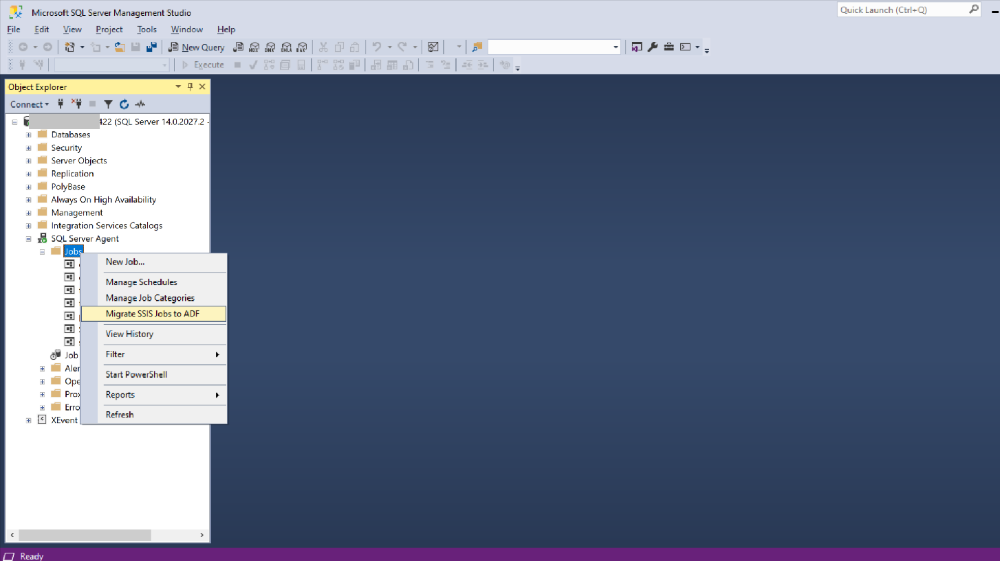
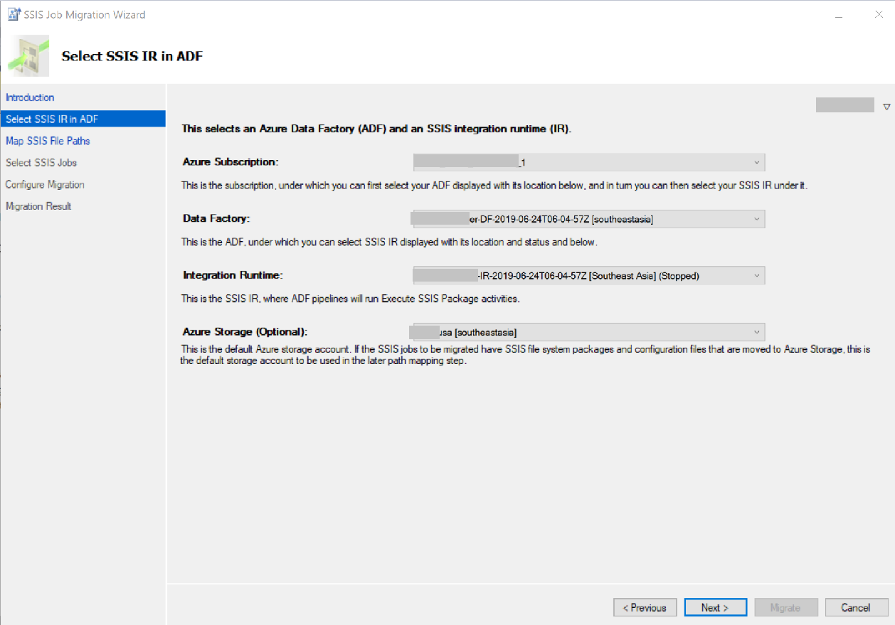
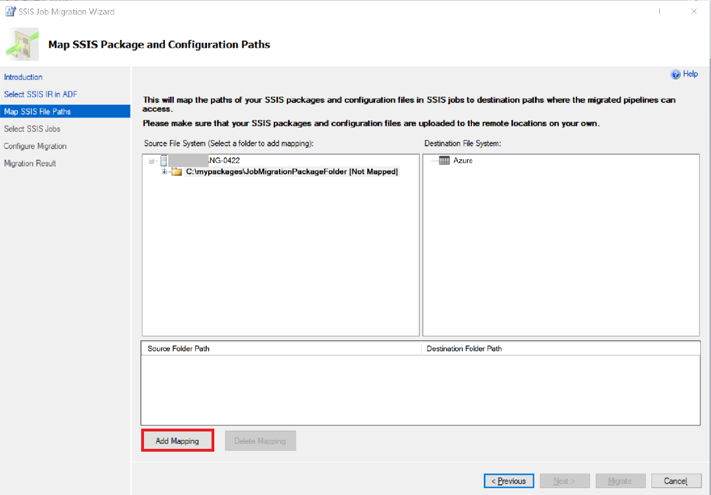
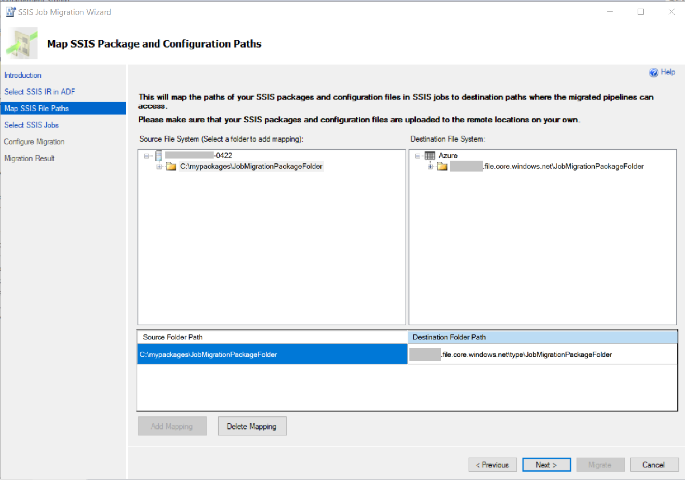
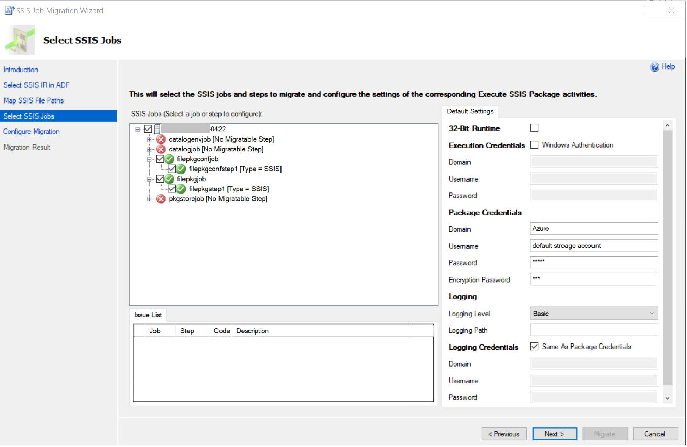
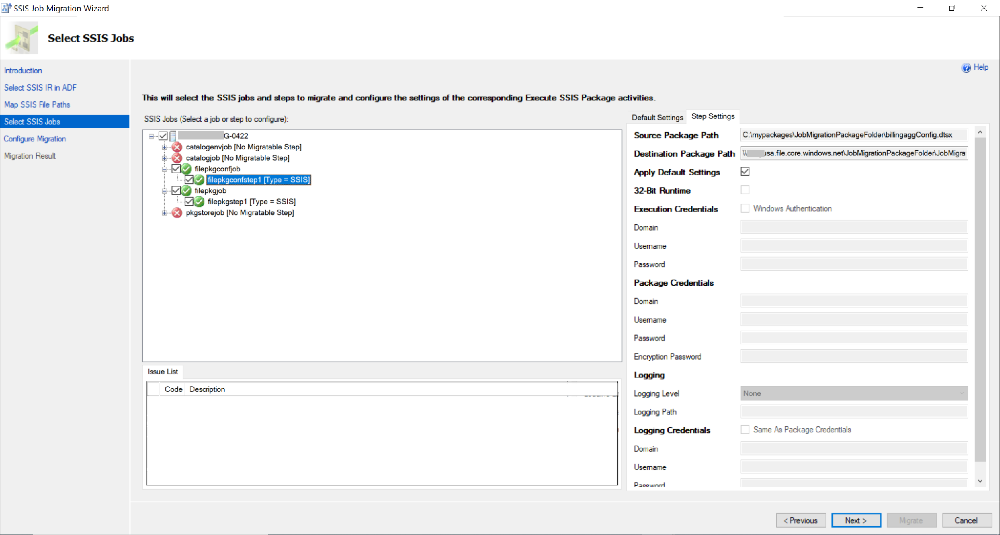
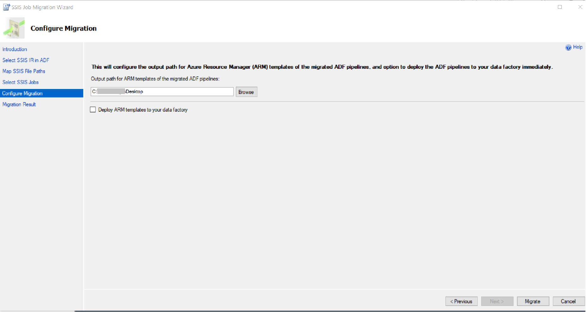
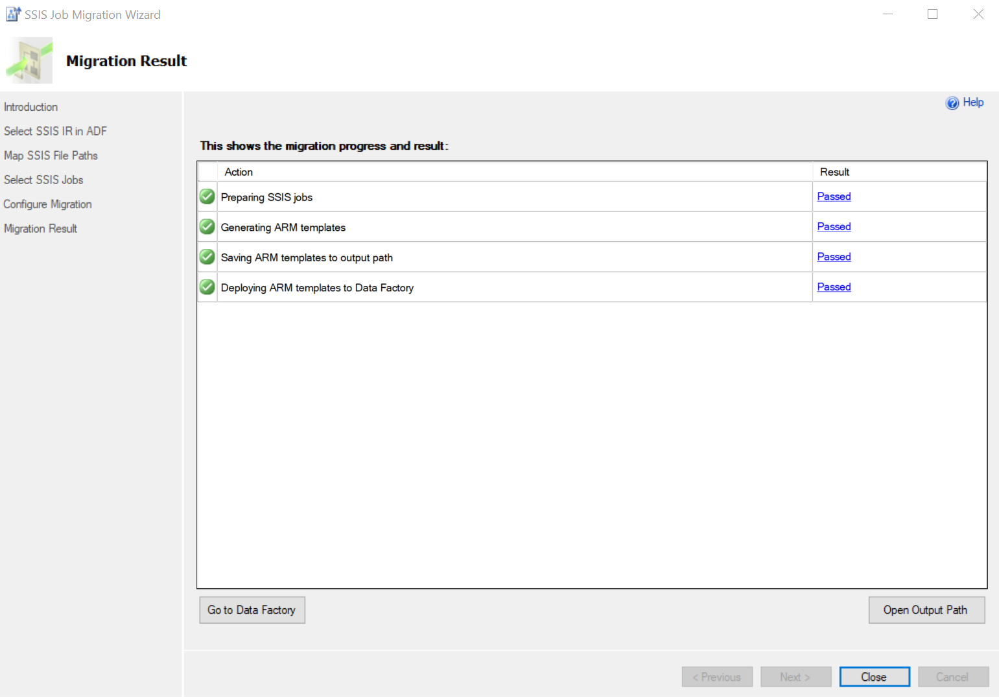

# Migrate SQL Server Agent jobs to ADF with SSMS

When [migrating on-premises SQL Server Integration Services (SSIS) workloads to SSIS in ADF](scenario-ssis-migration-overview.md), after SSIS packages are migrated, you can do batch migration of SQL Server Agent jobs with job step type of SQL Server Integration Services Package to Azure Data Factory (ADF) pipelines/activities/schedule triggers via SQL Server Management Studio (SSMS) **SSIS Job Migration Wizard**.

In general, for selected SQL agent jobs with applicable job step types, **SSIS Job Migration Wizard** can:

- map on-premises SSIS package location to where the packages are migrated to, which are accessible by SSIS in ADF.
    > [!NOTE]
    > Package location of File System is supported only.
- migrate applicable jobs with applicable job steps to corresponding ADF resources as below:

|SQL Agent job object  |ADF resource  |Notes|
|---------|---------|---------|
|SQL Agent job|pipeline     |Name of the pipeline will be *Generated for \<job name>*.     Built-in agent jobs are not applicable: <li> SSIS Server Maintenance Job <li> syspolicy_purge_history <li> collection_set_* <li> mdw_purge_data_* <li> sysutility_*|
|SSIS job step|Execute SSIS package activity|<li> Name of the activity will be \<step name>. <li> Proxy account used in job step will be migrated as Windows authentication of this activity. <li> *Execution options* except *Use 32-bit runtime* defined in job step will be ignored in migration. <li> *Verification* defined in job step will be ignored in migration.|
|schedule      |schedule trigger        |Name of the schedule trigger will be *Generated for \<schedule name>*.     Below options in SQL Agent job schedule will be ignored in migration: <li> Second-level interval. <li> *Start automatically when SQL Server Agent starts* <li> *Start whenever the CPUs become idle* <li> *weekday* and *weekend day* <time zone>   Below are the differences after SQL Agent job schedule is migrated to ADF schedule trigger: <li> ADF Schedule Trigger subsequent run is independent of the execution state of the antecedent triggered run. <li> ADF Schedule Trigger recurrence configuration differs from Daily frequency in SQL agent job.|

- generate Azure Resource Manager (ARM) templates in local output folder, and deploy to data factory directly or later manually. For more information about ADF Resource Manager templates, see [Microsoft.DataFactory resource types](https://docs.microsoft.com/azure/templates/microsoft.datafactory/allversions).

## Prerequisites

The feature described in this article requires SQL Server Management Studio version 18.5 or higher. To get the latest version of SSMS, see [Download SQL Server Management Studio (SSMS)](https://docs.microsoft.com/sql/ssms/download-sql-server-management-studio-ssms?view=sql-server-ver15).

## Migrate SSIS jobs to ADF

1. In SSMS, in Object Explorer, select SQL Server Agent, select Jobs, then right-click and select **Migrate SSIS Jobs to ADF**.

1. Sign In Azure, select Azure Subscription, Data Factory, and Integration Runtime. Azure Storage is optional, which is used in the package location mapping step if SSIS jobs to be migrated have SSIS File System packages.

1. Map the paths of SSIS packages and configuration files in SSIS jobs to destination paths where migrated pipelines can access. In this mapping step, you can:

    1. Select a source folder, then **Add Mapping**.
    1. Update source folder path. Valid paths are folder paths or parent folder paths of packages.
    1. Update destination folder path. Default is relative path to the default Storage account, which is selected in step 1.
    1. Delete a selected mapping via **Delete Mapping**.

1. Select applicable jobs to migrate, and configure the settings of corresponding *Executed SSIS Package activity*.

    - *Default Setting*, applies to all selected steps by default. For more information of each property, see *Settings tab* for the [Execute SSIS Package activity](how-to-invoke-ssis-package-ssis-activity.md) when package location is *File System (Package)*.
    
    - *Step Setting*, configure setting for a selected step.
        
        **Apply Default Setting**: default is selected. Unselect to configure setting for selected step only.  
        For more information of other properties, see *Settings tab* for the [Execute SSIS Package activity](how-to-invoke-ssis-package-ssis-activity.md) when package location is *File System (Package)*.
    

1. Generate and deploy ARM template.
    1. Select or input the output path for the ARM templates of the migrated ADF pipelines. Folder will be created automatically if not exists.
    2. Select the option of **Deploy ARM templates to your data factory**:
        - Default is unselected. You can deploy generated ARM templates later manually.
        - Select to deploy generated ARM templates to data factory directly.
    

1. Migrate, then check results.

## Next steps

[Run and monitor pipeline](how-to-invoke-ssis-package-ssis-activity.md)
