# Copy data from SAP Business Warehouse by using Azure Data Factory
[!INCLUDE[appliesto-adf-asa-md](includes/appliesto-adf-asa-md.md)]

This article shows how to use Azure Data Factory to copy data from SAP Business Warehouse (BW) via Open Hub to Azure Data Lake Storage Gen2. You can use a similar process to copy data to other [supported sink data stores](copy-activity-overview.md#supported-data-stores-and-formats).

> [!TIP]
> For general information about copying data from SAP BW, including SAP BW Open Hub integration and delta extraction flow, see [Copy data from SAP Business Warehouse via Open Hub by using Azure Data Factory](connector-sap-business-warehouse-open-hub.md).

## Prerequisites

- **Azure Data Factory**: If you don't have one, follow the steps to [create a data factory](quickstart-create-data-factory-portal.md#create-a-data-factory).

- **SAP BW Open Hub Destination (OHD) with destination type "Database Table"**: To create an OHD or to check that your OHD is configured correctly for Data Factory integration, see the [SAP BW Open Hub Destination configurations](#sap-bw-open-hub-destination-configurations) section of this article.

- **The SAP BW user needs the following permissions**:

  - Authorization for Remote Function Calls (RFC) and SAP BW.
  - Permissions to the “Execute” activity of the **S_SDSAUTH** authorization object.

- **A [self-hosted integration runtime (IR)](concepts-integration-runtime.md#self-hosted-integration-runtime) with SAP .NET connector 3.0**. Follow these setup steps:

  1. Install and register the self-hosted integration runtime, version 3.13 or later. (This process is described later in this article.)

  2. Download the [64-bit SAP Connector for Microsoft .NET 3.0](https://support.sap.com/en/product/connectors/msnet.html) from SAP's website, and install it on the same computer as the self-hosted IR. During installation, make sure that you select **Install Assemblies to GAC** in the **Optional setup steps** dialog box, as the following image shows:

     

## Do a full copy from SAP BW Open Hub

In the Azure portal, go to your data factory. Select **Author & Monitor** to open the Data Factory UI in a separate tab.

1. On the **Let's get started** page, select **Copy Data** to open the Copy Data tool.

2. On the **Properties** page, specify a **Task name**, and then select **Next**.

3. On the **Source data store** page, select **+Create new connection**. Select **SAP BW Open Hub** from the connector gallery, and then select **Continue**. To filter the connectors, you can type **SAP** in the search box.

4. On the **Specify SAP BW Open Hub connection** page, follow these steps to create a new connection.

   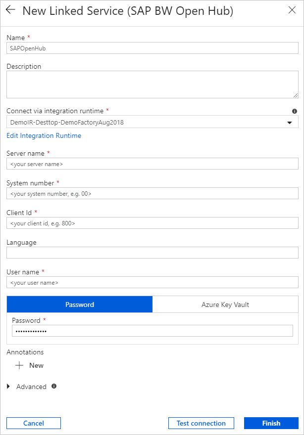

   1. From the **Connect via integration runtime** list, select an existing self-hosted IR. Or, choose to create one if you don't have one yet.

      To create a new self-hosted IR, select **+New**, and then select **Self-hosted**. Enter a **Name**, and then select **Next**. Select **Express setup** to install on the current computer, or follow the **Manual setup** steps that are provided.

      As mentioned in [Prerequisites](#prerequisites), make sure that you have SAP Connector for Microsoft .NET 3.0  installed on the same computer where the self-hosted IR is running.

   2. Fill in the SAP BW **Server name**, **System number**, **Client ID,** **Language** (if other than **EN**), **User name**, and **Password**.

   3. Select **Test connection** to validate the settings, and then select **Finish**.

   4. A new connection is created. Select **Next**.

5. On the **Select Open Hub Destinations** page, browse the Open Hub Destinations that are available in your SAP BW. Select the OHD to copy data from, and then select **Next**.

   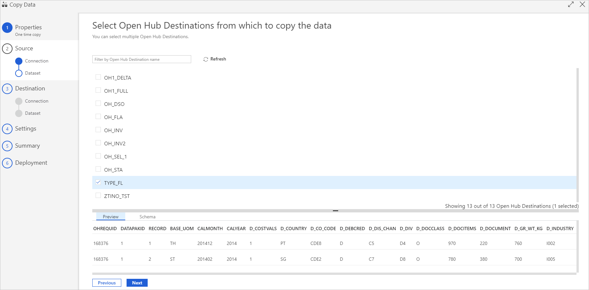

6. Specify a filter, if you need one. If your OHD only contains data from a single data-transfer process (DTP) execution with a single request ID, or you're sure that your DTP is finished and you want to copy the data, clear the **Exclude Last Request** check box.

   Learn more about these settings in the [SAP BW Open Hub Destination configurations](#sap-bw-open-hub-destination-configurations) section of this article. Select **Validate** to double-check what data will be returned. Then select **Next**.

   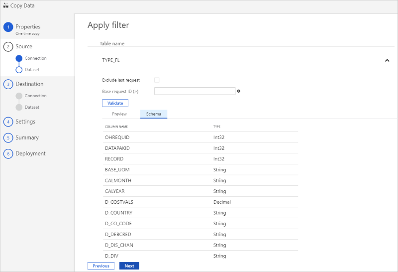

7. On the **Destination data store** page, select **+Create new connection** > **Azure Data Lake Storage Gen2** > **Continue**.

8. On the **Specify Azure Data Lake Storage connection** page, follow these steps to create a connection.

   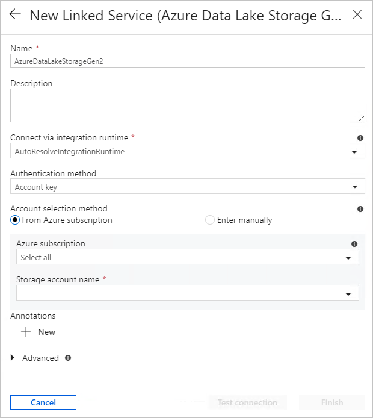

   1. Select your Data Lake Storage Gen2-capable account from the **Name** drop-down list.
   2. Select **Finish** to create the connection. Then select **Next**.

9. On the **Choose the output file or folder** page, enter **copyfromopenhub** as the output folder name. Then select **Next**.

   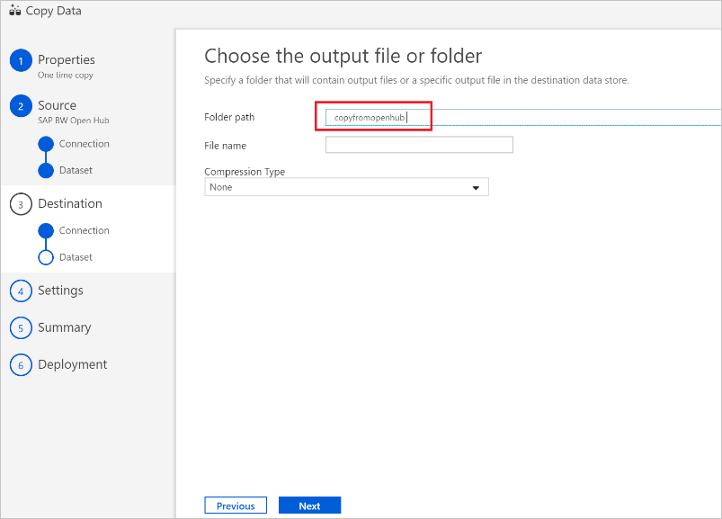

10. On the **File format setting** page, select **Next** to use the default settings.

    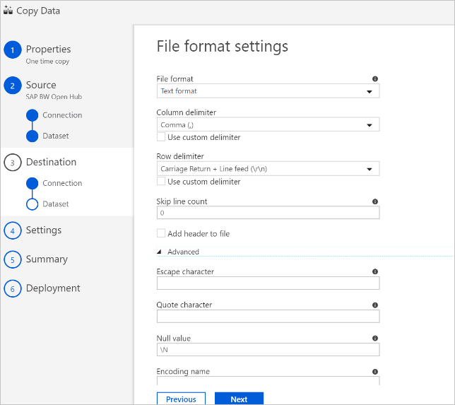

11. On the **Settings** page, expand **Performance settings**. Enter a value for **Degree of copy parallelism** such as 5 to load from SAP BW in parallel. Then select **Next**.

    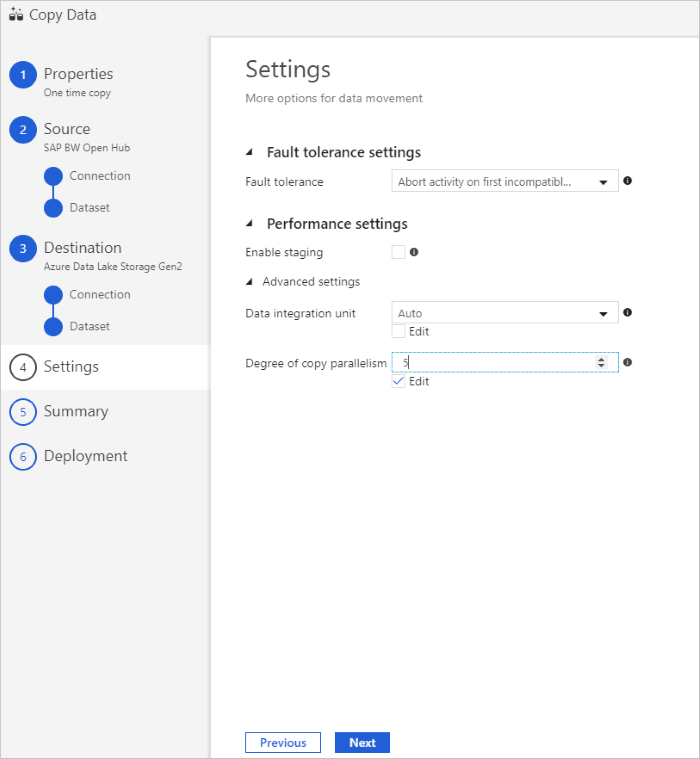

12. On the **Summary** page, review the settings. Then select **Next**.

13. On the **Deployment** page, select **Monitor** to monitor the pipeline.

    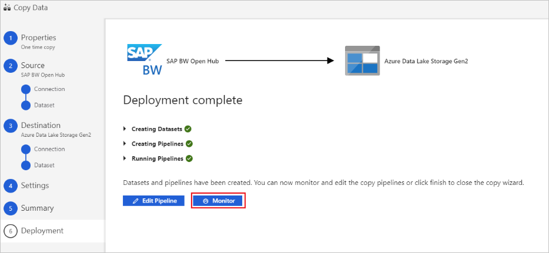

14. Notice that the **Monitor** tab on the left side of the page is automatically selected. The **Actions** column includes links to view activity-run details and to rerun the pipeline.

    

15. To view activity runs that are associated with the pipeline run, select **View Activity Runs** in the **Actions** column. There's only one activity (copy activity) in the pipeline, so you see only one entry. To switch back to the pipeline-runs view, select the **Pipelines** link at the top. Select **Refresh** to refresh the list.

    

16. To monitor the execution details for each copy activity, select the **Details** link, which is an eyeglasses icon below **Actions** in the activity-monitoring view. Available details include the data volume copied from the source to the sink, data throughput, execution steps and duration, and configurations used.

    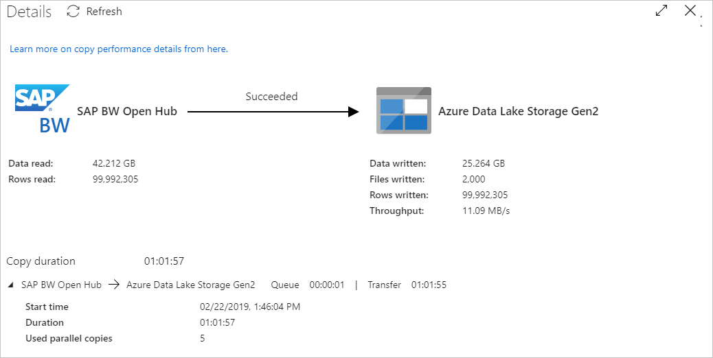

17. To view the **maximum Request ID**, go back to the activity-monitoring view and select **Output** under **Actions**.

    

    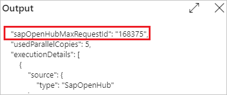

## Incremental copy from SAP BW Open Hub

> [!TIP]
> See [SAP BW Open Hub connector delta extraction flow](connector-sap-business-warehouse-open-hub.md#delta-extraction-flow) to learn how the SAP BW Open Hub connector in Data Factory copies incremental data from SAP BW. This article can also help you understand basic connector configuration.

Now, let's continue to configure incremental copy from SAP BW Open Hub.

Incremental copy uses a "high-watermark" mechanism that's based on the **request ID**. That ID is automatically generated in SAP BW Open Hub Destination by the DTP. The following diagram shows this workflow:


On the data factory **Let's get started** page, select **Create pipeline from template** to use the built-in template.

1. Search for **SAP BW** to find and select the **Incremental copy from SAP BW to Azure Data Lake Storage Gen2** template. This template copies data into Azure Data Lake Storage Gen2. You can use a similar workflow to copy to other sink types.

2. On the template's main page, select or create the following three connections, and then select **Use this template** in the lower-right corner of the window.

   - **Azure Blob storage**: In this walkthrough, we use Azure Blob storage to store the high watermark, which is the *max copied request ID*.
   - **SAP BW Open Hub**: This is the source to copy data from. Refer to the previous full-copy walkthrough for detailed configuration.
   - **Azure Data Lake Storage Gen2**: This is the sink to copy data to. Refer to the previous full-copy walkthrough for detailed configuration.

   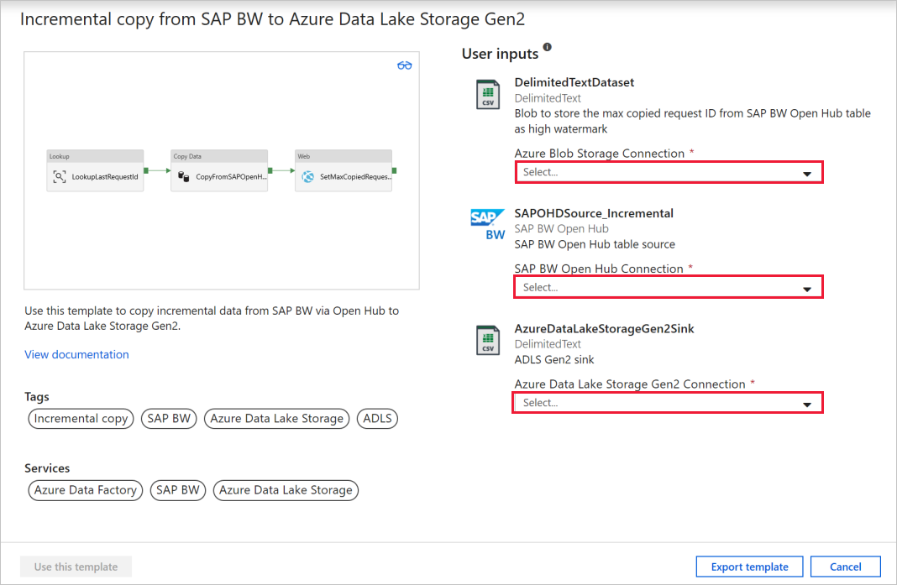

3. This template generates a pipeline with the following three activities and makes them chained on-success: *Lookup*, *Copy Data*, and *Web*.

   Go to the pipeline **Parameters** tab. You see all the configurations that you need to provide.

   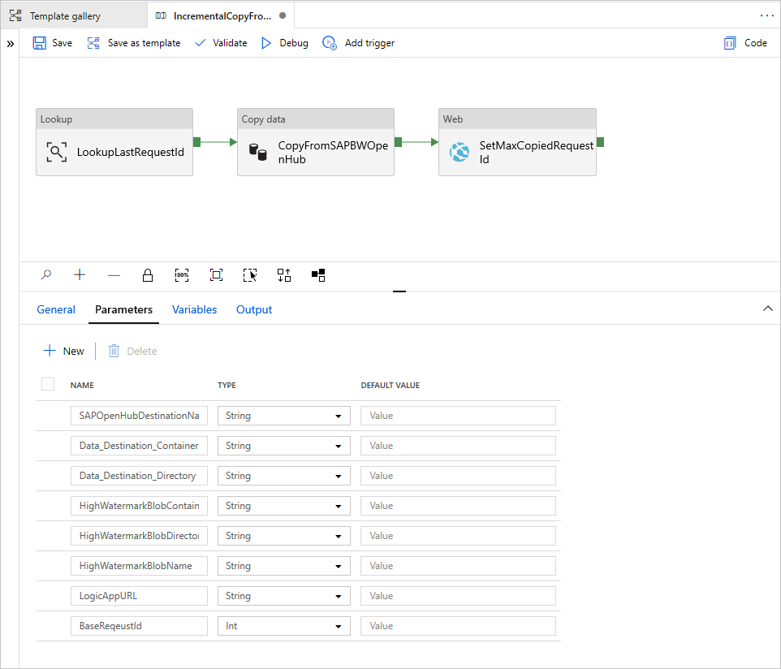

   - **SAPOpenHubDestinationName**: Specify the Open Hub table name to copy data from.

   - **Data_Destination_Container**: Specify the destination Azure Data Lake Storage Gen2 container to copy data to. If the container doesn't exist, the Data Factory copy activity creates one during execution.
  
   - **Data_Destination_Directory**: Specify the folder path under the Azure Data Lake Storage Gen2 container to copy data to. If the path doesn't exist, the Data Factory copy activity creates a path during execution.
  
   - **HighWatermarkBlobContainer**: Specify the container to store the high-watermark value.

   - **HighWatermarkBlobDirectory**: Specify the folder path under the container to store the high-watermark value.

   - **HighWatermarkBlobName**: Specify the blob name to store the high watermark value, such as `requestIdCache.txt`. In Blob storage, go to the corresponding path of HighWatermarkBlobContainer+HighWatermarkBlobDirectory+HighWatermarkBlobName, such as *container/path/requestIdCache.txt*. Create a blob with content 0.

      

   - **LogicAppURL**: In this template, we use WebActivity to call Azure Logic Apps to set the high-watermark value in Blob storage. Or, you can use Azure SQL Database to store it. Use a stored procedure activity to update the value.

      You must first create a logic app, as the following image shows. Then, paste in the **HTTP POST URL**.

      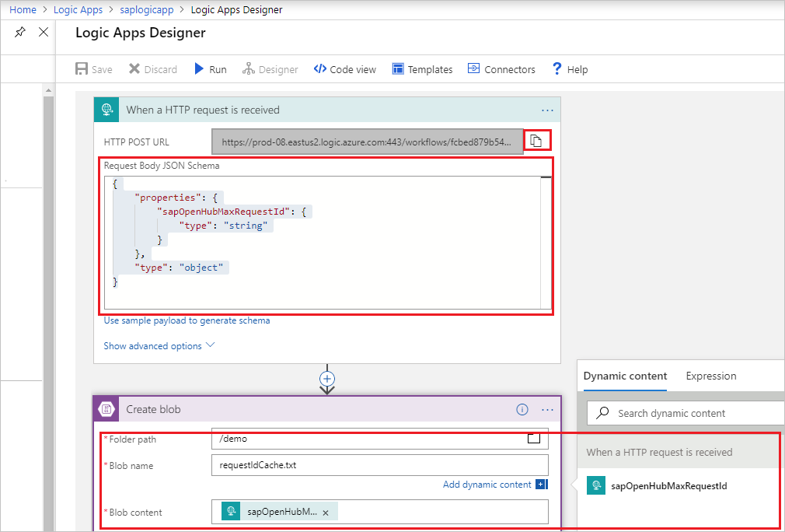

      1. Go to the Azure portal. Select a new **Logic Apps** service. Select **+Blank Logic App** to go to **Logic Apps Designer**.

      2. Create a trigger of **When an HTTP request is received**. Specify the HTTP request body as follows:

         ```json
         {
            "properties": {
               "sapOpenHubMaxRequestId": {
                  "type": "string"
               }
            },
            "type": "object"
         }
         ```

      3. Add a **Create blob** action. For **Folder path** and **Blob name**, use the same values that you configured previously in *HighWatermarkBlobContainer+HighWatermarkBlobDirectory* and *HighWatermarkBlobName*.

      4. Select **Save**. Then, copy the value of **HTTP POST URL** to use in the Data Factory pipeline.

4. After you provide the Data Factory pipeline parameters, select **Debug** > **Finish** to invoke a run to validate the configuration. Or, select **Publish** to publish all the changes, and then select **Add trigger** to execute a run.

## SAP BW Open Hub Destination configurations

This section introduces configuration of the SAP BW side to use the SAP BW Open Hub connector in Data Factory to copy data.

### Configure delta extraction in SAP BW

If you need both historical copy and incremental copy or only incremental copy, configure delta extraction in SAP BW.

1. Create the Open Hub Destination. You can create the OHD in SAP Transaction RSA1, which automatically creates the required transformation and data-transfer process. Use the following settings:

   - **ObjectType**: You can use any object type. Here, we use **InfoCube** as an example.
   - **Destination Type**: Select **Database Table**.
   - **Key of the Table**: Select **Technical Key**.
   - **Extraction**: Select **Keep Data and Insert Records into Table**.

   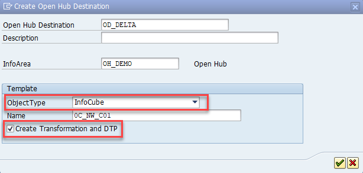

   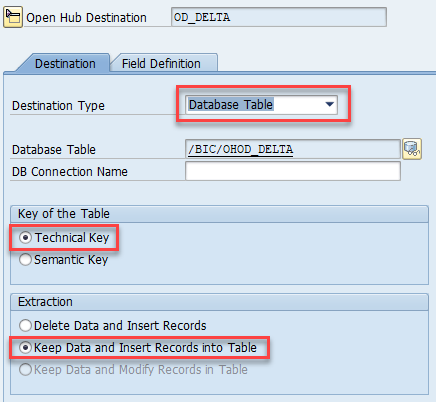

   You might increase the number of parallel running SAP work processes for the DTP:

   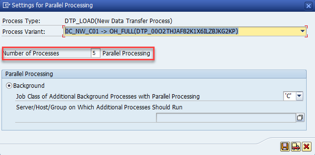

2. Schedule the DTP in process chains.

   A delta DTP for a cube only works if the necessary rows haven't been compressed. Make sure that BW cube compression isn't running before the DTP to the Open Hub table. The easiest way to do this is to integrate the DTP into your existing process chains. In the following example, the DTP (to the OHD) is inserted into the process chain between the *Adjust* (aggregate rollup) and *Collapse* (cube compression) steps.

   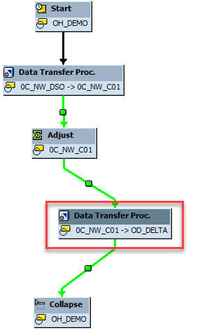

### Configure full extraction in SAP BW

In addition to delta extraction, you might want a full extraction of the same SAP BW InfoProvider. This usually applies if you want to do full copy but not incremental, or you want to [resync delta extraction](#resync-delta-extraction).

You can't have more than one DTP for the same OHD. So, you must create an additional OHD before delta extraction.

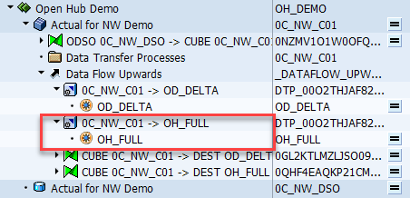

For a full load OHD, choose different options than for delta extraction:

- In OHD: Set the **Extraction** option to **Delete Data and Insert Records**. Otherwise, data will be extracted many times when you repeat the DTP in a BW process chain.

- In the DTP: Set **Extraction Mode** to **Full**. You must change the automatically created DTP from **Delta** to **Full** immediately after the OHD is created, as this image shows:

   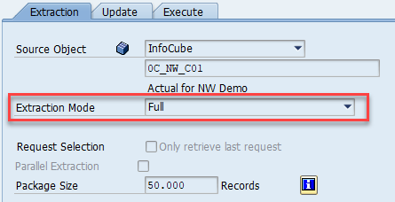

- In the BW Open Hub connector of Data Factory: Turn off **Exclude last request**. Otherwise, nothing will be extracted.

You typically run the full DTP manually. Or, you can create a process chain for the full DTP. It's typically a separate chain that's independent of your existing process chains. In either case, *make sure that the DTP is finished before you start the extraction by using Data Factory copy*. Otherwise, only partial data will be copied.

### Run delta extraction the first time

The first delta extraction is technically a *full extraction*. By default, the SAP BW Open Hub connector excludes the last request when it copies data. For the first delta extraction, no data is extracted by the Data Factory copy activity until a subsequent DTP generates delta data in the table with a separate request ID. There are two ways to avoid this scenario:

- Turn off the **Exclude last request** option for the first delta extraction. Make sure that the first delta DTP is finished before you start the delta extraction the first time.
-  Use the procedure for resyncing the delta extraction, as described in the next section.

### Resync delta extraction

The following scenarios change the data in SAP BW cubes but are not considered by the delta DTP:

- SAP BW selective deletion (of rows by using any filter condition)
- SAP BW request deletion (of faulty requests)

An SAP Open Hub Destination isn't a data-mart-controlled data target (in all SAP BW support packages since 2015). So, you can delete data from a cube without changing the data in the OHD. You must then resync the data of the cube with Data Factory:

1. Run a full extraction in Data Factory (by using a full DTP in SAP).
2. Delete all rows in the Open Hub table for the delta DTP.
3. Set the status of the delta DTP to **Fetched**.

After this, all subsequent delta DTPs and Data Factory delta extractions work as expected.

To set the status of the delta DTP to **Fetched**, you can use the following option to run the delta DTP manually:

*No Data Transfer; Delta Status in Source: Fetched*

## Next steps

Learn about SAP BW Open Hub connector support:

> [!div class="nextstepaction"]
>[SAP Business Warehouse Open Hub connector](connector-sap-business-warehouse-open-hub.md)
