# Alert and monitor data factories by using Azure Monitor

[!INCLUDE[appliesto-adf-xxx-md](includes/appliesto-adf-xxx-md.md)]

Cloud applications are complex and have many moving parts. Monitors provide data to help ensure that your applications stay up and running in a healthy state. Monitors also help you avoid potential problems and troubleshoot past ones.

You can use monitoring data to gain deep insights about your applications. This knowledge helps you improve application performance and maintainability. It also helps you automate actions that otherwise require manual intervention.

Azure Monitor provides base-level infrastructure metrics and logs for most Azure services. Azure diagnostic logs are emitted by a resource and provide rich, frequent data about the operation of that resource. And Azure Data Factory writes diagnostic logs in Monitor.

For details, see [Azure Monitor overview](https://docs.microsoft.com/azure/monitoring-and-diagnostics/monitoring-overview-azure-monitor).

## Keeping Azure Data Factory data

Data Factory stores pipeline-run data for only 45 days. Use Monitor if you want to keep that data for a longer time. With Monitor, you can route diagnostic logs for analysis. You can also keep them in a storage account so that you have factory information for your chosen duration.

## Diagnostic logs

* Save your diagnostic logs to a storage account for auditing or manual inspection. You can use the diagnostic settings to specify the retention time in days.
* Stream the logs to Azure Event Hubs. The logs become input to a partner service or to a custom analytics solution like Power BI.
* Analyze the logs with Log Analytics.

You can use a storage account or event-hub namespace that isn't in the subscription of the resource that emits logs. The user who configures the setting must have appropriate role-based access control (RBAC) access to both subscriptions.

## Set up diagnostic logs

### Diagnostic settings

Use diagnostic settings to configure diagnostic logs for noncompute resources. The settings for a resource control have the following features:

* They specify where diagnostic logs are sent. Examples include an Azure storage account, an Azure event hub, or Monitor logs.
* They specify which log categories are sent.
* They specify how long each log category should be kept in a storage account.
* A retention of zero days means logs are kept forever. Otherwise, the value can be any number of days from 1 through 2,147,483,647.
* If retention policies are set but storing logs in a storage account is disabled, the retention policies have no effect. For example, this condition can happen when only Event Hubs or Monitor logs options are selected.
* Retention policies are applied per day. The boundary between days occurs at midnight Coordinated Universal Time (UTC). At the end of a day, logs from days that are beyond the retention policy are deleted. For example, if you have a retention policy of one day, at the beginning of today the logs from before yesterday are deleted.

### Enable diagnostic logs via the Azure Monitor REST API

#### Create or update a diagnostics setting in the Monitor REST API

##### Request

```
PUT
https://management.azure.com/{resource-id}/providers/microsoft.insights/diagnosticSettings/service?api-version={api-version}
```

##### Headers

* Replace `{api-version}` with `2016-09-01`.
* Replace `{resource-id}` with the ID of the resource for which you want to edit diagnostic settings. For more information, see [Using Resource groups to manage your Azure resources](../azure-resource-manager/management/manage-resource-groups-portal.md).
* Set the `Content-Type` header to `application/json`.
* Set the authorization header to the JSON web token that you got from Azure Active Directory (Azure AD). For more information, see [Authenticating requests](../active-directory/develop/authentication-scenarios.md).

##### Body

```json
{
    "properties": {
        "storageAccountId": "/subscriptions/<subID>/resourceGroups/<resourceGroupName>/providers/Microsoft.Storage/storageAccounts/<storageAccountName>",
        "serviceBusRuleId": "/subscriptions/<subID>/resourceGroups/<resourceGroupName>/providers/Microsoft.EventHub/namespaces/<eventHubName>/authorizationrules/RootManageSharedAccessKey",
        "workspaceId": "/subscriptions/<subID>/resourceGroups/<resourceGroupName>/providers/Microsoft.OperationalInsights/workspaces/<LogAnalyticsName>",
        "metrics": [
        ],
        "logs": [
                {
                    "category": "PipelineRuns",
                    "enabled": true,
                    "retentionPolicy": {
                        "enabled": false,
                        "days": 0
                    }
                },
                {
                    "category": "TriggerRuns",
                    "enabled": true,
                    "retentionPolicy": {
                        "enabled": false,
                        "days": 0
                    }
                },
                {
                    "category": "ActivityRuns",
                    "enabled": true,
                    "retentionPolicy": {
                        "enabled": false,
                        "days": 0
                    }
                }
            ]
    },
    "location": ""
}
```

| Property | Type | Description |
| --- | --- | --- |
| **storageAccountId** |String | The resource ID of the storage account to which you want to send diagnostic logs. |
| **serviceBusRuleId** |String | The service-bus rule ID of the service-bus namespace in which you want to have Event Hubs created for streaming diagnostic logs. The rule ID has the format `{service bus resource ID}/authorizationrules/{key name}`.|
| **workspaceId** | Complex Type | An array of metric time grains and their retention policies. This property's value is empty. |
|**metrics**| Parameter values of the pipeline run to be passed to the invoked pipeline| A JSON object that maps parameter names to argument values. |
| **logs**| Complex Type| The name of a diagnostic-log category for a resource type. To get the list of diagnostic-log categories for a resource, perform a GET diagnostic-settings operation. |
| **category**| String| An array of log categories and their retention policies. |
| **timeGrain** | String | The granularity of metrics, which are captured in ISO 8601 duration format. The property value must be `PT1M`, which specifies one minute. |
| **enabled**| Boolean | Specifies whether collection of the metric or log category is enabled for this resource. |
| **retentionPolicy**| Complex Type| Describes the retention policy for a metric or log category. This property is used for storage accounts only. |
|**days**| Int| The number of days to keep the metrics or logs. If the property value is 0, the logs are kept forever. This property is used for storage accounts only. |

##### Response

200 OK.


```json
{
    "id": "/subscriptions/<subID>/resourcegroups/adf/providers/microsoft.datafactory/factories/shloadobetest2/providers/microsoft.insights/diagnosticSettings/service",
    "type": null,
    "name": "service",
    "location": null,
    "kind": null,
    "tags": null,
    "properties": {
        "storageAccountId": "/subscriptions/<subID>/resourceGroups/<resourceGroupName>//providers/Microsoft.Storage/storageAccounts/<storageAccountName>",
        "serviceBusRuleId": "/subscriptions/<subID>/resourceGroups/<resourceGroupName>//providers/Microsoft.EventHub/namespaces/<eventHubName>/authorizationrules/RootManageSharedAccessKey",
        "workspaceId": "/subscriptions/<subID>/resourceGroups/<resourceGroupName>//providers/Microsoft.OperationalInsights/workspaces/<LogAnalyticsName>",
        "eventHubAuthorizationRuleId": null,
        "eventHubName": null,
        "metrics": [],
        "logs": [
            {
                "category": "PipelineRuns",
                "enabled": true,
                "retentionPolicy": {
                    "enabled": false,
                    "days": 0
                }
            },
            {
                "category": "TriggerRuns",
                "enabled": true,
                "retentionPolicy": {
                    "enabled": false,
                    "days": 0
                }
            },
            {
                "category": "ActivityRuns",
                "enabled": true,
                "retentionPolicy": {
                    "enabled": false,
                    "days": 0
                }
            }
        ]
    },
    "identity": null
}
```

#### Get information about diagnostics settings in the Monitor REST API

##### Request

```
GET
https://management.azure.com/{resource-id}/providers/microsoft.insights/diagnosticSettings/service?api-version={api-version}
```

##### Headers

* Replace `{api-version}` with `2016-09-01`.
* Replace `{resource-id}` with the ID of the resource for which you want to edit diagnostic settings. For more information, see [Using Resource groups to manage your Azure resources](../azure-resource-manager/management/manage-resource-groups-portal.md).
* Set the `Content-Type` header to `application/json`.
* Set the authorization header to a JSON web token that you got from Azure AD. For more information, see [Authenticating requests](../active-directory/develop/authentication-scenarios.md).

##### Response

200 OK.

```json
{
    "id": "/subscriptions/<subID>/resourcegroups/adf/providers/microsoft.datafactory/factories/shloadobetest2/providers/microsoft.insights/diagnosticSettings/service",
    "type": null,
    "name": "service",
    "location": null,
    "kind": null,
    "tags": null,
    "properties": {
        "storageAccountId": "/subscriptions/<subID>/resourceGroups/shloprivate/providers/Microsoft.Storage/storageAccounts/azmonlogs",
        "serviceBusRuleId": "/subscriptions/<subID>/resourceGroups/shloprivate/providers/Microsoft.EventHub/namespaces/shloeventhub/authorizationrules/RootManageSharedAccessKey",
        "workspaceId": "/subscriptions/<subID>/resourceGroups/ADF/providers/Microsoft.OperationalInsights/workspaces/mihaipie",
        "eventHubAuthorizationRuleId": null,
        "eventHubName": null,
        "metrics": [],
        "logs": [
            {
                "category": "PipelineRuns",
                "enabled": true,
                "retentionPolicy": {
                    "enabled": false,
                    "days": 0
                }
            },
            {
                "category": "TriggerRuns",
                "enabled": true,
                "retentionPolicy": {
                    "enabled": false,
                    "days": 0
                }
            },
            {
                "category": "ActivityRuns",
                "enabled": true,
                "retentionPolicy": {
                    "enabled": false,
                    "days": 0
                }
            }
        ]
    },
    "identity": null
}

```
For more information, see [Diagnostic Settings](https://docs.microsoft.com/rest/api/monitor/diagnosticsettings).

## Schema of logs and events

### Monitor schema

#### Activity-run log attributes

```json
{
   "Level": "",
   "correlationId":"",
   "time":"",
   "activityRunId":"",
   "pipelineRunId":"",
   "resourceId":"",
   "category":"ActivityRuns",
   "level":"Informational",
   "operationName":"",
   "pipelineName":"",
   "activityName":"",
   "start":"",
   "end":"",
   "properties":
       {
          "Input": "{
              "source": {
                "type": "BlobSource"
              },
              "sink": {
                "type": "BlobSink"
              }
           }",
          "Output": "{"dataRead":121,"dataWritten":121,"copyDuration":5,
               "throughput":0.0236328132,"errors":[]}",
          "Error": "{
              "errorCode": "null",
              "message": "null",
              "failureType": "null",
              "target": "CopyBlobtoBlob"
        }
    }
}
```

| Property | Type | Description | Example |
| --- | --- | --- | --- |
| **Level** |String | The level of the diagnostic logs. For activity-run logs, set the property value to 4. | `4` |
| **correlationId** |String | The unique ID for tracking a particular request. | `319dc6b4-f348-405e-b8d7-aafc77b73e77` |
| **time** | String | The time of the event in the timespan UTC format `YYYY-MM-DDTHH:MM:SS.00000Z`. | `2017-06-28T21:00:27.3534352Z` |
|**activityRunId**| String| The ID of the activity run. | `3a171e1f-b36e-4b80-8a54-5625394f4354` |
|**pipelineRunId**| String| The ID of the pipeline run. | `9f6069d6-e522-4608-9f99-21807bfc3c70` |
|**resourceId**| String | The ID associated with the data-factory resource. | `/SUBSCRIPTIONS/<subID>/RESOURCEGROUPS/<resourceGroupName>/PROVIDERS/MICROSOFT.DATAFACTORY/FACTORIES/<dataFactoryName>` |
|**category**| String | The category of the diagnostic logs. Set the property value to `ActivityRuns`. | `ActivityRuns` |
|**level**| String | The level of the diagnostic logs. Set the property value to `Informational`. | `Informational` |
|**operationName**| String | The name of the activity with its status. If the activity is the start heartbeat, the property value is `MyActivity -`. If the activity is the end heartbeat, the property value is `MyActivity - Succeeded`. | `MyActivity - Succeeded` |
|**pipelineName**| String | The name of the pipeline. | `MyPipeline` |
|**activityName**| String | The name of the activity. | `MyActivity` |
|**start**| String | The start time of the activity runs in timespan UTC format. | `2017-06-26T20:55:29.5007959Z`|
|**end**| String | The end time of the activity runs in timespan UTC format. If the diagnostic log shows that an activity has started but not yet ended, the property value is `1601-01-01T00:00:00Z`. | `2017-06-26T20:55:29.5007959Z` |

#### Pipeline-run log attributes

```json
{
   "Level": "",
   "correlationId":"",
   "time":"",
   "runId":"",
   "resourceId":"",
   "category":"PipelineRuns",
   "level":"Informational",
   "operationName":"",
   "pipelineName":"",
   "start":"",
   "end":"",
   "status":"",
   "properties":
    {
      "Parameters": {
        "<parameter1Name>": "<parameter1Value>"
      },
      "SystemParameters": {
        "ExecutionStart": "",
        "TriggerId": "",
        "SubscriptionId": ""
      }
    }
}
```

| Property | Type | Description | Example |
| --- | --- | --- | --- |
| **Level** |String | The level of the diagnostic logs. For activity-run logs, set the property value to 4. | `4` |
| **correlationId** |String | The unique ID for tracking a particular request. | `319dc6b4-f348-405e-b8d7-aafc77b73e77` |
| **time** | String | The time of the event in the timespan UTC format `YYYY-MM-DDTHH:MM:SS.00000Z`. | `2017-06-28T21:00:27.3534352Z` |
|**runId**| String| The ID of the pipeline run. | `9f6069d6-e522-4608-9f99-21807bfc3c70` |
|**resourceId**| String | The ID associated with the data-factory resource. | `/SUBSCRIPTIONS/<subID>/RESOURCEGROUPS/<resourceGroupName>/PROVIDERS/MICROSOFT.DATAFACTORY/FACTORIES/<dataFactoryName>` |
|**category**| String | The category of the diagnostic logs. Set the property value to `PipelineRuns`. | `PipelineRuns` |
|**level**| String | The level of the diagnostic logs. Set the property value to `Informational`. | `Informational` |
|**operationName**| String | The name of the pipeline along with its status. After the pipeline run is finished, the property value is `Pipeline - Succeeded`. | `MyPipeline - Succeeded`. |
|**pipelineName**| String | The name of the pipeline. | `MyPipeline` |
|**start**| String | The start time of the activity runs in timespan UTC format. | `2017-06-26T20:55:29.5007959Z`. |
|**end**| String | The end time of the activity runs in timespan UTC format. If the diagnostic log shows an activity has started but not yet ended, the property value is `1601-01-01T00:00:00Z`.  | `2017-06-26T20:55:29.5007959Z` |
|**status**| String | The final status of the pipeline run. Possible property values are `Succeeded` and `Failed`. | `Succeeded`|

#### Trigger-run log attributes

```json
{
   "Level": "",
   "correlationId":"",
   "time":"",
   "triggerId":"",
   "resourceId":"",
   "category":"TriggerRuns",
   "level":"Informational",
   "operationName":"",
   "triggerName":"",
   "triggerType":"",
   "triggerEvent":"",
   "start":"",
   "status":"",
   "properties":
   {
      "Parameters": {
        "TriggerTime": "",
       "ScheduleTime": ""
      },
      "SystemParameters": {}
    }
}

```

| Property | Type | Description | Example |
| --- | --- | --- | --- |
| **Level** |String | The level of the diagnostic logs. For activity-run logs, set the property value to 4. | `4` |
| **correlationId** |String | The unique ID for tracking a particular request. | `319dc6b4-f348-405e-b8d7-aafc77b73e77` |
| **time** | String | The time of the event in the timespan UTC format `YYYY-MM-DDTHH:MM:SS.00000Z`. | `2017-06-28T21:00:27.3534352Z` |
|**triggerId**| String| The ID of the trigger run. | `08587023010602533858661257311` |
|**resourceId**| String | The ID associated with the data-factory resource. | `/SUBSCRIPTIONS/<subID>/RESOURCEGROUPS/<resourceGroupName>/PROVIDERS/MICROSOFT.DATAFACTORY/FACTORIES/<dataFactoryName>` |
|**category**| String | The category of the diagnostic logs. Set the property value to `PipelineRuns`. | `PipelineRuns` |
|**level**| String | The level of the diagnostic logs. Set the property value to `Informational`. | `Informational` |
|**operationName**| String | The name of the trigger with its final status, which indicates whether the trigger successfully fired. If the heartbeat was successful, the property value is `MyTrigger - Succeeded`. | `MyTrigger - Succeeded` |
|**triggerName**| String | The name of the trigger. | `MyTrigger` |
|**triggerType**| String | The type of the trigger. Possible property values are `Manual Trigger` and `Schedule Trigger`. | `ScheduleTrigger` |
|**triggerEvent**| String | The event of the trigger. | `ScheduleTime - 2017-07-06T01:50:25Z` |
|**start**| String | The start time of the trigger firing in timespan UTC format. | `2017-06-26T20:55:29.5007959Z`|
|**status**| String | The final status showing whether the trigger successfully fired. Possible property values are `Succeeded` and `Failed`. | `Succeeded`|

### Log Analytics schema

Log Analytics inherits the schema from Monitor with the following exceptions:

* The first letter in each column name is capitalized. For example, the column name "correlationId" in Monitor is "CorrelationId" in Log Analytics.
* There's no "Level" column.
* The dynamic "properties" column is preserved as the following dynamic JSON blob type.

    | Azure Monitor column | Log Analytics column | Type |
    | --- | --- | --- |
    | $.properties.UserProperties | UserProperties | Dynamic |
    | $.properties.Annotations | Annotations | Dynamic |
    | $.properties.Input | Input | Dynamic |
    | $.properties.Output | Output | Dynamic |
    | $.properties.Error.errorCode | ErrorCode | int |
    | $.properties.Error.message | ErrorMessage | string |
    | $.properties.Error | Error | Dynamic |
    | $.properties.Predecessors | Predecessors | Dynamic |
    | $.properties.Parameters | Parameters | Dynamic |
    | $.properties.SystemParameters | SystemParameters | Dynamic |
    | $.properties.Tags | Tags | Dynamic |
    
## Metrics

With Monitor, you can gain visibility into the performance and health of your Azure workloads. The most important type of Monitor data is the metric, which is also called the performance counter. Metrics are emitted by most Azure resources. Monitor provides several ways to configure and consume these metrics for monitoring and troubleshooting.

Azure Data Factory version 2 emits the following metrics.

| **Metric**           | **Metric display name**         | **Unit** | **Aggregation type** | **Description**                                       |
|----------------------|---------------------------------|----------|----------------------|-------------------------------------------------------|
| PipelineSucceededRuns | Succeeded pipeline runs metrics | Count    | Total                | The total number of pipeline runs that succeeded within a minute window. |
| PipelineFailedRuns   | Failed pipeline runs metrics    | Count    | Total                | The total number of pipeline runs that failed within a minute window.    |
| ActivitySucceededRuns | Succeeded activity runs metrics | Count    | Total                | The total number of activity runs that succeeded within a minute window.  |
| ActivityFailedRuns   | Failed activity runs metrics    | Count    | Total                | The total number of activity runs that failed within a minute window.     |
| TriggerSucceededRuns | Succeeded trigger runs metrics  | Count    | Total                | The total number of trigger runs that succeeded within a minute window.   |
| TriggerFailedRuns    | Failed trigger runs metrics     | Count    | Total                | The total number of trigger runs that failed within a minute window.      |

To access the metrics, complete the instructions in [Azure Monitor data platform](https://docs.microsoft.com/azure/monitoring-and-diagnostics/monitoring-overview-metrics).

> [!NOTE]
> Only completed, triggered activity and pipeline runs events are emitted. In progress and sandbox/debug runs are **not** emitted. 

## Monitor Data Factory metrics with Azure Monitor

You can use Data Factory integration with Monitor to route data to Monitor. This integration is useful in the following scenarios:

* You want to write complex queries on a rich set of metrics that is published by Data Factory to Monitor. You can create custom alerts on these queries via Monitor.

* You want to monitor across data factories. You can route data from multiple data factories to a single Monitor workspace.

For a seven-minute introduction and demonstration of this feature, watch the following video:

> [!VIDEO https://channel9.msdn.com/Shows/Azure-Friday/Monitor-Data-Factory-pipelines-using-Operations-Management-Suite-OMS/player]

### Configure diagnostic settings and workspace

Create or add diagnostic settings for your data factory.

1. In the portal, go to Monitor. Select **Settings** > **Diagnostic settings**.

1. Select the data factory for which you want to set a diagnostic setting.

1. If no settings exist on the selected data factory, you're prompted to create a setting. Select **Turn on diagnostics**.

   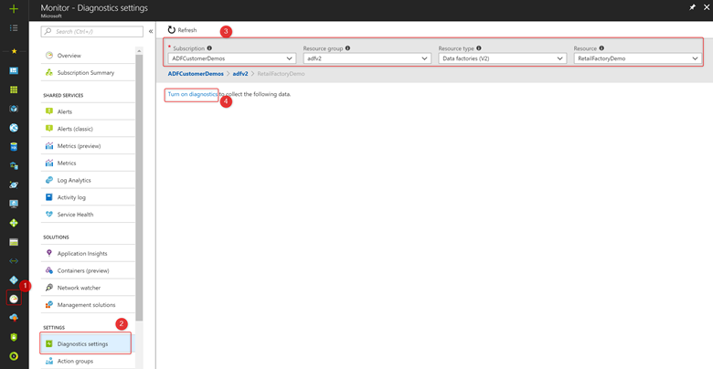

   If there are existing settings on the data factory, you see a list of settings already configured on the data factory. Select **Add diagnostic setting**.

   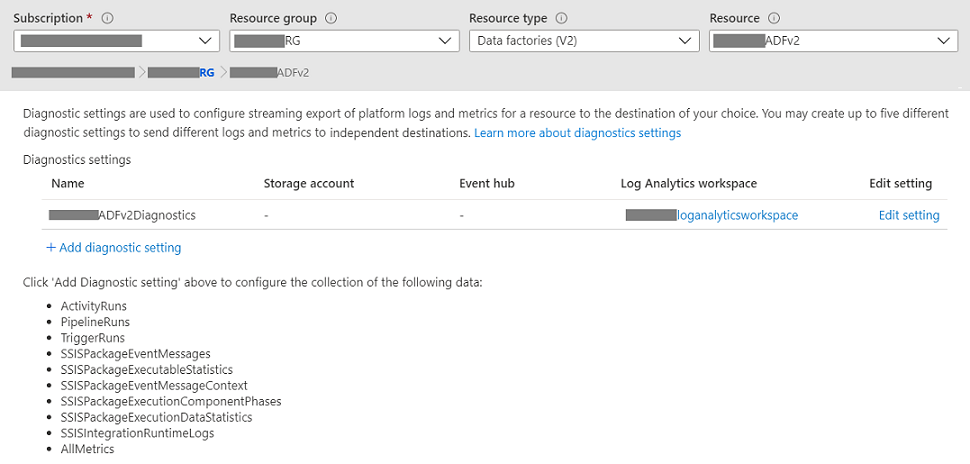

1. Give your setting a name, select **Send to Log Analytics**, and then select a workspace from **Log Analytics Workspace**.

    

1. Select **Save**.

After a few moments, the new setting appears in your list of settings for this data factory. Diagnostic logs are streamed to that workspace as soon as new event data is generated. Up to 15 minutes might elapse between when an event is emitted and when it appears in Log Analytics.

* In _Resource-Specific_ mode, diagnostic logs from Azure Data Factory flow into _ADFPipelineRun_, _ADFTriggerRun_, and _ADFActivityRun_ tables
* In _Azure-Diagnostics_ mode, diagnostic logs flow into _AzureDiagnostics_ table

> [!NOTE]
> Because an Azure log table can't have more than 500 columns, we highly recommended you select Resource-Specific mode. For more information, see [Log Analytics Known Limitations](../azure-monitor/platform/resource-logs-collect-workspace.md#column-limit-in-azurediagnostics).

### Install Azure Data Factory Analytics from Azure Marketplace


Select **Create** and then select **OMS Workspace** and **OMS Workspace settings**.

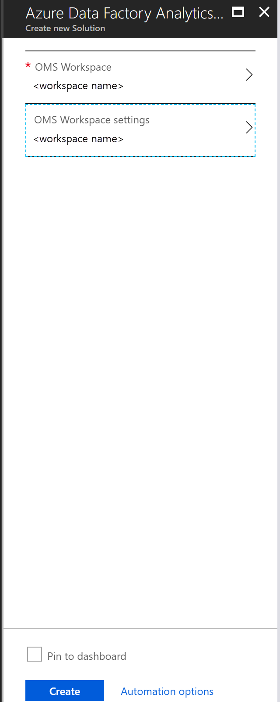

### Monitor Data Factory metrics

Installing Azure Data Factory Analytics creates a default set of views so that the following metrics become enabled:

- ADF Runs - 1) Pipeline Runs by Data Factory
 
- ADF Runs- 2) Activity Runs by Data Factory

- ADF Runs - 3) Trigger Runs by Data Factory

- ADF Errors - 1) Top 10 Pipeline Errors by Data Factory

- ADF Errors - 2) Top 10 Activity Runs by Data Factory

- ADF Errors - 3) Top 10 Trigger Errors by Data Factory

- ADF Statistics - 1) Activity Runs by Type

- ADF Statistics - 2) Trigger Runs by Type

- ADF Statistics - 3) Max Pipeline Runs Duration

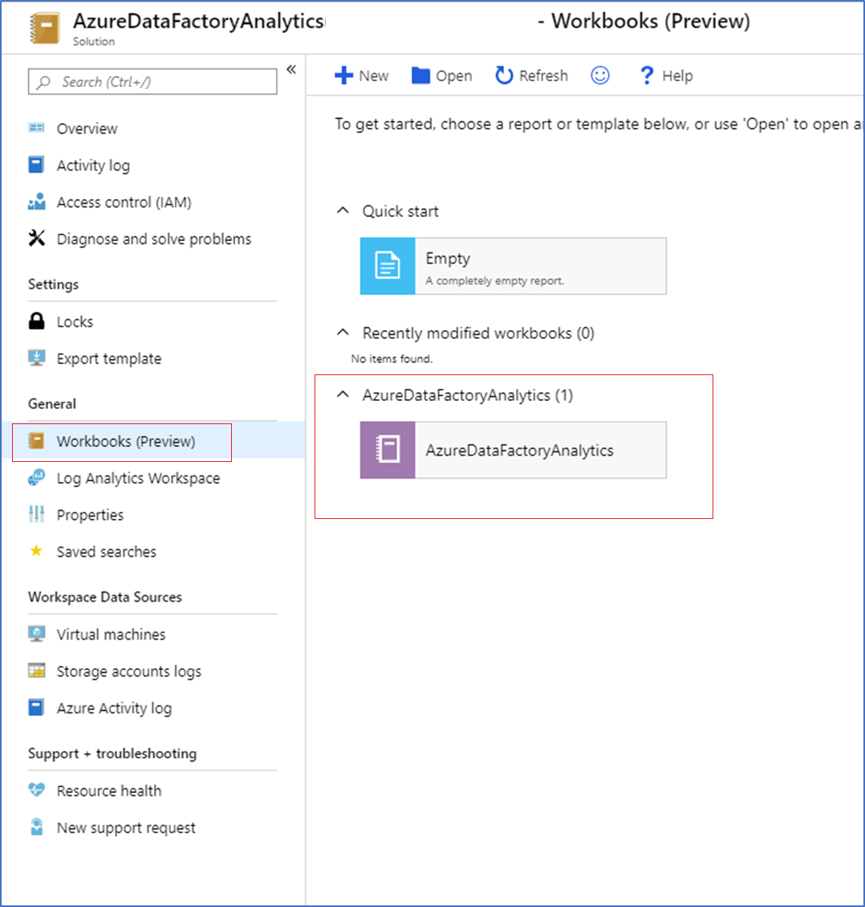

You can visualize the preceding metrics, look at the queries behind these metrics, edit the queries, create alerts, and take other actions.

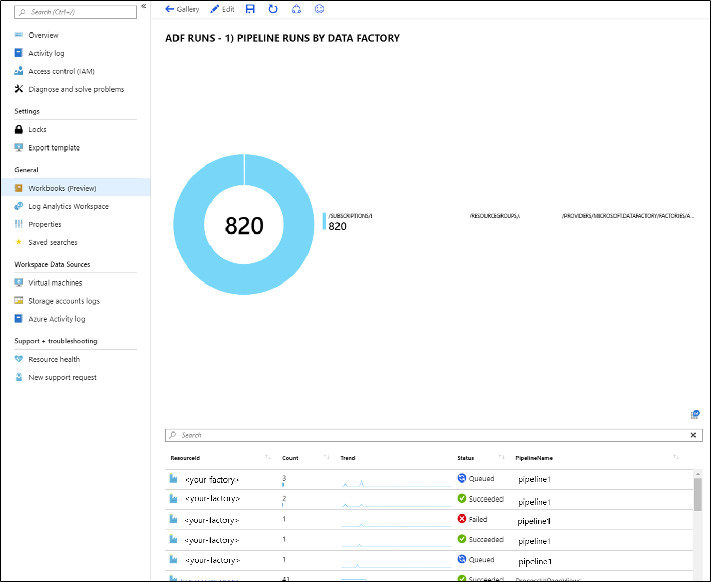

> [!NOTE]
> Azure Data Factory Analytics (Preview) sends diagnostic logs to _Resource-specific_ destination tables. You can write queries against the following tables: _ADFPipelineRun_, _ADFTriggerRun_, and _ADFActivityRun_.

## Alerts

Sign in to the Azure portal and select **Monitor** > **Alerts** to create alerts.

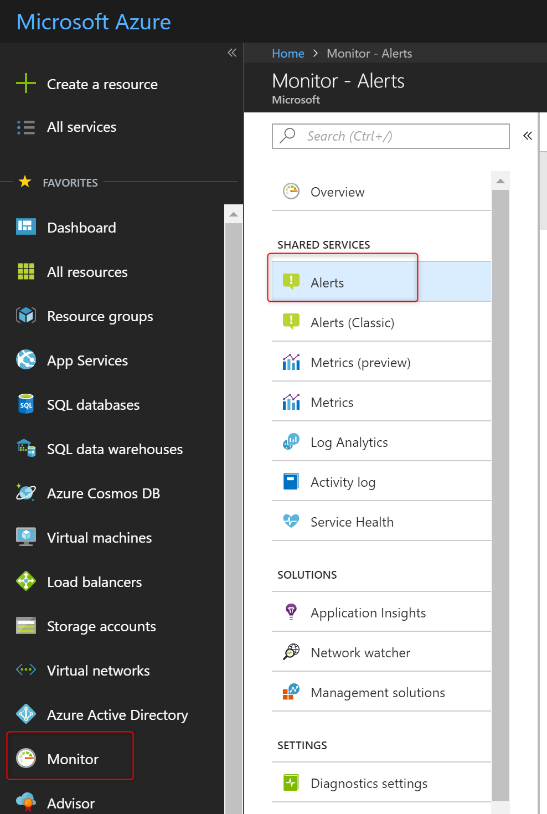

### Create Alerts

1. Select **+ New Alert rule** to create a new alert.

    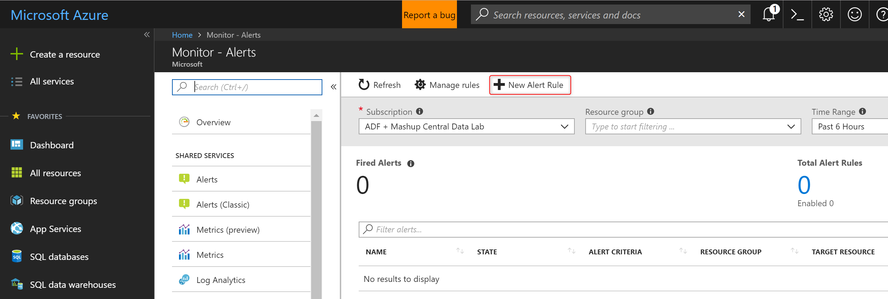

1. Define the alert condition.

    > [!NOTE]
    > Make sure to select **All** in the **Filter by resource type** drop-down list.

    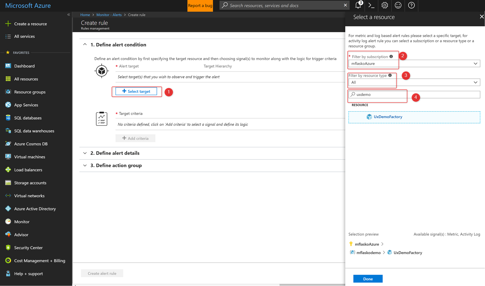

    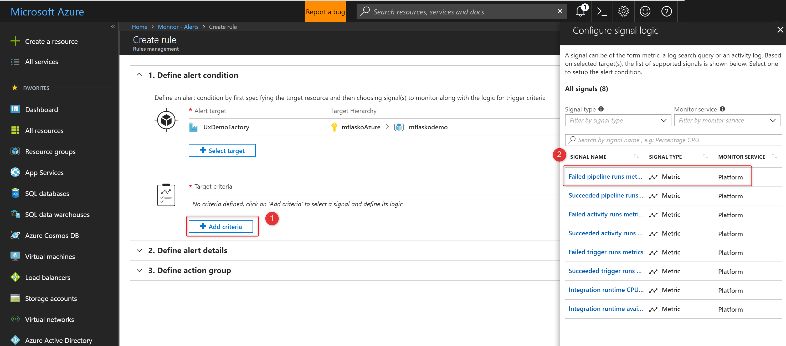

    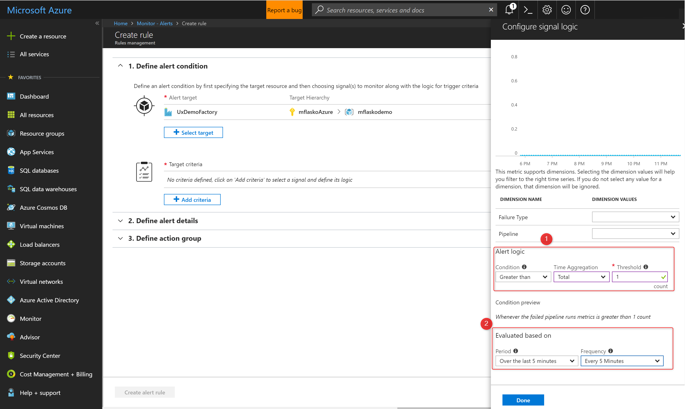

1. Define the alert details.

    

1. Define the action group.

    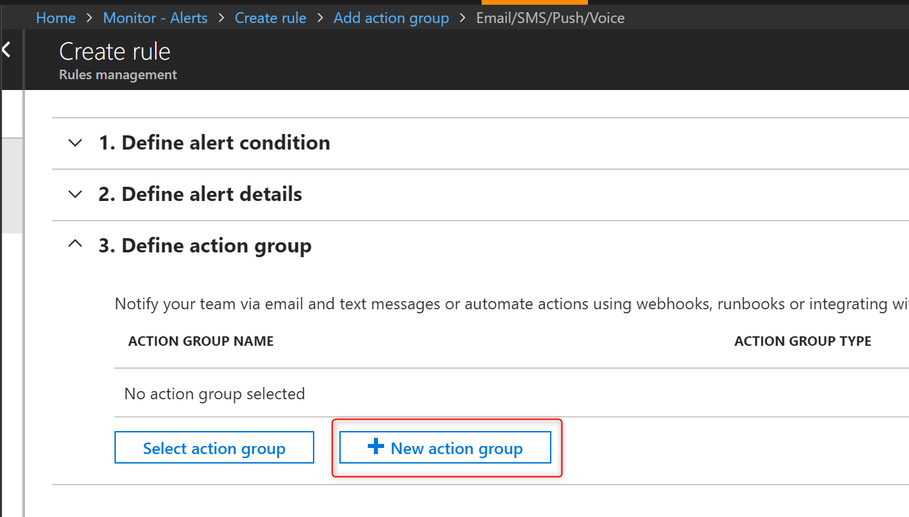

    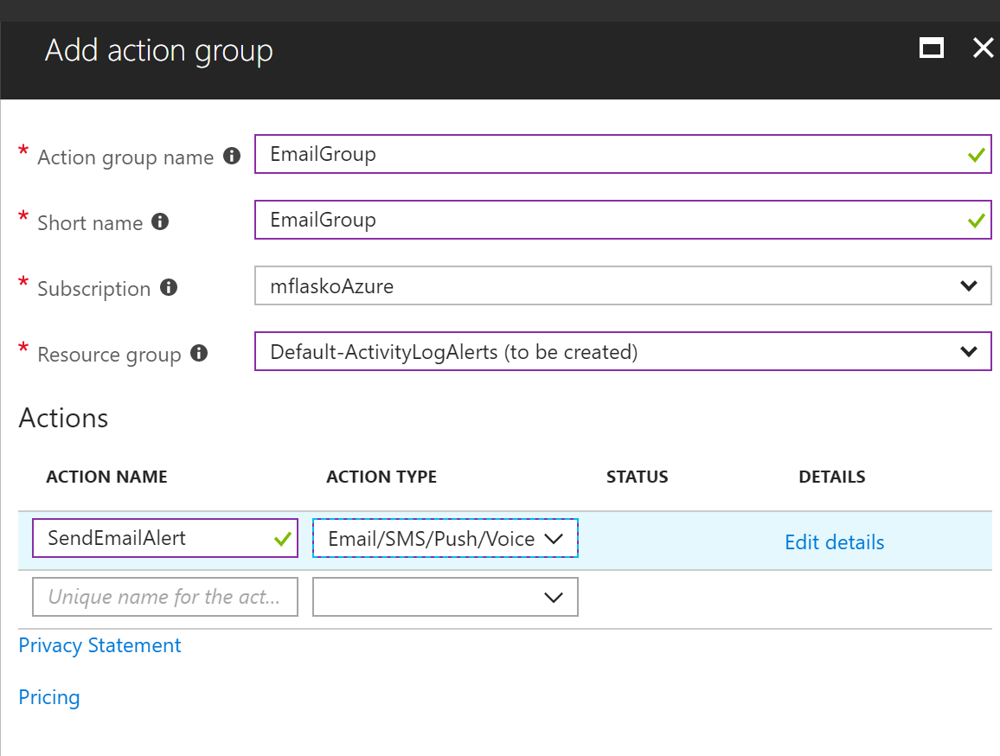

    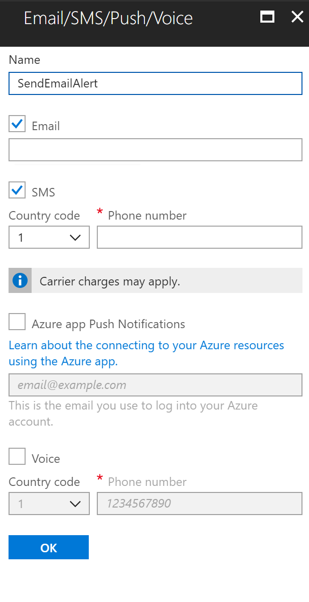

    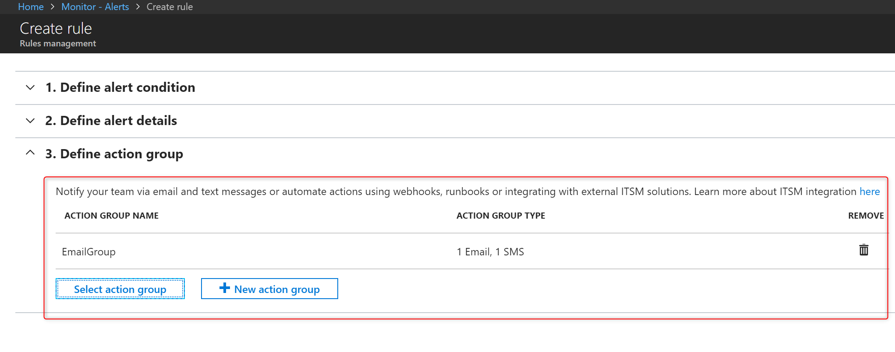

## Next steps
[Monitor and manage pipelines programmatically](monitor-programmatically.md)
