# Visually monitor Azure Data Factory

[!INCLUDE[appliesto-adf-xxx-md](includes/appliesto-adf-xxx-md.md)]

Once you've created and published a pipeline in Azure Data Factory, you can associate it with a trigger or manually kick off an ad hoc run. You can monitor all of your pipeline runs natively in the Azure Data Factory user experience. To open the monitoring experience, select the **Monitor & Manage** tile in the data factory blade of the [Azure portal](https://portal.azure.com/). If you're already in the ADF UX, click on the **Monitor** icon on the left sidebar.

All data factory runs are displayed in the browser's local time zone. If you change the time zone, all the date/time fields snap to the one that you selected.

## Monitor pipeline runs

The default monitoring view is list of pipeline runs in the selected time period. The following columns are displayed:

| **Column name** | **Description** |
| --- | --- |
| Pipeline Name | Name of the pipeline |
| Actions | Icons that allow you to view activity details, cancel, or rerun the pipeline |
| Run Start | Start date and time for the pipeline run (MM/DD/YYYY, HH:MM:SS AM/PM) |
| Duration | Run duration (HH:MM:SS) |
| Triggered By | The name of the trigger that started the pipeline |
| Status | **Failed**, **Succeeded**, **In Progress**, **Canceled**, or **Queued** |
| Annotations | Filterable tags associated with a pipeline  |
| Parameters | Parameters for the pipeline run (name/value pairs) |
| Error | If the pipeline failed, the run error |
| Run ID | ID of the pipeline run |

You need to manually select the **Refresh** button to refresh the list of pipeline and activity runs. Autorefresh is currently not supported.

## Monitor activity runs

To view activity runs for each pipeline run, select the **View activity runs** icon under the **Actions** column. The list view shows activity runs that correspond to each pipeline run.

| **Column name** | **Description** |
| --- | --- |
| Activity Name | Name of the activity inside the pipeline |
| Activity Type | Type of the activity, such as **Copy**, **ExecuteDataFlow**, or **AzureMLExecutePipeline** |
| Actions | Icons that allow you to see JSON input information, JSON output information, or detailed activity-specific monitoring experiences | 
| Run Start | Start date and time for the activity run (MM/DD/YYYY, HH:MM:SS AM/PM) |
| Duration | Run duration (HH:MM:SS) |
| Status | **Failed**, **Succeeded**, **In Progress**, or **Canceled** |
| Integration Runtime | Which Integration Runtime the activity was run on |
| User Properties | User-defined properties of the activity |
| Error | If the activity failed, the run error |
| Run ID | ID of the activity run |

### Promote user properties to monitor

Promote any pipeline activity property as a user property so that it becomes an entity that you monitor. For example, you can promote the **Source** and **Destination** properties of the copy activity in your pipeline as user properties. Select **Auto Generate** to generate the **Source** and **Destination** user properties for a copy activity.

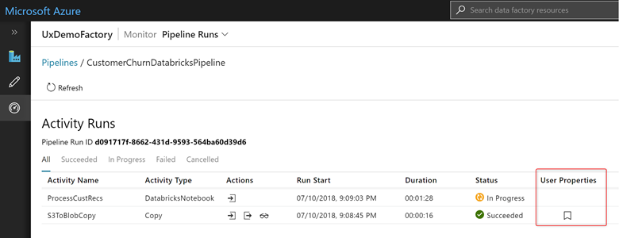

> [!NOTE]
> You can only promote up to five pipeline activity properties as user properties.

After you create the user properties, you can monitor them in the monitoring list views. If the source for the copy activity is a table name, you can monitor the source table name as a column in the list view for activity runs.

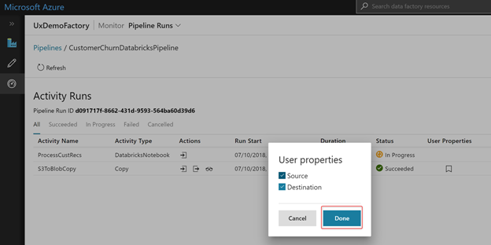

## Configure the list view

### Order and filter

Toggle whether pipeline runs will be in descending or ascending according to the run start time. Filter pipeline runs by using the following columns:

| **Column name** | **Description** |
| --- | --- |
| Pipeline Name | Filter by the name of the pipeline. |
| Run Start |  Determine the time range of the pipeline runs displayed. Options include quick filters for **Last 24 hours**, **Last week**, and **Last 30 days** or to select a custom date and time. |
| Run Status | Filter runs by status: **Succeeded**, **Failed**, **Queued**, **Canceled**, or **In Progress**. |
| Annotations | Filter by tags applied to each pipeline |
| Runs | Filter whether you want to see reran pipelines |

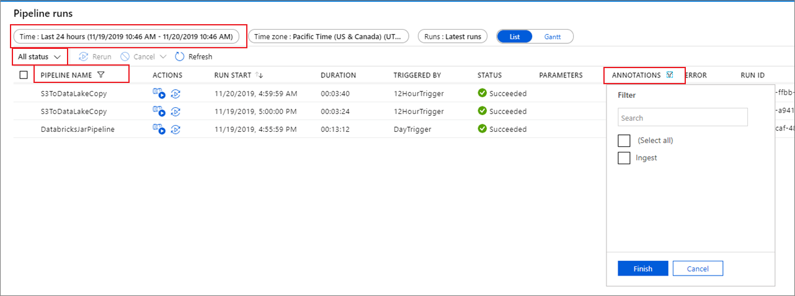

### Add or remove columns
Right-click the list view header and choose columns that you want to appear in the list view.

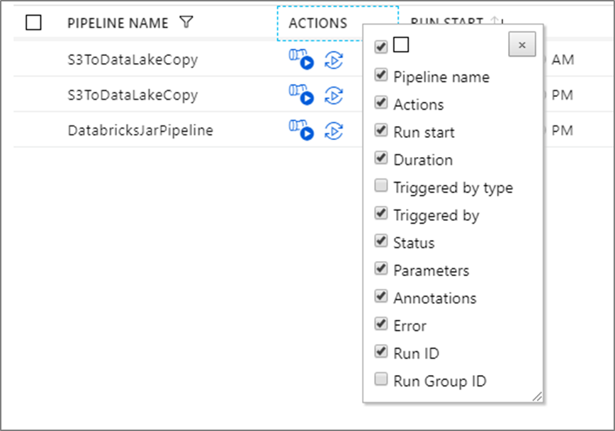

### Adjust column widths
Increase and decrease the column widths in the list view by hovering over the column header.

## Rerun activities inside a pipeline

You can rerun activities inside a pipeline. Select **View activity runs**, and then select the activity in your pipeline from which point you want to rerun your pipeline.

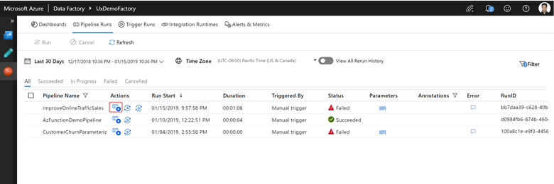

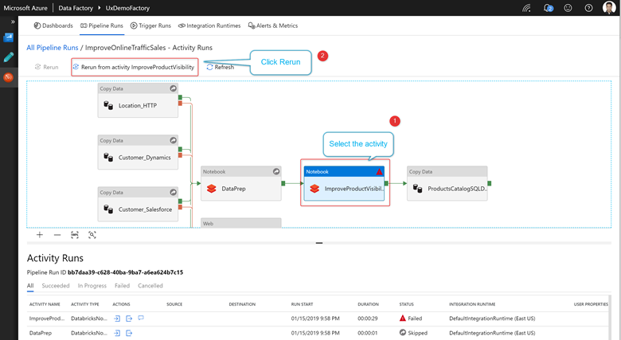

### Rerun from failed activity

If an activity fails, times out, or is canceled, you can rerun the pipeline from that failed activity by selecting **Rerun from failed activity**.

### View rerun history

You can view the rerun history for all the pipeline runs in the list view.

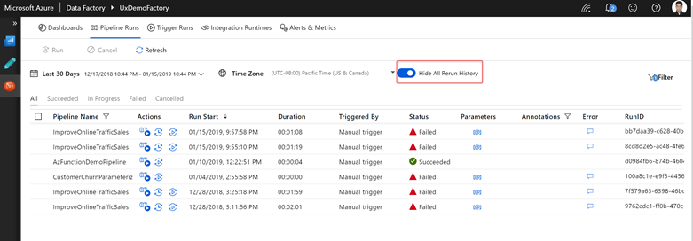

You can also view rerun history for a particular pipeline run.

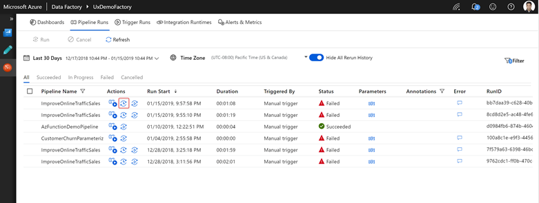

## Monitor consumption

You can see the resources consumed by a pipeline run by clicking the consumption icon next to the run. 

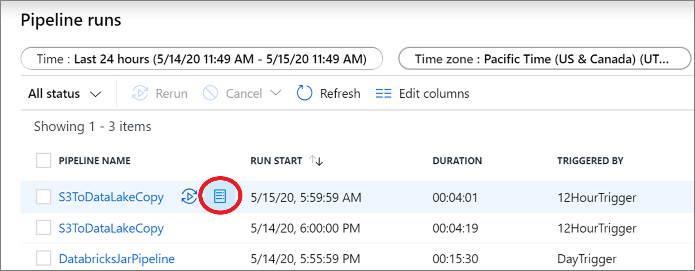

Clicking the icon opens a consumption report of resources used by that pipeline run. 

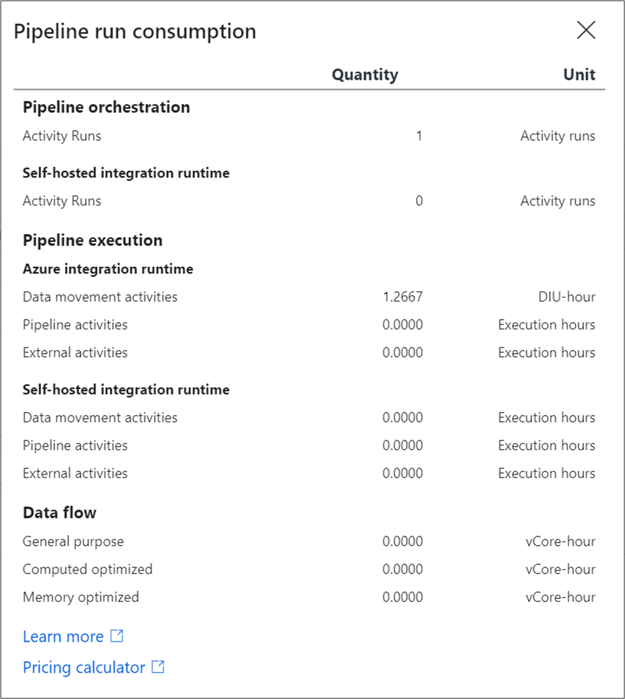

You can plug these values into the [Azure pricing calculator](https://azure.microsoft.com/pricing/details/data-factory/) to estimate the cost of the pipeline run. For more information on Azure Data Factory pricing, see [Understanding pricing](pricing-concepts.md).

> [!NOTE]
> These values returned by the pricing calculator is an estimate. It doesn't reflect the exact amount you will be billed by Azure Data Factory 

## Gantt views

Use Gantt views to quickly visualize your pipelines and activity runs.

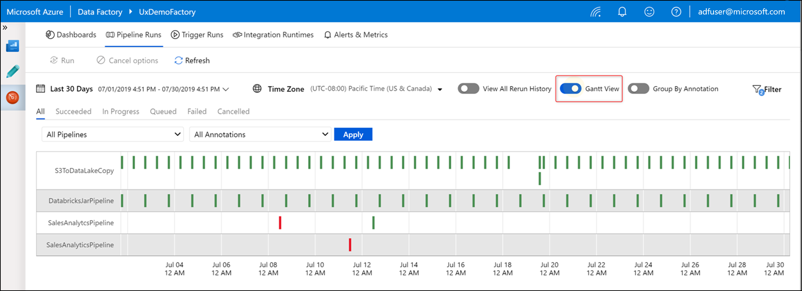

You can look at the Gantt view per pipeline or group by annotations/tags that you've created on your pipelines.

The length of the bar informs the duration of the pipeline. You can also select the bar to see more details.

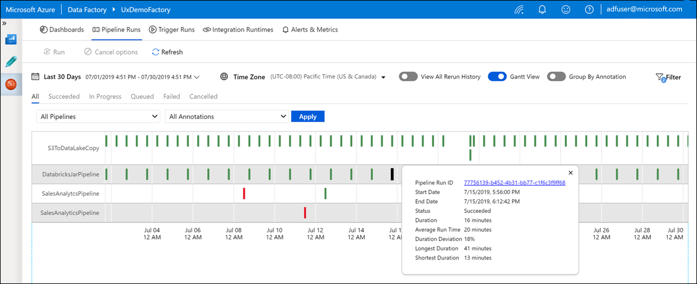

## Guided tours
Select the **Information** icon on the lower left. Then select **Guided Tours** to get step-by-step instructions on how to monitor your pipeline and activity runs.

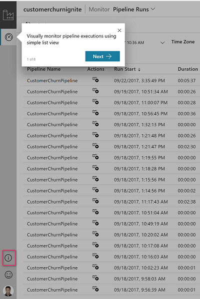

## Alerts

You can raise alerts on supported metrics in Data Factory. Select **Monitor** > **Alerts & metrics** on the Data Factory monitoring page to get started.

For a seven-minute introduction and demonstration of this feature, watch the following video:

> [!VIDEO https://channel9.msdn.com/shows/azure-friday/Monitor-your-Azure-Data-Factory-pipelines-proactively-with-alerts/player]

### Create alerts

1.  Select **New alert rule** to create a new alert.

    

1.  Specify the rule name and select the alert severity.

    

1.  Select the alert criteria.

    

    

1.  Configure the alert logic. You can create an alert for the selected metric for all pipelines and corresponding activities. You can also select a particular activity type, activity name, pipeline name, or failure type.

    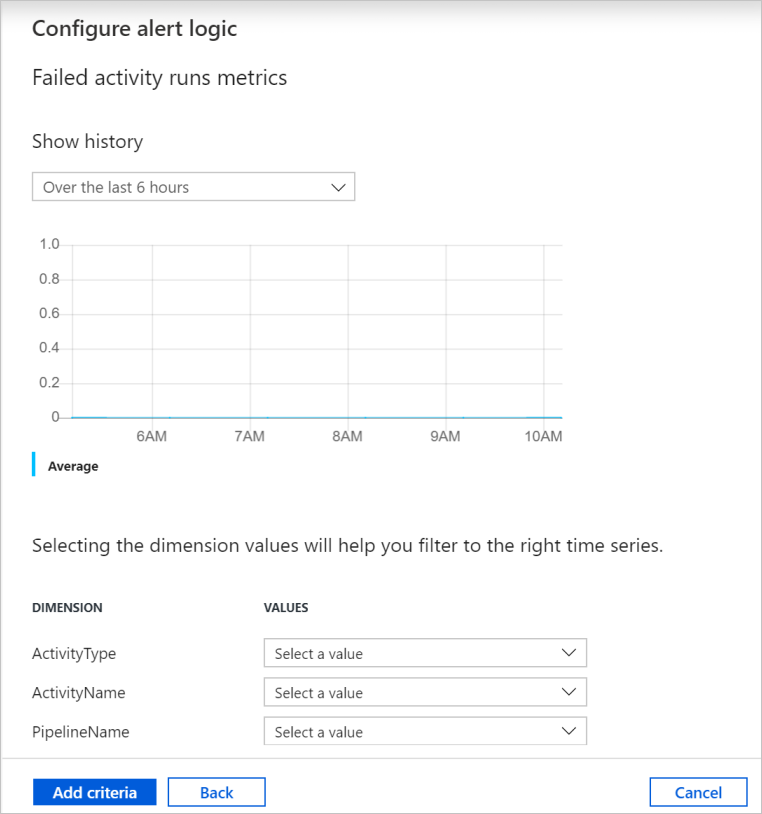

1.  Configure email, SMS, push, and voice notifications for the alert. Create an action group, or choose an existing one, for the alert notifications.

    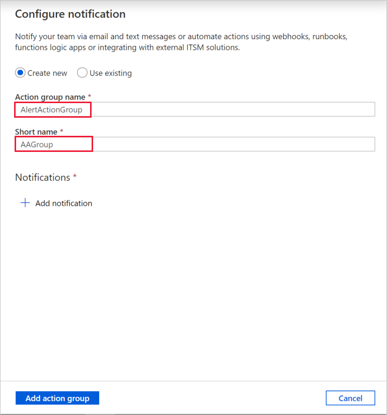

    

1.  Create the alert rule.

    

## Next steps

To learn about monitoring and managing pipelines, see the [Monitor and manage pipelines programmatically](https://docs.microsoft.com/azure/data-factory/monitor-programmatically) article.
