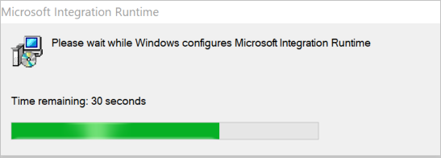

# Automating self-hosted integration runtime installation using local PowerShell scripts
To automate installation of Self-hosted Integration Runtime on local machines (other than Azure VMs where we can leverage the Resource Manager template instead), you can use local PowerShell scripts. This article introduces two scripts you can use.

## Prerequisites

* Launch PowerShell on your local machine. To run the scripts, you need to choose **Run as Administrator**.
* [Download](https://www.microsoft.com/download/details.aspx?id=39717) the self-hosted integration runtime software. Copy the path where the downloaded file is. 
* You also need an **authentication key** to register the self-hosted integration runtime.
* For automating manual updates, you need to have a pre-configured self-hosted integration runtime.

## Scripts introduction 

> [!NOTE]
> These scripts are created using the [documented command line utility](./create-self-hosted-integration-runtime.md#set-up-an-existing-self-hosted-ir-via-local-powershell) in the self-hosted integration runtime. If needed one can customize these scripts accordingly to cater to their automation needs.
> The scripts need to be applied per node, so make sure to run it across all nodes in case of high availability setup (2 or more nodes).

* For automating setup:
Install and register a new self-hosted integration runtime node using **[InstallGatewayOnLocalMachine.ps1](https://github.com/nabhishek/SelfHosted-IntegrationRuntime_AutomationScripts/blob/master/InstallGatewayOnLocalMachine.ps1)** -  The script can be used to install self-hosted integration runtime node and register it with an authentication key. The script accepts two arguments, **first** specifying the location of the [self-hosted integration runtime](https://www.microsoft.com/download/details.aspx?id=39717) on a local disk, **second** specifying the **authentication key** (for registering self-hosted IR node).

* For automating manual updates:
Update the self-hosted IR node with a specific version or to the latest version **[script-update-gateway.ps1](https://github.com/nabhishek/SelfHosted-IntegrationRuntime_AutomationScripts/blob/master/script-update-gateway.ps1)** - This is also supported in case you have turned off the auto-update, or want to have more control over updates. The script can be used to update the self-hosted integration runtime node to the latest version or to a specified higher version (downgrade doesn’t work). It accepts an argument for specifying version number (example: -version 3.13.6942.1). When no version is specified, it always updates the self-hosted IR to the latest version found in the [downloads](https://www.microsoft.com/download/details.aspx?id=39717).
    > [!NOTE]
    > Only last 3 versions can be specified. Ideally this is used to update an existing node to the latest version. **IT ASSUMES THAT YOU HAVE A REGISTERED SELF HOSTED IR**. 

## Usage examples

### For automating setup
1. Download the self-hosted IR from [here](https://www.microsoft.com/download/details.aspx?id=39717). 
1. Specify the path where the above downloaded SHIR MSI (installation file) is. For example, if the path is *C:\Users\username\Downloads\IntegrationRuntime_4.7.7368.1.msi*, then you can use below PowerShell command-line example for this task:

   ```powershell
   PS C:\windows\system32> C:\Users\username\Desktop\InstallGatewayOnLocalMachine.ps1 -path "C:\Users\username\Downloads\IntegrationRuntime_4.7.7368.1.msi" -authKey "[key]"
   ```

    > [!NOTE]
    > Replace [key] with the authentication key to register your IR.
    > Replace "username" with your user name.
    > Specify the location of the "InstallGatewayOnLocalMachine.ps1" file when running the script. In this example we stored it on Desktop.

1. If there is one pre-installed self-hosted IR on your machine, the script automatically uninstalls it and then configures a new one. You'll see following window popped out:
        

1. When the installation and key registration completes, you'll see *Succeed to install gateway* and *Succeed to register gateway* results in your local PowerShell.
        [](media/self-hosted-integration-runtime-automation-scripts/script-1-run-result.png#lightbox)

### For automating manual updates
This script is used to update/install + register latest self-hosted integration runtime. The script run performs the following steps:
1. Check current self-hosted IR version
2. Get latest version or specified version from argument
3. If there is newer version than current version:
    * download self-hosted IR msi
    * upgrade it

You can follow below command-line example to use this script:
* Download and install latest gateway:

   ```powershell
   PS C:\windows\system32> C:\Users\username\Desktop\script-update-gateway.ps1
   ```    
* Download and install gateway of specified version:
   ```powershell
   PS C:\windows\system32> C:\Users\username\Desktop\script-update-gateway.ps1 -version 3.13.6942.1
   ``` 
   If your current version is already the latest one, you'll see following result, suggesting no update is required.   
    [](media/self-hosted-integration-runtime-automation-scripts/script-2-run-result.png#lightbox)