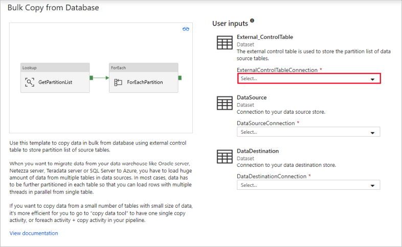
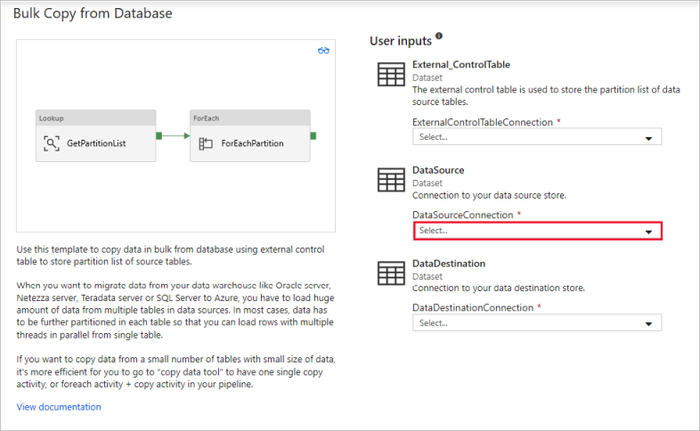
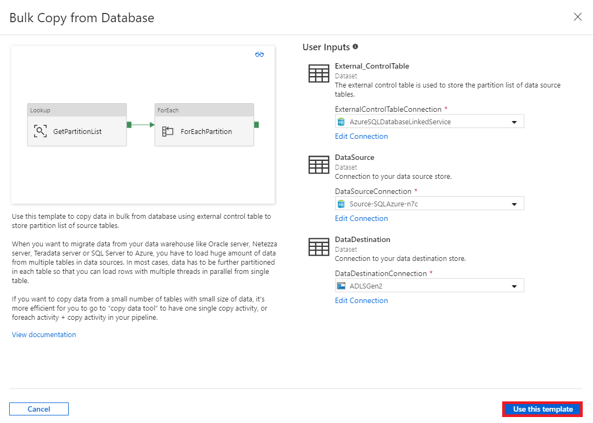
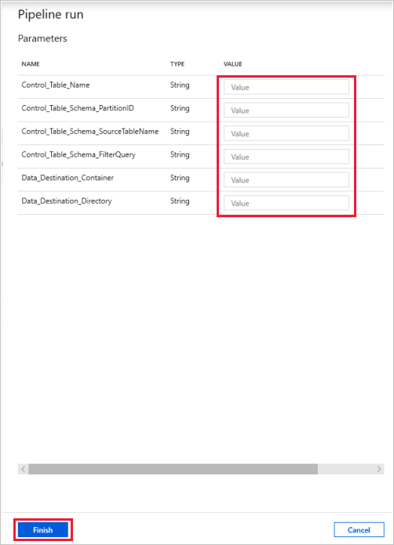
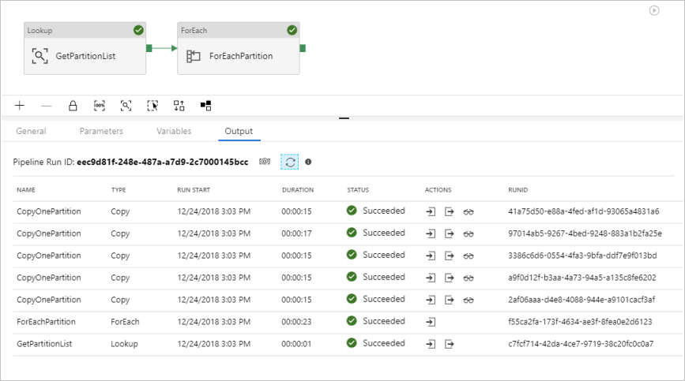
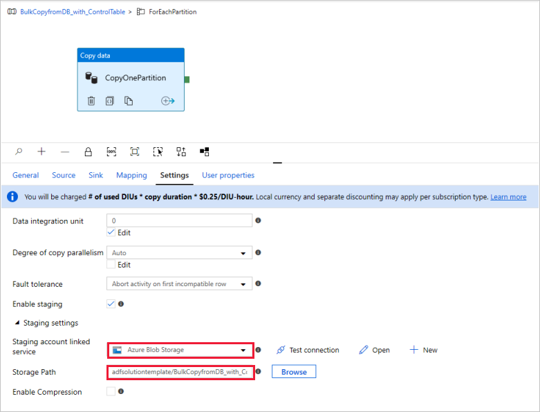

# Bulk copy from a database with a control table

To copy data from a data warehouse in Oracle Server, Netezza, Teradata, or SQL Server to Azure SQL Data Warehouse, you have to load huge amounts of data from multiple tables. Usually, the data has to be partitioned in each table so that you can load rows with multiple threads in parallel from a single table. This article describes a template to use in these scenarios.

 >!NOTE 
 > If you want to copy data from a small number of tables with relatively small data volume to SQL Data Warehouse, it's more efficient to use the [Azure Data Factory Copy Data tool](copy-data-tool.md). The template that's described in this article is more than you need for that scenario.

## About this solution template

This template retrieves a list of source database partitions to copy from an external control table. Then it iterates over each partition in the source database and copies the data to the destination.

The template contains three activities:
- **Lookup** retrieves the list of sure database partitions from an external control table.
- **ForEach** gets the partition list from the Lookup activity and iterates each partition to the Copy activity.
- **Copy** copies each partition from the source database store to the destination store.

The template defines five parameters:
- *Control_Table_Name* is your external control table, which stores the partition list for the source database.
- *Control_Table_Schema_PartitionID* is the name of the column name in your external control table that stores each partition ID. Make sure that the partition ID is unique for each partition in the source database.
- *Control_Table_Schema_SourceTableName* is your external control table that stores each table name from the source database.
- *Control_Table_Schema_FilterQuery* is the name of the column in your external control table that stores the filter query to get the data from each partition in the source database. For example, if you partitioned the data by year, the query that's stored in each row might be similar to ‘select * from datasource where LastModifytime >= ''2015-01-01 00:00:00'' and LastModifytime <= ''2015-12-31 23:59:59.999'''.
- *Data_Destination_Folder_Path* is the path where the data is copied into your destination store. This parameter is only visible if the destination that you choose is file-based storage. If you choose SQL Data Warehouse as the destination store, this parameter is not required. But the table names and the schema in SQL Data Warehouse must be the same as the ones in the source database.

## How to use this solution template

1. Create a control table in SQL Server or Azure SQL Database to store the source database partition list for bulk copy. In the following example, there are five partitions in the source database. Three partitions are for the *datasource_table*, and two are for the *project_table*. The column *LastModifytime* is used to partition the data in table *datasource_table* from the source database. The query that's used to read the first partition is 'select * from datasource_table where LastModifytime >= ''2015-01-01 00:00:00'' and LastModifytime <= ''2015-12-31 23:59:59.999'''. You can use a similar query to read data from other partitions.

	 ```sql
			Create table ControlTableForTemplate
			(
			PartitionID int,
			SourceTableName  varchar(255),
			FilterQuery varchar(255)
			);

			INSERT INTO ControlTableForTemplate
			(PartitionID, SourceTableName, FilterQuery)
			VALUES
			(1, 'datasource_table','select * from datasource_table where LastModifytime >= ''2015-01-01 00:00:00'' and LastModifytime <= ''2015-12-31 23:59:59.999'''),
			(2, 'datasource_table','select * from datasource_table where LastModifytime >= ''2016-01-01 00:00:00'' and LastModifytime <= ''2016-12-31 23:59:59.999'''),
			(3, 'datasource_table','select * from datasource_table where LastModifytime >= ''2017-01-01 00:00:00'' and LastModifytime <= ''2017-12-31 23:59:59.999'''),
			(4, 'project_table','select * from project_table where ID >= 0 and ID < 1000'),
			(5, 'project_table','select * from project_table where ID >= 1000 and ID < 2000');
    ```

2. Go to the **Bulk Copy from Database** template. Create a **New** connection to the external control table that you created in step 1.

    

3. Create a **New** connection to the source database that you're copying data from.

     
	
4. Create a **New** connection to the destination data store that you're copying the data to.

    

5. Select **Use this template**.

    
	
6. You see the pipeline, as shown in the following example:

    

7. Select **Debug**, enter the **Parameters**, and then select **Finish**.

    

8. You see results that are similar to the following example:

    

9. (Optional) If you chose SQL Data Warehouse as the data destination, you must enter a connection to Azure Blob storage for staging, as required by SQL Data Warehouse Polybase. Make sure that the container in Blob storage has already been created.
	
	
	   
## Next steps

- [Introduction to Azure Data Factory](introduction.md)
