# Migrate data from Amazon S3 to Azure Data Lake Storage Gen2

Use the templates to migrate petabytes of data consisting of hundreds of millions of files from Amazon S3 to Azure Data Lake Storage Gen2. 

 > [!NOTE]
 > If you want to copy small data volume from AWS S3 to Azure (for example, less than 10 TB), it's more efficient and easy to use the [Azure Data Factory Copy Data tool](copy-data-tool.md). The template that's described in this article is more than what you need.

## About the solution templates

Data partition is recommended especially when migrating more than 10 TB of data. To partition the data, leverage the ‘prefix’ setting to filter the folders and files on Amazon S3 by name, and then each ADF copy job can copy one partition at a time. You can run multiple ADF copy jobs concurrently for better throughput.

Data migration normally requires one-time historical data migration plus periodically synchronizing the changes from AWS S3 to Azure. There are two templates below, where one template covers one-time historical data migration and another template covers synchronizing the changes from AWS S3 to Azure.

### For the template to migrate historical data from Amazon S3 to Azure Data Lake Storage Gen2

This template (*template name: migrate historical data from AWS S3 to Azure Data Lake Storage Gen2*) assumes that you have written a partition list in an external control table in Azure SQL Database. So it will use a *Lookup* activity to retrieve the partition list from the external control table, iterate over each partition, and make each ADF copy job copy one partition at a time. Once any copy job completed, it uses *Stored Procedure* activity to update the status of copying each partition in control table.

The template contains five activities:
- **Lookup** retrieves the partitions which have not been copied to Azure Data Lake Storage Gen2 from an external control table. The table name is *s3_partition_control_table* and the query to load data from the table is *"SELECT PartitionPrefix FROM s3_partition_control_table WHERE SuccessOrFailure = 0"*.
- **ForEach** gets the partition list from the *Lookup* activity and iterates each partition to the *TriggerCopy* activity. You can set the *batchCount* to run multiple ADF copy jobs concurrently. We have set 2 in this template.
- **ExecutePipeline** executes *CopyFolderPartitionFromS3* pipeline. The reason we create another pipeline to make each copy job copy a partition is because it will make you easy to rerun the failed copy job to reload that specific partition again from AWS S3. All other copy jobs loading other partitions will not be impacted.
- **Copy** copies each partition from AWS S3 to Azure Data Lake Storage Gen2.
- **SqlServerStoredProcedure** update the status of copying each partition in control table.

The template contains two parameters:
- **AWS_S3_bucketName** is your bucket name on AWS S3 where you want to migrate data from. If you want to migrate data from multiple buckets on AWS S3, you can add one more column in your external control table to store the bucket name for each partition, and also update your pipeline to retrieve data from that column accordingly.
- **Azure_Storage_fileSystem** is your fileSystem name on Azure Data Lake Storage Gen2 where you want to migrate data to.

### For the template to copy changed files only from Amazon S3 to Azure Data Lake Storage Gen2

This template (*template name: copy delta data from AWS S3 to Azure Data Lake Storage Gen2*) uses LastModifiedTime of each file to copy the new or updated files only from AWS S3 to Azure. Be aware if your files or folders has already been time partitioned with timeslice information as part of the file or folder name on AWS S3 (for example, /yyyy/mm/dd/file.csv), you can go to this [tutorial](tutorial-incremental-copy-partitioned-file-name-copy-data-tool.md) to get the more performant approach for incremental loading new files. 
This template assumes that you have written a partition list in an external control table in Azure SQL Database. So it will use a *Lookup* activity to retrieve the partition list from the external control table, iterate over each partition, and make each ADF copy job copy one partition at a time. When each copy job starts to copy the files from AWS S3, it relies on LastModifiedTime property to identify and copy the new or updated files only. Once any copy job completed, it uses *Stored Procedure* activity to update the status of copying each partition in control table.

The template contains seven activities:
- **Lookup** retrieves the partitions from an external control table. The table name is *s3_partition_delta_control_table* and the query to load data from the table is *"select distinct PartitionPrefix from s3_partition_delta_control_table"*.
- **ForEach** gets the partition list from the *Lookup* activity and iterates each partition to the *TriggerDeltaCopy* activity. You can set the *batchCount* to run multiple ADF copy jobs concurrently. We have set 2 in this template.
- **ExecutePipeline** executes *DeltaCopyFolderPartitionFromS3* pipeline. The reason we create another pipeline to make each copy job copy a partition is because it will make you easy to rerun the failed copy job to reload that specific partition again from AWS S3. All other copy jobs loading other partitions will not be impacted.
- **Lookup** retrieves the last copy job run time from the external control table so that the new or updated files can be identified via LastModifiedTime. The table name is *s3_partition_delta_control_table* and the query to load data from the table is *"select max(JobRunTime) as LastModifiedTime from s3_partition_delta_control_table where PartitionPrefix = '@{pipeline().parameters.prefixStr}' and SuccessOrFailure = 1"*.
- **Copy** copies new or changed files only for each partition from AWS S3 to Azure Data Lake Storage Gen2. The property of *modifiedDatetimeStart* is set to the last copy job run time. The property of *modifiedDatetimeEnd* is set to the current copy job run time. Be aware the time is applied to UTC time zone.
- **SqlServerStoredProcedure** update the status of copying each partition and copy run time in control table when it succeeds. The column of SuccessOrFailure is set to 1.
- **SqlServerStoredProcedure** update the status of copying each partition and copy run time in control table when it fails. The column of SuccessOrFailure is set to 0.

The template contains two parameters:
- **AWS_S3_bucketName** is your bucket name on AWS S3 where you want to migrate data from. If you want to migrate data from multiple buckets on AWS S3, you can add one more column in your external control table to store the bucket name for each partition, and also update your pipeline to retrieve data from that column accordingly.
- **Azure_Storage_fileSystem** is your fileSystem name on Azure Data Lake Storage Gen2 where you want to migrate data to.

## How to use these two solution templates

### For the template to migrate historical data from Amazon S3 to Azure Data Lake Storage Gen2 

1. Create a control table in Azure SQL Database to store the partition list of AWS S3. 

    > [!NOTE]
    > The table name is s3_partition_control_table.
    > The schema of the control table is PartitionPrefix and SuccessOrFailure, where PartitionPrefix is the prefix setting in S3 to filter the folders and files in Amazon S3 by name, and SuccessOrFailure is the status of copying each partition: 0 means this partition has not been copied to Azure and 1 means this partition has been copied to Azure successfully.
    > There are 5 partitions defined in control table and the default status of copying each partition is 0.

    ```sql
    CREATE TABLE [dbo].[s3_partition_control_table](
    	[PartitionPrefix] [varchar](255) NULL,
    	[SuccessOrFailure] [bit] NULL
    )

    INSERT INTO s3_partition_control_table (PartitionPrefix, SuccessOrFailure)
    VALUES
    ('a', 0),
    ('b', 0),
    ('c', 0),
    ('d', 0),
    ('e', 0);
    ```

2. Create a Stored Procedure on the same Azure SQL Database for control table. 

    > [!NOTE]
    > The name of the Stored Procedure is sp_update_partition_success. It will be invoked by SqlServerStoredProcedure activity in your ADF pipeline.

    ```sql
    CREATE PROCEDURE [dbo].[sp_update_partition_success] @PartPrefix varchar(255)
    AS
    BEGIN
    
    	UPDATE s3_partition_control_table
    	SET [SuccessOrFailure] = 1 WHERE [PartitionPrefix] = @PartPrefix
    END
    GO
    ```

3. Go to the **Migrate historical data from AWS S3 to Azure Data Lake Storage Gen2** template. Input the connections to your external control table, AWS S3 as the data source store and Azure Data Lake Storage Gen2 as the destination store. Be aware that the external control table and the stored procedure are reference to the same connection.

    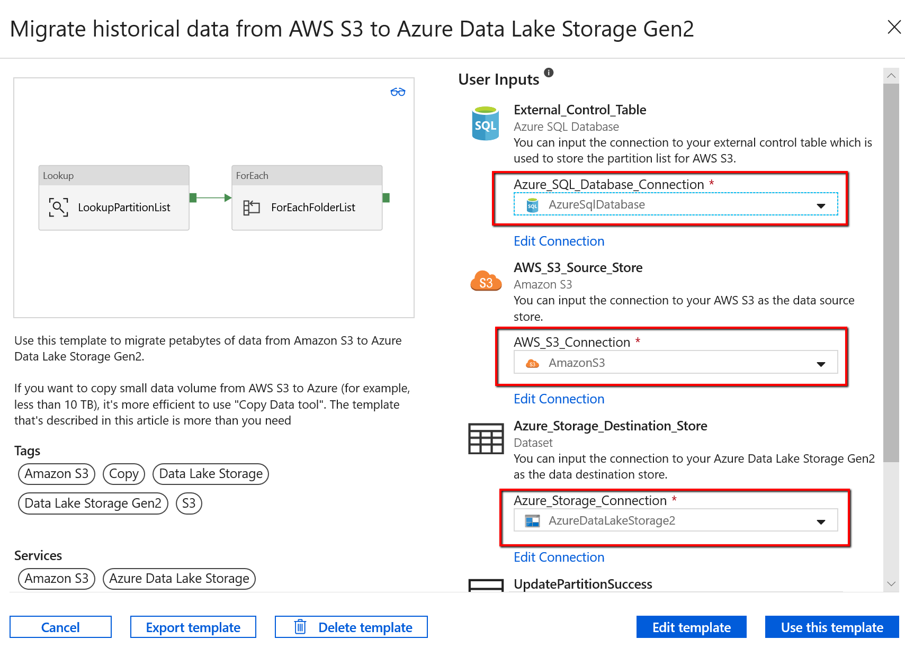

4. Select **Use this template**.

    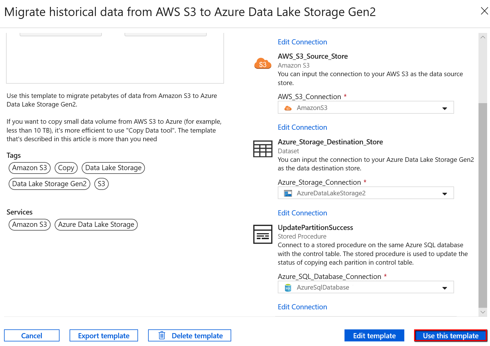
	
5. You see the 2 pipelines and 3 datasets were created, as shown in the following example:

    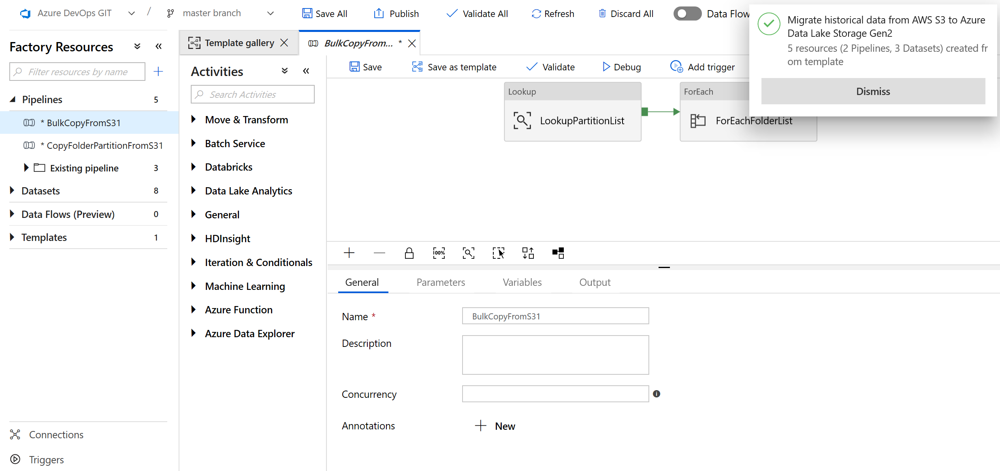

6. Select **Debug**, enter the **Parameters**, and then select **Finish**.

    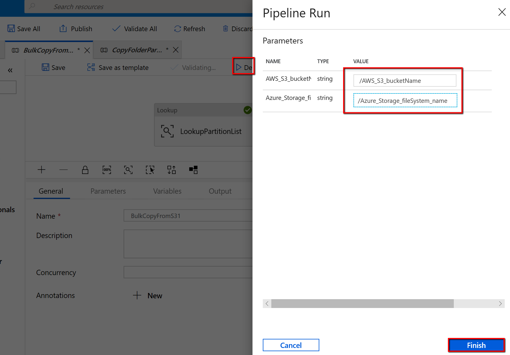

7. You see results that are similar to the following example:

    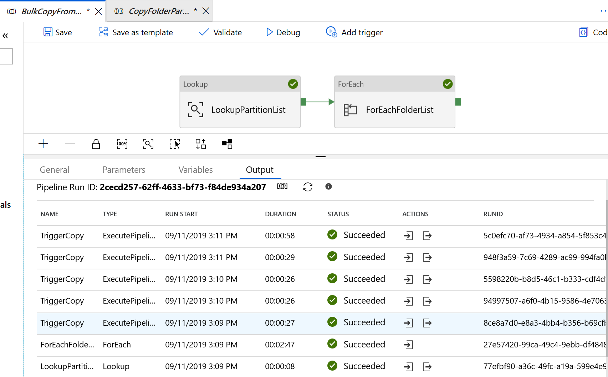


### For the template to copy changed files only from Amazon S3 to Azure Data Lake Storage Gen2

1. Create a control table in Azure SQL Database to store the partition list of AWS S3. 

    > [!NOTE]
    > The table name is s3_partition_delta_control_table.
    > The schema of the control table is PartitionPrefix, JobRunTime and SuccessOrFailure, where PartitionPrefix is the prefix setting in S3 to filter the folders and files in Amazon S3 by name, JobRunTime is the datetime value when copy jobs run, and SuccessOrFailure is the status of copying each partition: 0 means this partition has not been copied to Azure and 1 means this partition has been copied to Azure successfully.
    > There are 5 partitions defined in control table. The default value for JobRunTime can be the time when one-time historical data migration starts. ADF copy activity will copy the files on AWS S3 which have been last modified after that time. The default status of copying each partition is 1.

    ```sql
    CREATE TABLE [dbo].[s3_partition_delta_control_table](
    	[PartitionPrefix] [varchar](255) NULL,
    	[JobRunTime] [datetime] NULL,
    	[SuccessOrFailure] [bit] NULL
    	)

    INSERT INTO s3_partition_delta_control_table (PartitionPrefix, JobRunTime, SuccessOrFailure)
    VALUES
    ('a','1/1/2019 12:00:00 AM',1),
    ('b','1/1/2019 12:00:00 AM',1),
    ('c','1/1/2019 12:00:00 AM',1),
    ('d','1/1/2019 12:00:00 AM',1),
    ('e','1/1/2019 12:00:00 AM',1);
    ```

2. Create a Stored Procedure on the same Azure SQL Database for control table. 

    > [!NOTE]
    > The name of the Stored Procedure is sp_insert_partition_JobRunTime_success. It will be invoked by SqlServerStoredProcedure activity in your ADF pipeline.

    ```sql
    	CREATE PROCEDURE [dbo].[sp_insert_partition_JobRunTime_success] @PartPrefix varchar(255), @JobRunTime datetime, @SuccessOrFailure bit
    	AS
    	BEGIN
    		INSERT INTO s3_partition_delta_control_table (PartitionPrefix, JobRunTime, SuccessOrFailure)
    		VALUES
    		(@PartPrefix,@JobRunTime,@SuccessOrFailure)
    	END
    	GO
    ```


3. Go to the **Copy delta data from AWS S3 to Azure Data Lake Storage Gen2** template. Input the connections to your external control table, AWS S3 as the data source store and Azure Data Lake Storage Gen2 as the destination store. Be aware that the external control table and the stored procedure are reference to the same connection.

    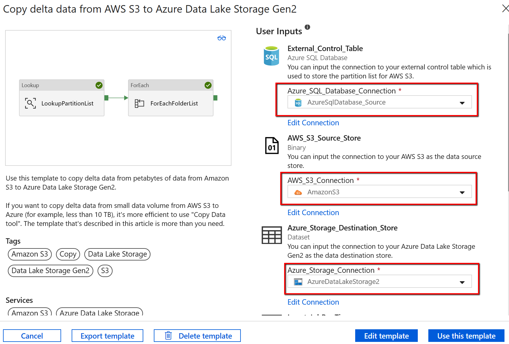

4. Select **Use this template**.

    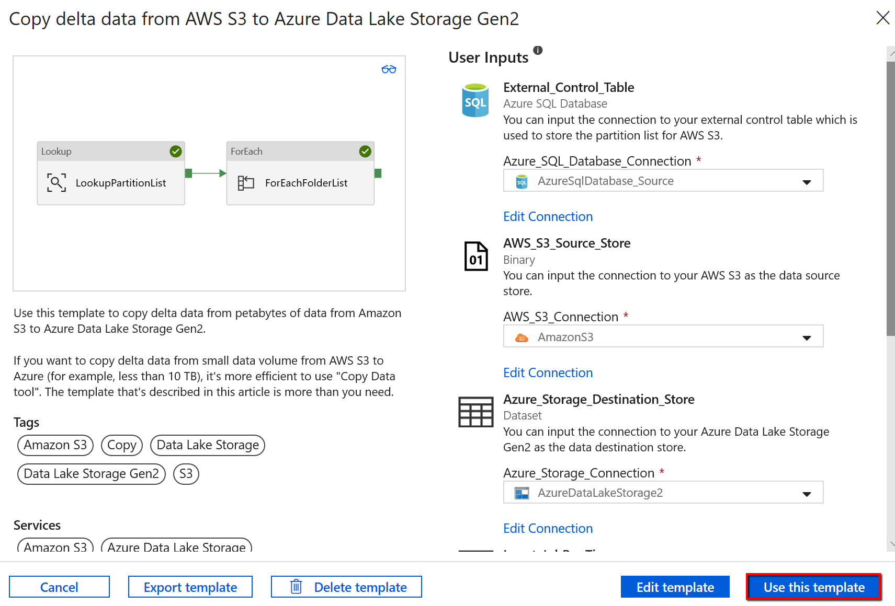
	
5. You see the 2 pipelines and 3 datasets were created, as shown in the following example:

    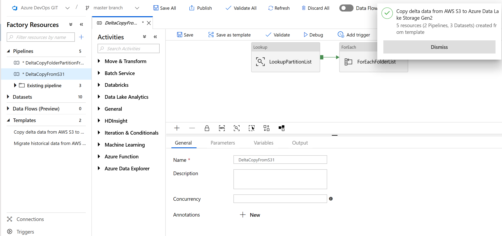

6. Select **Debug**, enter the **Parameters**, and then select **Finish**.

    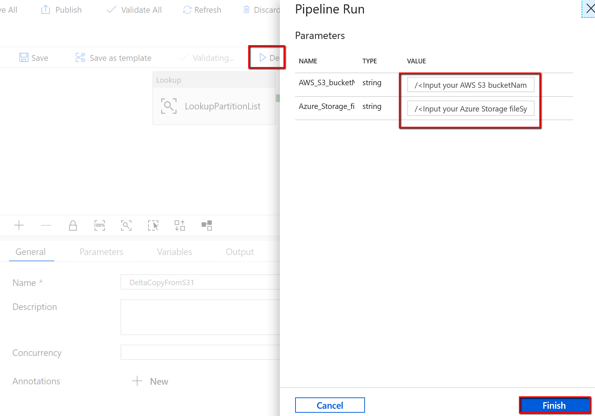

7. You see results that are similar to the following example:

    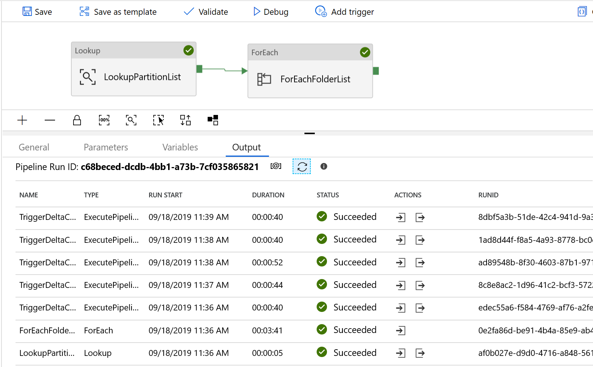

8. You can also check the results from the control table by a query *"select * from s3_partition_delta_control_table"*, you will see the output similar to the following example:

    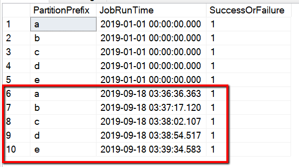
	
## Next steps

- [Copy files from multiple containers](solution-template-copy-files-multiple-containers.md)
- [Move files](solution-template-move-files.md)