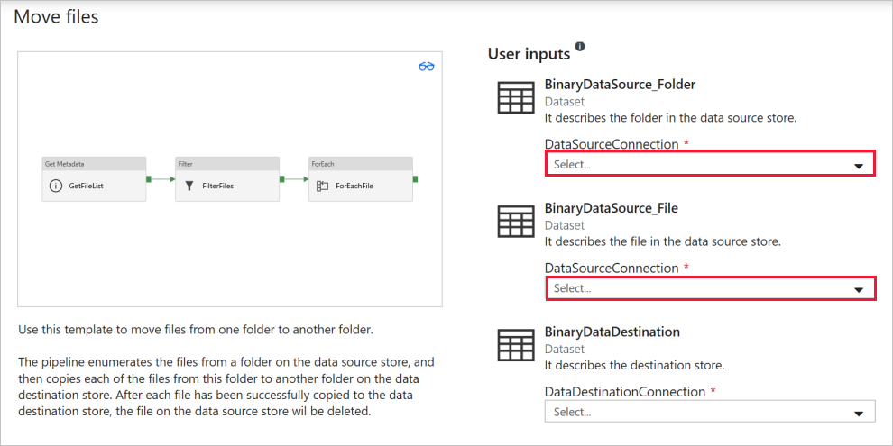
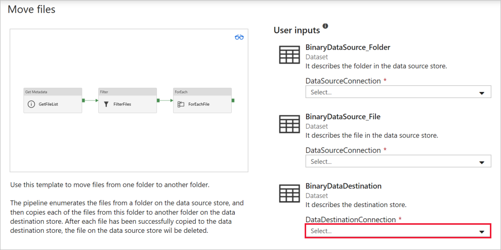
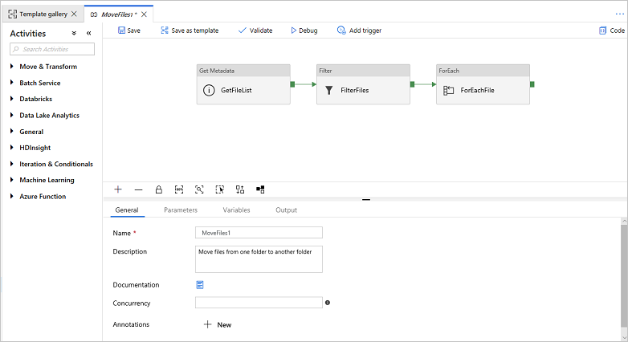
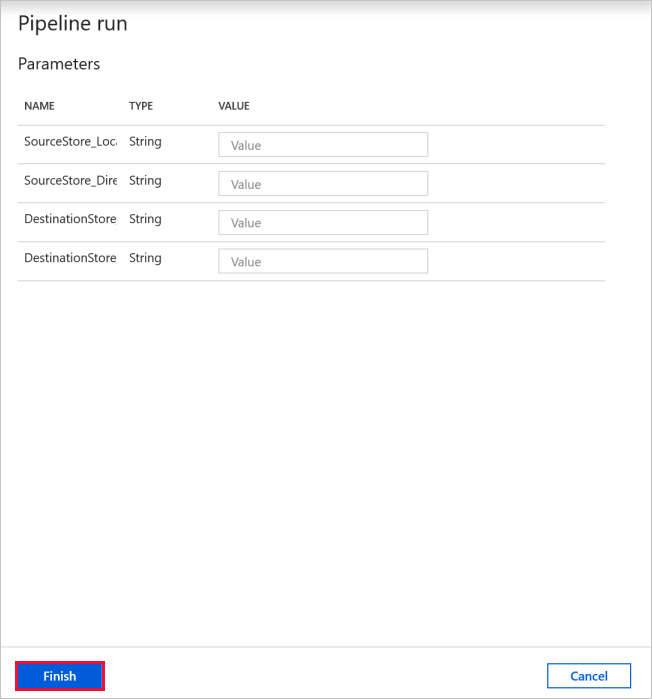
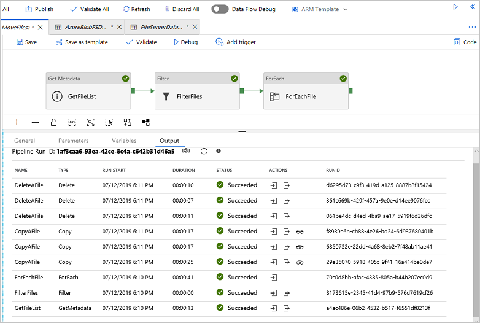

# Move files with Azure Data Factory

[!INCLUDE[appliesto-adf-xxx-md](includes/appliesto-adf-xxx-md.md)]

ADF copy activity has built-in support on “move” scenario when copying binary files between storage stores.  The way to enable it is to set “deleteFilesAfterCompletion” as true in copy activity. By doing so, copy activity will delete files from data source store after job completion. 

This article describes a solution template as another approach leveraging ADF flexible control flow plus copy activity and delete activity to achieve the same scenario. One of the common scenarios of using this template: Files are continually dropped to a landing folder of your source store. By creating a schedule trigger, ADF pipeline can periodically move those files from the source to the destination store.  The way that ADF pipeline achieves "moving files" is getting the files from the landing folder, copying each of them to another folder on the destination store and then deleting the same files from the landing folder on the source store.

> [!NOTE]
> Be aware that this template is designed to move files rather than moving folders.  If you want to move the folder by changing the dataset to make it contain a folder path only, and then using the copy activity and delete activity to reference to the same dataset representing a folder, you need to be very careful. It is because you have to make sure that there will NOT be new files arriving into the folder between copying operation and deleting operation. If there are new files arriving at the folder at the moment when your copy activity just completed the copy job but the Delete activity has not been stared, it is possible that the Delete activity will delete this new arriving file which has NOT been copied to the destination yet by deleting the entire folder.

## About this solution template

This template gets the files from your source file-based store. It then moves each of them to the destination store.

The template contains five activities:
- **GetMetadata** gets the list of objects including the files and subfolders from your folder on source store. It will not retrieve the objects recursively. 
- **Filter** filter the objects list from **GetMetadata** activity to select the files only. 
- **ForEach** gets the file list from the **Filter** activity and then iterates over the list and passes each file to the Copy activity and Delete activity.
- **Copy** copies one file from the source to the destination store.
- **Delete** deletes the same one file from the source store.

The template defines four parameters:
- *SourceStore_Location* is the folder path of your source store where you want to move files from. 
- *SourceStore_Directory* is the subfolder path of your source store where you want to move files from.
- *DestinationStore_Location* is the folder path of your destination store where you want to move files to. 
- *DestinationStore_Directory* is the subfolder path of your destination store where you want to move files to.

## How to use this solution template

1. Go to the **Move files** template. Select existing connection or create a **New** connection to your source file store where you want to move files from. Be aware that **DataSource_Folder** and **DataSource_File** are reference to the same connection of your source file store.

    

2. Select existing connection or create a **New** connection to your destination file store where you want to move files to.

    

3. Select **Use this template** tab.
	
4. You'll see the pipeline, as in the following example:

    

5. Select **Debug**, enter the **Parameters**, and then select **Finish**.   The parameters are the folder path where you want to move files from and the folder path where you want to move files to. 

    

6. Review the result.

    

## Next steps

- [Copy new and changed files by LastModifiedDate with Azure Data Factory](solution-template-copy-new-files-lastmodifieddate.md)

- [Copy files from multiple containers with Azure Data Factory](solution-template-copy-files-multiple-containers.md)