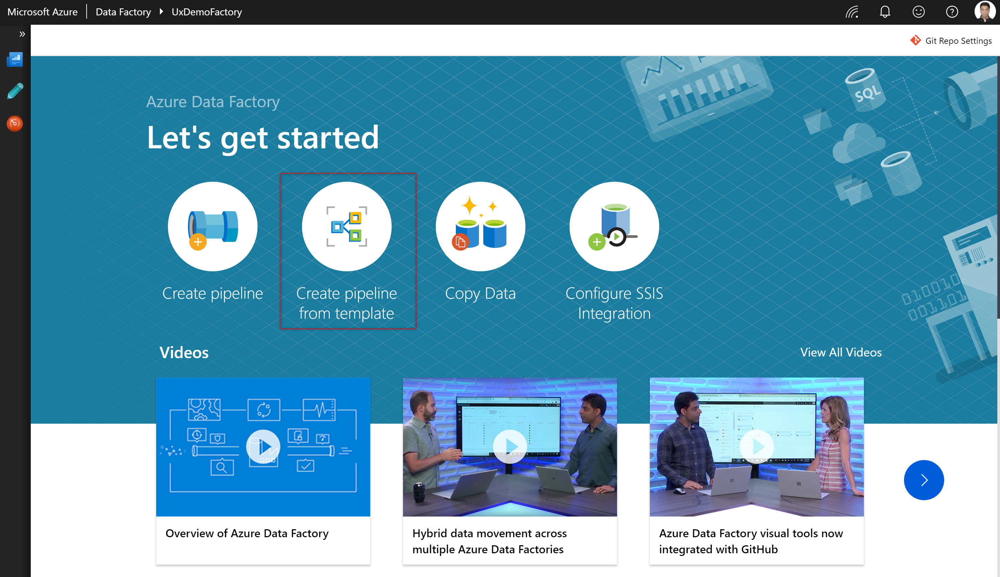
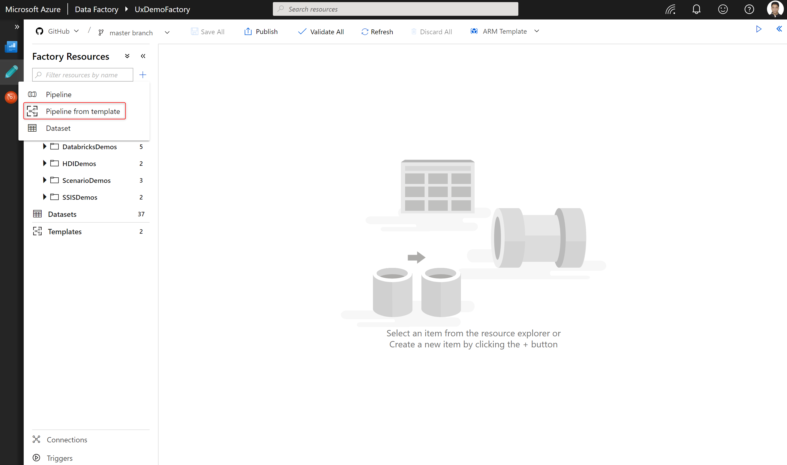
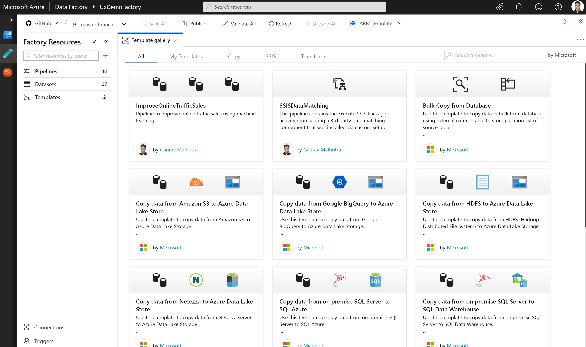
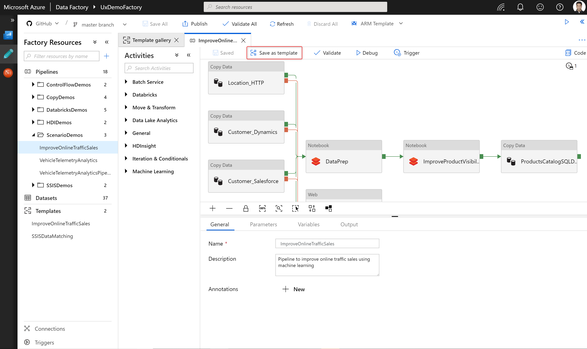

# Templates

Templates are predefined Azure Data Factory pipelines that allow you to get started quickly with Data Factory. Templates are useful when you're new to Data Factory and want to get started quickly. These templates reduce the development time for building data integration projects thereby improving developer productivity.

## Create Data Factory pipelines from templates

You can get started creating a Data Factory pipeline from a template in the following two ways:

1.  Select **Create pipeline from template** on the Overview page to open the template gallery.

    

1.  On the Author tab in Resource Explorer, select **+**, then **Pipeline from template** to open the template gallery.

    

## Template Gallery

### Out of the box Data Factory templates

Data Factory uses Azure Resource Manager templates for saving data factory pipeline templates. You can see all the Resource Manager templates, along with the manifest file used for out of the box Data Factory templates, in the [official Azure Data Factory GitHub repo](https://github.com/Azure/Azure-DataFactory/tree/master/templates). The predefined templates provided by Microsoft include but are not limited to the following items:

-   Copy templates:

    -   [Bulk copy from Database](solution-template-bulk-copy-with-control-table.md)
	
    -   [Copy new files by LastModifiedDate](solution-template-copy-new-files-lastmodifieddate.md)

    -   [Copy multiple file containers between file-based stores](solution-template-copy-files-multiple-containers.md)

    -   [Move files](solution-template-move-files.md)

    -   [Delta copy from Database](solution-template-delta-copy-with-control-table.md)

    -   Copy from \<source\> to \<destination\>

        -   From Amazon S3 to Azure Data Lake Store Gen 2

        -   From Google Big Query to Azure Data Lake Store Gen 2

        -   From HDF to Azure Data Lake Store Gen 2

        -   From Netezza to Azure Data Lake Store Gen 1

        -   From SQL Server on premises to Azure SQL Database

        -   From SQL Server on premises to Azure SQL Data Warehouse

        -   From Oracle on premises to Azure SQL Data Warehouse

-   SSIS templates

    -   Schedule Azure-SSIS Integration Runtime to execute SSIS packages

-   Transform templates

    -   [ETL with Azure Databricks](solution-template-databricks-notebook.md)

### My Templates

You can also save a pipeline as a template by selecting **Save as template** on the Pipeline tab.

You can view pipelines saved as templates in the **My Templates** section of the Template Gallery. You can also see them in the **Templates** section in the Resource Explorer.

> [!NOTE]
> To use the My Templates feature, you have to enable GIT integration. Both Azure DevOps GIT and GitHub are supported.
